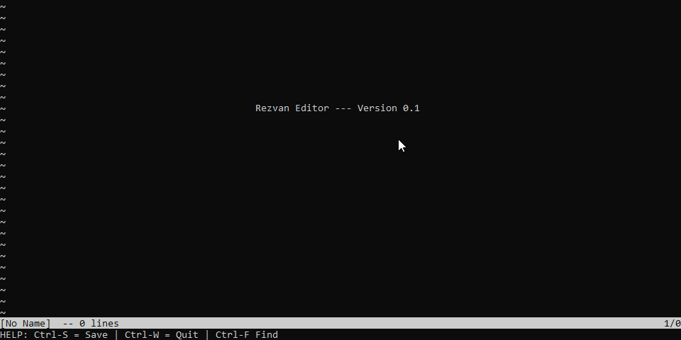
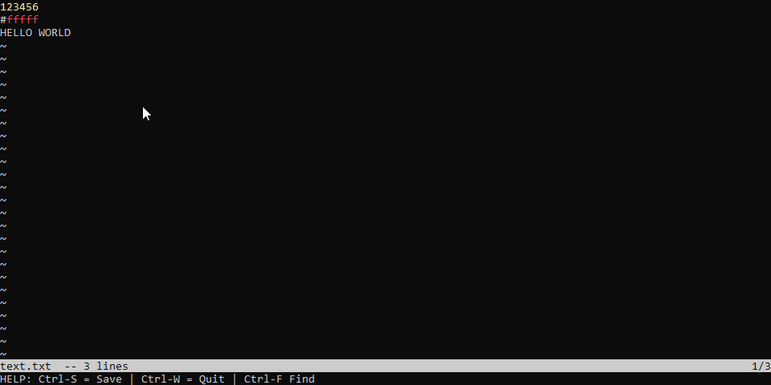

I've wanted to learn Rust for a long time - I've dabbled and manged to learn the basic syntax a while ago.
However, you haven't truly learned a language until you made a project and the code would be considered 'idiomatic' - or at least in my opinion.

So I decided to make a Vim-like text editor. I took a lot of inspiration from this [post](https://medium.com/@otukof/build-your-text-editor-with-rust-678a463f968b) from medium, so all credits to Kofi.

However, I wanted to it more *Vim-like* since it would be fun. So I did it. I learned a lot of 'Think-in-a-Rust-way'. Which is refreshing.

Here are some screenshots for preview.

[Link to source code](https://github.com/rezaarezvan/text-editor)
