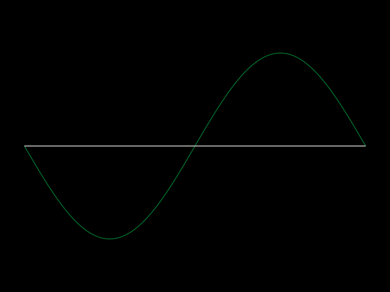

I've recently felt the urge to make some math-related projects and visualization projects.
So I picked up [Julia](https://julialang.org/) and have so far learned the basics of the language - it's a quite simple and dynamic language which I appreciate,
especially after my most recent projects have been in C/C++ and Rust - it's a great refresh in programming.

So far I've made quite small projects with a lot of built-in libraries. Which, once again, is a huge refresher from the C/C++ world. Stuff just works (mostly) :).

The project I've liked the best so far is a program that visualizes [Fourier Series](https://en.wikipedia.org/wiki/Fourier_series) - In this project, I wrote the math as well so that was fun.
Here's a GIF to show the output:

I'm glad I've started to learn Julia, it seems like a nice language for visual and data related projects. Definitely a language I will continue to learn and explore.
