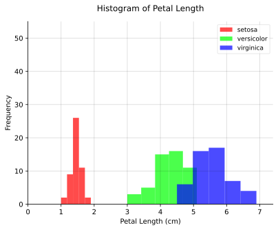
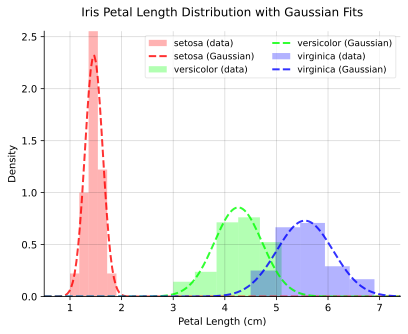
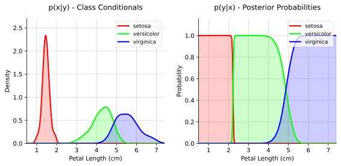
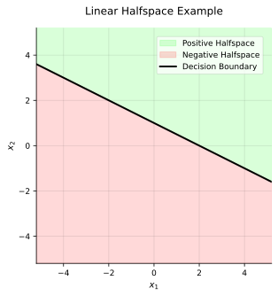
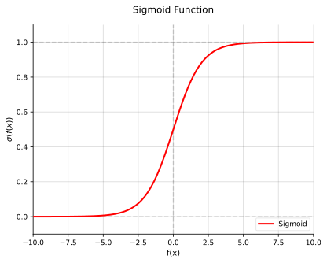
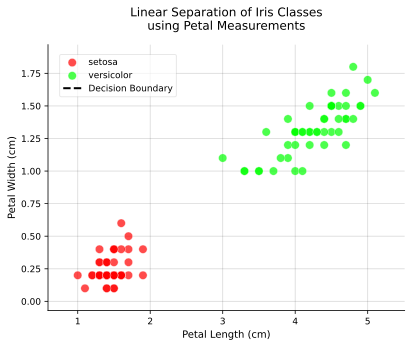
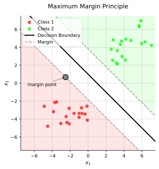
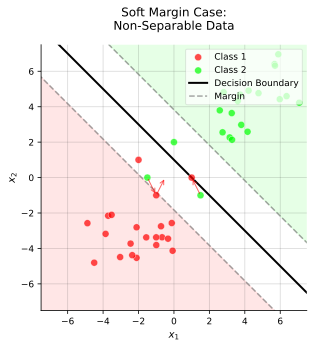
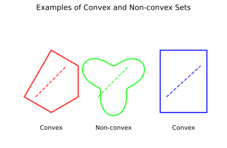
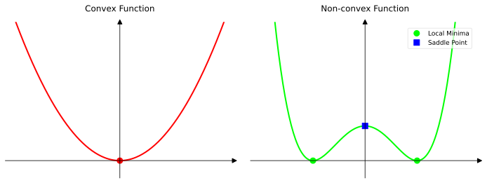

As of writing this, last night as I was going to sleep, I was lying in bed and thought about the future.
After some rambling I came up with this (hopefully) series, **Rezvan Explains**. I took a course called [machine learning](https://www.cityu.edu.hk/catalogue/ug/current/course/CS4487.htm) during my exchange semester @ CityUHK taught by [Kede Ma](https://kedema.org) (wonderful professor and I highly recommend taking the course).
This post is very inspired by his course but, I want to add my touch on the topic.

My goal for this part is to build your **intuition** when it comes to machine learning.
I believe most people getting started with AI nowadays don't want to understand the foundations modern deep learning is built upon.

## Preqrequisites and Notation
This post will assume that you know about:

* Linear Algebra
* Multivariable and Matrix Calculus
* Probability and Statistics

If you don't feel comfortable with these topics, read up and come back when ready.

These are the notations that we will use, there is no need to go through them the first time you're reading this, it's meant as a **reference**.

:::table[Notation used throughout this article.]{#notation}
| **Symbol** | **Meaning** |
|---|---|
|  $M$ | Number of Examples in Dataset |
|  $N$ | Number of Features in Training Sample |
|  $\mathcal{D}$  | Dataset of $M$ Examples |
|  $\mathbf{x}$ | $N$-dimensional Feature Vector |
|  $y$  | Class Label |
|  $\mathbf{x}^{(i)}$  | $i$-th Feature Vector in Dataset in $\mathcal{D}$ |
|  $\mathbf{x}^{(i)}_j$  | $j$-th Feature in $i$-th Feature Vector in $\mathcal{D}$ |
|  $y^{(i)}$  | $i$-th Class Label in Dataset in $\mathcal{D}$ corresponding to $\mathbf{x}^{(i)}$ |
|  $\mathbf{X}$  | Input Space |
|  $\mathbf{Y}$  | Output Space |
|  $\| \mathbf{Y} \|$  | Number of Classes in Output Space |
:::

## What, Why, and How?
There is one fundamental flaw I've seen with **every** machine learning course I've taken.
Machine learning is a study of **statistical algorithms**, i.e., statistics and machine learning are *very* closely related fields.
But the distinct difference is in their principal goal.

### Statistics VS. Machine Learning
Generally in machine learning we want to find **generalizable predictive patterns.** [^1]
While this might not be exclusive to machine learning (a large part of statistics is also about prediction), in machine learning, it is the **main goal**.

I'm not going into the history of machine learning as a field and its evolution, but if it is one thing I want you to take away from this post, it is that machine learning **fundamentally relies on data**.
I can't stress this enough, a lot of my fellow peers never got this intuition at the start of our courses, and therefore everything during the semester seemed like black magic.
But in the end **everything** comes down to **data**.

### Humble Beginnings
Okay I lied, a bit of history won't hurt.
The name *machine learning* implies that a machine is learning (duh).
I think the *machine* part is quite obvious (a computer), but learning is a bit more abstract.

A lot of people have defined *learning* in varying ways and for different domains, let's take a look:

* Behaviorism (Skinner)
    - > Learning is a long-term change in behavior due to experience. [^2]
* Cognitivism (Gestalt School)
    - > Learning is an internal mental process that integrates new information into established mental frameworks and updates those frameworks over time. [^3]
* Connectionism (Hebbian Learning)
    - > Learning is a physical process in which neurons join by developing the synapses between them. [^4]

We can see that in an abstract sense, learning is taking some input and changing some internal state based on that input.
The last one is an outlier, but remember this for later.

## Different Types of Learning
Depending on the **type of data** we have but also **what we want to achieve**, the learning process *needs* to be different.

In this post, we will focus on **supervised learning** and **unsupervised learning**.

Let's define supervised learning in mathematical terms.

### Supervised Learning
In supervised learning, we have a dataset consisting of well-defined input-output pairs.
The task is to find a (good) **generalized mapping** from an arbitrary input to an output.

Mathematically we define this as,

$$
f : \mathbf{X} \mapsto \mathbf{Y},
$$

where $\mathbf{X}$ is the input space and $\mathbf{Y}$ is the output space, we want to find the *best* function $f$ that maps $\mathbf{X}$ to $\mathbf{Y}$.

#### The Classification Task
The best way to understand supervised learning is through the **classification task** and *Fisher's Iris dataset*. [^5]

In Fisher's Iris dataset we have 150 samples of input-output pairs.
The input is a vector with four **features** &mdash; sepal length, sepal width, petal length, petal width &mdash; the output is the **species** of the iris flower.

As described above, our input and output spaces are,

$$
\begin{aligned}
\mathbf{X} & = \{ \text{Sepal Length}, \text{Sepal Width}, \text{Petal Length}, \text{Petal Width} \} \newline
\mathbf{Y} & = \{ \text{Setosa}, \text{Versicolor}, \text{Virginica} \}
\end{aligned}
$$

So given a vector with four real numbers (where each number describes a feature of the iris flower), we want to predict a number that corresponds to the species of the iris flower.

Thus, the proper mathematical definition of the classification task is,

:::definition[Definition: The Classification Task]
Given a feature vector $\mathbf{x} \in \mathbf{X} = \mathbb{R}^N$ that describes an object that belongs to one of $C$ classes from the set $\mathbf{Y} = \{ 1, 2, \ldots, C \}$, predict the class label $y \in \mathbf{Y}$.
:::

#### The Classification Learning Problem
Now that we have defined the classification task, let's define the classification learning problem,

:::definition[Definition: The Classification Learning Problem]
Given a dataset of example pairs $\mathcal{D} = \{ (\mathbf{x}^{(i)}, y^{(i)}), i = 1, \ldots, M \}$ where $\mathbf{x}^{(i)} \in \mathbf{X} = \mathbb{R}^N$ is a feature vector and $y^{(i)} \in \mathbf{Y} = \{1, \ldots, C\}$ is the class label, learn a function,
$$
f: \mathbb{R}^N \mapsto \mathbf{Y}
$$
that accurately predicts the class label $y$ for any feature vector $\mathbf{x}$.
:::

##### Metrics
To determine how well our function $f$ is doing, we need to define some (primal) metrics.

Firstly, let's define the **indicator function**,

$$
\mathbb{I}[A] = \begin{cases}
1, & \text{if } A \text{ is true}, \newline
0, & \text{otherwise}.
\end{cases}
$$

The **classification error** is then defined as,
:::definition[Definition: The Classification Error]
Given a dataset of example pairs $\mathcal{D} = \{ (\mathbf{x}^{(i)}, y^{(i)}), i = 1, \ldots, M \}$ and a function $f: \mathbb{R}^N \mapsto \mathbf{Y}$, the classification error of $f$ on $\mathcal{D}$ is defined as,
$$
\text{Error}(f, \mathcal{D}) = \frac{1}{M} \sum_{i=1}^{M} \mathbb{I}[f(\mathbf{x}^{(i)}) \neq y^{(i)}].
$$
:::

I.e., the classification error is the fraction of examples in the dataset that are misclassified by the function $f$.

The **classification accuracy** is then defined as,
:::definition[Definition: The Classification Accuracy]
Given a dataset of example pairs $\mathcal{D} = \{ (\mathbf{x}^{(i)}, y^{(i)}), i = 1, \ldots, M \}$ and a function $f: \mathbb{R}^N \mapsto \mathbf{Y}$, the classification accuracy of $f$ on $\mathcal{D}$ is defined as,
$$
\text{Accuracy}(f, \mathcal{D}) = \frac{1}{M} \sum_{i=1}^{M} \mathbb{I}[f(\mathbf{x}^{(i)}) = y^{(i)}] = 1 - \text{Error}(f, \mathcal{D}).
$$
:::

#### Different Approaches
But how do we solve the classification learning problem?
We will go through different ways of approaching this problem.

But I want to start of with the **probabilistic approach** first.

##### Generative Models
We know that our dataset $\mathcal{D}$ consists of input-output pairs $(\mathbf{x}^{(i)}, y^{(i)})$.
In the real dataset, we have a **joint distribution** $p(\mathbf{x}, y)$, this describes the probability of observing the pair $(\mathbf{x}, y)$.

We can learn this joint distribution from the dataset.
We know from **Bayes' Rule** that,

$$
p(\mathbf{x}, y) = p(y) p(\mathbf{x} | y).
$$

These two terms are very important, let's define them properly.

The first term $p(y)$ is often called the **prior distribution** of the classes.
It describes how frequently each class occurs in nature (or in the dataset).

The second term $p(\mathbf{x} | y)$ is called the **class-conditional distribution**.
This distribution describes how the features $\mathbf{x}$ are distributed for different classes $y$.

To remind you, the **classification task** is to predict the **class label $y$ given a feature vector $\mathbf{x}$**.

So again, by Bayes's Rule we know that,

$$
p(y | \mathbf{x}) = \frac{p(\mathbf{x}, y)}{p(\mathbf{x})} = \frac{p(y) p(\mathbf{x} | y)}{p(\mathbf{x})}.
$$

So for the classification task, we want to choose the **best prediction**.

Let's clarify the difference between the **$\max$** and **$\arg \max$** operators.
The $\max$ returns the maximum **value** of a function, while the $\arg \max$ returns the **argument** that gives the maximum value.

Or in mathematical terms,

$$
\max_{\mathbf{x}} f(\mathbf{x}) = \{f(\mathbf{x}) | \mathbf{x} \in \mathcal{D} \land \forall \mathbf{y} \in \mathcal{D}, f(\mathbf{y}) \leq f(\mathbf{x})\}
$$

$$
\underset{\mathbf{x}}{\arg\max} f(\mathbf{x}) = \{\mathbf{x} | \mathbf{x} \in \mathcal{D} \land \forall \mathbf{y} \in \mathcal{D}, f(\mathbf{y}) \leq f(\mathbf{x})\}
$$

Therefore, the best prediction for the classification task is,

$$
\hat{y} = \arg \max_{y \in \mathbf{Y}} p(y | \mathbf{x}) = \arg \max_{y \in \mathbf{Y}} \frac{p(y) p(\mathbf{x} | y)}{p(\mathbf{x})}.
$$

If we are looking to **maximize the fraction**, we can **ignore the denominator** $p(\mathbf{x})$ since we know that it is **non-negative and class-independent**.

$$
\hat{y} = \arg \max_{y \in \mathbf{Y}} p(y) p(\mathbf{x} | y).
$$

So if we can estimate the **prior distribution** $p(y)$ and the **class-conditional distribution** $p(\mathbf{x} | y)$, we can predict the class label $y$ for **any feature vector** $\mathbf{x}$.

Let's start with the **prior distribution** $p(y)$, since it is the easiest to learn.
From our dataset $\mathcal{D} = \{ (\mathbf{x}^{(i)}, y^{(i)}), i = 1, \ldots, M \}$, with well-defined input-output pairs we simply count how often each class label $y$ appears,

$$
p(y = c) \approx \frac{\sum_{i = 1}^M \mathbb{I}[y^{(i)} = c]}{M}.
$$

**Note**, that this is the simplest case if $y$ only captures one class, it is possible that for a different task that $y$ is a vector of classes (e.g., multi-label classification).

The class-conditional distribution $p(\mathbf{x} | y)$ is a bit more tricky. How do we model this distribution?

By looking at @fig:iris-histogram, we see that it is a bit noisy, but we can see *some* Gaussian structure.
Let's assume a probability model for the class conditional $p(\mathbf{x} | y)$, in our case **Gaussian**.

###### Bayes Optimal Classifier
So, each class is modeled as a **separate Gaussian** distribution **of the feature values**, or in other words,

$$
p(\mathbf{x} | y) = \frac{1}{\sqrt{2 \pi \sigma_{c}^2}} e^{-\frac{1}{2 \sigma_{c}^2} \left(x^{(i)} - \mu_{c}\right)^2}
$$

Each class has its own mean and variance parameters ($\mu_{c}$ and $\sigma_{c}^2$).
But what's considered the "best" estimates, and how do we find them?

###### Maximum Likelihood Estimate
We want our model to be as close to the true distribution as possible.
Meaning that **our (already) observed data should be the most probable** under our model.

The **likelihood function** measures how well a model explains the observed data given the model parameters [^6].

**Maximum Likelihood Estimate (MLE)** is a method for estimating said parameters by maximizing the likelihood function.

**Note**, there are more sophisticated methods (e.g., Bayesian estimation, Maximum A Posteriori (MAP) estimation, etc.), but MLE has very nice properties and is good enough for most cases.

In our case, the likelihood function is defined as,

$$
L(\mu_c, \sigma_c^2) = \prod_{i=1}^{M_c} \frac{1}{\sqrt{2 \pi \sigma_{c}^2}} e^{-\frac{1}{2 \sigma_{c}^2} \left(x^{(i)} - \mu_{c}\right)^2},
$$

where **$M_c$ is the number of samples in class $c$**, since the parameters are different for each class.

Thus, our MLE estimates are,

$$
(\hat{\mu_c}, \hat{\sigma_c^2}) = \underset{\mu_c, \sigma_c^2}{\arg\max} \prod_{i=1}^{M_c} \frac{1}{\sqrt{2 \pi \sigma_{c}^2}} e^{-\frac{1}{2 \sigma_{c}^2} \left(x^{(i)} - \mu_{c}\right)^2}.
$$

Let's use a little trick to avoid the product notation.
The **logarithm** is a **monotonic function**, meaning that the **order of the values doesn't change**.
In other words, the **maximum value before applying the logarithm is still the maximum value** after applying the logarithm (just the scale changes).

Thus, taking the **MLE of the log-likelihood function is equivalent** to taking the MLE of the likelihood function.

$$
(\hat{\mu_c}, \hat{\sigma_c^2}) = \underset{\mu_c, \sigma_c^2}{\arg\max} \log \left[\prod_{i=1}^{M_c} \frac{1}{\sqrt{2 \pi \sigma_{c}^2}} e^{-\frac{1}{2 \sigma_{c}^2} \left(x^{(i)} - \mu_{c}\right)^2}\right].
$$

Now, the product becomes a sum (since the logarithm of a product is the sum of the logarithms).

$$
(\hat{\mu_c}, \hat{\sigma_c^2}) = \underset{\mu_c, \sigma_c^2}{\arg\max} \sum_{i=1}^{M_c} \log \left[\frac{1}{\sqrt{2 \pi \sigma_{c}^2}} e^{-\frac{1}{2 \sigma_{c}^2} \left(x^{(i)} - \mu_{c}\right)^2}\right].
$$

Now, I am going to simplify the expression step-by-step, at some steps I will have a $\big\rvert \cdot$ to indicate what operation we perform at that step.

$$
\begin{aligned}
\log \left[\frac{1}{\sqrt{2 \pi \sigma_{c}^2}} e^{-\frac{1}{2 \sigma_{c}^2} \left(x^{(i)} - \mu_{c}\right)^2}\right] &= \log \left[\frac{1}{\sqrt{2 \pi \sigma_{c}^2}}\right] + \log \left[e^{-\frac{1}{2 \sigma_{c}^2} \left(x^{(i)} - \mu_{c}\right)^2}\right] \ \biggr\rvert \log(ab) = \log(a) + \log(b) \newline
&= \log(1) - \log(\sqrt{2 \pi \sigma_{c}^2}) + \log \left[e^{-\frac{1}{2 \sigma_{c}^2} \left(x^{(i)} - \mu_{c}\right)^2}\right] \ \biggr\rvert \log(a/b) = \log(a) - \log(b) \newline
&= -\log(\sqrt{2 \pi \sigma_{c}^2}) + \log \left[e^{-\frac{1}{2 \sigma_{c}^2} \left(x^{(i)} - \mu_{c}\right)^2}\right] \ \biggr\rvert \log(1) = 0 \newline
&= -\log(\sqrt{2 \pi \sigma_{c}^2}) -\frac{1}{2 \sigma_{c}^2} \left(x^{(i)} - \mu_{c}\right)^2 \ \biggr\rvert \log(e^a) = a \newline
\end{aligned}
$$

So, our MLE estimates are,

$$
(\hat{\mu_c}, \hat{\sigma_c^2}) = \underset{\mu_c, \sigma_c^2}{\arg\max} \sum_{i=1}^{M_c} \left[-\log(\sqrt{2 \pi \sigma_{c}^2}) -\frac{1}{2 \sigma_{c}^2} \left(x^{(i)} - \mu_{c}\right)^2\right].
$$

To find the maximum, we need to take the derivative of the expression with respect to $\mu_c$ and $\sigma_c^2$ and set them to zero.

Let's start with $\mu_c$ since it's easier.

$$
\begin{aligned}
\frac{\partial}{\partial \mu_c} \sum \left[-\log(\sqrt{2 \pi \sigma_c^2}) -\frac{1}{2 \sigma_c^2} \left(x^{(i)} - \mu_c\right)^2\right] &= 0 \newline
\sum \frac{\partial}{\partial \mu_c} \left[\underbrace{-\log(\sqrt{2 \pi \sigma_c^2})}_0 -\frac{1}{2 \sigma_c^2} \left(x^{(i)} - \mu_c\right)^2\right] &= 0 \newline
\sum \frac{1}{\sigma_c^2} \left(x^{(i)} - \mu_c\right) &= 0 \ \biggr\rvert \text{Chain Rule} \newline
\sum \left(x^{(i)} - \mu_c\right) &= 0 \ \biggr\rvert \cdot \sigma_c^2 \newline
\sum x^{(i)} - \sum \mu_c &= 0 \newline
\sum x^{(i)} - M_c \mu_c &= 0 \ \biggr\rvert \text{ Since $\mu_c$ doesn't depend on $i$} \newline
\hat{\mu_c} &= \boxed{\frac{1}{M_c} \sum x^{(i)}}
\end{aligned}
$$

Now, let's find $\sigma_c^2$.

$$
\begin{aligned}
\frac{\partial}{\partial \sigma_c^2} \sum \left[-\log(\sqrt{2 \pi \sigma_c^2}) -\frac{1}{2 \sigma_c^2} \left(x^{(i)} - \mu_c\right)^2\right] &= 0 \newline
\sum \frac{\partial}{\partial \sigma_c^2} \left[-\log(\sqrt{2 \pi \sigma_c^2}) -\frac{1}{2 \sigma_c^2} \left(x^{(i)} - \mu_c\right)^2\right] &= 0 \newline
\sum \frac{\partial}{\partial \sigma_c^2} \left[-\log(\left(2 \pi \sigma_c^2\right)^{1/2}) -\frac{1}{2 \sigma_c^2} \left(x^{(i)} - \mu_c\right)^2\right] &= 0 \ \biggr\rvert \sqrt{a} = a^{1/2} \newline
\sum \frac{\partial}{\partial \sigma_c^2} \left[-\frac{1}{2} \log(2 \pi \sigma_c^2) -\frac{1}{2 \sigma_c^2} \left(x^{(i)} - \mu_c\right)^2\right] &= 0 \ \biggr\rvert \log(a^b) = b \log(a) \newline
\sum \left[-\frac{1}{2} \frac{1}{2 \pi \sigma_c^2} \cdot 2 \pi + \frac{1}{2 \sigma_c^4} \left(x^{(i)} - \mu_c\right)^2\right] &= 0 \newline
\sum \left[-\frac{1}{2 \sigma_c^2} + \frac{1}{2 \sigma_c^4} \left(x^{(i)} - \mu_c\right)^2\right] &= 0 \newline
\sum \left[-1 + \frac{1}{\sigma_c^2} \left(x^{(i)} - \mu_c\right)^2\right] &= 0 \ \biggr\rvert \cdot 2\sigma_c^2 \newline
-M_c + \sum \frac{1}{\sigma_c^2} \left(x^{(i)} - \mu_c\right)^2 &= 0 \newline
\sum \frac{1}{\sigma_c^2} \left(x^{(i)} - \mu_c\right)^2 &= M_c \newline
\frac{1}{\sigma_c^2} \sum \left(x^{(i)} - \mu_c\right)^2 &= M_c \ \biggr\rvert \text{Since $\sigma_c^2$ doesn't depend on $i$} \newline
\hat{\sigma_c^2} &= \boxed{\frac{1}{M_c} \sum \left(x^{(i)} - \hat{\mu_c}\right)^2}
\end{aligned}
$$

In our example from @fig:iris-histogram, if we plot the Gaussian estimates, we get the following plot,

We can see that @fig:iris-gaussian indeed captures these distributions quite nicely.

###### Bayes Optimal Classifier Summary
Let's summarize what we have learned about Bayes Optimal Classifier and how we can use the Bayesian Decision Rule to classify new data points.

Given an observation $\mathbf{x}$, we want to pick the class $c$ with the **highest posterior probability** $p(y = c | \mathbf{x})$,

$$
f_B(\mathbf{x}) = \underset{c \in \mathbf{Y}}{\arg\max} \ p(y = c | \mathbf{x})
$$

But in most real-world scenarios we don't have $p(y | \mathbf{x})$ or any reliable way to estimate it, we only $p(y)$ and $p(\mathbf{x} | y)$.

So by using Bayes' rule, the posterior probability can be expressed as,

$$
p(y = c | \mathbf{x}) = \frac{p(\mathbf{x} | y = c) \ p(y = c)}{p(\mathbf{x})}
$$

We can see that we have a **decision boundary**, or where the posterior probabilities meet.
We'll talk more about decision boundaries later.

So, in summary for the Bayes Optimal Classifier,

* **Training**
    - Estimate the class conditional densities $p(x | y = c)$ **for each class $c$** using **MLE** where distribution is assumed to be **Gaussian**.
    - Estimate the prior probabilities $p(y = c)$ using **MLE**.
* **Classification**
    - Given a new sample $\mathbf{x}^{\star}$, calculate the probability $p(\mathbf{x}^{\star} | y = c)$ for each class $c$.
    - Pick the class $c$ with the **largest posterior probability** p(y = c | $\mathbf{x}^{\star}$).
        - Equivalently use $p(\mathbf{x}^{\star} | y = c) p(y = c)$.

The Bayes Optimal Classifier is the best classifier in theory, but it is often not practical because it is hard estimating $p(\mathbf{x} | y = c)$.

###### Naive Bayes Classifier
**Technically**, the entire previous section is **wrong in notation**.
I've used $\mathbf{x}$ to denote the feature vector, but the method proposed is for a **single feature**.

If we have multiple features, the joint probability $p(\mathbf{x} | y = c)$ can't be modeled as a single Gaussian distribution.
So let's make a **naive assumption** that the features are **statistically independent** given the class label, e.g., in 2D,

$$
p(x_1, x_2 | y = c) = p(x_1 | y = c) p(x_2 | y = c)
$$

The general form for classification is,

$$
f_{NB}(\mathbf{x}) = \underset{c}{\arg\max} \ p(y = c) \prod_{j=1}^{N} p(x_j | y = c),
$$

where $N$ is the number of features.

**I will consider the 2D case for visualization and building your intuition**, but everything we discuss can be generalized to $N$ dimensions.

The only difference from the previous section is that we now have parameters $(\mu_{j | c}, \sigma_{j | c}^2)$ instead of $(\mu_{c}, \sigma_{c}^2)$.

**TODO**

###### Linear Discriminant Analysis (LDA)
So far we have only considered **univariate Gaussian distributions**.
Why not extend this to **multivariate Gaussian distributions**?

However, LDA makes one assumption, that the **covariance matrix is the same for all classes**,

$$
p(\mathbf{x} | y = c) = \frac{1}{|(2\pi)^N \Sigma|^{1/2}} \exp \left( -\frac{1}{2} (\mathbf{x} - \mu_c)^T \Sigma^{-1} (\mathbf{x} - \mu_c) \right),
$$

where $\Sigma$ is the covariance matrix.

As with (Naive) Bayes Classifier, these parameters are learned from the data using MLE.

For now, let's focus on class conditional densities $p(\mathbf{x} | y = c)$.
Let's look at the log-likelihood function.

$$
\begin{aligned}
(\hat{\mu_c}, \hat{\Sigma}) & = \underset{\mu_c, \Sigma}{\arg\max} \log \left[\prod \frac{1}{(2\pi)^{N/2} |\Sigma|^{1/2}} \exp \left( -\frac{1}{2} (\mathbf{x}^{(i)} - \mu_c)^T \Sigma^{-1} (\mathbf{x}^{(i)} - \mu_c) \right) \right] \newline
& = \underset{\mu_c, \Sigma}{\arg\max} \sum \log \left[ \frac{1}{(2\pi)^{N/2} |\Sigma|^{1/2}} \exp \left( -\frac{1}{2} (\mathbf{x}^{(i)} - \mu_c)^T \Sigma^{-1} (\mathbf{x}^{(i)} - \mu_c) \right) \right] \newline
& = \underset{\mu_c, \Sigma}{\arg\max} \sum \left[ \log \left( \frac{1}{(2\pi)^{N/2} |\Sigma|^{1/2}} \right) + \log \left( \exp \left( -\frac{1}{2} (\mathbf{x}^{(i)} - \mu_c)^T \Sigma^{-1} (\mathbf{x}^{(i)} - \mu_c) \right) \right) \right] \ \biggr\rvert \log(ab) = \log(a) + \log(b) \newline
& = \underset{\mu_c, \Sigma}{\arg\max} \sum \left[ \underbrace{\log(1)}_0 - \log \left( (2\pi)^{N/2} |\Sigma|^{1/2} \right) + \log \left( \exp \left( -\frac{1}{2} (\mathbf{x}^{(i)} - \mu_c)^T \Sigma^{-1} (\mathbf{x}^{(i)} - \mu_c) \right) \right) \right] \ \biggr\rvert \log(a/b) = \log(a) - \log(b) \newline
& = \underset{\mu_c, \Sigma}{\arg\max} \sum \left[ -\log \left( (2\pi)^{N/2} |\Sigma|^{1/2} \right) - \frac{1}{2} (\mathbf{x}^{(i)} - \mu_c)^T \Sigma^{-1} (\mathbf{x}^{(i)} - \mu_c) \right] \ \biggr\rvert \log(e^a) = a \newline
& = \underset{\mu_c, \Sigma}{\arg\max} \sum \left[ -\left(\log\left((2\pi)^{N/2}\right) + \log\left(|\Sigma|^{1/2}\right) \right) - \frac{1}{2} (\mathbf{x}^{(i)} - \mu_c)^T \Sigma^{-1} (\mathbf{x}^{(i)} - \mu_c) \right] \ \biggr\rvert \log(ab) = \log(a) + \log(b) \newline
& = \underset{\mu_c, \Sigma}{\arg\max} \sum \left[ -\frac{N}{2} \log(2\pi) - \frac{1}{2} \log\left(|\Sigma|\right) - \frac{1}{2} (\mathbf{x}^{(i)} - \mu_c)^T \Sigma^{-1} (\mathbf{x}^{(i)} - \mu_c) \right] \ \biggr\rvert \log(a^b) = b \log(a) \newline
\end{aligned}
$$

Then to find the MLE estimates, we differentiate the log-likelihood function with respect to $\mu_c$ and $\Sigma$ and set them to zero.

Let's start with $\mu_c$.

$$
\begin{aligned}
\frac{\partial}{\partial \mu_c} \sum \left[ -\frac{N}{2} \log(2\pi) - \frac{1}{2} \log\left(|\Sigma|\right) - \frac{1}{2} (\mathbf{x}^{(i)} - \mu_c)^T \Sigma^{-1} (\mathbf{x}^{(i)} - \mu_c) \right] & = 0 \newline
\sum \frac{\partial}{\partial \mu_c} \left[ \underbrace{-\frac{N}{2} \log(2\pi)}_0 - \underbrace{\frac{1}{2} \log\left(|\Sigma|\right)}_0 - \frac{1}{2} (\mathbf{x}^{(i)} - \mu_c)^T \Sigma^{-1} (\mathbf{x}^{(i)} - \mu_c) \right] & = 0 \newline
\sum \frac{\partial}{\partial \mu_c} \left[ -\frac{1}{2} (\mathbf{x}^{(i)} - \mu_c)^T \Sigma^{-1} (\mathbf{x}^{(i)} - \mu_c) \right] & = 0.
\end{aligned}
$$

Now we need to use the identity $\frac{\partial}{\partial \mathbf{v}} \mathbf{v}^T A \mathbf{v} = 2 A \mathbf{v}$, by letting $\mathbf{v} = \mathbf{x}^{(i)} - \mu_c$ and using the chain rule &mdash; where the inner product is just $-\mathbf{I}$, we get,

$$
\begin{aligned}
\sum \frac{\partial}{\partial \mu_c} \left[ -\frac{1}{2} (\mathbf{x}^{(i)} - \mu_c)^T \Sigma^{-1} (\mathbf{x}^{(i)} - \mu_c) \right] & = 0 \newline
\sum \frac{1}{2} 2 \Sigma^{-1} (\mathbf{x}^{(i)} - \mu_c) & = 0 \newline
\sum \Sigma^{-1} (\mathbf{x}^{(i)} - \mu_c) & = 0 \newline
\Sigma^{-1} \sum (\mathbf{x}^{(i)} - \mu_c) & = 0 \newline
\sum (\mathbf{x}^{(i)} - \mu_c) & = 0 \ \biggr\rvert \Sigma^{-1} \text{ is invertible} \newline
\sum \mathbf{x}^{(i)} - M_c \mu_c & = 0 \ \biggr\rvert \text{doesn't depend on sum} \newline
\hat{\mu_c} & = \boxed{\frac{1}{M_c} \sum \mathbf{x}^{(i)}}.
\end{aligned}
$$

The mean MLE is the same as the MLE for the univariate Gaussian distribution.

Now for the covariance matrix $\Sigma$.

$$
\begin{aligned}
\frac{\partial}{\partial \Sigma} \sum \left[ -\frac{N}{2} \log(2\pi) - \frac{1}{2} \log\left(|\Sigma|\right) - \frac{1}{2} (\mathbf{x}^{(i)} - \mu_c)^T \Sigma^{-1} (\mathbf{x}^{(i)} - \mu_c) \right] & = 0 \newline
\sum \frac{\partial}{\partial \Sigma} \left[ \underbrace{-\frac{N}{2} \log(2\pi)}_0 - \frac{1}{2} \log\left(|\Sigma|\right) - \frac{1}{2} (\mathbf{x}^{(i)} - \mu_c)^T \Sigma^{-1} (\mathbf{x}^{(i)} - \mu_c) \right] & = 0,
\end{aligned}
$$

From here we need to use two identities &mdash; $\frac{\partial}{\partial A} \log|A| = (A^{-1})^T$ and $\frac{\partial}{\partial A} \mathbf{a}^T A^{-1} \mathbf{b} = -A^{-T} \mathbf{a} \mathbf{b}^T A^{-T}$ &mdash; where the former holds if $A$ is symmetric.

Thus,
$$
\begin{aligned}
\sum \frac{\partial}{\partial \Sigma} \left[ -\frac{1}{2} \log\left(|\Sigma|\right) - \frac{1}{2} (\mathbf{x}^{(i)} - \mu_c)^T \Sigma^{-1} (\mathbf{x}^{(i)} - \mu_c) \right] & = 0 \newline
\sum -\frac{1}{2} \Sigma^{-1} + \frac{1}{2} \Sigma^{-1} (\mathbf{x}^{(i)} - \mu_c) (\mathbf{x}^{(i)} - \mu_c)^T \Sigma^{-1} & = 0 \newline
\sum -\Sigma^{-1} + \Sigma^{-1} (\mathbf{x}^{(i)} - \mu_c) (\mathbf{x}^{(i)} - \mu_c)^T \Sigma^{-1} & = 0 \ \biggr\rvert \cdot 2 \newline
\sum \Sigma^{-1} \left(-\mathbf{I} + (\mathbf{x}^{(i)} - \mu_c) (\mathbf{x}^{(i)} - \mu_c)^T \Sigma^{-1}\right) & = 0 \ \biggr\rvert \textbf{left } \text{factorize } \Sigma^{-1} \newline
\Sigma^{-1} \sum \left(-\mathbf{I} + (\mathbf{x}^{(i)} - \mu_c) (\mathbf{x}^{(i)} - \mu_c)^T \Sigma^{-1}\right) & = 0 \ \biggr\rvert \text{doesn't depend on sum} \newline
\sum \left(-\mathbf{I} + (\mathbf{x}^{(i)} - \mu_c) (\mathbf{x}^{(i)} - \mu_c)^T \Sigma^{-1}\right) & = 0 \ \biggr\rvert \Sigma^{-1} \text{ is invertible} \newline
-M_c \mathbf{I} + \sum (\mathbf{x}^{(i)} - \mu_c) (\mathbf{x}^{(i)} - \mu_c)^T \Sigma^{-1} & = 0 \ \biggr\rvert \mathbf{I} \text{ doesn't depend on sum} \newline
\sum (\mathbf{x}^{(i)} - \mu_c) (\mathbf{x}^{(i)} - \mu_c)^T \Sigma^{-1} & = M_c \mathbf{I} \newline
\sum (\mathbf{x}^{(i)} - \mu_c) (\mathbf{x}^{(i)} - \mu_c)^T \Sigma^{-1} \Sigma & = M_c \mathbf{I} \Sigma \ \biggr\rvert \textbf{right } \text{multiply by } \Sigma \newline
\sum (\mathbf{x}^{(i)} - \mu_c) (\mathbf{x}^{(i)} - \mu_c)^T & = M_c \Sigma \newline
\Sigma & = \boxed{\frac{1}{M_c} \sum (\mathbf{x}^{(i)} - \mu_c) (\mathbf{x}^{(i)} - \mu_c)^T}.
\end{aligned}
$$

##### Summary Generative Models
**TODO**

I want to emphasize that we've taken a more **frequentist approach (MLE)** to the problem, but **one can also take a Bayesian approach** [^7].

##### Discriminative Models
We've seen that generative models model the joint distribution $p(\mathbf{x}, y)$ &mdash; more specifically the class-conditional densities $p(\mathbf{x} | y)$ and the prior probabilities $p(y)$ &mdash; and then use Bayes' rule to calculate the posterior probabilities $p(y | \mathbf{x})$.

But density estimation is hard and an ill-posed problem (to some extent), let's take a **discriminative** approach instead, let's solve for $p(y | \mathbf{x})$ directly.

###### Logistic Regression
Let's start with the simplest classifier, a **binary linear classifier** from a logistic regression perspective.

So we have the setup that our observation/feature vector $\mathbf{x} \in \mathbb{R}^N$, and we want to predict our class label $y \in \{-1, +1\}$.
**Note**, one can use a zero-indexed class label but using $-1$ and $+1$ yields a nice property that we will see later on.

Our **goal** is to have a linear function depends on $\mathbf{x}$ that,

$$
f(\mathbf{x}) = \mathbf{w}^T \mathbf{x} + b = \sum_{j = 1}^N w_j x_j + b,
$$

where $\mathbf{w} \in \mathbb{R}^N$ is the weight vector used to multiply each feature value and then sum.

From this we decide on a decision rule that is, **if $f(\mathbf{x})$ then predict class $y = 1$**, if $f(\mathbf{x}) < 0$ then predict class $y = - 1$.
Equivalently, the decision rule is, $y = \text{sign}(f(\mathbf{x}))$.

This is why we have $-1$ and $+1$ as class labels.

Our linear classifier will separate the feature space into 2 half-spaces

In a $N$-dimensional feature space $\mathbf{x} \in \mathbb{R}^N$ our parameters are $\mathbf{w} \in \mathbb{R}^N$.

Our equation &mdash; $\mathbf{w}^T \mathbf{x} + b = 0$ defines an $N - 1$-dimensional (linear) surface.
In general, we call this the **hyperplane**.

But how do we find the parameters $(\mathbf{w}, b)$?

Logistic regression takes a **probabilistic** approach to classification.
But there's a problem, to take a probabilistic approach we need a function to map the value of $f(\mathbf{x}) = \mathbf{w}^T \mathbf{x} + b$ to a probability value (between 0 and 1).

Luckily, the **sigmoid function** maps any real-value to $[0, 1]$. It is defined as,

$$
\sigma(z) = \frac{1}{1 + e^{-z}}, \quad z \in \mathbb{R}
$$

::::problem[Exercise: What is the derivative of the sigmoid function?]
:::answer
$$
\begin{aligned}
\sigma(z) &= \frac{1}{1 + e^{-z}} \newline
\frac{d}{dz} \sigma(z) &= \frac{d}{dz} \left(1 + e^{-z}\right)^{-1} \newline
&= -1 \cdot \left(1 + e^{-z}\right)^{-2} \cdot -e^{-z} \biggr\rvert \text{ Chain rule} \newline
&= \frac{e^{-z}}{\left(1 + e^{-z}\right)^2} \newline
&= \frac{1}{1 + e^{-z}} \cdot \frac{e^{-z}}{1 + e^{-z}} \newline
&= \sigma(z) \cdot \left(1 - \sigma(z)\right)
\end{aligned}
$$
:::
::::

Thus, given a feature vector $\mathbf{x}$ the probability of the classes are,

$$
\begin{aligned}
p(y = +1 | \mathbf{x}) &= \sigma(f(\mathbf{x})) \newline
p(y = -1 | \mathbf{x}) &= 1 - \sigma(f(\mathbf{x})) = \sigma(-f(\mathbf{x}))
\end{aligned}
$$

Equivalently, we can write this as,

$$
p(y | \mathbf{x}) = \sigma(yf(\mathbf{x}))
$$

::::problem[Exercise: Can you prove that $1 - \sigma(z) = \sigma(-z)$?]
:::answer
$$
\begin{aligned}
1 - \sigma(z) &= 1 - \frac{1}{1 + e^{-z}} \ \biggr\rvert \cdot 1 + e^{-z} \newline
&= \frac{1 + e^{-z} - 1}{1 + e^{-z}} \newline
&= \frac{e^{-z}}{1 + e^{-z}} \ \biggr\rvert \cdot \frac{1}{e^{-z}} \newline
&= \frac{1}{1 + e^{z}} \newline
&= \sigma(-z)
\end{aligned}
$$
:::
::::

Thus, we are **directly modeling the class posterior probability** $p(y | \mathbf{x})$.

Just like Naive Bayes and LDA we learn the parameters from the data.

By maximizing the (log) likelihood,

$$
\begin{aligned}
(\mathbf{w}^{\star}, b^{\star}) &= \underset{\mathbf{w}, b}{\arg\max} \prod_{i=1}^{N} p(y^{(i)} | \mathbf{x}^{(i)}; \mathbf{w}, b) \newline
& = \underset{\mathbf{w}, b}{\arg\max} \prod_{i=1}^{N} \sigma\left(y^{(i)}(\mathbf{w}^T \mathbf{x}^{(i)} + b)\right) \newline
& = \underset{\mathbf{w}, b}{\arg\max} \sum_{i=1}^{N} \log \sigma\left(y^{(i)}(\mathbf{w}^T \mathbf{x}^{(i)} + b)\right) \ \biggr\rvert \log(\cdot) \newline
\end{aligned}
$$

**However**, this does not have a closed-form solution like our previous models.
For now, we will leave it at this, but we will come back and see how we eventually can solve for these parameters.

###### Support Vector Machines (SVMs)
So far we've only looked at **probabilistic models**, they all use the same probabilistic framework (MLE) to learn how to classify the data.

But when you think about it, a **purely geometric approach** to classification should be possible and easy to understand.
This is what the **Support Vector Machine (SVM)** does, a **purely geometric approach** to classification.

For now, let's assume that our data is **linearly separable**.

If our data is linearly separable, we will have many possible solutions for a hyperplane.
We need somekind of **criterion** to choose the best hyperplane.

###### Maximum Margin Principle
Let us define a naive criterion, the **maximum margin principle**.

We define the **distance between the separating line and the closest point** as the **margin**.
Intuitively, we think of this space as the amount of "wiggle room" for any potential errors in estimating $\mathbf{w}$.

Thus, we say that the **best line is the one that maximizes the margin** (i.e., has the most distance between the closest point(s) and the hyperplane).

By symmetry, there **should be at least one margin point on each side of the hyperplane** (assuming the data is linearly separable).

These points on the margin(s) are called the **support vectors** (these points define the margin).

###### Computing the Margin
How do we compute the margin from $\mathbf{w}^T \mathbf{x} + b = 0$ to a point $(\mathbf{x}^{(i)}, y^{(i)})$?

We compute the **geometric distance** from the point to the hyperplane,

$$
d^{(i)} = \frac{y^{(i)}(\mathbf{w}^T \mathbf{x}^{(i)} + b)}{\Vert \mathbf{w} \Vert_2}
$$

Then we simply compute this distance and take the minimum of all the distances,

$$
d = \min \{d^{(i)}\}_{i=1}^{M} = \underset{(\mathbf{x}, y) \in \mathcal{D}}{\min} \frac{y(\mathbf{w}^T \mathbf{x} + b)}{\Vert \mathbf{w} \Vert_2}
$$

Thus, the maximum margin is found by solving,

$$
\begin{aligned}
\underset{\mathbf{w}, b}{\max} \left(\underset{(\mathbf{x}, y) \in \mathcal{D}}{\min} \frac{y(\mathbf{w}^T \mathbf{x} + b)}{\Vert \mathbf{w} \Vert_2}\right) \newline
\underset{\mathbf{w}, b}{\max} \left(\frac{1}{\Vert \mathbf{w} \Vert_2} \underset{(\mathbf{x}, y) \in \mathcal{D}}{\min} y(\mathbf{w}^T \mathbf{x} + b)\right) \newline
\end{aligned}
$$

::::problem[Exercise: If we rescale $(\mathbf{w}, b)$ does our objective function change?]
:::answer
No, even if we rescale $\mathbf{w} \to \gamma \mathbf{w}$ and $b \to \gamma b$ the objective function remains the same.
:::
::::

###### Why is Maximize the Margin a Good Idea?
Let's take a step back and think about why maximizing the margin is a good idea.

Firstly, the **true $\mathbf{w}$ is uncertain** (we only have a finite amount of data), maximizing the margin allows the most uncertainty (wiggle room) for $\mathbf{w}$, while keeping all the points on the correct side of the hyperplane.
Also, the **data is uncertain**, maximizing the margin allows the most uncertainty (wiggle room) for the data, while keeping all the points on the correct side of the hyperplane.

Thus, maximizing the margin is a good idea because it allows the most uncertainty for both the data and the true $\mathbf{w}$.

###### Soft-Margin
So far we have assumed that the data is **completely linearly separable**, but this is rarely the case in practice.

Let's now imagine that the data is *almost* linearly separable, but there are a few points that are on the wrong side of the hyperplane.

How should we proceed? We allow *some* samples to **violate the margin**.

We define the **slack variable** $\xi_i \geq 0$ for each sample $(\mathbf{x}^{(i)}, y^{(i)})$, where $\xi_i = 0$ means that our sample is outside of margin area (no slack) and $\xi_i > 0$ means our sample is inside the margin area (slack).

###### (Convex) Optimization
Before we continue, we need to take a detour and talk about **(convex) optimization**.

A lot of machine learning problems can not be solved analytically and we need to rely on numerical optimization methods to solve them.

But what does this mean? Much of machine learning can be written as an optimization problem,

$$
\underset{\mathbf{\theta}}{\min} \ \ell(\mathcal{D}; \mathbf{\theta}) = \underset{\mathbf{\theta}}{\min} \frac{1}{M} \sum_{i = 1}^M \ell(\mathbf{x}^{(i)}, y^{(i)}; \mathbf{\theta})
$$

where $\mathbf{\theta}$ is our parameter vector to be optimized, $\ell(\cdot)$ is our **loss function**, and $\mathcal{D}$ is our dataset.

::::problem[Exercise: What is the loss function for logistic regression?]
:::answer
$$
\begin{aligned}
\ell(\mathbf{x}^{(i)}, y^{(i)}; \mathbf{w}, b) & = \log \sigma(y^{(i)}(\mathbf{w}^T \mathbf{x}^{(i)} + b)) \newline
& = \log \left(\frac{1}{1 + \exp(-y^{(i)}(\mathbf{w}^T \mathbf{x}^{(i)} + b))}\right) \newline
& = \log(1) - \log(1 + \exp(-y^{(i)}(\mathbf{w}^T \mathbf{x}^{(i)} + b))) \biggr\rvert \log(a/b) = \log(a) - \log(b) \newline
& = -\log(1 + \exp(-y^{(i)}(\mathbf{w}^T \mathbf{x}^{(i)} + b))) \biggr\rvert \log(1) = 0 \newline
\end{aligned}
$$
:::
::::

When solving optimization problems, it is important to know which *type* of problem we have.

**Convex** optimization is the easy case **since we can guarantee to find the optimal solution** (we will prove this later).
**Non-convex** optimization is the hard case **since we can not guarantee to find the optimal solution**.

Understanding (convex) optimization is a huge part of (modern) machine learning.
But I feel like there a lot of good sources on these ... so I will give the brief introduction and explanation, if it is not sufficient find a good source and read about it.

To understand convex optimization, we first need to understand what a **convex set** is.

Recall that a **line segment** between two points $\mathbf{x}^{(1)}$ and $\mathbf{x}^{(2)}$ is defined as,

$$
\mathbf{x} = \alpha \mathbf{x}^{(1)} + (1 - \alpha) \mathbf{x}^{(2)}, \quad 0 \leq \alpha \leq 1.
$$

A **convex set** is a set which contains all line segments between any two points in the set,

$$
\mathbf{x}^{(1)}, \mathbf{x}^{(2)} \in \chi, 0 \leq \alpha \leq 1 \Rightarrow \mathbf{x} = \alpha \mathbf{x}^{(1)} + (1 - \alpha) \mathbf{x}^{(2)} \in \chi,
$$

where $\chi$ is our convex set.

A function, $f : \mathbb{R}^N \mapsto \mathbb{R}$ is **convex** if $\text{dom}(f)$ is a *convex set* **and**,

$$
f(\alpha \mathbf{x}^{(1)} + (1 - \alpha) \mathbf{x}^{(2)}) \leq \alpha f(\mathbf{x}^{(1)}) + (1 - \alpha) f(\mathbf{x}^{(2)})
$$

The most simple way one can understand convex functions is, **any line segment between two points lies above the curve**.

As we mentioned earlier, we can guarantee to find the optimal solution for convex optimization problems.
Let's prove this now, I will use a proof of contradiction.

:::proof[Optimal Solution for Convex Optimization]
Suppose $x$ is a local optimum and $y$ is a global optimum with $f(y) < f(x)$.
The local optimum $x$ implies that there is a radius $R > 0$ such that,
$$
z \in \text{dom}(f), \Vert z - x \Vert_2 \leq R \Rightarrow f(x) \leq f(z).
$$
Now consider $z = \theta y + (1 - \theta)x$ with $\theta = \frac{R}{2 \Vert y - x \Vert_2}$.
First, we note that $\Vert y - x \Vert_2 > R$, due to our assumptions.
Therefore, we have $0 \leq \theta \leq \frac{1}{2}$, which implies that $z$ is a convex combination of $x$ and $y$ and is in the domain of $f$.
Note also that,
$$
\Vert z - x \Vert_2 = \Vert \theta y + (1 - \theta)x - x \Vert_2 = \Vert \theta (y - x) \Vert_2 = \theta \Vert y - x \Vert_2 = \frac{R}{2},
$$
which implies that $f(x) \leq f(z)$.
As $f$ is convex, we have,
$$
f(z) = f(\theta y + (1 - \theta)x) \leq \theta f(y) + (1 - \theta) f(x) < \theta f(x) + (1 - \theta) f(x) = f(x),
$$
which is a contradiction, thus any local optimum must be a global optimum.
:::

###### Standard Form of Convex Optimization
Convex optimization problems can be written in the following standard form,

$$
\begin{aligned}
\underset{\mathbf{x}}{\min} & \quad f_0(\mathbf{x}) \newline
\text{subject to} & \quad f_i(\mathbf{x}) \leq 0, \quad i = 1, \ldots, r \newline
& \quad h_i(\mathbf{x}) = 0, \quad i = 1, \ldots, s
\end{aligned}
$$

The optimal value is,

$$
p^{\star} = \min\{f_0(\mathbf{x}) | f_i(\mathbf{x}) \leq 0, i = 1, \ldots, r, h_i(\mathbf{x}) = 0, i = 1, \ldots,s \}
$$

###### Duality and KKT Conditions
But, how do we solve these optimization problems?

Let's first introduce the **Lagrangian** [^8].

We have our standard form optimization problem (not necessarily convex),

$$
\begin{aligned}
\underset{\mathbf{x}}{\min} & \quad f_0(\mathbf{x}) \newline
\text{subject to} & \quad f_i(\mathbf{x}) \leq 0, \quad i = 1, \ldots, r \newline
& \quad h_i(\mathbf{x}) = 0, \quad i = 1, \ldots, s
\end{aligned}
$$

With our variable $\mathbf{x} \in \mathbb{R}^N$ and its domain $\chi$ and the optimal value $p^{\star}$.

The **Lagrangian** is defined as,

$$
L(\mathbf{x}, \mathbf{\lambda}, \mathbf{\nu}) = f_0(\mathbf{x}) + \sum_{i=1}^{r} \lambda_i f_i(\mathbf{x}) + \sum_{i=1}^{s} \nu_i h_i(\mathbf{x}).
$$

The domain $\text{dom}(L) = \chi \times \mathbb{R}^r \times \mathbb{R}^s$.
The lagrangian is a weighted sum of the objective function and the constraints.
The coefficients $\lambda_i$ and $\nu_i$ are called the **Lagrange multipliers**.

The **lagrangian dual function** $g : \mathbb{R}^r \times \mathbb{R}^s \mapsto \mathbb{R}$ is defined as,

$$
g(\mathbf{\lambda}, \mathbf{\nu}) = \underset{\mathbf{x} \in \chi}{\inf} \ L(\mathbf{x}, \mathbf{\lambda}, \mathbf{\nu}).
$$

With this we can prove the **lower bound property**,

:::proof[Lower Bound Property]
If $\mathbf{\lambda} \geq 0$, then $g(\mathbf{\lambda}, \mathbf{\nu}) \leq p^{\star}$.
**Proof**: If $\tilde{x}$ is feasible and $\mathbf{\lambda} \geq 0$, then,
$$
f_0(\tilde{x}) \geq L(\tilde{x}, \mathbf{\lambda}, \mathbf{\nu}) \geq \underset{\mathbf{x} \in \chi}{\inf} L(\mathbf{x}, \mathbf{\lambda}, \mathbf{\nu}) = g(\mathbf{\lambda}, \mathbf{\nu}).
$$
Minimizing over all feasible $\tilde{x}$ gives $p^{\star} \geq g(\mathbf{\lambda}, \mathbf{\nu})$.
:::

::::problem[Exercise: What is the lower-bound for the following optimization problem?]
$$
\begin{aligned}
\underset{\mathbf{x}}{\min} & \quad \mathbf{x}^T \mathbf{x} \newline
\text{subject to} & \quad \mathbf{A} \mathbf{x} = \mathbf{b}
\end{aligned}
$$

:::answer
Firstly, rewrite it to standard form,
$$
\begin{aligned}
\underset{\mathbf{x}}{\min} & \quad \mathbf{x}^T \mathbf{x} \newline
\text{subject to} & \quad \mathbf{A} \mathbf{x} - \mathbf{b} = 0
\end{aligned}
$$
Formulate the Lagrangian $L(\mathbf{x}, \mathbf{\nu}) = \mathbf{x}^T \mathbf{x} + \mathbf{\nu}^T (\mathbf{A} \mathbf{x} - \mathbf{b})$
We take gradient of the Lagrangian and set it equal to zero to, $\nabla_{\mathbf{x}} L(\mathbf{x}, \mathbf{\nu}) = 2 \mathbf{x} + \mathbf{A}^T \mathbf{\nu} = 0$.
Solve for $\mathbf{x}$ to get $\mathbf{x} = -\frac{1}{2} \mathbf{A}^T \mathbf{\nu}$.
Substitute this into the dual function to get $g(\mathbf{\nu}) = -\frac{1}{4} \mathbf{\nu}^T \mathbf{A} \mathbf{A}^T \mathbf{\nu} - \mathbf{b}^T \mathbf{\nu}$.
Thus, this is the lower bound for all $\mathbf{\nu}$.
:::
::::

Notice how our original problem &mdash; which we will call the **primal problem** &mdash; is a minimization problem, while the dual problem is a maximization problem,

$$
\begin{aligned}
\underset{\mathbf{\lambda}, \mathbf{\nu}}{\max} & \quad g(\mathbf{\lambda}, \mathbf{\nu}) \newline
\text{subject to} & \quad \mathbf{\lambda} \succeq 0
\end{aligned}
$$

$\mathbf{\lambda}, \mathbf{\nu}$ are (dual) feasible if $\mathbf{\lambda} \succeq 0$ (here $\succeq 0$ means that every $\lambda_i \geq 0$) and $(\mathbf{\lambda}, \mathbf{\nu}) \in \text{dom}(g)$.

**The dual problem is always a convex optimization problem, and the optimal value of the dual problem is always a lower bound on the optimal value of the primal problem**.
Yes everything above is in bold because it is important. Really take time to understand why this is important (and powerful).

We denote the optimal value of the dual problem as $d^{\star}$.
We say that we have **weak duality** if $d^{\star} \leq p^{\star}$. This **always holds**, both for convex and non-convex problems.

The interesting case is **strong duality**, or $d^{\star} = p^{\star}$, this usually does not hold in general but *usually* holds for convex problems (e.g., SVMs, which we will derive later).

Assume that strong duality holds such that $\mathbf{x}^{\star}$ is primal optimal and $(\mathbf{\lambda}^{\star}, \mathbf{\nu}^{\star})$ is dual optimal, then,

$$
\begin{aligned}
f(\mathbf{x}^{\star}) = g(\mathbf{\lambda}^{\star}, \mathbf{\nu}^{\star}) & = \underset{\mathbf{x} \in \chi}{\inf} \left(f_0(\mathbf{x}) + \sum_{i=1}^{r} \lambda_i^{\star} f_i(\mathbf{x}) + \sum_{i=1}^{s} \nu_i^{\star} h_i(\mathbf{x})\right) \newline
& \leq f_0(\mathbf{x}^{\star}) + \sum_{i=1}^{r} \lambda_i^{\star} f_i(\mathbf{x}^{\star}) + \sum_{i=1}^{s} \nu_i^{\star} h_i(\mathbf{x}^{\star}) \newline
\end{aligned}
$$

If we let $\lambda_i^{\star} f_i(\mathbf{x}^{\star}) = 0$ for $i = 1, \ldots, r$ &mdash; which we will call **complementary slackness**) &mdash; then we have,

$$
\begin{aligned}
f(\mathbf{x}^{\star}) = g(\mathbf{\lambda}^{\star}, \mathbf{\nu}^{\star}) & = \underset{\mathbf{x} \in \chi}{\inf} \left(f_0(\mathbf{x}) + \sum_{i=1}^{r} \lambda_i^{\star} f_i(\mathbf{x}) + \sum_{i=1}^{s} \nu_i^{\star} h_i(\mathbf{x})\right) \newline
& \leq f_0(\mathbf{x}^{\star}) + \sum_{i=1}^{r} \lambda_i^{\star} f_i(\mathbf{x}^{\star}) + \sum_{i=1}^{s} \nu_i^{\star} h_i(\mathbf{x}^{\star}) \newline
& \leq f_0(\mathbf{x}^{\star})
\end{aligned}
$$

**The two inequalities hold with equality**. **$\mathbf{x}^{\star}$ not only minimizes $f_0(\mathbf{x})$, but also minimizes $L(\mathbf{x}, \mathbf{\lambda}^{\star}, \mathbf{\nu}^{\star})$.**

We've **finally** covered the four KKT (Karush-Kuhn-Tucker) conditions!

1. **Primal constraints**: $f_i(\mathbf{x}^{\star}) \leq 0$ for $i = 1, \ldots, r, h_i(\mathbf{x}^{\star}) = 0$ for $i = 1, \ldots, s$.
2. **Dual constraints**: $\mathbf{\lambda}^{\star} \succeq 0$.
3. **Complementary slackness**: $\lambda_i^{\star} f_i(\mathbf{x}^{\star}) = 0$ for $i = 1, \ldots, r$.
4. **Gradient of Lagrangian with respect to $\mathbf{x}$ vanishes**,
$$
\nabla_{\mathbf{x}} L(\mathbf{x}^{\star}, \mathbf{\lambda}^{\star}, \mathbf{\nu}^{\star}) = 0
$$

If strong duality holds and $\mathbf{x}^{\star}$ are optimal, then they must satisfy the KKT conditions.

###### SVMs Continued
Let's now write our hard-margin SVM as an optimization problem,

$$
\begin{aligned}
\underset{\mathbf{w}, b}{\min} & \quad \frac{1}{2} \Vert \mathbf{w} \Vert_2^2 \newline
\text{subject to} & \quad y^{(i)}(\mathbf{w}^T \mathbf{x}^{(i)} + b) \geq 1, \quad i = 1, \ldots, M
\end{aligned}
$$

**Note** that our constraint is from the fact that rescaling $(\mathbf{w}, b)$ does not change the objective function.
Therefore, we set the margin to be $1$,

$$
\underset{(\mathbf{x}, y) \in \mathcal{D}}{\min} y(\mathbf{w}^T \mathbf{x} + b) = 1
$$

For the soft-margin SVM, we introduced the slack variable $\xi_i \geq 0$ for each sample $(\mathbf{x}^{(i)}, y^{(i)})$,

$$
\begin{aligned}
\underset{\mathbf{w}, b}{\min} & \quad \frac{1}{2} \Vert \mathbf{w} \Vert_2^2 + C \sum_{i=1}^{M} \xi_i \newline
\text{subject to} & \quad y^{(i)}(\mathbf{w}^T \mathbf{x}^{(i)} + b) \geq 1 - \xi_i, \quad i = 1, \ldots, M \newline
& \quad \xi_i \geq 0, \quad i = 1, \ldots, M
\end{aligned}
$$

We also introduce a (hyper)parameter $C$ as a penalty for violating the margin (too much slack).
Now that we have both the hard-margin and soft-margin SVMs, let's derive their respective dual problems.

###### Deriving the Dual Problem

Let's now derive the dual problem for SVMs, since they are so alike, I will derive both "at the same time".
The unique part(s) of the soft-margin SVM will be highlighted in $\htmlClass{eq-hl-purple}{\text{purple}}$.

We have the following optimization problem,

$$
\begin{aligned}
\underset{\mathbf{w}, b}{\min} & \quad \frac{1}{2} \Vert \mathbf{w} \Vert_2^2 + \htmlClass{eq-hl-purple}{C \sum_{i=1}^{M} \xi_i} \newline
\text{subject to} & \quad y^{(i)}(\mathbf{w}^T \mathbf{x}^{(i)} + b) \geq 1 \htmlClass{eq-hl-purple}{- \xi_i}, \quad i = 1, \ldots, M \newline
& \quad \htmlClass{eq-hl-purple}{\xi_i \geq 0 \quad i = 1, \ldots, M}
\end{aligned}
$$

Firstly, we write the problem into standard form,

$$
\begin{aligned}
\underset{\mathbf{w}, b}{\min} & \quad \frac{1}{2} \Vert \mathbf{w} \Vert_2^2 + \htmlClass{eq-hl-purple}{C \sum_{i=1}^{M} \xi_i} \newline
\text{subject to} & \quad 1 - y^{(i)}(\mathbf{w}^T \mathbf{x}^{(i)} + b) \htmlClass{eq-hl-purple}{+ \xi_i} \leq 0, \quad i = 1, \ldots, M \newline
& \quad \htmlClass{eq-hl-purple}{-\xi_i \leq 0 \quad i = 1, \ldots, M}
\end{aligned}
$$

Then, we form the Lagrangian,

$$
\begin{aligned}
L(\mathbf{w}, b, \mathbf{\lambda}, \htmlClass{eq-hl-purple}{\mathbf{\mu}}) & = \frac{1}{2} \Vert \mathbf{w} \Vert_2^2 + \htmlClass{eq-hl-purple}{C \sum_{i=1}^{M} \xi_i} + \sum_{i = 1}^M \lambda_i (1 - y^{(i)}(\mathbf{w}^T \mathbf{x}^{(i)} + b) \htmlClass{eq-hl-purple}{+ \xi_i}) - \htmlClass{eq-hl-purple}{\sum_{i=1}^{M} \mu_i \xi_i} \newline
& = \frac{1}{2} \Vert \mathbf{w} \Vert_2^2 + \sum_{i = 1}^M \lambda_i - \lambda_i y^{(i)} (\mathbf{w}^T \mathbf{x}^{(i)} + b) + \htmlClass{eq-hl-purple}{\sum_{i=1}^{M} \xi_i (C - \lambda_i - \mu_i)} \newline
& = \frac{1}{2} \Vert \mathbf{w} \Vert_2^2 + \sum_{i = 1}^M \lambda_i - \lambda_i y^{(i)} \mathbf{w}^T \mathbf{x}^{(i)} + \lambda_i y^{(i)} b + \htmlClass{eq-hl-purple}{\sum_{i=1}^{M} \xi_i (C - \lambda_i - \mu_i)} \newline
& = \frac{1}{2} \Vert \mathbf{w} \Vert_2^2 - \sum_{i = 1}^M \lambda_i y^{(i)} \mathbf{w}^T \mathbf{x}^{(i)} + \sum_{i = 1}^M \lambda_i y^{(i)} b + \sum_{i = 1}^M \lambda_i + \htmlClass{eq-hl-purple}{\sum_{i=1}^{M} \xi_i (C - \lambda_i - \mu_i)}.
\end{aligned}
$$

The dual function is defined as,

$$
g(\mathbf{\lambda}, \htmlClass{eq-hl-purple}{\mathbf{\mu}}) = \underset{\mathbf{w}, b}{\max} \ L(\mathbf{w}, b, \mathbf{\lambda}, \htmlClass{eq-hl-purple}{\mathbf{\mu}}).
$$

To maximize $L$ with respect to $\mathbf{w}$, $b$ $\htmlClass{eq-hl-purple}{\xi_i}$, we take the partial derivative of $\mathbf{w}$, $b$ and $\htmlClass{eq-hl-purple}{\xi_i}$ of $L$ and set the expression to zero, respectively.

$$
\begin{aligned}
\frac{\partial L(\mathbf{w}, b, \mathbf{\lambda}, \htmlClass{eq-hl-purple}{\xi_i})}{\partial \mathbf{w}} & = \frac{\partial}{\partial \mathbf{w}} \left[\frac{1}{2} \Vert \mathbf{w} \Vert_2^2 - \sum_{i = 1}^M \lambda_i y^{(i)} \mathbf{w}^T \mathbf{x}^{(i)} + \sum_{i = 1}^M \lambda_i y^{(i)} b \sum_{i = 1}^M \lambda_i + \htmlClass{eq-hl-purple}{\sum_{i=1}^{M} \xi_i (C - \lambda_i - \mu_i)} \right] \newline
& = \mathbf{w} - \sum_{i = 1}^M \lambda_i y^{(i)} \mathbf{x}^{(i)} = 0.
\end{aligned}
$$

$$
\begin{aligned}
\frac{\partial L(\mathbf{w}, b, \mathbf{\lambda}, \htmlClass{eq-hl-purple}{\xi_i})}{\partial b} & = \frac{\partial}{\partial b} \left[\frac{1}{2} \Vert \mathbf{w} \Vert_2^2 - \sum_{i = 1}^M \lambda_i y^{(i)} \mathbf{w}^T \mathbf{x}^{(i)} + \sum_{i = 1}^M \lambda_i y^{(i)} b \sum_{i = 1}^M \lambda_i + \htmlClass{eq-hl-purple}{\sum_{i=1}^{M} \xi_i (C - \lambda_i - \mu_i)} \right] \newline
& = \sum_{i = 1}^M \lambda_i y^{(i)} = 0.
\end{aligned}
$$

$$
\begin{aligned}
\frac{\partial L(\mathbf{w}, b, \mathbf{\lambda}, \htmlClass{eq-hl-purple}{\xi_i})}{\htmlClass{eq-hl-purple}{\partial \xi_i}} & = \frac{\partial}{\htmlClass{eq-hl-purple}{\partial \xi_i}} \left[\frac{1}{2} \Vert \mathbf{w} \Vert_2^2 - \sum_{i = 1}^M \lambda_i y^{(i)} \mathbf{w}^T \mathbf{x}^{(i)} + \sum_{i = 1}^M \lambda_i y^{(i)} b \sum_{i = 1}^M \lambda_i + \htmlClass{eq-hl-purple}{\sum_{i=1}^{M} \xi_i (C - \lambda_i - \mu_i)} \right] \newline
& = \htmlClass{eq-hl-purple}{C - \lambda_i - \mu_i = 0}.
\end{aligned}
$$

Thus, we can solve for $\mathbf{w}$ from the first equation and use the other two as constraints.

$$
\mathbf{w} = \sum_{i = 1}^M \lambda_i y^{(i)} \mathbf{x}^{(i)}.
$$

If we plug back these into our original Lagrangian,

$$
\begin{aligned}
L(\mathbf{w}, b, \mathbf{\lambda}, \htmlClass{eq-hl-purple}{\xi_i}) & = \frac{1}{2} \left( \sum_{i = 1}^M \lambda_i y^{(i)} \mathbf{x}^{(i)} \right)^T \left( \sum_{j = 1}^M \lambda_j y^{(j)} \mathbf{x}^{(j)} \right) - \sum_{i = 1}^M \lambda_i y^{(i)} \left( \sum_{j = 1}^M \lambda_j y^{(j)} \mathbf{x}^{(j)} \right) ^T \mathbf{x}^{(i)} + \sum_{i = 1}^M \lambda_i y^{(i)} b + \sum_{i = 1}^M \lambda_i + \htmlClass{eq-hl-purple}{\sum_{i=1}^{M} \xi_i (C - \lambda_i - \mu_i)}\newline
& = \sum_{i = 1}^M \lambda_i + \frac{1}{2} \sum_{i = 1}^M \sum_{j = 1}^M y^{(i)} y^{(j)} \lambda_i \lambda_j (\mathbf{x}^{(i)})^T  \mathbf{x}^{(j)} - \sum_{i = 1}^M \sum_{j = 1}^M y^{(i)} y^{(j)} \lambda_i \lambda_j (\mathbf{x}^{(i)})^T \mathbf{x}^{(j)} \newline
& = \sum_{i = 1}^M \lambda_i - \frac{1}{2} \sum_{i = 1}^M \sum_{j = 1}^M y^{(i)} y^{(j)} \lambda_i \lambda_j (\mathbf{x}^{(i)})^T  \mathbf{x}^{(j)}
\end{aligned}
$$

**Note** that I have rewritten $\Vert \mathbf{w} \Vert_{2}^2$ as $\mathbf{w}^T \mathbf{w}$.

So, our dual function is,
$$
g(\mathbf{\lambda}) = \sum_{i = 1}^M \lambda_i - \frac{1}{2} \sum_{i = 1}^M \sum_{j = 1}^M y^{(i)} y^{(j)} \lambda_i \lambda_j (\mathbf{x}^{(i)})^T  \mathbf{x}^{(j)}.
$$

Combining this and our constraints, we get the following dual optimization problem,

$$
\begin{aligned}
\underset{\lambda}{\max} & \quad \sum_{i = 1}^M \lambda_i - \frac{1}{2} \sum_{i = 1}^M \sum_{j = 1}^M y^{(i)} y^{(j)} \lambda_i \lambda_j (\mathbf{x}^{(i)})^T  \mathbf{x}^{(j)}. \newline
\text{subject to} & \quad \sum_{i = 1}^M \lambda_i y^{(i)} = 0 \newline
& \quad \htmlClass{eq-hl-purple}{C - \lambda_i - \mu_i = 0} \quad i = 1, \ldots, M \newline
& \quad \lambda_i \geq 0, \quad i = 1, \ldots, M \newline
& \quad \htmlClass{eq-hl-purple}{\mu_i \geq 0} \quad i = 1, \ldots, M
\end{aligned}
$$

Which we can easily rewrite as,
$$
\begin{aligned}
\underset{\lambda}{\max} & \quad \sum_{i = 1}^M \lambda_i - \frac{1}{2} \sum_{i = 1}^M \sum_{j = 1}^M y^{(i)} y^{(j)} \lambda_i \lambda_j (\mathbf{x}^{(i)})^T  \mathbf{x}^{(j)}. \newline
\text{subject to} & \quad \sum_{i = 1}^M \lambda_i y^{(i)} = 0 \newline
& \quad 0 \leq \lambda_i \htmlClass{eq-hl-purple}{\leq C} \quad i = 1, \ldots, M
\end{aligned}
$$

We can see that the only difference lies in the constraint on $\lambda_i$.

In the **hard margin case**, we **do not have an upper-bound**, this is due to the $\xi_i$ term (slackness term), we get the upper-bound $C$.
With hard margins, we assume the data is perfectly separable, i.e., no mistakes in classification.

We can think of the **hard margin case** as a **special case of the soft margin**, if we let $C \to \infty$ we get the hard margin case.

However, I lied earlier, SVMs do not have a **truly closed form solution**, only a quadratic programming/optimization problem [^10].
These optimization problems are **well studied and methods to solve them exists** but beyond our scope [^11].

###### Gradient Descent and variants
But there is another way to find the best parameters, that we also can use for logistic regression.

**Gradient descent** is an optimization algorithm used to minimize some function by iteratively moving in the direction of steepest descent as defined by the negative of the gradient,

$$
\mathbf{\theta} = \mathbf{\theta} - \alpha \nabla \ell(\mathbf{\theta}),
$$

where $\alpha$ is the **learning rate** and $\nabla \ell(\mathbf{\theta})$ is the gradient of the loss function evaluated at $\mathbf{\theta}$.

<!-- **Figure 11:** Gradient descent. -->

Gradient descent picks an initial point $\mathbf{\theta}^{(0)}$ and iteratively performs,

$$
\begin{aligned}
\mathbf{\theta}^{(t+1)} & = \mathbf{\theta}^{(t)} - \alpha \nabla \ell(\mathcal{D}; \mathbf{\theta}^{(t)}) \newline
& = \mathbf{\theta}^{(t)} - \alpha \frac{1}{M} \sum_{i=1}^{M} \nabla \ell(\mathbf{x}^{(i)}, y^{(i)}; \mathbf{\theta}^{(t)}).
\end{aligned}
$$

But when do we stop?

We can stop when $\Vert \mathbf{\theta}^{(t+1)} - \mathbf{\theta}^{(t)} \Vert_2 \leq \epsilon$ for some small $\epsilon$.
Intuitively, this means that we are not moving much anymore, i.e., we are close to (some) optimum.

Similarly, we can stop if $\Vert \nabla \ell(\mathcal{D}; \mathbf{\theta}^{(t)}) \Vert_2 \leq \epsilon$.
Again, this can intuitively be interpreted as we are not moving much anymore.

<!-- **Figure 12:** Gradient descent example. -->

Our initial point matters a lot.
Therefore, we can run gradient descent multiple times with different initial points and pick the best one.

<!-- **Figure 13:** Gradient descent example. -->

Our *learning rate* matters too of course, if we choose a too big $\alpha$, gradient descent might move too quickly and risk never converging.
If we choose a too small $\alpha$, gradient descent might take too long to converge.

However, there is a drawback to gradient descent, **the computational cost**.
For each iteration, we need to compute the gradient for all samples, this can be very expensive for large datasets.

**Stochastic gradient descent** (SGD) is a variant of gradient descent that only uses a (random) single sample to compute the gradient.
At the $t$-th iteration, we randomly sample a single input-output pair and compute the gradient,

$$
\mathbf{\theta}^{(t+1)} = \mathbf{\theta}^{(t)} - \alpha \nabla \ell(\mathbf{x}^{(i)}, y^{(i)}; \mathbf{\theta}^{(t)}).
$$

<!-- **Figure 14:** Stochastic gradient descent VS. Gradient descent. -->

::::problem[Exercise: What is the expected value of SGD over all samples?]
:::answer
The expected value of SGD over all samples is the same as the gradient descent,
$$
\begin{aligned}
\mathbb{E}[\ell(\mathbf{x}, y; \mathbf{\theta}^{(t+1)})] & = \frac{1}{M} \sum_{i=1}^{M} \ell(\mathbf{x}^{(i)}, y^{(i)}; \mathbf{\theta}^{(t+1)}) \newline
& = \nabla \ell(\mathcal{D}; \mathbf{\theta}^{(t)}).
\end{aligned}
$$
:::
::::

**Mini-batch gradient descent** is a compromise between gradient descent and SGD.
At the $t$-th iteration, we randomly sample a mini-batch $\mathcal{B} \subset \mathcal{D}$ and compute the gradient,

$$
\begin{aligned}
\mathbf{\theta}^{(t+1)} & = \mathbf{\theta}^{(t)} - \alpha \nabla \ell(\mathcal{B}; \mathbf{\theta}^{(t)}) \newline
& = \mathbf{\theta}^{(t)} - \alpha \frac{1}{|\mathcal{B}|} \sum_{(\mathbf{x}^{(i)}, y^{(i)}) \in \mathcal{B}} \nabla \ell(\mathbf{x}^{(i)}, y^{(i)}; \mathbf{\theta}^{(t)}).
\end{aligned}
$$

Let's now derive the gradient descent update rule for logistic regression.
Remember that the loss function for logistic regression is,

$$
\ell(\mathbf{x}, y; \mathbf{w}, b) = -\log(1 + \exp(-y(\mathbf{w}^T \mathbf{x} + b))).
$$

We can rewrite our MLE problem (which has no closed-form solution) as an optimization problem,

$$
\begin{aligned}
\underset{\mathbf{w}, b}{\max} & \quad \sum_{i=1}^{M} -\log(1 + \exp(-y^{(i)}(\mathbf{w}^T \mathbf{x}^{(i)} + b))) \newline
\underset{\mathbf{w}, b}{\min} & \quad \sum_{i=1}^{M} \log(1 + \exp(-y^{(i)}(\mathbf{w}^T \mathbf{x}^{(i)} + b))).
\end{aligned}
$$

Simply using the negative sign to convert the maximization problem to a minimization problem.

Let's see how the gradient behaves for a single training example $(\mathbf{x}, y)$.
The partial derivative of the loss function with respect to the $j$-th component $w_j$,

$$
\begin{aligned}
\frac{\partial \ell(\mathbf{x}, y; \mathbf{w}, b)}{\partial w_j} & = \frac{\partial}{\partial w_j} \left[-\log(\sigma(y(\mathbf{w}^T \mathbf{x} + b)))\right] \newline
& = -\frac{1}{\sigma(y(\mathbf{w}^T \mathbf{x} + b))} \frac{\partial}{\partial w_j} \sigma(y(\mathbf{w}^T \mathbf{x} + b)) \biggr\rvert \text{ Chain rule} \newline
& = -\frac{1}{\sigma(y(\mathbf{w}^T \mathbf{x} + b))} \sigma(y(\mathbf{w}^T \mathbf{x} + b)) (1 - \sigma(y(\mathbf{w}^T \mathbf{x} + b))) \frac{\partial}{\partial w_j} y(\mathbf{w}^T \mathbf{x} + b) \biggr\rvert \text{ Chain rule} \newline
& = (\sigma(y(\mathbf{w}^T \mathbf{x} + b)) - 1) \frac{\partial}{\partial w_j} y(\mathbf{w}^T \mathbf{x} + b) \newline
& = (\sigma(y(\mathbf{w}^T \mathbf{x} + b)) - 1) y \frac{\partial}{\partial w_j} (\mathbf{w}^T \mathbf{x} + b) \newline
& = (\sigma(y(\mathbf{w}^T \mathbf{x} + b)) - 1) y x_j.
\end{aligned}
$$

The partial derivative of the loss function with respect to $b$,

$$
\begin{aligned}
\frac{\partial \ell(\mathbf{x}, y; \mathbf{w}, b)}{\partial b} & = \frac{\partial}{\partial b} \left[-\log(\sigma(y(\mathbf{w}^T \mathbf{x} + b)))\right] \newline
& = -\frac{1}{\sigma(y(\mathbf{w}^T \mathbf{x} + b))} \frac{\partial}{\partial b} \sigma(y(\mathbf{w}^T \mathbf{x} + b)) \text{ Chain rule} \newline
& = -\frac{1}{\sigma(y(\mathbf{w}^T \mathbf{x} + b))} \sigma(y(\mathbf{w}^T \mathbf{x} + b)) (1 - \sigma(y(\mathbf{w}^T \mathbf{x} + b))) \frac{\partial}{\partial b} y(\mathbf{w}^T \mathbf{x} + b) \text{ Chain rule} \newline
& = (\sigma(y(\mathbf{w}^T \mathbf{x} + b)) - 1) y \frac{\partial}{\partial b} (\mathbf{w}^T \mathbf{x} + b) \newline
& = (\sigma(y(\mathbf{w}^T \mathbf{x} + b)) - 1) y.
\end{aligned}
$$

Thus, the (vectorized) gradient descent update rules for logistic regression are,

$$
\begin{aligned}
\mathbf{w}^{(t+1)} & = \mathbf{w}^{(t)} - \alpha \frac{1}{M} \sum_{i=1}^{M} (\sigma(y^{(i)}(\mathbf{w}^{(t)T} \mathbf{x}^{(i)} + b^{(t)}) - 1) y^{(i)} \mathbf{x}^{(i)} \newline
b^{(t+1)} & = b^{(t)} - \alpha \frac{1}{M} \sum_{i=1}^{M} (\sigma(y^{(i)}(\mathbf{w}^{(t)T} \mathbf{x}^{(i)} + b^{(t)}) - 1) y^{(i)}.
\end{aligned}
$$

###### $k$-Nearest Neighbors
Well, this detour to derive the dual problem for SVMs was quite long along with understanding gradient descent has taken quite a bit of time.
But let's introduce another geometric approach to classification, $k$-Nearest Neighbors (KNN).

The idea is to store all the data $\mathcal{D} = \{(\mathbf{x}^{(i)}, y^{(i)})\}_{i=1}^{M}$ and when we want to classify a new point $\mathbf{x}$ we use a majority vote over its $k$-nearest neighbors $\mathcal{N}_k(\mathbf{x}) \subset \mathcal{D}$.
KNNs therefore require a distance function $d : \mathcal{X} \times \mathcal{X} \to \mathbb{R}$ and the number of neighbors $k$.

Therefore, the classification function is,

$$
f_{\text{KNN}}(\mathbf{x}) = \underset{y \in \mathcal{Y}}{\text{argmax}} \sum_{i \in \mathcal{N}_k(\mathbf{x})} \mathbb{I}[y^{(i)} = y],
$$

where $\mathbb{I}$ is the indicator function.

(Brute force) KNNs work by computing the distance $d_i = d(\mathbf{x}^{(i)}, \mathbf{x})$ from the target point $\mathbf{x}$ to all other points in the dataset $\mathbf{x}^{(i)}$.
We then sort the distances $\{d_i, i = 1, \ldots, M\}$ and take the $k$-nearest neighbors to create the set $\mathcal{N}_k(\mathbf{x})$.

#### The Regression Task
Okay, we are finally done with classification, but what if our target variable is **continuous**?

:::definition[Definition: The regression task]
Given a feature vector $\mathbf{x} \in \mathbf{X} = \mathbb{R}^N$, predict its corresponding output value $y \in \mathbf{Y} = \mathbb{R}$.
:::

Let's take a moment to think about the difference between classification and regression.

In classification, we need to find a hyperplane that **separates the classes (data) from each other**.
While in regression we need to find a **function that best fits the data**.

While *curve fitting* is not the same as regression, it is a good analogy.
Given $M$ points from some underlying function (assuming it exists and has negligible noise) our goal is to find this function.

::::problem[Exercise: Here are four questions we need to answer to understand curve fitting (and by extension regression),]
1. Does a small subset of points work, or is the more data the better?
2. Do the locations of the points (on the curve) matter?
3. Given the same set of $M$ points, is the curve(s) unique?
4. If (3) is false, how do we measure the quality of the curve(s)?
:::answer
1. More data is better, as it gives us a better approximation of the underlying function.
2. Yes, the locations of the points matter, as they determine the shape of the curve, i.e., they need to be representative of the underlying function.
3. Estimating a continuous function from a finite set of points is an ill-posed problem and rarely has a unique solution.
4. We can measure the quality of the curve(s) by how well it fits the data, i.e., the error between the predicted and actual values.
:::
::::

#### The Regression Learning Problem
:::definition[Definition: The regression learning problem]
Given a data set of example pairs $\mathcal{D} = \{(\mathbf{x}^{(i)}, y^{(i)}), i = 1, \ldots, M \}$ where $\mathbf{x}^{(i)} \in \mathbb{R}^{N}$ is a feature vector and $y^{(i)} \in \mathbb{R}$ is the output, learn a function $f : \mathbb{R}^{N} \mapsto \mathbb{R}$ that accurately predicts $y$ for any feature vector $\mathbf{x}$.
:::

For the error measure, we will use the **mean squared error (MSE)**,

:::definition[Definition: Mean Squared Error (MSE)]
Given a data set of example pairs $\mathcal{D} = \{(\mathbf{x}^{(i)}, y^{(i)}), i = 1, \ldots, M \}$ and a function $f : \mathbb{R}^{N} \mapsto \mathbb{R}$, the mean squared error of $f$ on $\mathcal{D}$ is,
$$
\text{MSE}(\mathcal{D}, f) = \frac{1}{M} \sum_{i=1}^M (y^{(i)} - f(\mathbf{x}^{(i)}))^2.
$$
:::

##### Linear Regression

<!-- **Figure 15:** 1D regression example. -->

I think you are familiar with **linear regression**, in 1D it is simply fitting a line,

$$
y = wx + b,
$$

where $w$ is the slope and $b$ is the intercept. Here we simply have one feature $x$.

In the $N$-dimensional case our $y$ is a linear combination of the $N$ features,

$$
y = w_1 x_1 + w_2 x_2 + \ldots + w_N x_N + w_0,
$$

or equivalently,

$$
y = \mathbf{w}^T \mathbf{x} + w_0 = \sum_{j=1}^{N} w_j x_j + w_0 = \sum_{j=0}^{N} w_j x_j,
$$

with defining $x_0 = 1$.

###### Ordinary Least Squares (OLS)
Just as the classification task, we need to estimate our parameters $(\mathbf{w}, b)$ from the data (remember, machine learning relies on data).

The **ordinary least squares (OLS)** method **minimizes the sum of the squared differences** between the observed values and the predicted values, or in other words, **minimizes the MSE**,

$$
\mathbf{w}^{\star}, b^{\star} = \underset{\mathbf{w}, b}{\arg \min} \frac{1}{M} \sum_{i=1}^{M} (y^{(i)} - \mathbf{w}^T \mathbf{x}^{(i)} - b)^2.
$$

Let's solve OLS for **one feature** and see how it looks like.

As always, we take the derivative of the objective with respect to $w$ (arbitrarily chosen) and set it to zero,

$$
\begin{aligned}
\frac{\partial}{\partial w} \frac{1}{M} \sum_{i=1}^{M} (y^{(i)} - w x^{(i)} - b)^2 & = 0 \newline
2 \frac{1}{M} \sum_{i=1}^{M} (y^{(i)} - w x^{(i)} - b) (-x^{(i)}) & = 0 \biggr\rvert \text{ Chain rule} \newline
\left( \sum_{i=1}^{M} (x^{(i)})^2 \right) w + \left( \sum_{i=1}^{M} x^{(i)} \right) b & = \sum_{i=1}^{M} x^{(i)} y^{(i)}
\end{aligned}
$$

Equivalently for $b$,

$$
\begin{aligned}
\frac{\partial}{\partial b} \frac{1}{M} \sum_{i=1}^{M} (y^{(i)} - w x^{(i)} - b)^2 & = 0 \newline
2 \frac{1}{M} \sum_{i=1}^{M} (y^{(i)} - w x^{(i)} - b) (-1) & = 0 \biggr\rvert \text{ Chain rule} \newline
\left( \sum_{i=1}^{M} x^{(i)} \right) w + M b & = \sum_{i=1}^{M} y^{(i)} \biggr\rvert b \text{ is independent of sum} \newline
\end{aligned}
$$

Thus, we can write them in matrix form,

$$
\begin{bmatrix}
\sum_{i=1}^{M} (x^{(i)})^2 & \sum_{i=1}^{M} x^{(i)} \newline
\sum_{i=1}^{M} x^{(i)} & M
\end{bmatrix}
\begin{bmatrix}
w \newline
b
\end{bmatrix} =
\begin{bmatrix}
\sum_{i=1}^{M} x^{(i)} y^{(i)} \newline
\sum_{i=1}^{M} y^{(i)}
\end{bmatrix}.
$$

Solving for $(w, b)$ yields,

$$
\begin{bmatrix}
w \newline
b
\end{bmatrix} =
\begin{bmatrix}
\sum_{i=1}^{M} (x^{(i)})^2 & \sum_{i=1}^{M} x^{(i)} \newline
\sum_{i=1}^{M} x^{(i)} & M
\end{bmatrix}^{-1}
\begin{bmatrix}
\sum_{i=1}^{M} x^{(i)} y^{(i)} \newline
\sum_{i=1}^{M} y^{(i)}
\end{bmatrix}.
$$

###### General OLS Derivation
For the general case we need to create a **data matrix**.

Let $\mathbf{x}^{(i)} \in \mathbb{R}^{N + 1}$, where we have defined $x_0^{(i)} = 1$.
Thus, let $\mathbf{X} \in \mathbb{R}^{M \times (N + 1)}$ with rows $\mathbf{x}^{(i)} \in \mathbb{R}^{N + 1}$,

$$
\mathbf{X} =
\begin{bmatrix}
-- & (\mathbf{x}^{(1)})^T & -- \newline
-- & (\mathbf{x}^{(2)})^T & -- \newline
& \vdots & \newline
-- & (\mathbf{x}^{(M)})^T & --
\end{bmatrix}.
$$

Equivalently, let $\mathbf{y} \in \mathbb{R}^{M}$ be a column vector with elements $y^{(i)}$,

$$
\mathbf{y} =
\begin{bmatrix}
y^{(1)} \newline
y^{(2)} \newline
\vdots \newline
y^{(M)}
\end{bmatrix}.
$$

As before $\mathbf{w} \in \mathbb{R}^{N +1}$, where $w_0 = b$.

One can verify that,

$$
\mathbf{y} - \mathbf{X} \mathbf{w} =
\begin{bmatrix}
y^{(1)} \newline
y^{(2)} \newline
\vdots \newline
y^{(M)}
\end{bmatrix} -
\begin{bmatrix}
-- & (\mathbf{x}^{(1)})^T & -- \newline
-- & (\mathbf{x}^{(2)})^T & -- \newline
& \vdots & \newline
-- & (\mathbf{x}^{(M)})^T & --
\end{bmatrix} \mathbf{w} =
\begin{bmatrix}
y^{(1)} \newline
y^{(2)} \newline
\vdots \newline
y^{(M)}
\end{bmatrix} -
\begin{bmatrix}
\mathbf{x}^{(1)T} \mathbf{w} \newline
\mathbf{x}^{(2)T} \mathbf{w} \newline
\vdots \newline
\mathbf{x}^{(M)T} \mathbf{w}
\end{bmatrix} =
\begin{bmatrix}
y^{(1)} - \mathbf{x}^{(1)T} \mathbf{w} \newline
y^{(2)} - \mathbf{x}^{(2)T} \mathbf{w} \newline
\vdots \newline
y^{(M)} - \mathbf{x}^{(M)T} \mathbf{w}
\end{bmatrix}.
$$

Thus, the MSE can be written as,

$$
\frac{1}{M} (\mathbf{y} - \mathbf{X} \mathbf{w})^T (\mathbf{y} - \mathbf{X} \mathbf{w}) = \frac{1}{M} \sum_{i=1}^{M} (y^{(i)} - \mathbf{x}^{(i)T} \mathbf{w})^2.
$$

Therefore,

$$
\begin{aligned}
\mathbf{w}^{\star} & = \underset{\mathbf{w}}{\arg \min} \frac{1}{M} \sum_{i=1}^{M} (y^{(i)} - \mathbf{x}^{(i)T} \mathbf{w})^2 \newline
& = \underset{\mathbf{w}}{\arg \min} \frac{1}{M} (\mathbf{y} - \mathbf{X} \mathbf{w})^T (\mathbf{y} - \mathbf{X} \mathbf{w}) \newline
\end{aligned}
$$

Taking the derivative with respect to $\mathbf{w}$ and setting it to zero yields,

$$
\begin{aligned}
\nabla_{\mathbf{w}} \frac{1}{M} (\mathbf{y} - \mathbf{X} \mathbf{w})^T (\mathbf{y} - \mathbf{X} \mathbf{w}) & = 0 \newline
\frac{1}{M} \nabla_{\mathbf{w}} (\mathbf{y}^T \mathbf{y} - \mathbf{y}^T \mathbf{X} \mathbf{w} - \mathbf{w}^T \mathbf{X}^T \mathbf{y} + \mathbf{w}^T \mathbf{X}^T \mathbf{X} \mathbf{w}) & = 0 \biggr\rvert \text{ Multiply the parenthesis} \newline
\frac{1}{M} \nabla_{\mathbf{w}} (\mathbf{y}^T \mathbf{y} - \mathbf{y}^T \mathbf{X} \mathbf{w} - \mathbf{y}^T \mathbf{X} \mathbf{w} + \mathbf{w}^T \mathbf{X}^T \mathbf{X} \mathbf{w}) & = 0 \biggr\rvert (AB)^T = B^T A^T \newline
\frac{1}{M} \nabla_{\mathbf{w}} (\mathbf{y}^T \mathbf{y} - 2 \mathbf{y}^T \mathbf{X} \mathbf{w} + \mathbf{w}^T \mathbf{X}^T \mathbf{X} \mathbf{w}) & = 0 \newline
\frac{1}{M} \nabla_{\mathbf{w}} (\mathbf{w}^T \mathbf{X}^T \mathbf{X} \mathbf{w}- 2 \mathbf{y}^T \mathbf{X} \mathbf{w}) & = 0 \biggr\rvert \text{ Does not depend on } \mathbf{w} \text{, so we can ignore it} \newline
\frac{2}{M} (\mathbf{X}^T \mathbf{X} \mathbf{w} - \mathbf{X}^T \mathbf{y}) & = 0 \newline
\end{aligned}
$$

Here we rely on two identities for the derivative, $\nabla_{\mathbf{w}} \mathbf{w}^T \mathbf{X}^T \mathbf{X} \mathbf{w} = (\mathbf{X}^T \mathbf{X} + (\mathbf{X}^T \mathbf{X})^T) \mathbf{w} = 2 \mathbf{X}^T \mathbf{X} \mathbf{w}$
and
$\nabla_{\mathbf{w}} \mathbf{y}^T \mathbf{X} \mathbf{w} = (\mathbf{y}^T \mathbf{X})^T = \mathbf{X} \mathbf{y}$.

Finally, solving for $\mathbf{w}$ yields,

$$
\begin{aligned}
\frac{2}{M} (\mathbf{X}^T \mathbf{X} \mathbf{w} - \mathbf{X}^T \mathbf{y}) & = 0 \newline
\mathbf{X}^T \mathbf{X} \mathbf{w} & = \mathbf{X}^T \mathbf{y} \newline
\mathbf{w} & = (\mathbf{X}^T \mathbf{X})^{-1} \mathbf{X}^T \mathbf{y}.
\end{aligned}
$$

::::problem[Exercise: Can the same solution be derived from a probabilistic perspective using MLE?]
:::answer
Yes, the same solution can be derived from a probabilistic perspective using MLE.
I will leave the derivation as an exercise for you, but the assumption is that our observation $\mathbf{y}$ is from a conditional Gaussian distribution with mean $\mathbf{X} \mathbf{w}$ and variance $\sigma^2 \mathbf{I}$.
:::
::::

### Unsupervised Learning

[^1]: [Wikipedia, Machine Learning](https://en.wikipedia.org/wiki/Machine_learning)
[^2]: [Wikipedia, Behaviorism](https://en.wikipedia.org/wiki/Behaviorism)
[^3]: [Wikipedia, Cognitivism](https://en.wikipedia.org/wiki/Cognitivism)
[^4]: [Wikipedia, Connectionism](https://en.wikipedia.org/wiki/Connectionism)
[^5]: [Wikipedia, Iris Flower Data Set](https://en.wikipedia.org/wiki/Iris_flower_data_set)
[^6]: [Wikipedia, Likelihood function](https://en.wikipedia.org/wiki/Likelihood_function)
[^7]: [A Gentle Introduction to the Bayes Optimal Classifier](https://machinelearningmastery.com/bayes-optimal-classifier/)
[^8]: [Wikipedia, Lagrangian](https://en.wikipedia.org/wiki/Lagrangian)
[^9]: [Wikipedia, Quadratic Programming](https://en.wikipedia.org/wiki/Quadratic_programming)
[^10]: [Sequential Minimal Optimization](https://en.wikipedia.org/wiki/Sequential_minimal_optimization)
