For the past six months (at the time when I started writing this...), I have spent a lot of time thinking about generative models through both a research project and a (PhD) course on the topic.

My goal for this post is to lay the foundations of generative models for you, so you can go and read the literature without the whole field feeling like magic.
Mainly, I want to introduce the biggest frameworks for generative models.

We will first build the stochastic-calculus toolbox, ODEs, SDEs, Itô calculus, and the Fokker-Planck equation.
Then we will use that toolbox to explain diffusion models, score-based models, and flow matching through one shared picture.
Transporting a simple distribution into a complicated one.

Note that I will not introduce the concept of latent generative models, as I feel like that deserves a post of its own.

## Continuous-Time Foundations

### Ordinary Differential Equations (ODEs)
Ordinary differential equations describe the evolution of deterministic continuous-time systems and form the foundation of many generative models. An ODE is formally expressed as,

$$
\frac{d\mathbf{x}(t)}{dt} = \mathbf{f}(\mathbf{x}(t), t), \quad \mathbf{x}(0) = \mathbf x_0,
$$

where $\mathbf{x}(t) \in \mathbb{R}^d$ represents the state of the system at time $t$ ::margin[Here state refers to the system's variables at a given time, such as position, velocity, etc.], $\mathbf{f}: \mathbb{R}^d \times [0,T] \mapsto \mathbb{R}^d$ is the velocity field guiding the evolution, and $\mathbf x_0$ is the initial condition. Solutions to this equation yield deterministic trajectories through state space.

### Stochastic Differential Equations (SDEs)
You probably learned about ODEs in high school, but not as many people go on and learn about the (beautiful) domain of SDEs.

Now, the core idea behind stochastic differential equations is not complex, "just" add some randomness to ODEs!

$$
\begin{equation}
\label{eq:sde-definition}
dx(t) = \underbrace{f(x(t), t) \ dt}_{\text{drift}} + \underbrace{L(x(t), t) \ d\beta(t)}_{\text{diffusion}}.
\end{equation}
$$
where $x(t)$ is the **stochastic process** and $\beta(t)$ is a Brownian motion.

:::definition[Brownian motion -- &nbsp; $\beta(t)$]
1. Any increment $\Delta \beta = \beta(t^{\prime}) - \beta(t) \sim \mathcal{N}(0, (t^{\prime} - t) Q).$ (Often $Q = 1$).
2. Increments are independent unless intervals overlap.
3. $\beta(0) = 0$.

Essentially, Brownian motion is a (continuous-time) sequence of "random walks" that are independent and normally distributed, with the variance of the increments proportional to the time difference.
:::

This compact notation is **short-hand for the following (Itô) integral**,

$$
x(t) - x(t_0) = \int_{t_0}^{t} f(x(s), s) \ ds + \int_{t_0}^{t} L(x(s), s) \ d\beta(s).
$$

We can see that, if we set the diffusion term $L(x(t), t) = 0$ in @eq:sde-definition, we get back to the ODE!
So really, an ODE is just a special case of an SDE, where the noise is zero.
But how do we solve these integrals?

### Convergence and Mean-Square Calculus
To understand how we can integrate random functions/sequences, let's quickly recap the basics for convergence, continuity, differentiability, and Riemann integrals.

:::definition[Continuity]
A function $f(x)$ is continuous at $a$ if $\lim_{x \to a} f(x) = f(a)$. ::margin[This is a very basic definition of continuity, we could introduce the formal definition from real analysis, but we can sacrifice some rigor here to save us some time :).]
:::

:::definition[Differentiability]
If the derivative exists, the function $f(x)$ is differentiable at $x$ if,

$$
f^{\prime}(x) \triangleq \lim_{h \to 0} \frac{f(x + h) - f(x)}{h}.
$$
:::

:::definition[Differentiability]
If the derivative exists, the function $f(x)$ is differentiable at $x$ if,
$$
f^{\prime}(x) \triangleq \lim_{h \to 0} \frac{f(x + h) - f(x)}{h}.
$$
:::

:::definition[Riemann integrals]
Firstly, let $P(t)$ be a partition of $[a, b]$ such that,
$$
a = t_0 < t_1 < \ldots < t_n = b,
$$
and let its norm be $|P| = \underset{i}{\max}(t_{i + 1} - t_i)$.

Thus, if the limit exists, the Riemann integral is defined as,
$$
\int_{a}^{b} f(t) \ dt \triangleq \lim_{\substack{n \to \infty \newline |P| \to 0}} \sum_{i = 0}^{n - 1} (t_{i + 1} - t_i) f(t_i^{\star}),
$$
for any $t_i^{\star} \in [t_i, t_{i + 1}]$.
:::

Now, let's recall the definition of convergence.

:::definition[Convergence]
A **deterministic** sequence $x_n \in \mathbb{R}$ converges to $a$ if $\forall \epsilon > 0, \exists N$,
$$
\Vert x_n - a \Vert_2 < \epsilon, \quad \forall n > N.
$$
That is, for sufficiently large $n$, $x_n$ is roughly $a$.
:::

But for random sequences, this breaks down and does not make sense anymore.

Now, take some time and think about some possible ways to define convergence for a sequence of random variables.

::::exercise[Convergence of random variables]
A few (decently) intuitive ways are,
:::answer
The sequence of random variables $x_n$ is said to converge to $x$ ::margin[Here we will write the proper notation for our random variables for some definitions, $x_n(\omega)$, where $\omega$ is the sample space.],
- **with probability 1 (almost surely)** if,
$$
Pr[\lim_{n \to \infty} x_n(\omega) = x(\omega)] = 1.
$$
- **in mean square** if,
$$
\lim_{n \to \infty} \mathbb{E}[(x_n - x)^2] = 0.
$$
- **in probability** if for all $\epsilon > 0$,
$$
\lim_{n \to \infty} Pr[\Vert x_n(\omega) - x(\omega) \Vert \geq \epsilon] = 0,
$$
- **in distribution** if for all $A \subset \mathbb{R}^n$,
$$
\lim_{n \to \infty} Pr[x_n \in A] = Pr[x \in A].
$$
:::
::::

The "weakest" of these is **convergence in distribution**, and the "strongest" is **convergence almost surely**.

::::exercise[Why is convergence in distribution the weakest and convergence almost surely the strongest?]
:::answer
Convergence in distribution is the weakest because it only requires (as the name suggest) the distribution of the random variables to converge, not the actual values.

This means that the values can be very different, but as long as the distribution converges, we say that the sequence converges in distribution.

In contrast, convergence almost surely requires that the values converge for almost all sample points.
:::
::::

#### Continuous and Differentiable Random Variables
From this, we can now define **continuity** and **differentiability** for random functions (or random variables).

We will mainly focus on the **mean square** sense, as it is the most common in the literature.

:::definition[Continuous random functions (in mean square sense)]
The random function is continuous **in mean square** at $t$ if,
$$
\underset{h \to 0}{\text{l.i.m}} \ x(t + h) = x(t),
$$
where $\text{l.i.m}$ is *limits in mean square* meaning,
$$
\lim_{h \to 0} \mathbb{E}[(x(t + h) - x(t))^2] = 0.
$$
:::

:::definition[Differentiable random functions (in mean square sense)]
The mean square derivative is,
$$
\dot{x}(t) \triangleq \underset{h \to 0}{\text{l.i.m}} \frac{x(t + h) - x(t)}{h},
$$
if the limit exists, again, more explicitly,
$$
\lim_{h \to 0} \mathbb{E}\left[\left(\frac{x(t + h) - x(t)}{h} - \dot{x}(t)\right)^2\right] = 0.
$$
:::

Consider $x(t) = a \ sin(t + \phi)$ where $a \sim \text{unif}[1, 2]$ and $\phi \sim \text{unif}[0, 2\pi]$.

The random function is **differentiable**.
Note that the derivative is itself random.

:::definition[Mean square Riemann integrals]
Riemann integrals:
As before, let $P(t)$ be a partition of $[a, b]$,
$$
a = t_0 < t_1 < \ldots < t_n = b
$$
and let its norm be $|P| = \underset{i}{\max}(t_{i+1} - t_i)$.
If the limit exists, the mean square Riemann integral is,
$$
\int_{a}^{b} x(t) \ dt \triangleq \underset{\substack{n \to \infty \newline |P| \to 0}}{\text{l.i.m}} \sum_{i=0}^{n-1} (t_{i+1} - t_i) x(t^{\star}_i),
$$

for any $t^{\star}_i \in [t_i, t_{i+1}]$.
:::

For $x(t) = a \ sin(t + \phi)$, consider the integral,

$$
\int_{\frac{\pi}{2}}^{\frac{3\pi}{2}} x(t) \ dt.
$$

Note, the integral is a random variable.

To solve this integral, we need to understand and use all of our calculus tools.
Let's begin by studying Brownian motion a bit further.

Recall the definition of Brownian motion,

:::definition[Brownian motion -- &nbsp; $\beta(t)$]
1. Any increment $\Delta \beta = \beta(t^{\prime}) - \beta(t) \sim \mathcal{N}(0, (t^{\prime} - t) Q).$ (Often $Q = 1$).
2. Increments are independent unless intervals overlap.
3. $\beta(0) = 0$.
:::

We can see that the variance grows linearly with time, we can argue for this given independent and stationary intervals.

For an interval $[t_0, t_1, t_2]$ with $t_0 < t_1 < t_2$, we have

$$
\beta(t_2) - \beta(t_0) = \underbrace{\underbrace{\beta(t_2) - \beta(t_1)}_{\sim \mathcal{N}(0, (t_2 - t_1))} + \underbrace{\beta(t_1) - \beta(t_0)}_{\sim \mathcal{N}(0, (t_1 - t_0))}}_{\sim \mathcal{N}(0, (t_2 - t_0))},
$$

which matches assumption (1) of Brownian motion.

Let's investigate if $\beta(t)$ is continuous.

As we have seen previously, we can show that a random sequence is continuous (in mean square) if,

$$
\begin{align*}
\underset{h \to 0}{\text{l.i.m}} \ \beta(t + h) & = \beta(t), \newline
\lim_{h \to 0} \mathbb{E}[\Vert \beta(t + h) - \beta(t) \Vert^2] & = 0.
\end{align*}
$$

By the definition of Brownian motion (and assumption (1)), we have

$$
\begin{align*}
\lim_{h \to 0} \mathbb{E}[\Vert \underbrace{\beta(t + h) - \beta(t)}_{\sim \mathcal{N}(0, |h|)} \Vert^2] & = \newline
\lim_{h \to 0} |h| & = 0 \quad \square
\end{align*}
$$

Hence, $\beta(t)$ is continuous.

Let's now investigate if $\beta(t)$ is differentiable.

$$
\underset{h \to 0}{\text{l.i.m}} \ \frac{\beta(t + h) - \beta(t)}{h} = \dot{\beta}(t),
$$

which is equivalent to,

$$
\lim_{h \to 0} \mathbb{E}\left[\left\Vert \underbrace{\frac{\beta(t + h) - \beta(t)}{h}}_{\mathcal{N}(0, \frac{1}{|h|})} - \dot{\beta}(t) \right\Vert^2\right] = 0.
$$

Since $\frac{\beta(t + h) - \beta(t)}{h} \sim \mathcal{N}(0, \frac{1}{|h|})$, has a variance that grows with $|h|$, we can see that the limit does not exist (goes to $\infty$ as $h \to 0$).

Instead, $\beta(t)$ is like a fractal as $h \to 0$ the variance grows to $\infty$.

Now that we understand the properties of Brownian motion, let's see what happens if we apply them to normal Riemann integrals.

Let's first recall the definition of the Riemann integral,
:::definition[Riemann integral]
If the limit exists, and is the same for any $t^{\star}_i \in [t_i, t_{i+1}]$, the Riemann integral is defined as ::margin[A quick technical note: for Brownian increments we are really talking about a Riemann-Stieltjes integral setup.],
$$
\int_{a}^{b} f(t) \ dt \triangleq \lim_{\substack{n \to \infty \newline |P| \to 0}} \sum_{i=0}^{n-1} (t_{i+1} - t_i) f(t^{\star}_i).
$$
:::

Suppose the limit exists for an arbitrary $t^{\star}_i \in [t_i, t_{i+1}]$, do we get the same limit for $\forall t^{\star}_i \in [t_i, t_{i+1}]$?

Recall that $P(t)$ is a partition of $[a, b]: a = t_0 < t_1 < \ldots < t_n = b$.

We assume that $t_{i + 1} = \frac{b - a}{n}$ for all $i \Rightarrow |P| = \underset{i}{\max}(t_{i + 1} - t_i) = \frac{b - a}{n}$.

Let's now investigate if the left and right Riemann sums have identical limits,

$$
L(n) = \sum_{i=0}^{n-1} \underbrace{(t_{i + 1} - t_i)}_{= \frac{b - a}{n}} f(t_i) \quad \text{and} \quad R(n) = \sum_{i=0}^{n-1} \underbrace{(t_{i + 1} - t_i)}_{= \frac{b - a}{n}} f(t_{i + 1}).
$$

We'll investigate three different examples, starting with the (trivial) case.

Consider the case when $f(t) = t$, we'll denote $(t_{i + 1} - t_i) = \frac{b - a}{n} = \Delta t$,

$$
\begin{align*}
L(n) & = \sum_{i=0}^{n-1} \Delta t \cdot t_i, \newline
R(n) & = \sum_{i=0}^{n-1} \Delta t \cdot t_{i + 1}, \newline
R(n) - L(n) & = \sum_{i=0}^{n-1} \Delta t \cdot \underbrace{(t_{i + 1} - t_i)}_{= \Delta t} \newline
& = \sum_{i=0}^{n-1} \Delta t^2 \newline
& = n \cdot \Delta t^2 \newline
& = \frac{(b - a)^2}{n} = \mathcal{O}\left(\frac{1}{n}\right).
\end{align*}
$$

Thus, as $n \to \infty$, $R(n) - L(n) \to 0$. Good, we see that the trivial case holds.

Consider the Riemann(-Stieltjes) sum,

$$
\sum_{i=0}^{n-1} f(t^{\star}_i)(\beta(t_{i + 1}) - \beta(t_i)).
$$

Since we now have a random sequence, we need to take the limit in mean square, or in other words, is $\underset{n \to \infty}{\text{l.i.m}} \ R(n) - L(n) = 0$?

Again, we let $\Delta \beta_i = \beta(t_{i + 1}) - \beta(t_i) \sim \mathcal{N}(0, \Delta t)$, and we have,

$$
\begin{align*}
R(n) - L(n) & = \sum_{i=0}^{n-1} \underbrace{\Delta \beta_i}_{\sim \mathcal{N}(0, \Delta t)} \cdot \underbrace{(t_{i + 1} - t_i)}_{\Delta t} \newline
& = \sum_{i=0}^{n-1} \underbrace{\Delta \beta_i \cdot \Delta t}_{\sim \mathcal{N}(0, \Delta t^3)} \newline
& = \underbrace{n \cdot \Delta \beta_i \cdot \Delta t}_{\sim \mathcal{N}(0, n \Delta t^3)} = \mathcal{O}\left(\frac{1}{n^2}\right).
\end{align*}
$$

Thus, as $n \to \infty$, $R(n) - L(n) \to 0$ and it is mean square Riemann(-Stieltjes) integrable.

Finally, let's consider the case when $f(t) = \beta(t)$, we compare,

$$
\begin{align*}
L(n) & = \sum_{i=0}^{n-1} \beta(t_i) \Delta \beta_i, \newline
R(n) & = \sum_{i=0}^{n-1} \beta(t_{i + 1}) \Delta \beta_i, \newline
\end{align*}
$$

where $\Delta \beta_i = \beta(t_{i + 1}) - \beta(t_i) \sim \mathcal{N}(0, \Delta t)$.

Is $\underset{n \to \infty}{\text{l.i.m}} \ R(n) - L(n) = 0$?

We have,
$$
\begin{align*}
R(n) - L(n) & = \sum_{i=0}^{n-1} \Delta \beta_i \cdot \underbrace{(\beta(t_{i + 1}) - \beta(t_i))}_{\Delta \beta_i} \newline
& = \sum_{i=0}^{n-1} \Delta \beta_i^2 \newline
& \Rightarrow \mathbb{E}[R(n) - L(n)] = \sum_{i=0}^{n-1} \mathbb{E}[\Delta \beta_i^2] \newline
& \Rightarrow \mathrm{Var}(\Delta \beta_i) = \mathbb{E}[\Delta \beta_i - \underbrace{\mathbb{E}[\Delta \beta_i]}_{= 0}]^2 \newline
& \Rightarrow \mathbb{E}[\Delta \beta_i^2] = \mathrm{Var}(\Delta \beta_i) = \Delta t \newline
& \Rightarrow \mathbb{E}[R(n) - L(n)] = n \cdot \Delta t = \boxed{b - a}.
\end{align*}
$$

Thus, as $n \to \infty$, $R(n) - L(n) \to b - a$ and it is not mean square Riemann(-Stieltjes) integrable.

### The Itô Integral
Riemann(-Stieltjes) sums cannot define $\int \beta(t) \ d\beta(t)$ since the limit depends on $t^{\star}_i$.

Instead, we define the Itô integral as,
:::definition[Itô integrals]
We define the Itô integral (of the diffusion term) as,
$$
\int_{t_0}^{t} L(x(s), s) \ d\beta(s) = \underset{\substack{n \to \infty \newline |P| \to 0}}{\text{l.i.m}} \sum_{i=0}^{n-1} L(x(t_i), t_i) (\beta(t_{i + 1}) - \beta(t_i)).
$$
:::

The difference compared to using Riemann(-Stieltjes) sums is that $t^{\star}_i = t_i$.

We finally have our definition of our SDEs,

$$
x(t) - x(t_0) = \underbrace{\int_{t_0}^t f(x(s), s) \ ds}_{\text{mean square Riemann integral}} + \underbrace{\int_{t_0}^t L(x(s), s) \ d\beta(s)}_{\text{Itô integral}}.
$$

Now, it might seem quite arbitrary to always evaluate at the left endpoint.
There are some reasons why one would want to do this, to keep it short, it will make a lot of things convenient for us.

But do not fear, if you dislike the left endpoint, you might like the **backward Itô integral** or **Stratonovich integral** instead.

### The Euler-Maruyama Method
It is generally intractable to exactly simulate a process $x(t)$ described by an SDE,

$$
\begin{equation}
\label{eq:euler-maruyama-sde}
dx(t) = f(x(t), t) \ dt + L(x(t), t) \ d\beta(t).
\end{equation}
$$

The Euler-Maruyama method corresponds to the approximation,

$$
dx(t) \approx f(x(t_i), t_i) \ dt + L(x(t_i), t_i) \ d\beta(t), \quad \forall t_i \in [t_i, t_{i + 1}].
$$

:::definition[The Euler-Maruyama method]
To simulate $x(t)$ from @eq:euler-maruyama-sde, draw $x(t_0) \sim p(x(t_0))$ and repeat for $i = 0, \ldots$,
1. Sample the Brownian motion, $\Delta \beta_i \sim \mathcal{N}(0, \Delta t)$.
2. Predict the mean, $\hat{x}(t_{i + 1}) = x(t_i) + (t_{i + 1} - t_i) f(x(t_i), t_i)$.
3. Sample the new state, $x(t_{i + 1}) = \hat{x}(t_{i + 1}) + L(x(t_i), t_i) \Delta \beta_i$.
:::

### Second-Order Stochastic Integrals
We can also define the **second-order** stochastic integrals,

$$
\int_{a}^{b} g(t) (d \beta(t))^2 \triangleq \underset{\substack{n \to \infty \newline |P| \to 0}}{\text{l.i.m}} \sum_{i=0}^{n-1} g(t_i) (\beta(t_{i + 1}) - \beta(t_i))^2.
$$

If we set $g(t) = 1$ and standard $P$, we get,

$$
\begin{equation}
\label{eq:quadratic-brownian-variation}
\sum_{i=0}^{n-1} (\beta(t_{i + 1}) - \beta(t_i))^2,
\end{equation}
$$

Which we know has an expected value of $b - a$.

Now, let $z_i = \beta(t_{i + 1}) - \beta(t_i) \sim \mathcal{N}(0, \Delta t)$.

@eq:quadratic-brownian-variation is $\Vert z \Vert^2$, $\mathbb{E}[\Vert z \Vert^2] = b - a$, and $\dim(z) = n$.

In a more abstract sense, as $n \to \infty$, samples from $z$ **concentrates close to the surface of a sphere**.

This is known as **concentration of measure**, a key result in many fields.

:::theorem[Second-order stochastic integrals (scalar case)]
Under suitable regularity conditions (e.g., g(t) is independent of future increments $\Delta \beta$),
$$
\int_{a}^{b} g(t) (d \beta(t))^2 = \int_{a}^{b} g(t) dt.
$$
:::

In this context, we can simply replace (d$\beta(t)$)$^2$ by $dt$ and the Brownian motion does not introduce extra stochasticity.

## Chain Rules and Itô Calculus

### The Classical Chain Rule
Suppose $x(t)$ satisfies the ordinary differential equation (ODE),

$$
\frac{dx(t)}{dt} = f(x(t)),
$$

:::definition[The Chain Rule]
If $\phi(x)$ is a differentiable function, then,
$$
\frac{d \phi(x(t))}{dt} = \underbrace{\frac{d \phi(x(t))}{dx}}_{\phi^{\prime}(x(t))} \underbrace{\frac{d x(t)}{dt}}_{x^{\prime}(t)} = \phi^{\prime}(x) f(x(t)).
$$
:::

#### Integral Form of the Chain Rule
Suppose $x(t)$ satisfies the (same) ODE,

$$
\begin{align*}
dx(t) & = f(x(t)) \ dt, \newline
x(t) - x(t_0) & = \int_{t_0}^{t} f(x(s)) \ ds.
\end{align*}
$$

:::definition[The Chain Rule]
If $\phi(x)$ is a differentiable function, then,
$$
\begin{align*}
\phi(x(t)) - \phi(x(0)) & = \int_{0}^{t} \frac{d \phi(x(s))}{ds} \ ds = \int_{0}^{t} \phi^{\prime}(x(s)) dx(s) \newline
& = \int_{0}^{t} \phi^{\prime}(x(s)) f(x(s)) \ ds \newline
d \phi(x(t)) & = \phi^{\prime}(x(t)) \ dx(t) = \phi^{\prime}(x(t)) f(x(t)) \ dt.
\end{align*}
$$
:::

#### Derivation of the Integral Form
Consider a partition, $a = t_0 < t_1 < \ldots < t_n = b$ such that $t_{i+1} - t_i = \Delta t = \frac{b - a}{n} $ for $i = 1, 2, \ldots, n$.

It follows that,

$$
\phi(x(b)) - \phi(x(a)) = \sum_{i=0}^{n-1} \phi(x(t_{i + 1})) - \phi(x(t_i)).
$$

We have $n$ terms and $\Delta t = \frac{b - a}{n} \Rightarrow \mathcal{O}(\Delta t^2)$ can be ignored as $n \to \infty$.

Using $dx(t) = f(x(t)) dt$ (the ODE) and its Taylor expansion, we get,

$$
\begin{align*}
x(t_{i + 1}) & = x(t_i) + f(x(t_i)) \Delta t + \mathcal{O}(\Delta t^2), \newline
\phi(x(t_{i + 1})) & = \phi(x(t_i)) + \phi^{\prime}(x(t_i))(x(t_{i + 1}) - x(t_i)) + \mathcal{O}(\Delta t^2).
\end{align*}
$$

Thus, we conclude that,
$$
\phi(x(b)) - \phi(x(a)) = \sum_{i=0}^{n-1} \phi^{\prime}(x(t_i)) f(x(t_i)) \Delta t  = \int_{a}^{b} \phi^{\prime}(x(t)) f(x(t)) \ dt.
$$

Recall that the ODE $dx(t) = f(x(t)) \ dt$ and that all $\mathcal{O}(\Delta t^2)$ terms can be ignored, as $n \to \infty$,

$$
\begin{align*}
d\phi(x(t)) & = \phi^{\prime}(x(t)) \ dx(t) + \frac{1}{2} \phi^{\prime \prime}(x(t)) (dx(t))^2 + \mathcal{O}((dx(t))^3) \newline
& = \phi^{\prime}(x(t)) \ dx(t) \newline
& = \phi^{\prime}(x(t)) f(x(t)) \ dt.
\end{align*}
$$

#### Solving a Linear ODE
The chain rule is useful in various contexts, but we note that it yields **a new ODE**,

$$
\begin{align*}
dx(t) & = f(x(t)) \ dt, \newline
d\phi(x(t)) & = \phi^{\prime}(x(t)) \ dx(t) \newline
& = \phi^{\prime}(x(t)) f(x(t)) \ dt.
\end{align*}
$$

We can use this to solve ODEs.

::::exercise[Linear ODE via the chain rule]
Solve $dx(t) = -cx(t) \ dt$ with $x(0) = 1$.
:::answer
Introduce $\phi(x(t)) = \log x(t)$. The chain rule gives
$$
d\phi(x(t)) = \frac{dx(t)}{x(t)} = -c \ dt.
$$
Therefore $\phi(x(t)) = -ct$, and exponentiating yields
$$
x(t) = \exp(-ct).
$$
:::
::::

### Itô Stochastic Calculus
Suppose $x(t)$ is described (in the Itô sense) by the SDE,

$$
dx(t) = f(x(t), t) \ dt + L(x(t), t) \ d\beta(t).
$$

The "chain rule" for $\phi(x(t))$ is called the **Itô formula**.

To present a short derivation, we recall that,

$$
\int_{a}^{b} g(t) \ (d\beta(t))^2 = \int_{a}^{b} g(t) \ dt.
$$

It is also easy to verify that all other higher-order terms vanish, e.g.,

$$
\int_{a}^{b} g(t) \ dt \ d\beta(t) = 0.
$$

#### The Itô Formula
**The Itô formula** can thus be formally derived as,

$$
\begin{align*}
d \phi(x(t)) & = \phi^{\prime}(x(t)) \ dx(t) + \frac{1}{2} \phi^{\prime \prime}(x(t)) (dx(t))^2 + \mathcal{O}((dx(t))^3) \newline
& = \phi^{\prime}(x(t)) \left( f(x(t), t) \ dt + L(x(t), t) \ d\beta(t) \right) + \frac{1}{2} \phi^{\prime \prime}(x(t)) (L(x(t), t))^2 dt
\end{align*}
$$

The Itô formula can be generalized to vector-valued states and $\phi, f$ and $L$ may all be time-dependent.

Let's present a scalar version where $\phi$ depends on state and time, i.e., $\phi(x(t), t)$.

:::definition[The Itô formula]
Suppose $x(t)$ is a scalar Itô process that obeys the SDE,
$$
dx(t) = f(x(t), t) \ dt + L(x(t), t) \ d\beta(t).
$$
The scalar function $\phi(x(t), t)$ can then be described by the SDE,
$$
d \phi(x(t), t) = \frac{\partial \phi}{\partial t} dt + \frac{\partial \phi}{\partial x} dx(t) + \frac{1}{2} \frac{\partial^2 \phi}{\partial x^2} L(x(t))^2 dt.
$$
:::

We can use this to solve SDEs.

::::exercise[Linear multiplicative-noise SDE]
Solve $dx(t) = -cx(t) \ dt + x(t) \ d\beta(t)$ with $x(0) = 1$.
:::answer
Introduce $\phi(x(t)) = \log x(t)$. The Itô formula gives
$$
d \phi(x(t)) = \frac{dx(t)}{x(t)} - \frac{(dx(t))^2}{2 (x(t))^2} = -c \ dt + d\beta(t) - \frac{1}{2} dt.
$$
Therefore $\phi(x(t)) = -(c + \frac{1}{2}) t + \beta(t)$, and hence
$$
x(t) = \exp\left(-\left(c + \frac{1}{2}\right) t + \beta(t)\right).
$$
:::
::::

#### Squared Brownian Motion
::::exercise[Squared Brownian motion]
Suppose $x(0) = 0$ and $dx(t) = d\beta(t)$, so $x(t) = \beta(t)$. Apply Itô's formula to $\phi(x(t)) = x^2(t)$.
:::answer
Since $\phi'(x) = 2x$ and $\phi''(x) = 2$, Itô's formula gives
$$
d \phi(x(t)) = 2 x(t) \ dx(t) + (dx(t))^2 = 2 \beta(t) d\beta(t) + dt.
$$
$$
\Rightarrow \int_{0}^{t} d \phi(x(s)) = \beta^2(t) = \int_{0}^{t} 2 \beta(s) d\beta(s) + t.
$$
For an ordinary differentiable function, the analogous calculation would give
$$
\int_{0}^{t} f(s) df(s) = \int_{0}^{t} f(s) f^{\prime}(s) ds = \frac{1}{2} \int_{0}^{t} \frac{d f^2(s)}{ds} ds = \frac{f^2(t) - f^2(0)}{2},
$$
whereas the Itô formula yields an extra $t$ term after integrating.
:::
::::

Starting from the SDE $(x(t) = \beta(t))$,
$$
dx(t) = d\beta(t),
$$

we have derived an SDE for $\phi(x(t)) = \beta^2(t)$,
$$
d(\beta^2(t)) = 2 \beta(t) d\beta(t) + dt.
$$

To verify the result directly, let us use the definition of the Itô integral.

::::exercise[Verify the squared-Brownian-motion identity]
Recover the same identity from the partition definition of the Itô integral.
:::answer
The Itô formula implies that
$$
\int_{a}^{b} d \beta^2(t) = \int_{a}^{b} 2 \beta(t) d\beta(t) + \int_{a}^{b} dt.
$$
Using a partition, $a = t_0 < t_1 < \ldots < t_n = b$, the first integral is
$$
\begin{align*}
\sum_{i=0}^{n-1} \underbrace{(\beta^2(t_{i + 1}) - \beta^2(t_i))}_{a^2 - b^2} & = \sum_{i=0}^{n-1} (\beta(t_{i + 1}) + \beta(t_i)) (\beta(t_{i + 1}) - \beta(t_i)) \newline
& = \sum_{i=0}^{n-1} 2 \beta(t_i) (\beta(t_{i + 1}) - \beta(t_i)) + (\beta(t_{i + 1}) - \beta(t_i))^2,
\end{align*}
$$
This converges (in mean square) to the right-hand side of (1) as $n \to \infty$.
:::
::::

## Density Evolution and Reverse Time

### SDEs and Probability Distributions
At each time $t$, the state $x(t)$ is a random variable with its own probability distribution $p(x(t), t)$.
Typically, $x(t_0) \sim p(x(t_0), t_0) = p_{\text{init}}(x(t_0))$.

How does $p(x(t), t)$ evolve over time $t \geq t_0$?

This is where the earlier calculus starts paying off.
Generative models are not really about one sample path, but about how an entire density moves through time.
So from here on, the main object is $p(x, t)$ rather than an individual realization $x(t)$.

#### SDE with Only Drift

Suppose $f(x(t), t) = 2, L(x(t), t) = 0 \Rightarrow \frac{dx}{dt} = 2.$

We also assume that $x(t_0 = 0) \sim \mathcal{N}(0, 1)$.

Intuitively, for this SDE (or ODE in this case), the probability distribution of $x(t)$ is just,

$$
x(t) \sim \mathcal{N}(2t, 1).
$$

But, more formally we know that,

$$
\begin{align*}
x(t) & = \underbrace{x(0)}_{\mathcal{N}(0, 1)} + 2t \newline
& \Rightarrow x(t) \sim \mathcal{N}(2t, 1) \newline
\end{align*}
$$

#### SDE with Only Diffusion

Suppose $f(x(t), t) = 0, L(x(t), t) = 2 \Rightarrow dx = 2 d\beta(t)$.

We also assume that $x(t_0 = 0) \sim \mathcal{N}(0, 1)$.

Thus,

$$
\begin{align*}
x(t) & = \underbrace{x(0)}_{\mathcal{N}(0, 1)} + \underbrace{2 \beta(t)}_{\mathcal{N}(0, 4t)} \newline
& \Rightarrow x(t) \sim \mathcal{N}(0, 1 + 4t)
\end{align*}
$$

#### Connection to Diffusion Models
So, we have seen that (simple) SDEs and their probability distributions **evolve over time**.
This is the key idea behind diffusion models.

Suppose $x(0) \sim p(x(0), 0) = p_{\text{init}}(x(0))$ where $p_{\text{init}}$ is a simple distribution like a Gaussian.
We would like $x(1) \sim p(x(1), 1) = p_{\text{data}}(x(1))$ where $p_{\text{data}}$ is some complicated data distribution.

Can we, and if so how do we, construct such an SDE?
If it is possible, then we can sample from $p_{\text{init}}$, run it through the SDE, and obtain a sample from $p_{\text{data}}$.
In practice, diffusion papers usually define the easier forward noising process from data to noise and then learn the reverse-time dynamics.
Mathematically, both viewpoints are describing the same family of intermediate marginals.

### Fokker-Planck-Kolmogorov Equation
The Fokker-Planck-Kolmogorov equation describes the evolution of the probability distribution of a stochastic process over time,

:::definition[Fokker-Planck-Kolmogorov Equation in $\ \mathbb{R}^d$]
The probability density $p(\mathbf{x}, t)$ of the solution of the SDE,
$$
d\mathbf{x}(t) = \mathbf{f}(\mathbf{x}(t), t) \ dt + \mathbf{L}(\mathbf{x}(t), t) \ d \beta(t),
$$
solves the partial differential equation,
$$
\frac{\partial p(\mathbf{x}, t)}{\partial t} = - \sum_i \frac{\partial}{\partial x_i} [f_i(\mathbf{x}, t) p(\mathbf{x}, t)] + \frac{1}{2} \sum_{i,j} \frac{\partial^2}{\partial x_i \partial x_j} \left[ [\mathbf{L}(\mathbf{x}, t) \mathbf{L}^T(\mathbf{x}, t)]_{ij} p(\mathbf{x}, t) \right].
$$
:::

In physics literature, this is often called the **Fokker-Planck equation**, while in stochastics, it is called the **forward Kolmogorov equation**.

:::definition[Fokker-Planck-Kolmogorov Equation in $\ \mathbb{R}$]
The probability density $p(x, t)$ of the solution of the SDE,
$$
dx(t) = f(x(t), t) \ dt + L(x(t), t) \ d\beta(t),
$$
solves the partial differential equation,
$$
\frac{\partial p(x, t)}{\partial t} = - \frac{\partial}{\partial x} [f(x, t) p(x, t)] + \frac{1}{2} \frac{\partial^2}{\partial x^2} \left[ L(x, t)^2 p(x, t) \right].
$$
:::

#### Pure Diffusion Gives the Heat Equation
::::exercise[Pure diffusion gives the heat equation]
Consider the SDE
$$
dx(t) = d \beta(t),
$$
and use the Fokker-Planck-Kolmogorov equation to derive the PDE for its density.
:::answer
Here $f(x, t) = 0$ and $L(x, t) = 1$, so the scalar Fokker-Planck-Kolmogorov equation becomes
$$
\frac{\partial p(x, t)}{\partial t} = \frac{1}{2} \frac{\partial^2}{\partial x^2} p(x, t).
$$
This is the **diffusion equation**, also known as the **heat equation**.
:::
::::

#### Proof of the Fokker-Planck-Kolmogorov Equation
We will prove the Fokker-Planck-Kolmogorov PDE, but let's first understand some useful results that we'll use.

:::note[Integration by parts]
$$
\int_{a}^{b} u^{\prime}(x) v(x) \ dx = [u(x) v(x)]_{a}^{b} - \int_{a}^{b} u(x) v^{\prime}(x) \ dx
$$
:::

In higher dimensions it is known as the **divergence theorem** or **Gauss's theorem**.
(This is nothing new, just a friendly reminder.)

:::note[The Itô Formula]
Suppose $x(t)$ is a scalar Itô process that obeys the SDE,
$$
dx(t) = f(x(t), t) \ dt + L(x(t), t) \ d\beta(t),
$$
The scalar function $\phi(x)$ (with no explicit dependence on $t$) can then be described by the SDE,
$$
d\phi(x) = \frac{\partial \phi}{\partial x} dx + \frac{1}{2} \frac{\partial^2 \phi}{\partial x^2} L(x, t)^2 \ dt
$$
:::

Taking the expectation and dividing by $dt$ gives,
$$
\frac{d \mathbb{E}[\phi]}{dt} = \mathbb{E}\left[ \frac{\partial \phi}{\partial x} f(x, t)\right] + \frac{1}{2} \mathbb{E}\left[ \frac{\partial^2 \phi}{\partial x^2} L(x, t)^2 \right]
$$

Now, let's prove the Fokker-Planck-Kolmogorov PDE.

By Itô's formula, we have,

$$
d \phi(x) = \phi^{\prime}(x) \ dx + \frac{1}{2} \phi^{\prime \prime}(x) L(x, t)^2 \ dt
$$

Substituting $dx$ into the above equation gives,

$$
\begin{align*}
d \phi(x) & = \phi^{\prime}(x) f(x, t) \ dt + \phi^{\prime}(x) L(x, t) \ d\beta(t) + \frac{1}{2} \phi^{\prime \prime}(x) L(x, t)^2 \ dt \newline
d \phi(x) & = \left[f(x, t) \phi^{\prime}(x) + \frac{1}{2} L(x, t)^2 \phi^{\prime \prime}(x) \right] dt + \underbrace{L(x, t) \phi^{\prime}(x) d\beta(t)}_{\mathbb{E}[ \cdot ] = 0} \newline
\end{align*}
$$

If we take the expectation of both sides, we get,

$$
\frac{d}{dt} \mathbb{E}[\phi] = \mathbb{E}\left[f(x, t) \phi^{\prime}(x)\right] + \frac{1}{2} \mathbb{E}\left[L(x, t)^2 \phi^{\prime \prime}(x)\right]
$$

By using the density representation of the expectation, we can write,

$$
\frac{d}{dt} \int \phi(x) p(x, t) \ dx = \int f(x, t) \phi^{\prime}(x) p(x, t) \ dx + \frac{1}{2} \int L(x, t)^2 \phi^{\prime \prime}(x) p(x, t) \ dx.
$$

Let's rewrite our right-hand side terms.

##### First term: $\int f(x, t) \phi^\prime (x) p(x, t) \ dx$
By letting,

$$
u(x) = f(x, t) p(x, t), \quad v(x) = \phi^\prime (x),
$$

and using integration by parts, we have,

$$
\int f(x, t) \phi^{\prime}(x) p(x, t) \ dx = [f(x, t) p(x, t) \phi(x)] - \int \phi(x) \frac{\partial}{\partial x} [f(x, t) p(x, t)] \ dx,
$$

we'll assume that the first term vanishes at the boundaries, thus,

$$
\int f(x, t) \phi^{\prime}(x) p(x, t) \ dx = - \int \phi(x) \frac{\partial}{\partial x} [f(x, t) p(x, t)] \ dx.
$$

##### Second term: $\int L(x, t)^2 \phi^{\prime\prime} (x) p(x, t) \ dx$
Here we'll need to use integration by parts twice. First, we have,

$$
u_1(x) = L(x, t)^2 p(x, t), \quad v_1(x) = \phi^\prime (x),
$$

Then we have,

$$
\int L(x, t)^2 \phi^{\prime \prime}(x) p(x, t) \ dx = [L(x, t)^2 p(x, t) \phi^\prime (x)] - \int \phi^\prime (x) \frac{\partial}{\partial x} [L(x, t)^2 p(x, t)] \ dx,
$$

Again, we'll assume that the first term vanishes at the boundaries, thus,

$$
\int L(x, t)^2 \phi^{\prime \prime}(x) p(x, t) \ dx = - \int \phi^\prime (x) \frac{\partial}{\partial x} [L(x, t)^2 p(x, t)] \ dx.
$$

Now, for the second integration by parts, we have,

$$
u_2(x) = \frac{\partial}{\partial x} [L(x, t)^2 p(x, t)], \quad v_2(x) = \phi(x),
$$

and we can write,

$$
\int \phi^\prime (x) \frac{\partial}{\partial x} [L(x, t)^2 p(x, t)] \ dx = [\phi(x) \frac{\partial}{\partial x} [L(x, t)^2 p(x, t)]] - \int \phi(x) \frac{\partial^2}{\partial x^2} [L(x, t)^2 p(x, t)] \ dx,
$$

and again, we'll assume that the first term vanishes at the boundaries, thus,

$$
\int \phi^\prime (x) \frac{\partial}{\partial x} [L(x, t)^2 p(x, t)] \ dx = - \int \phi(x) \frac{\partial^2}{\partial x^2} [L(x, t)^2 p(x, t)] \ dx.
$$

Now, we can combine the two terms to get,
$$
\begin{align*}
\int L(x, t)^2 \phi^{\prime \prime}(x) p(x, t) \ dx & = -\left[- \int \phi(x) \frac{\partial^2}{\partial x^2} [L(x, t)^2 p(x, t)] \ dx \right] \newline
& = \int \phi(x) \frac{\partial^2}{\partial x^2} [L(x, t)^2 p(x, t)] \ dx.
\end{align*}
$$

##### Putting It All Together
Now, we can combine the two terms to get,
$$
\begin{align*}
\frac{d}{dt} \int \phi(x) p(x, t) \ dx & = - \int \phi(x) \frac{\partial}{\partial x} [f(x, t) p(x, t)] \ dx + \int \phi(x) \frac{\partial^2}{\partial x^2} [L(x, t)^2 p(x, t)] \ dx \newline
& = \int \phi(x) \left[- \frac{\partial}{\partial x} [f(x, t) p(x, t)] + \frac{1}{2} \frac{\partial^2}{\partial x^2} [L(x, t)^2 p(x, t)] \right] \ dx.
\end{align*}
$$

We can rewrite the left-hand side as,

$$
\frac{d}{dt} \int \phi(x) p(x, t) \ dx = \int \phi(x) \frac{\partial}{\partial t} p(x, t) \ dx.
$$

since our $\phi(x)$ does not depend on $t$.

Now we can rewrite the entire equation as,

$$
\int \phi(x) \left[\frac{\partial}{\partial t} p(x, t) + \frac{\partial}{\partial x} [f(x, t) p(x, t)] - \frac{1}{2} \frac{\partial^2}{\partial x^2} [L(x, t)^2 p(x, t)] \right] \ dx = 0.
$$

But, our $\phi(x)$ is arbitrary, therefore the term in the brackets must be zero, i.e.,

$$
\boxed{
\frac{\partial}{\partial t} p(x, t) = - \frac{\partial}{\partial x} [f(x, t) p(x, t)] + \frac{1}{2} \frac{\partial^2}{\partial x^2} [L(x, t)^2 p(x, t)].
}
$$

which is precisely the Fokker-Planck-Kolmogorov equation!

#### Benes SDE
::::exercise[Write the Fokker-Planck equation for the Benes SDE]
For the SDE
$$
dx(t) = \tanh(x(t)) \ dt + d \beta(t),
$$
compute the corresponding Fokker-Planck-Kolmogorov PDE.
:::answer
Substituting $f(x, t) = \tanh(x)$ and $L(x, t) = 1$ into the scalar equation gives
$$
\begin{align*}
\frac{\partial p(x, t)}{\partial t} & = -\frac{\partial}{\partial x} [\tanh(x) p(x, t)] + \frac{1}{2} \frac{\partial^2}{\partial x^2} [p(x, t)] \newline
& = -(\tanh^2(x) - 1) p(x, t) - \tanh(x) \frac{\partial p(x, t)}{\partial x} + \frac{1}{2} \frac{\partial^2 p(x, t)}{\partial x^2}.
\end{align*}
$$
:::
::::

### Mean and Covariance of an SDE
Let's now try to derive the mean and covariance of an SDE, using the Fokker-Planck-Kolmogorov equation.

#### Mean of an SDE
Recall,

:::note[The Itô Formula]
Suppose $x(t)$ is a scalar Itô process that obeys the SDE,
$$
dx(t) = f(x(t), t) \ dt + L(x(t), t) \ d\beta(t),
$$
The scalar function $\phi(x)$ (with no explicit dependence on $t$) can then be described by the SDE,
$$
d\phi(x) = \frac{\partial \phi}{\partial x} dx + \frac{1}{2} \frac{\partial^2 \phi}{\partial x^2} L(x, t)^2 \ dt
$$
:::

Taking the expectation and dividing by $dt$ gives,
$$
\frac{d \mathbb{E}[\phi]}{dt} = \mathbb{E}\left[ \frac{\partial \phi}{\partial x} f(x, t)\right] + \frac{1}{2} \mathbb{E}\left[ \frac{\partial^2 \phi}{\partial x^2} L(x, t)^2 \right]
$$

Now, if $\phi(x, t)$ (explicit dependence on $t$), we instead have,

$$
\frac{d \mathbb{E}[\phi]}{dt} = \mathbb{E}\left[\frac{\partial \phi}{\partial t} \right] + \mathbb{E}\left[ \frac{\partial \phi}{\partial x} f(x, t)\right] + \frac{1}{2} \mathbb{E}\left[ \frac{\partial^2 \phi}{\partial x^2} L(x, t)^2 \right]
$$

To derive the evolution of the **mean** $m(t) = \mathbb{E}[x]$, we can pick,

$$
\phi(x, t) = x
$$

Then we have,
$$
\begin{align*}
\mathbb{E}\left[\frac{\partial \phi}{\partial t} \right] & = 0 \quad \text{(no explicit dependence on $t$)} \newline
\mathbb{E}\left[ \frac{\partial \phi}{\partial x}\right] & = 1 \newline
\mathbb{E}\left[ \frac{\partial^2 \phi}{\partial x^2} \right] & = 0 \newline
\end{align*}
$$

Plugging these back into the equation gives,

$$
\frac{d m(t)}{dt} = \mathbb{E}\left[ f(x, t) \right]
$$

Similarly, for a vector version of $\mathbf{x} \in \mathbb{R}^d$ is given by,

$$
\frac{d \mathbf{m}}{dt} = \mathbb{E}\left[ \mathbf{f}(\mathbf{x}, t) \right]
$$

#### Covariance of an SDE
To derive the evolution of the **covariance** $p(t) = \mathbb{E}[(x - m(t))^2]$, we can pick,

$$
\phi(x, t) = (x - m(t))^2
$$

Then we have,

$$
\begin{align*}
\mathbb{E}\left[\frac{\partial \phi}{\partial t} \right] & = 2 (x - m(t)) \frac{d m(t)}{dt} \quad \text{(using chain rule)} \newline
\mathbb{E}\left[ \frac{\partial \phi}{\partial x}\right] & = 2 (x - m(t)) \newline
\mathbb{E}\left[ \frac{\partial^2 \phi}{\partial x^2} \right] & = 2 \newline
\end{align*}
$$

Plugging these back into the equation gives,

$$
\frac{d}{dt} \mathbb{E}\left[(x - m(t))^2\right] = \mathbb{E}\left[-2(x - m(t)) \frac{\partial m(t)}{\partial t}\right] + \mathbb{E}\left[2(x - m(t)) f(x, t)\right] + \frac{1}{2} \mathbb{E}\left[2 L(x, t)^2\right]
$$

Which can be simplified to,
$$
\frac{d p(t)}{dt} = -2 \frac{d m(t)}{dt} \mathbb{E}\left[(x - m(t))\right] + 2 \mathbb{E}\left[(x - m(t)) f(x, t)\right] + \mathbb{E}\left[L(x, t)^2\right]
$$

By definition $m(t) = \mathbb{E}[x]$, thus $\mathbb{E}\left[(x - m(t))\right] = 0$ and we can simplify the equation to,

$$
\frac{d p(t)}{dt} = 2 \mathbb{E}\left[(x - m(t)) f(x, t)\right] + \mathbb{E}\left[L(x, t)^2\right]
$$

Similarly, for a vector version of $\mathbf{x} \in \mathbb{R}^d$ is given by,

$$
\frac{d \mathbf{p}}{dt} = \mathbb{E}\left[(\mathbf{x} - \mathbf{m}(t)) \mathbf{f}(\mathbf{x}, t)^T\right] + \mathbb{E}\left[\mathbf{f}(\mathbf{x}, t) (\mathbf{x} - \mathbf{m}(t))^T\right] + \mathbb{E}\left[\mathbf{L}(\mathbf{x}, t) \mathbf{L}^T(\mathbf{x}, t)\right]
$$

#### Ornstein-Uhlenbeck Process

::::exercise[Mean and covariance of the Ornstein-Uhlenbeck process]
Consider the SDE
$$
dx(t) = -\lambda x(t) \ dt + \sigma \ d\beta(t), \quad x(0) = 0,
$$
where $\lambda > 0$ and $\beta$ is Brownian motion with diffusion/std. deviation $\sigma$. Derive the ODEs for the mean and variance.
:::answer
From the general moment formulas, we have
$$
\begin{align*}
\mathbb{E}[f(x, t)] & = -\lambda \mathbb{E}[x(t)] = -\lambda m(t) \newline
\mathbb{E}[f(x)(x - m(t))] & = \mathbb{E}[-\lambda x(t)(x - m(t))] = -\lambda \mathbb{E}[(x - m(t))^2] = -\lambda p(t).
\end{align*}
$$
This gives the ODEs
$$
\begin{align*}
\frac{d m(t)}{dt} & = -\lambda m(t), \quad m(0) = 0 \newline
\frac{d p(t)}{dt} & = -2 \lambda p(t) + \sigma^2, \quad p(0) = 0.
\end{align*}
$$
As the solution $x(t)$ is Gaussian, these two equations characterize the whole distribution.
:::
::::

In summary, the mean and covariance are governed by,

$$
\begin{align*}
\frac{d \mathbf{m}}{dt} & = \mathbb{E}\left[\mathbf{f}(\mathbf{x}, t) \right] \newline
\frac{d \mathbf{P}}{dt} & = \mathbb{E}\left[(\mathbf{x} - \mathbf{m}(t)) \mathbf{f}(\mathbf{x}, t)^T\right] + \mathbb{E}\left[\mathbf{f}(\mathbf{x}, t) (\mathbf{x} - \mathbf{m}(t))^T\right] + \mathbb{E}\left[\mathbf{L}(\mathbf{x}, t) \mathbf{L}^T(\mathbf{x}, t)\right]
\end{align*}
$$

Note that the expectations are with respect to the density $p(\mathbf{x}, t)$!

To solve these ODEs, in general, we need to know $p(\mathbf{x}, t)$, which is not always possible.

In the linear-Gaussian case, the first two moments characterize the solution.

### Backward Kolmogorov Equation
Let the transition probability function be denoted,

$$
p(x(\tau) | x(t)) = p_{x(\tau) | x(t)}(y, \tau; x, t) = p(y, \tau | x, t) \text{ with } \tau \geq t.
$$

Then, one can similarly derive the **Kolmogorov backward equation**,

:::definition[Kolmogorov backward equation]
$$
-\frac{\partial p(y, \tau; x, t)}{\partial \tau} = f(y, \tau) \frac{\partial p(y, \tau; x, t)}{\partial y} + \frac{1}{2} L(y, \tau)^2 \frac{\partial^2 p(y, \tau; x, t)}{\partial y^2}
$$
:::

If the end conditions are known for some $T, p(x, T)$, then one can compute the transition probability for times before $T$.

This is the key to generative modeling via denoising diffusion processes @cite:sohldickstein2015deep.

Consider the Itô process,

$$
dx(t) = f(x(t), t) \ dt + L(x(t), t) \ d\beta(t),
$$

Then, there exists a reverse Itô process of the form @cite:anderson1982reverse,
$$
dx(t) = \bar{f}(x(t), t) \ dt + \bar{L}(x(t), t) \ d\bar{\beta}(t),
$$

defined in some region $t \leq T$.

$x(T)$ is a random variable independent of $\bar{\beta}$ and the above is shorthand for,

$$
x(T) - x(t) = \int_{t}^{T} \bar{f}(x(s), s) \ ds + \int_{t}^{T} \bar{L}(x(s), s) \ d\bar{\beta}(s),
$$

Lastly, consider the Itô process of the probabilistic denoising diffusion model,

$$
d\mathbf{x}(t) = \mathbf{f}(\mathbf{x}(t), t) \ dt + \sigma(t) \ d\beta(t),
$$

Then, the reverse Itô process is given by @cite:anderson1982reverse,

$$
d\mathbf{x}(t) = \left[\mathbf{f}(\mathbf{x}(t), t) - \sigma(t)^2 \nabla_{\mathbf{x}} \log p(\mathbf{x}(t), t)\right] dt + \sigma(t) d\bar{\beta}(t),
$$

The quantity,

$$
\nabla_{\mathbf{x}} \log p(\mathbf{x}(t), t)
$$

is known as the **score function** ::margin[The score is the gradient of the log-density, so it points toward increasing probability mass.] and is the basis for **score-based generative models**.
In words, the score tells us which direction increases density the fastest, so it is exactly the correction term we need when we try to run a noising process backward.

### Reverse-Time Euler-Maruyama Method
In the forward SDE,

$$
dx = f(x(t), t) \ dt + L(t) \ d \beta(t),
$$

we simulate forward in time using Euler-Maruyama method, also note that $L(t)$ does not depend on the state $x(t)$,

$$
x_{n + 1} = x_n + f(x_n, t_n) \Delta t + L(t_n) \sqrt{\Delta t} \ \xi_n.
$$

For the reverse SDE @cite:anderson1982reverse,

$$
dx = [f(x(t), t) - L(t)^2 \nabla_x \log p(x(t), t)] dt + L(t) \ d \bar{\beta}(t),
$$

we simulate **backward in time** with,

$$
x_{n - 1} = x_n - [f(x_n, t_n) - L(t_n)^2 \nabla_x \log p(x_n, t_n)] \Delta t - L(t_n) \sqrt{\Delta t} \ \xi_n.
$$

The **score function** $\nabla_x \log p(x(t), t)$ must be estimated or known.

#### Reverse Euler-Maruyama for the Ornstein-Uhlenbeck Process
::::exercise[Reverse Euler-Maruyama for the Ornstein-Uhlenbeck process]
Consider the forward SDE
$$
dx = -\lambda x(t) \ dt + \sigma \ d \beta(t), \quad x(0) = 0.
$$
Compute its score and plug it into the reverse-time Euler-Maruyama update.
:::answer
The marginal distribution $p(x(t), t)$ is Gaussian with zero mean and variance
$$
\mathrm{Var}[x(t)] = \frac{\sigma^2}{2 \lambda}(1 - e^{-2 \lambda t}).
$$
Therefore the score of the process is
$$
\begin{align*}
\nabla_x \log p(x(t), t) & = \nabla_x \log \left[\frac{1}{\sqrt{2 \pi \mathrm{Var}[x(t)]}} e^{-\frac{x(t)^2}{2 \mathrm{Var}[x(t)]}} \right] \newline
& = \nabla_x \left[-\frac{1}{2} \log(2 \pi) - \frac{1}{2} \log(\mathrm{Var}[x(t)]) - \frac{x(t)^2}{2 \mathrm{Var}[x(t)]} \right] \newline
& = -\frac{1}{\mathrm{Var}[x(t)]} \underbrace{\nabla_x \mathrm{Var}[x(t)]}_{= 0} - \frac{x(t)}{\mathrm{Var}[x(t)]} \underbrace{\nabla_x x(t)}_{= 1} \newline
& = -\frac{x(t)}{\mathrm{Var}[x(t)]}.
\end{align*}
$$
Plugging this into the reverse-time Euler-Maruyama method gives
$$
x_{n - 1} = x_n - \left[-\lambda x_n + \frac{\sigma^2 x_n}{\mathrm{Var}[x_n]} \right] \Delta t - \sigma \sqrt{\Delta t} \ \xi_n,
$$
:::
::::

## Diffusion Models

### Denoising Diffusion Probabilistic Models
The previous section told us how to reverse a diffusion process if we know its score.
DDPMs make that story concrete, design a forward noising process with simple marginals, then learn the object needed to reverse it.

How do you design a scalar SDE of the form,

$$
dx(t) = f(x(t), t) \ dt + L(t) \ d \beta(t),
$$

that produces a process $x(t)$ with,

1. Mean: $\mathbb{E}[x(t)] = \alpha(t) x_0$,
2. Variance: $\mathrm{Var}[x(t)] = \sigma(t)^2$,
3. Initial Conditions: $x(0) = x_0, \alpha(0) = 1, \sigma(0) = 0$?

Let's start with the **mean** condition, recall that,

$$
\begin{equation}
\label{eq:mean-dynamics}
\frac{dm(t)}{dt} = \frac{d\mathbb{E}[x(t)]}{dt} = \mathbb{E}[f(x(t), t)].
\end{equation}
$$

Thus, from our ansatz,

$$
\begin{equation}
\label{eq:mean-ansatz}
\mathbb{E}[x(t)] = \alpha(t) x_0 \implies \frac{d \mathbb{E}[x(t)]}{dt} = \dot{\alpha}(t) x_0.
\end{equation}
$$

A natural choice for $f(x(t), t)$ is a simple affine function of the form,

$$
f(x(t), t) = a(t) x(t) + b(t),
$$

Taking the expectation yields,

$$
\begin{align*}
\mathbb{E}[f(x(t), t)] & = a(t) \mathbb{E}[x(t)] + b(t) \newline
& = a(t) \alpha(t) x_0 + b(t).
\end{align*}
$$

If we, e.g., set $b(t) = 0$ then we can solve for $a(t)$ from @eq:mean-dynamics and @eq:mean-ansatz to get,

$$
\begin{align*}
a(t) \alpha(t) x_0 & = \dot{\alpha}(t) x_0 \newline
a(t) & = \frac{\dot{\alpha}(t)}{\alpha(t)} \left(= \frac{d}{dt} \log(\alpha(t))\right).
\end{align*}
$$

Thus, we have the linear SDE of the form,

$$
dx(t) = \left(\frac{\dot{\alpha}(t)}{\alpha(t)} x(t) \right) dt + L(t) \ d \beta(t).
$$

Now, one can check that the mean condition is satisfied by this SDE, but we also have a variance condition to satisfy, thus, let's consider the linear SDE of the form,

$$
dx(t) = \left(\frac{\dot{\alpha}(t)}{\alpha(t)} x(t) \right) dt + \underbrace{\alpha(t)}_{\text{new}} L(t) \ d \beta(t).
$$

The solution to this SDE is,

$$
x(t) = \alpha(t) \underbrace{\left(x_0 + \int_0^t L(s) \ d \beta(s) \right)}_{y(t)}.
$$

Thus,

$$
d(y(t)) = L(t) \ d \beta(t),
$$

By definition of the variance,

$$
\begin{align*}
\mathrm{Var}[x(t)] & = \mathbb{E}[(\underbrace{x(t)}_{= \alpha(t) y(t)} - \underbrace{\mathbb{E}[x(t)]}_{= \alpha(t) x_0})^2] \newline
& = \mathbb{E}[(\alpha(t) y(t) - \alpha(t) x_0)^2] \newline
& = \mathbb{E}[((\underbrace{\alpha(t)}_{\text{deterministic}})(y(t) - \underbrace{x_0}_{\text{deterministic}}))^2] \newline
& = \alpha(t)^2 \int_0^t L(s)^2 \ ds \newline
\end{align*}
$$

In our case, we want our variance to be $\sigma(t)^2$, thus we can set,

$$
\begin{align*}
\alpha(t)^2 \int_0^t L(s)^2 \ ds & = \sigma(t)^2 \newline
\int_0^t L(s)^2 \ ds & = \frac{\sigma(t)^2}{\alpha(t)^2} \newline
L(t)^2 & = \frac{d}{dt} \left(\frac{\sigma(t)^2}{\alpha(t)^2}\right) \newline
L(t) & = \sqrt{\frac{d}{dt} \left(\frac{\sigma(t)^2}{\alpha(t)^2}\right)} \newline
\end{align*}
$$

#### The Resulting Gaussian SDE
To construct an SDE with,

1. Mean: $\mathbb{E}[x(t)] = \alpha(t) x_0$,
2. Variance: $\mathrm{Var}[x(t)] = \sigma(t)^2$,

We use the SDE,

$$
dx(t) = \left(\frac{\dot{\alpha}(t)}{\alpha(t)} x(t) \right) dt + \sqrt{\frac{d}{dt} \left(\frac{\sigma(t)^2}{\alpha(t)^2}\right)} \ d \beta(t).
$$

This guarantees that the process $x(t)$ is Gaussian with the desired mean and variance.

#### Recovering an SDE from Target Moments
::::exercise[Recover an SDE from target moments]
Suppose we are given an SDE of the form
$$
dx(t) = \frac{\dot{\alpha}(t)}{\alpha(t)} x(t) \ dt + \alpha(t) L(t) \ d \beta(t), \quad x(0) = x_0,
$$
with

1. Mean: $\mathbb{E}[x(t)] = (1 - t) x_0$,
2. Target Variance: $\mathrm{Var}[x(t)] = t^2$.

Recover the drift and diffusion terms explicitly.
:::answer
Using $\alpha(t) = 1 - t$ we have
$$
\dot{\alpha}(t) = -1, \quad \frac{\dot{\alpha}(t)}{\alpha(t)} = -\frac{1}{1 - t}.
$$
Thus, the SDE becomes
$$
dx(t) = -\frac{1}{1 - t} x(t) \ dt + (1 - t) L(t) \ d \beta(t).
$$
By doing the same trick as before, we find that
$$
\begin{align*}
L^2(t) & = \frac{d}{dt} \left(\frac{t^2}{(1 - t)^2}\right) \newline
& = \frac{2t(1 - t)^2 + 2t^2(1 - t)}{(1 - t)^4} \newline
& = \frac{2t[(1 - t)^2 + t(1 - t)]}{(1 - t)^4} \newline
& = \frac{2t(1 - t)}{(1 - t)^4} \newline
& = \frac{2t}{(1 - t)^3}.
\end{align*}
$$
So
$$
L(t) = \sqrt{\frac{2t}{(1 - t)^3}},
$$
and we can further simplify the diffusion term to
$$
(1 - t) L(t) = (1 - t) \sqrt{\frac{2t}{(1 - t)^3}} = \sqrt{\frac{2t}{(1 - t)}}.
$$
Hence the SDE becomes
$$
dx(t) = -\frac{1}{1 - t} x(t) \ dt + \sqrt{\frac{2t}{(1 - t)}} \ d \beta(t).
$$
This form is valid for $t < 1$, and it produces

1. Mean: $\mathbb{E}[x(t)] = (1 - t) x_0$,
2. Variance: $\mathrm{Var}[x(t)] = t^2$.

The process is Gaussian, so these expressions fully characterize it.
:::
::::

## Flow Matching and Probability Paths

### Probability Paths and Conditional Flow Matching
Up to this point we have mostly looked at diffusion-style SDEs.
Flow matching keeps the same high-level goal, moving a simple distribution into a data distribution, but removes the stochasticity and learns the transport field directly.

Consider the SDE in $\mathbb{R}^d$,

$$
d \mathbf{x}(t) = \mathbf{f}^{\theta}(\mathbf{x}(t), t) \ dt + \sigma_t \ d \beta(t),
$$

Our **goal** is to, given $\mathbf{x}(0) \sim p_{\text{init}}(\mathbf{x}(0))$, make sure that $\mathbf{x}(1) \sim p_{\text{data}}(\mathbf{x}(1))$.

:::note[Terminology]
$\sigma_t = 0$ **Flow model**: The SDE is reduced to an ODE (e.g., Flow Matching).
$\sigma_t \neq 0$ **Diffusion model**: The SDE is a stochastic process (e.g., Denoising Diffusion Probabilistic Models).

The useful mental model is that both families choose a probability path $p_t$ between noise and data ::margin[Think of $p_t$ as a movie of distributions, each $t$ is one frame.].
The main difference is whether we follow that path with an ODE or with an SDE.
:::

Suppose $\mathbf{x}(0) \sim p_0 = p_{\text{init}}$ at time $t = 0$ where $p_{\text{init}}$ is a simple distribution like a Gaussian.

We would like $\mathbf{x}(1) \sim p_1 = p_{\text{data}}$ at time $t = 1$ where $p_{\text{data}}$ is some complicated data distribution.

We'll study how to,

1. Construct an (ideal) vector field $\mathbf{f}^{\text{target}}$ and choose $\sigma_t$.
2. Train such that $\mathbf{f}^{\theta} \approx \mathbf{f}^{\text{target}}$.

We can then sample from $p_{\text{init}}$, run it through the SDE, and obtain a sample from $p_{\text{data}}$.

#### Method Overview
The idea has four steps.
1. Start by constructing a probability path $p_t(\cdot | \mathbf{z})$ for individual samples $\mathbf{z}$ which interpolates from noise $p_0(\cdot | \mathbf{z}) = p_{\text{init}}(\cdot)$ to the data sample $\mathbf{z}$, $p_1(\cdot | \mathbf{z}) = \delta_{\mathbf{z}}(\cdot)$.
2. Marginalization gives us,
$$
p_t(\mathbf{x}) = \int p_t(\mathbf{x} | \mathbf{z}) p_{\text{data}}(\mathbf{z}) \ d \mathbf{z}.
$$
3. Construct target dynamics that simulate $p_t$.
4. Train a neural network that approximates this SDE.

#### Step 1: Constructing the Probability Path
Start by constructing,

$$
p_t(\cdot | \mathbf{z}),
$$

for individual samples $\mathbf{z}$ from the data distribution with conditions,

$$
p_0(\cdot | \mathbf{z}) = p_{\text{init}}(\cdot) \text{ and } p_1(\cdot | \mathbf{z}) = \delta_{\mathbf{z}}(\cdot) \text{ for all } \mathbf{z} \in \mathbb{R}^d.
$$

Such a path $p_t(\cdot | \mathbf{z})$ is called a **conditional probability path** ::margin[Each path is conditioned on a target sample $\mathbf{z}$, so it describes how noise morphs into that specific endpoint.].

#### Step 2: Marginalization
Each conditional path induces a **marginal probability path**,

$$
p_t(\mathbf{x}) = \int p_t(\mathbf{x} | \mathbf{z}) p_{\text{data}}(\mathbf{z}) \ d \mathbf{z}.
$$

We can sample from $p_t$ via,

$$
\mathbf{z} \sim p_{\text{data}}, \quad \mathbf{x} \sim p_t(\cdot | \mathbf{z}) \implies \mathbf{x} \sim p_t.
$$

Note that we do not know the density values of $p_t(\mathbf{x})$ as the integral is intractable.

The marginal probability path $p_t(\mathbf{x})$ interpolates between $p_{\text{init}}$ and $p_{\text{data}}$,

$$
p_0(\mathbf{x}) = p_{\text{init}}(\mathbf{x}) \text{ and } p_1(\mathbf{x}) = p_{\text{data}}(\mathbf{x}).
$$

::::exercise[Gaussian conditional probability path]
Pick a Gaussian path that starts at noise and ends at a data sample $\mathbf{z}$.
:::answer
Define
$$
p_t(\cdot | \mathbf{z}) = \mathcal{N}(\alpha_t \mathbf{z}, \sigma_t^2 \mathbf{I}_d),
$$
with $\alpha_0 = \sigma_1 = 0$ and $\alpha_1 = \sigma_0 = 1$, so we move from $\mathcal{N}(0, 1)$ to $\mathcal{N}(\mathbf{z}, 0)$.

The functions $\alpha_t$ and $\sigma_t$ should be continuous and differentiable in $t$.

Sampling from the marginal path then looks like
$$
\mathbf{z} \sim p_{\text{data}}, \epsilon \sim p_{\text{init}} = \mathcal{N}(0, \mathbf{I}_d) \implies \mathbf{x}(t) = \alpha_t \mathbf{z} + \sigma_t \epsilon \sim p_t.
$$
:::
::::

#### Step 3: Constructing the Target Dynamics
First, we construct **analytically** dynamics for simulating the conditional probability path.

Then, via the so-called "marginalization trick", we obtain dynamics for the marginal probability path.

We will write these in the general SDE form $d\mathbf{x}(t) = \mathbf{f}(\mathbf{x}(t), t) \ dt + L(t) d \ \beta(t)$, with flow matching as the special case $L(t) = 0$.

::::exercise[Gaussian dynamics for the conditional path]
For the Gaussian path above, write down dynamics whose marginals match it.
:::answer
For the path
$$
p_t(\cdot | \mathbf{z}) = \mathcal{N}(\alpha_t \mathbf{z}, \sigma_t^2 \mathbf{I}_d),
$$
with $\alpha_0 = \sigma_1 = 0$ and $\alpha_1 = \sigma_0 = 1$, the following ODE
$$
\mathbf{f}(\mathbf{x}(t), t) = (\dot{\alpha}_t - \frac{\dot{\sigma}_t}{\sigma_t} \alpha_t) \mathbf{z} + \frac{\dot{\sigma}_t}{\sigma_t} \mathbf{x}(t) \text{ and } L(t) = 0,
$$
simulates the conditional probability path in the sense that $\mathbf{x}(t) \sim \mathcal{N}(\alpha_t \mathbf{z}, \sigma_t^2 \mathbf{I}_d)$.
We can check this either from
1. By definition of mean and variance of an SDE,
2. The Fokker-Planck-Kolmogorov equation.
:::
::::

What are the target dynamics for the marginal path?

:::tip[Marginalization Trick]
If the ODE with vector field $\mathbf{f}^{\text{target}}(\mathbf{x}(t), t | \mathbf{z})$ yields the conditional path $p_t(\mathbf{x}(t) \mid \mathbf{z})$ then the marginal field,
$$
\mathbf{f}^{\text{target}}(\mathbf{x}(t), t) = \int \mathbf{f}^{\text{target}}(\mathbf{x}(t), t | \mathbf{z}) \underbrace{\frac{p_t(\mathbf{x}(t) | \mathbf{z}) p_{\text{data}}(\mathbf{z})}{p_t(\mathbf{x}(t))}}_{p_t(\mathbf{z} | \mathbf{x}(t))} \ d \mathbf{z},
$$
:::

yields the marginal path $p_t(\mathbf{x}(t))$.

Hence, using $\mathbf{f}^{\text{target}}(\mathbf{x}(t), t)$ yields a good path &mdash; **it turns noise into data!** (sadly, it is unknown).

The proof? Fokker-Planck-Kolmogorov equation!

#### Step 4: Training the Neural Network
A possible loss function is,
$$
\mathcal{L}_{FM} = \mathbb{E}_{t \sim \text{Unif}, \mathbf{x}(t) \sim p_t} \left[ \Vert \mathbf{f}^{\theta}(\mathbf{x}(t), t) - \mathbf{f}^{\text{target}}(\mathbf{x}(t), t) \Vert^2  \right]
$$

However, $\mathbf{f}^{\text{target}}(\mathbf{x}(t), t)$ is not explicitly available.

:::theorem[Flow Matching Loss Equivalence]
For,
$$
\begin{align*}
\mathcal{L}_{FM} & = \mathbb{E}_{t \sim \text{Unif}, \mathbf{x}(t) \sim p_t} \left[ \Vert \mathbf{f}^{\theta}(\mathbf{x}(t), t) - \mathbf{f}^{\text{target}}(\mathbf{x}(t), t) \Vert^2  \right], \newline
\mathcal{L}_{CFM} & = \mathbb{E}_{t \sim \text{Unif}, \mathbf{z} \sim p_{\text{data}}, \mathbf{x} \sim p_t(\cdot | \mathbf{z})} \left[ \Vert \mathbf{f}^{\theta}(\mathbf{x}(t), t) - \mathbf{f}^{\text{target}}(\mathbf{x}(t), t | \mathbf{z}) \Vert^2  \right],
\end{align*}
$$
it holds that $\nabla_{\theta} \mathcal{L}_{FM} = \nabla_{\theta} \mathcal{L}_{CFM}$.
:::

Hence, we can use $\mathcal{L}_{CFM}$ to train $\mathbf{f}^{\theta}(\mathbf{x}(t), t)$ (this is the main takeaway from the original flow matching paper @cite:lipman2023flow).

::::exercise[Gaussian conditional flow matching loss]
Specialize the conditional flow matching loss to the Gaussian path with $\alpha(t) = t$ and $\sigma(t) = 1 - t$.
:::answer
The path $p_t(\cdot | \mathbf{z}) = \mathcal{N}(\alpha_t \mathbf{z}, \sigma_t^2 \mathbf{I}_d)$ is simulated via the ODE with vector field
$$
\mathbf{f}^{\text{target}}(\mathbf{x}(t), t | \mathbf{z}) = (\dot{\alpha}_t - \frac{\dot{\sigma}_t}{\sigma_t} \alpha_t) \mathbf{z} + \frac{\dot{\sigma}_t}{\sigma_t} \mathbf{x}(t).
$$
A natural choice is $\alpha(t) = t$ and $\sigma(t) = 1 - t$, which gives $\dot{\alpha}(t) = 1$ and $\dot{\sigma}(t) = -1$.

It yields the loss function
$$
\begin{align*}
\mathcal{L}_{CFM} & = \mathbb{E}_{t \sim \text{Unif}, \mathbf{z} \sim p_{\text{data}}, \mathbf{x} \sim \mathcal{N}(\alpha_t \mathbf{z}, \sigma_t^2 \mathbf{I}_d)} \left[ \Vert \mathbf{f}^{\theta}(\mathbf{x}(t), t) - \mathbf{f}^{\text{target}}(\mathbf{x}(t), t | \mathbf{z}) \Vert^2  \right] \newline
& = \mathbb{E}_{t \sim \text{Unif}, \mathbf{z} \sim p_{\text{data}}, \epsilon \sim \mathcal{N}(\mathbf{0}, \mathbf{I}_d)} \left[ \Vert \mathbf{f}^{\theta}(t \mathbf{z} + (1 - t) \epsilon, t) - (\mathbf{z} - \epsilon) \Vert^2  \right] \newline
\end{align*}
$$
where we have used $\mathbf{x}(t) = t \mathbf{z} + (1 - t) \epsilon$.
:::
::::

We have constructed an ODE for a conditional probability path. One can also construct an SDE and the same methodology is applicable.

### Why Conditional Flow Matching Works
Let $p_t(x_t)$ be the target (true) distribution, $x_t = \psi_t(x)$ is the flow function with the following property,

$$
\frac{d}{dt} \psi_t(x) = u_t(\psi_t(x)),
$$

where $u_t(x_t)$ is the true (unknown) vector field.

Therefore, we want to learn $v_t(x_t)$ to approximate $u_t(x_t)$, so our objective is,

$$
\mathbb{E}_{x_t \sim p_t(x_t)} \left[ \Vert v_t(x_t) - u_t(x_t) \Vert^2 \right].
$$

However, since we do not have $p_t(x_t)$ or $u_t(x_t)$, we can't compute the expectation above.

$$
\mathbb{E}_{x_t \sim p_t(x_t)} \left[ \Vert v_t(x_t) \Vert^2 - 2 v_t(x_t) \cdot u_t(x_t) + \Vert u_t(x_t) \Vert^2 \right] \newline
$$

We know that $\mathbb{E}_{p(x)} = \int p(x) dx$, so we can rewrite the middle term as,

$$
\mathbb{E}_{x_t \sim p_t(x_t)} \left[2 v_t(x_t) \cdot u_t(x_t) \right] = 2 \int v_t(x_t) \cdot u_t(x_t) \cdot p_t(x_t) dx_t.
$$

By marginalizing $u_t(x_t)$,

$$
u_t(x_t) = \int u_t(x_t | x_1) \frac{p_t(x_t | x_1) q(x_1)}{p_t(x_t)} dx_1.
$$

Thus,

$$
\mathbb{E}_{x_t \sim p_t(x_t)} \left[2 v_t(x_t) \cdot u_t(x_t) \right] = 2 \int v_t(x_t) \cdot \frac{\int u_t(x_t | x_1) \frac{p_t(x_t | x_1) q(x_1)}{p_t(x_t)} dx_1}{p_t(x_t)} p_t(x_t) dx_t.
$$

By Fubini's Theorem,

$$
\mathbb{E}_{x_t \sim p_t(x_t)} \left[2 v_t(x_t) \cdot u_t(x_t) \right] = 2 \int \int v_t(x_t) \cdot u_t(x_t | x_1) p_t(x_t | x_1) q(x_1) dx_1 dx_t.
$$

Written as an expectation,

$$
2 \mathbb{E}_{x_t \sim p_t(x_t | x_1), x_1 \sim q(x_1)} \left[v_t(x_t) \cdot u_t(x_t | x_1) \right].
$$

Plugging this back into our objective,

$$
\mathbb{E}_{x_t \sim p_t(x_t | x_1), x_1 \sim q(x_1)} \left[ \Vert v_t(x_t) \Vert^2 - 2 v_t(x_t) \cdot u_t(x_t | x_1) + \Vert u_t(x_t) \Vert^2 \right] \newline
$$

Now, let's do the classic $+c - c$ trick,

$$
\mathbb{E}_{x_t \sim p_t(x_t | x_1), x_1 \sim q(x_1)} \left[ \Vert v_t(x_t) \Vert^2 - 2 v_t(x_t) \cdot u_t(x_t | x_1) + \Vert u_t(x_t) \Vert^2 + \Vert u_t(x_t | x_1) \Vert^2 - \Vert u_t(x_t | x_1) \Vert^2 \right] \newline
$$

Now, we can rewrite this, using our algebraic identity, as our first step,

$$
\mathbb{E}_{x_t \sim p_t(x_t | x_1), x_1 \sim q(x_1)} \left[ \Vert v_t(x_t) - u_t(x_t | x_1) \Vert^2 + \Vert u_t(x_t) \Vert^2 - \Vert u_t(x_t | x_1) \Vert^2 \right] \newline
$$

Since expectation is a linear operator, we can split our expectation,

$$
\mathbb{E}_{x_t \sim p_t(x_t | x_1), x_1 \sim q(x_1)} \left[ \Vert v_t(x_t) - u_t(x_t | x_1) \Vert^2 \right] + \ldots
$$

The other terms are constants (since we are training $v_t$), so we can ignore them when minimizing the objective.

What we started with, $\mathbb{E}_{x_t \sim p_t(x_t)} \left[ \Vert v_t(x_t) - u_t(x_t) \Vert^2 \right]$, is the **flow matching objective**.

What we ended up with, $\mathbb{E}_{x_t \sim p_t(x_t | x_1), x_1 \sim q(x_1)} \left[ \Vert v_t(x_t) - u_t(x_t | x_1) \Vert^2 \right]$, is the **conditional flow matching objective**.

Recall that the flow function is defined as,

$$
\frac{d}{dt} \psi_t(x) = u_t(\psi_t(x))
$$

Thus, the conditional flow function is defined as,

$$
\frac{d}{dt} \psi_t(x \mid x_1) = u_t(\psi_t(x \mid x_1) \mid x_1)
$$

Let's now define the conditional flow map as,

$$
\psi_t(x_0 \mid x_1) = \sigma_t x_0 + \mu_t(x_1)
$$

If $x_0 \sim \mathcal{N}(0, I)$, then $\psi_t(x_0 \mid x_1)$ is the canonical transformation of the flow,

$$
\psi_t(x_0 \mid x_1) = \sigma_t x_0 + \mu_t(x_1)
$$

This is the simplest form of interpolation of two distributions, only allowing shifts and scaling.

If we define $\sigma_t = 1 - t$ and $\mu_t(x_1) = t x_1$, then we can interpolate between two distributions,

$$
\psi_t(x_0 \mid x_1) = (1 - t) x_0 + t x_1.
$$

Thus, we can rewrite our objective as,

$$
\mathbb{E}_{x_t \sim p_t(x_t | x_1), x_1 \sim q(x_1)} \left[ \Vert v_t(x_t) - \frac{d}{dt} \psi_t(x_0 \mid x_1) \Vert^2 \right]
$$

We can reparameterize this as,

$$
\mathbb{E}_{x_t \sim p_t(x_t | x_1), x_1 \sim q(x_1)} \left[ \Vert v_t(\psi_t(x_0 \mid x_1)) - \frac{d}{dt} \psi_t(x_0 \mid x_1) \Vert^2 \right]
$$

The derivative of $\psi_t(x_0 \mid x_1)$ is,

$$
\frac{d}{dt} \psi_t(x_0 \mid x_1) = x_1 - x_0
$$

So at training time we,

1. Sample noise from a noise distribution &mdash; $x_0 \sim \mathcal{N}(0, I)$.
2. Sample a data point from our dataset &mdash; $x_1 \sim \mathcal{D}$.
3. Sample a $t \sim \mathcal{U}(0, 1)$.
4. Then we calculate $x_t$ by linearly interpolating between $x_0$ and $x_1$ &mdash; $x_t = (1 - t) x_0 + t x_1$.
5. (4) is our input to our neural network $v_t$.
6. The network tries to predict the vector from $x_0$ to $x_1$.

## One Coin, Three Views
At this point, the big picture is hopefully clearer, denoising diffusion, score matching, and flow matching are not three unrelated ideas.
They are three ways of describing the same transport problem.

### Doob's $h$-transform gives the reverse drift
One of the nicest conceptual connections from the course is that the reverse diffusion drift has the same structure as Doob's $h$-transform ::margin[The $h$-transform is the classical way to turn an unconditional diffusion into a bridge conditioned on future information.].
If we condition a forward process to end up in the right place, we add a drift correction of the form $L^2 \nabla \log h$.
That is exactly the same kind of correction term that appears in the reverse SDE, where the score $\nabla \log p_t$ pushes noisy samples back toward regions of high data density.

So the reverse diffusion story is not some separate trick.
It is a continuous-time bridge, we start from a simple process, then bend it toward the desired endpoint distribution.

### Gaussian bridges tie score matching and flow matching together
Now take the Gaussian probability path
$$
x_t = \alpha_t x_1 + \sigma_t \epsilon, \quad \epsilon \sim \mathcal{N}(0, I).
$$

This one bridge already contains the three viewpoints.
The **diffusion** view asks for an SDE whose marginals follow this path.
The **score matching** view learns
$$
s_t(x_t) = \nabla_{x_t} \log p_t(x_t),
$$
the field that tells us how to move toward higher density.
The **flow matching** view learns the velocity field that transports samples along the same path.

The key identity is the Gaussian score identity, sometimes presented as a Fisher or Tweedie-style relation:
$$
s_t(x_t)
= \mathbb{E}\left[-\frac{x_t - \alpha_t x_1}{\sigma_t^2} \mid x_t\right]
= -\frac{1}{\sigma_t} \mathbb{E}[\epsilon \mid x_t].
$$

So the score, the predicted noise, and the denoiser all carry the same posterior information.
Equivalently,
$$
\mathbb{E}[x_1 \mid x_t] = \frac{x_t + \sigma_t^2 s_t(x_t)}{\alpha_t}.
$$

And the marginal flow-matching vector field is just a reparameterization of that same score field:
$$
u_t(x_t)
= \left(\dot{\alpha}_t - \frac{\dot{\sigma}_t}{\sigma_t} \alpha_t\right)\mathbb{E}[x_1 \mid x_t] + \frac{\dot{\sigma}_t}{\sigma_t} x_t
= \frac{\dot{\alpha}_t}{\alpha_t} x_t + \sigma_t^2 \left(\frac{\dot{\alpha}_t}{\alpha_t} - \frac{\dot{\sigma}_t}{\sigma_t}\right) s_t(x_t).
$$

This is the cleanest sense in which they are the same coin,

1. Fix a probability path from noise to data.
2. Learn its score, its denoiser, or its velocity field.
3. Convert between these parameterizations with simple identities.

At the sampler level, the same unification shows up again, DDIM is diffusion with the stochasticity turned down, which is exactly why its first-order update can line up with a flow-matching Euler step after a change of parameterization.

Diffusion keeps the stochasticity.
Flow matching sets it to zero.
Score matching learns the field that lets you move between the two descriptions.
