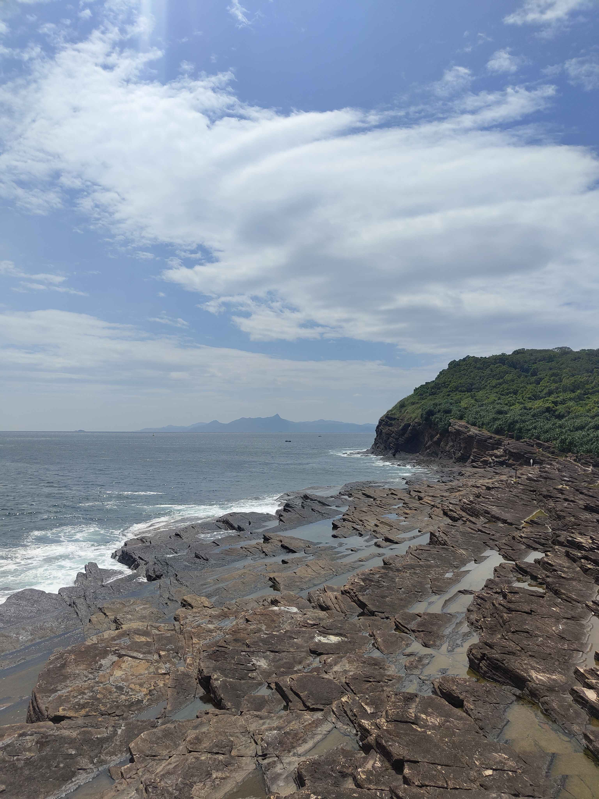
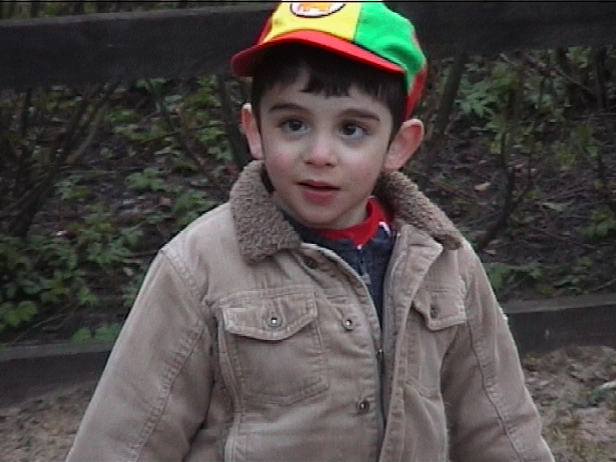
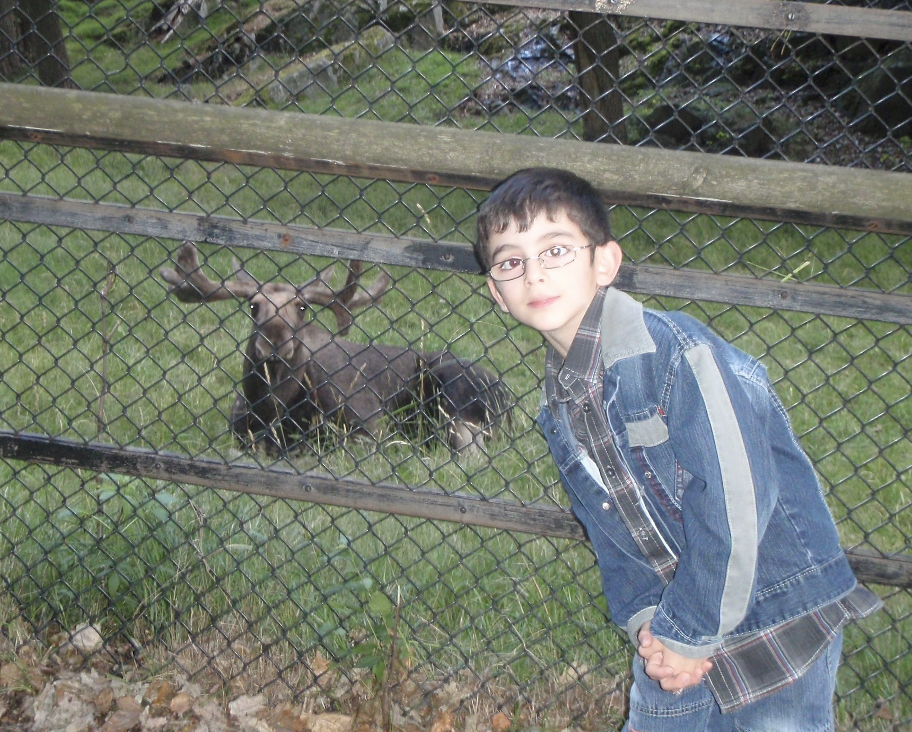

Today marks my first day as a PhD student, and I am excited to start this new chapter in my life.
I am grateful to have had the opportunity to meet all the brilliant and kind people whose support has opened opportunities I once could only dream of.

---

I still remember the first statistics lecture I had with Moritz. His enthusiasm for the subject was contagious, and it sparked my interest in understanding the (un)certainty::margin[[An exact science to make sense of an uncertain and inexact world ❤️](https://x.com/MoritzSchauer/status/1778091483226128700)] of the world:).
I will be forever grateful that he believed in my crazy (and perhaps too complex:)) idea for a bachelor's thesis, truly the catalyst for my interest in research and academia.

To this day, I still feel lucky that I got the opportunity to work with Richard::margin[Essentially going against [this](https://torkar.github.io/phd.html)] and Moritz on what would become the foundation of my research interests and skills.

The work with Richard and Moritz also led me to the opportunity to work with Simon and the AIMLeNS group.
I simply wish we had more time to work on `SemlaITO`:), summers are short!

I remember seeing the Canvas announcement by Morteza about a 1-year MSc thesis project and immediately sending my resume.
I was even more thrilled when I got the opportunity to work with him, Han, Linus, and Valter on [`AFABench`](https://doi.org/10.1145/3770855.3817493), which has been an incredible learning experience and a great opportunity to grow as a researcher.
I thank you all and hope to continue working with you in the future:).

To my ~~future~~ supervisor Anna, I am looking forward to five years of working together.
I knew from our first talk that I wanted to work with you. The shared passion for the communicative side of research, and the drive to make research more accessible and inclusive, are things I deeply resonate with, and I am excited to be part of that journey with you:).
I am excited to be one of your first PhD students. I am sure it will be a great experience, and I am looking forward to learning from you:).

---

However, not everything has been linear or clear from the start.
It was only after completing my [bachelor's thesis](/research/claudeslens/) back in 2024 with Moritz, and during my subsequent exchange semester in Hong Kong 🇭🇰 that I understood that I wanted to pursue a career in research and academia.
Before this, the role of science in my life was not clear to me.

For as long as I can remember, I have always liked talking to like-minded people, and I have always been curious about science and how things work.
However, being a (too) talkative and curious child came with some pushback.
I was often told to be quiet and stop bothering others with so many questions.
Unfortunately, this shaped me over the years to be a much more shy and reserved person.

But there was one thing I did not stop talking about, science and how to learn science.
I have always enjoyed trying to explain scientific concepts in my own words and understanding.
During all stages of education, my peers often came to me asking for help, and I have always enjoyed helping them:)
(a big reason that I started [Rezvan](/essays/rezvan_explains/) [Explains](/essays/rezvan_explains_diff/):) and [note-taking](/notes/)!).

Most of my life, I was not exposed to the various forms science and research can take. I always thought that being a scientist meant working in a laboratory.
I was never given early exposure to programming, computer science, and mathematics outside of school.
I wish I could have experienced the joy of learning and doing science in a more inclusive and accessible way from an early age, and I hope to contribute to making that a reality for others in the future:).

I wish I could go back in time and tell my younger self to be more confident, to ask more questions, and to talk to more people. It always amazes me how much I have learned, and how many opportunities I have had, just by talking to people and asking questions. I wish I could have done that more when I was younger.

I hope that by sharing my journey, I can inspire others to follow their passions and to not be afraid of being curious and talkative.
I am excited to start this new chapter in my life and I hope to make the most out of it.

