## You and your tools
Despite what most (tech-)people say, all professionals have a toolbox.
A doctor has an arsenal of tools to diagnose and treat patients, a carpenter has a set of chisels and saws, and programmers have the fortune to create their own tools.

I'm not going to tell you what tools you should use, that's stupid, you use the right tool, that **you know how to use**, for the job.

### The tools I use
Recently I've written a few tools that I use on a daily/weekly basis.
I've essentially managed to change large parts of my everyday workflow from a few lines of (mostly) Python.

Much of this change of heart was inspired by [this video](https://youtu.be/i_AUyNqFAGQ?si=6yfIXwip2OIBZpwv) (and just in general a lot from Vitaly).

#### arXiv Reading Tool
I've occasionally replaced my morning reading of stuff&trade; (X, BlueSky, HN, etc.) with reading arXiv papers (when I feel like it).

But the process of finding interesting papers was a bit infeasible, I mostly found papers via social media from people I follow.
So I wrote a simple shell script to gather top $N$ papers from arXiv in the last {24 hours, 1 week}.

I began by choosing one and downloading the PDF, but that was a bit boring. So I enhanced the workflow to:

1. Download the PDF(s).
2. From `fzf` [^1] select the paper I want to read.
3. Open the PDF in `sioyek` [^2].
4. Open a new `tmux` [^3] pane and open a `.md` file for taking notes.

and I'm happy with that, available in my [`.dotfiles`](https://github.com/rezaarezvan/.dotfiles/)

#### rezvanstyle
I wouldn't even call this a tool, but since I have the need to make beautiful plots, I need a good `plt.style()` to make my plots look good.

I wrote a script that simply does both light and dark themes, along with other scientific standards for plotting, available [here](https://github.com/rezaarezvan/rezvanstyle).

#### rdf
This is the main tool and the reason for this post.
If you haven't read my other posts or notes (newer ones), I'm invested quite a bit of time to have **dynamic plots**.

I remember a friend commenting on how normal plots look very bad when using dark mode, and this is the case for *static plots*.
So I started writing a tool that just took a matplotlib SVG and changed the colors to be dynamic (i.e. change color if you have light or dark mode).

The first iteration of the tool was successful and I've used it for [Rezvan Explains](/essays/rezvan_explains/).

But, recently I needed to expand the tool to support both 3D and animated plots, so I added support for that!

Here are some examples of the tool in action,

All of these are animated SVGs (although, the first one isn't that apparent), again, the tool is available [here](https://github.com/rezaarezvan/rdf).

Along with these tools I've also revamped my website, using [this beautiful theme](https://github.com/jktrn/astro-erudite).
I've added a bunch of small features that are helpful for me, like a search bar, a better way to collect my notes, automatic figure and figure caption generation, and a few other things.

## Conclusion
What I wanted to say is that you should always be on the lookout for ways to improve your workflow.
I'm aware that my tools might be a bit niche and not useful (and probably not even that good from a perf. and usability perspective), but they are useful for me.

I hope you now can find a way to sharpen your own axe and to better master your tools.

[^1]: [fzf](https://github.com/junegunn/fzf)
[^2]: [sioyek](https://github.com/ahrm/sioyek)
[^3]: [tmux](https://github.com/tmux/tmux/wiki)
