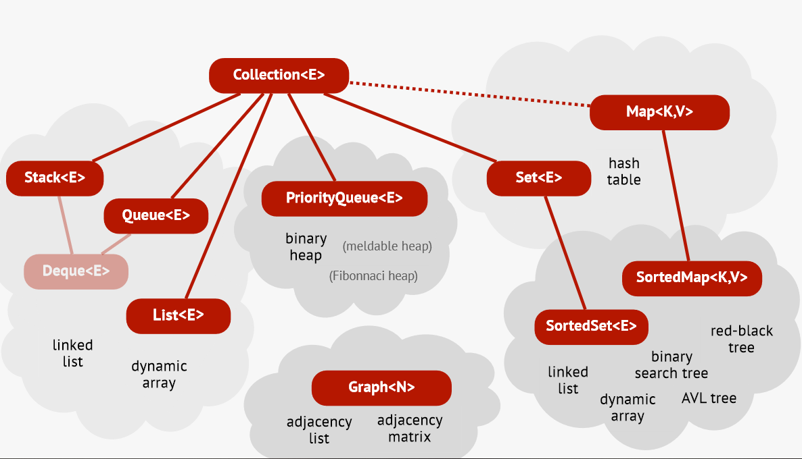

### ADT vs Data Structures
So, what's the difference between an **A**bstract **D**ata **T**ype and an actual data structure?

An ADT is a kind of specification of something - it specifies how we can interact with that *object*, like an API.

It consists of methods and constructors but also plain-text specifications (like the complexity for example) and explanations.

A data structure on the other hand is an **actual** *implementation* of an ADT. It specifies how the *object* works *internally*.
But an important note is, that it doesn't need to be in an actual programming language - often it's just specified in pseudocode.


### Method Descriptions
As explained above - an ADT has methods/functions - but these need to be specified/have a brief plain-text explanation.
For example, all these ADTs have the same functions, but work differently:
```
Stack<Item>:
    void add(Item x)
    Item remove()

Queue<Item>
    void add(Item x)
    Item remove()

PrioQueue<Item>:
    void add(Item x)
    Item remove()
```

### Different kind of ADTs
Now we will cover all ADTs that we will encounter in this course!

### Ordered collections: Stacks, Queues, etc

#### Stacks
Since we have covered in depth as well as implemented stacks, let's just briefly go over them.

Stacks - LIFO ('**L**ast **I**n **F**irst **O**ut')

Builds on the functions `pop()` `push()`

So the ADT would be:
```
Stack<Item>:
    // Adds Item X to the top of the stack
    void push(Item x)

    // Returns and removes the topmost element of the stack
    Item pop()

    // Returns the topmost element, without removing it
    Item peek()

    // Returns True if the stack is empty, False otherwise
    boolean is_empty()

    Returns the current size (length) of the stack
    int size()
```

#### Queues
Same goes for a queue - since we've already covered this in depth, we'll just briefly recover it.

Queues - FIFO ('**F**irst **I**n **F**irst **O**ut')

Builds on the functions `enqueue()` `dequeue()`

So the ADT can be described as:
```
Queue<Item>:
    // Adds Item X to the end of the queue
    void enqueue(Item x)

    // Removes and returns the first item in the queue
    Item dequeue()

    // Returns True if the queue is empty, False otherwise
    boolean empty()

    // Returns True if the queue is full, False otherwise
    boolean full()

    // Returns the current size (length) of the queue
    int qsize()
```

#### Stacks + Queues = Deques
If we combine these two ADTs that we've become so familiar with - we get a so-called double-ended queue!

Here's the ADT for it:
```
Deque<Item>:
    // Adds Item X to the front of the deque
    void add_first(Item x)

    // Adds Item X to the end of the deque
    void add_last(Item x)

    // Removes and returns the frontmost item in the deque
    Item remove_first()

    // Removes and returns the last item in the deque
    Item remove_last()
```

So why would we want to use a stack or queue - when their combination exists?

The answer is quite simple - it differs from problem to problem! Sometimes a stack might just be *exactly* what you want, and sometimes you might feel hindered or blocked by a ADT.

So you need to do research on what kind of ADT you should use before actually implementing one. Also cost/how hard the implementation will be is also a important factor.

#### Lists: Generalizing Stacks and Queues
Lists is the ADT when we finally don't restrict ourselves to only add/remove the front/end element - and finally can add/remove wherever we want!

The ADT looks something like:
```
List<Item>:
    // Inserts Item X at position i in the list
    void add(Item x, int i)

    // Removes and returns the item at position i
    Item remove(int i)

    // Returns the element on position i
    Item get(int i)

    // Sets/replaces element i with x
    void set(int i, Item x)

    // Returns True if the list is currently empty, otherwise False
    boolean is_empty()

    // Returns the current size (# of elements) in the list
    int size()
```

#### Priority Queues
The only difference between priority queues, stacks and regular queues is which element to remove.
A stack removes the 'youngest' element, a queue removes the 'oldest' element, and a priority queue removes the 'minimum' element. Minimum here means by some arbitrary ordering.

These are quite complicated to implement so, we'll be implementing them a bit later.

#### Iterating, Comparing and Sorting
Iterating, comparing, and sorting are all very important when it comes to ordered collections - we need to be able to iterate through the whole collection,
comparing items to each other, and of course the most important - sorting the collection!

These all feel like very 'low-level' and natural things - but quite often we ourselves will need to implement these.
For example, iterating through a queue. Note that some data structures actually doesn't allow iterating throughout the collection!

Iteration also works differently, for example in Java it's called `iterator()` and in Python `__iter__()`.
One thing to note is that iterables and iterators are different. An *iterator* has a method that returns the next element, and a way of telling when the iteration is exhausted.

So, an *iterator* can only be iterated over once, while an *iterable* can be iterated many times, because it creates new iterators. Quite a mouthful.

So in Python for example a simple:
```py
for x in elements:
    # do something with x
```
is translated to:
```py
it = elements.__iter__()
while True:
    try:
        x = it.__next__()
    expect StopIteration():
        break

    # do something  with x
```

A same kind of logic is applied when we want to compare items. If something is comparable they implement a *comparable* interface for example.
But often we want our own comparisons to something rather than the 'natural ordering' the comparable interface provides. In these cases we need to implement different *comparators*.

Now sorting becomes quite trivial - the built-in sorting methods either use the 'natural ordering' comparator, or can take a comparator as an argument to sort it how we want.

#### Unordered collections: Maps, sets, and graphs
These are just like the ordered collections, but without a specific order :)

#### Sets
You should be quite familiar with sets from a discrete math course - but let's go over it anyway.

A set is a collection of objects where:
* It cannot contain duplicates of the same object.
* Basic operations for testing for 'membership', and adding/removing an element.
* Methods for size of the set and testing for emptiness.
* Usually a kind of iterator for looping over all elements/members in set.

So the ADT could look like:
```
Set<Item>:
    // Returns True if x is in the set, False otherwise
    boolean contains(Item x)

    // Adds x to the set, if it's not already in the set
    void add(Item x)

    // Removes x from the set, if it's present
    void remove(Item x)

    // Returns True if the set is currently empty, False otherwise
    boolean is_empty()

    // Returns the current size (# of elements) in the set
    int size()

    // Iterates over all elements in the set
    Iterator<Item> iterator()
```
#### Maps

A map is a 'mapping' from a 'key' to a 'value' with these properties:
* It cannot contain duplicates of the same 'key'
* The basic operations are `getting` and `setting` the 'value' for a given 'key'. Also removing a 'key' along with its associated value.
* Helper methods such as, `number_of_keys()`, `is_empty()`
* (Usually) an iterator to loop over all keys

So an ADT would look like:
```
Map<Key, Value>:
    // Returns True if there's an association for the key, k.
    boolean contains(Key k)

    // Returns the value associated with key, k.
    Value get(Key k)

    // Associates the key, k, with the value, v.
    void put(Key k, Value v)

    // Removes the value associated with the key, k.
    void remove(Key k)

    // Returns True if the Map is currently empty, False otherwise
    boolean is_empty()

    // Returns the current size (# of key-value pairs) in the map
    int size()

    // Iterates over all keys in the map
    Iterator<Key> keys()
```

'Maps' have a lot of associated names:
* Dictionaries
* Symbol tables
* Associative arrays
* Lookup tables
* finite-domain functions
* $\dots$

Maps can be seen as a further generalization of list even. The integer position is now replaced by a generic 'key' type.

For actual implementation of maps, these are the following:
* Lists
* Search trees
    * Binary search trees
        * Unbalanced BSTs
        * Balanced BSTs (red-black tree, AVL trees, $\dots$)
* Hash tables
    * Separate chaining
    * Open addressing (Linear probing, quadratic probing, $\dots$)
* Randomized data structures
    * Skip list, treap, $\dots$

#### A Set is Degenerated Map
If we have an implementation of a map, it's actually quite easy to turn it into a set. We just need to create an underlying map,
whose keys are the set items!

So an ADT solution would be:
```
Set<Item>:
    Map<Item, Void> underlying_map

    boolean contains(Item x)  = underlying_map.contains(x)
    void add(Item x)          = underlying_map.add(x, null)
    void remove(Item x)       = underlying_map.remove(x)

    boolean is_empty()        = underlying_map.is_empty()
    int size()                = underlying_map.size()

    Iterator<Item> iterator() = underlying_map.keys()
```

#### Multiset and multimap
Sometimes we want to put several objects into the same 'slot' (for example a set with lists).

A multiset (sometimes called 'bag') is just like a set, but can contain duplicates.
```
Multiset<Item>:
    // Returns the number of occurrences of Item x in the multiset
    int count(Item x)

    // Adds Item X to the multiset
    void add(Item x)

    // Removes one occurrence of Item x, returns the Item
    Item remove(Item x)
```

A multimap (or sometimes called 'index') is just like a map, but keys can map to several values.
```
Multimap<Key, Value>:
    // Returns the whole collection of values associated with the key, k
    Collection<Value> get(Key k)

    // Adds the value, v, to the key, k
    void add(Key k, Value v)

    // Removes the value, v, associated with the key, k
    void remove(Key k, Value v)
```

#### Multiset and Multimap are Maps
Now this might sound weird - but yes, maps as well! We can just like how we implemented a set using an underlying map,
use an underlying map to implement multisets and maps.

An ADT for this would be:
```
Multimap<Key, Value>:
    Map<Key, Set<Value>> underlying_map

    Collection<Value> get(Key k) = underlying_map.get(k)

    void add(Key k, Value v)     = underlying_map.put(k, v)

    void remove(Key k, Value v)  = underlying_map.remove(k)
```

And for Multisets:
```
Mutlisets<Item>:
    Map<Key, Item> underlying_map

    int count(Item x) = underlying_map.get(x)

    void add(Item x) =
        if underlying_map.contains():
            count = underlying_map.get(x)
            count += 1
            underlying_map.put(x, count)
        else:
            underlying_map.put(x, 1)

    Item remove(Item x) = underlying_map.remove(x)
```

### Graphs
Graphs should also be familiar from the discrete mathematics course - but let's quickly go over it. Graphs consists of *nodes* (also called vertices, points)
- and *edges* (also called arcs, links) that connect nodes.

There are many, many types of graphs - in this course we'll mainly use so-called directed graphs, so our ADT will look like:
```
DirectedGraph<Node>:
    // Adds an edge to the graph
    void add(DirectedEdge<Node> e)

    // Removes an edge from the graph
    void remove(DirectedEdge<Node> e)

    // Returns True if the graph contains the edge, False otherwise
    boolean contains(DirectedEdge<Node> e)

    // Returns all edges that goes out from Node, n
    Collection<DirectedEdge<Node>>
        outgoing_edges(Node n)

    // Returns the total number of nodes in the graph
    int n_node()

    // Returns the total number of edges in the graph
    int n_edges()
```

As you can see this ADT relies on a class that specifies how an edge should work:
```
class DirectedEdge<Node>:
    // The constructor to create a new edge between two nodes
    __init__(Node from, Node to, float weight)

    // Returns the 'starting' node
    Node from()

    // Returns the 'final' node
    Node to()

    // Returns the weight of the edge
    double weight()
```

As said earlier, graphs come in many different shapes and forms - either they are directed or directed as well as weighted or unweighted.

### Summary
*Phew* this was a lot to take in (and write...) - but to summarize - there really isn't a universal standard/best of what the best ADT/API looks like.

In my notes there is one way, I wrote it using slightly different syntax/language. But the takeaway is still the ADTs as in a concept -  all these ADTs build on the same basic idea/operations.

I really liked the picture from the slides in my course so, I'll put it here to visualize everything we have discussed today.


In the next part we'll begin with concept we mentioned today - Hash tables!
