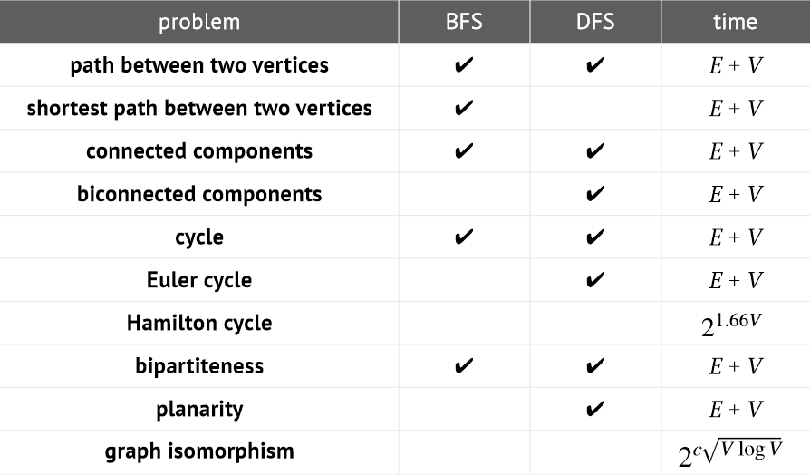

In this part we'll so-called graphs and their applications.

### Introduction of Graphs
A graph is a *set* of **vertices** connected *pairwise* by **edges**.
So a very natural thing is that these edged can be either undirected or directed!

A node can have a so-called **degree** describing how many in/outgoing edges it has.
In the directed case we split this variable to 'out degree' and 'in degree'.

Another basic term that we'll encounter is a **cycle**.
A cycle is just as it sounds, a *cycle*, meaning that you start in a certain node and after a *walk* you end up in the same node again.

Also, we can see the undirected graphs as directed graphs, but just having edges in both directions.
We'll mainly look at the use cases for directed graphs.


### Pseudo Code for Graphs
There are a lot of different ADT/API's for graphs, we'll be using this:
```
class Graph<Vertices>:
    // Adds an edge to the graph
    add_edge(e: Edge<Vertices>)

    // Removes an edge from the graph
    remove_edge(e: Edge<Vertices>)

    // Returns true if the edge is present in the graph, otherwise false
    contains_edge(e: Edge<Vertices>) -> boolean

    // Returns all the edges which are connected with the vertices
    outgoing_edges(from: Vertices) -> Collection<Edge<Vertices>>

    // Returns the number of vertices present in the graph
    n_vertices() -> Int

    // Returns the number of edges present in the graph
    n_edges() -> Int
```

Now this depends on the `Edge` class which will be implemented as:
```
class Edge<Vertices>:
    from   : Vertices
    to     : Vertices
    weight : float = 1.0
```

### Graph Representation
We can represent a graph by doing:
* A set of edges
* An adjacency list
* An adjacency matrix

#### Representation: Set of edges
We can use set data structure for this. If the graph is undirected we only need to keep one pair of the direction.
This is a quite good implementation for undirected graphs,
since the complexity of finding all adjacent neighbors to a vertex v would be $\mathcal{O}(E)$,
where E is the total number of edges in the graph.

It can look something like:
```
0 1
0 2
0 5
0 6
3 4
3 5
4 5
4 6
7 8
9 10
9 11
9 12
11 12
```
We can look at these as tuples, where $(v_1, v_2)$ means that $v_1$ has a connecting edge to $v_2$.
This is directed, but as we said, if we have an undirected graph, then it is enough to store just one of them.

#### Representation: Adjacency list
We maintain a *map* from vertices to collections of edges, we could alternatively also do a collection of vertices.

If the graph is **undirected**, then we need to include **both** directions.

The complexity for iterating over all the vertices adjacent to a vertex is $\mathcal{O}(v_a)$,
we can write this as $\mathcal{O}(degree(V))$.
So it's good, note this is if the lookup for the key is $\mathcal{O}(1)$.

#### Representation: Adjacency matrix
We maintain a 2d $V \times V$ boolean array. Where true represent a connecting edge.

The complexity of this is quite bad, since we need to loop through one of the dimensions, the complexity becomes $\mathcal{O}(V)$.

#### Representation
In most real-world cases we use adjacency lists

### Implementation
So let's try to implement a directed graph using an adjacency list!
```
class Graph<V>:
    all_edges    : Map<V, Collection<Edge<V>>>
    n_edges      : int
    all_vertices : Set<V>

    outgoing_edges(from: V) -> Collection<Edge<V>>:
        return all_edges.get(from)

    contains_edge(e: Edge<V>) -> boolean:
        return e in outgoing_edges(edge.from)

    add(e: Edge<V>):
        outgoing = outgoing_edges(e.from)

        if e not in outgoing:
            outgoing.add(e)
            n_edges += 1
            all_vertices.add(e.from)
            all_vertices.add(e.to)

    remove(e: Edge<V>):
        outgoing = outgoing_edges(e.from)
        if edge in outgoing:
            outgoing.remove(e)
            n_edges -= 1
```

### Searching in Graphs
In many real-world applications, graphs will represent some sort of maze, or other structure, where we want to find a path.
Sometimes the path with the least resistance/weight/length. There are two primary search algorithms for graphs.

So called **D**epth-**F**irst **S**earch or DFS for short. The other called **B**readth-**F**irst **S**earch or BFS for short.

Let's begin with DFS.

#### Depth-first search
Depth-first search is a way to traverse a graph systematically.

A short pseudocode of a DFS would be:
```
DFS(to visit a vertex v):
    mark v as visited
    recursively visit all unmarked vertices w adjacent to v
```

We've encountered DFS for trees, the difference here as we can see is that we 'mark' each vertex we visit.
Because in a graph, there might be cycles, so we don't want to be stuck in them.

Applications of using a DFS are usually,
finding all vertices connected to a source vertex, or simply, finding a path between two vertices.

#### Implementation
To implement this we need data structures! To store all marked vertices, we will use a Set.
To keep track of the path we've taken, we'll use a map which contains vertices tuples.

```
recursiveDFS(v : V):
    add v to visited
    for edge in outgoing_edges(v):
        w = endpoint of edge
        if v not in visited:
            recursiveDFS(w)
            cameFrom[w] = v
```

### Breadth-First Search
For our DFS we used an underlying stack for our recursive calls, the function stack.

BFS uses a *queue* instead of stack, so we have to implement this ourselves.

So a breakdown of what we have to do:
```
BFS(from a starting vertex s):
    put s into FIFO queue, mark as visited
    while queue not empty:
        dequeue a vertex v
        for each unmarked vertex w adjacent to v:
            enqueue w, mark it as visited
```

So really, the only difference for BFS in trees compared to graphs is that we have to keep track of the visited vertices.

#### Implementation
So a pseudocode implementation would look something like:
```
iterativeBFS(start: V):
    visited = new Set<V>
    agenda = new Queue<V>
    agenda.enqueue(start)

    while agenda is not empty:
        agenda.dequeue(v)
        if v not in visited:
            add v to visited
            for edge in outgoing_edges(v):
                w = endpoint of edge
                if w not in visited:
                    add w to agenda
```

If we want to retrace our steps, we would need a `cameFrom` Map as in the DFS.

Also, one thing to note, if we replace the queue, with a stack, we'll just end up with a `iterativeDFS` instead!

#### BFS properties
In a BFS search, what do we actually get/perform? We get a path yes -
but it's always the **shortest** path from `s` to all other vertices!
It actually does this in $\mathcal{O}(E + V)$

#### Implementation: Calculating the distance
In this implementation we'll add a map that hold the distances between every vertex.
(I also added that `cameFrom` map that I discussed earlier)
```
iterativeBFS(start: V):
    visited = new Set<V>
    agenda = new Queue<V>
    cameFrom = new Map<V,V>
    distTo = new empty Map<V, Int>

    agenda.enqueue(start)
    distTo[start] = 0

    while agenda is not empty:
        agenda.dequeue(v)
        if v not in visited:
            add v to visited
            for edge in outgoing_edges(v):
                w = endpoint of edge
                if w not in visited:
                    add w to agenda
                    cameFrom[w] = v
                    distTo[w] = 1 + distTo[v]
```

### Example Problems
So now that we've seen DFS, BFS and understood graphs - let's see what we can do with them.

A very important kind of graph is a **DAG**, or a Directed **acyclic** graph. This means the graph doesn't contain any cycles.

This is especially useful for scheduling, for example. But we need to know if a graph contains a cycle - how can we detect a cycle?

That's a very common problem that many applications implement into their programs.
There are multiple ways of detecting a cycle in a graph, for example,
we can use a DFS, and if we encounter a node that we've visited before, we know that we have a cycle.

Also, a good note here, If we ever want the *preorder*, *post order* or *reverse post order* we just modify our DFS by one line -
we change where the enqueue/push goes.

```
DFS(v : V):
    visited.add(v)
    preorder.enqueue(v)
    for w in outgoing_edges(v):
        if w not in visited:
            visited.add(w)
    postorder.enqueue(v)
    reversePostorder.push(v)
```

Note that the `reversePostorder` is a stack, therefore we will get the reverse order.

There are many finding 'connected components' problems, here's a good picture to illustrate what we can use and not:


### Conclusion
So that's it for graphs - in the next part we'll cover *minimum spanning trees* and *shortest path algorithms*.
