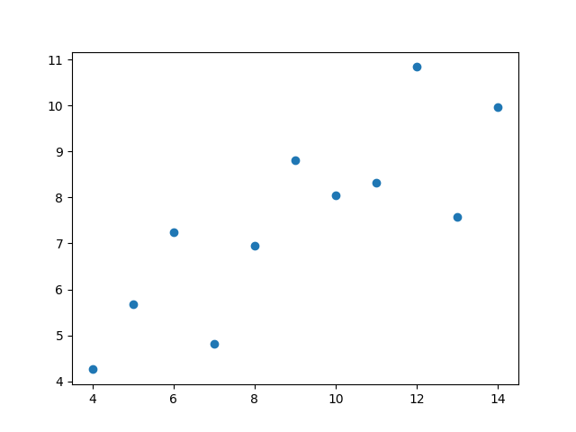
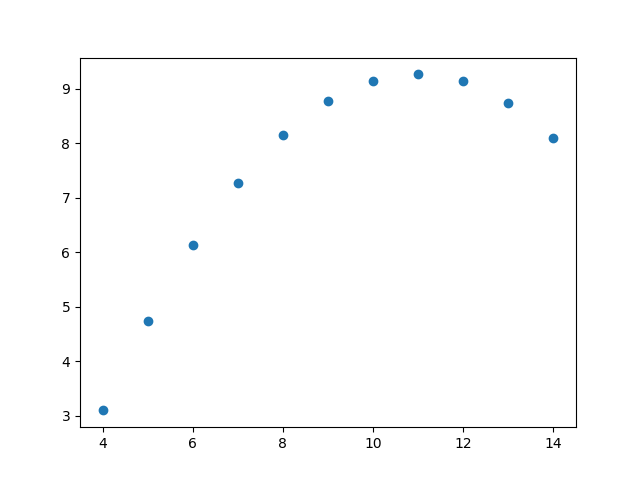
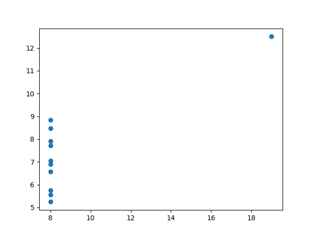
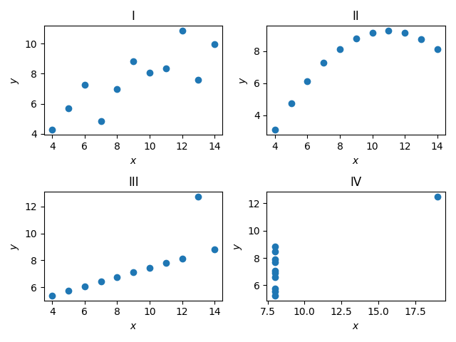
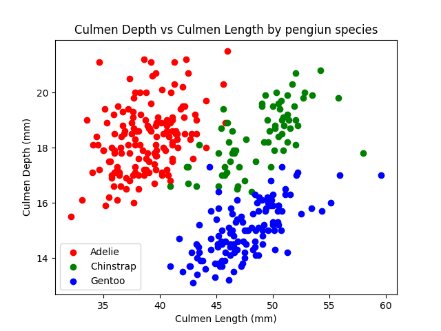

### Introduction
In this part we're going to explore some popular Python tools for data science.

#### NumPy
**Num**erical **Py**thon, is the standard package for computation and array operations.

Low-level functions are written in C, therefore, very fast.

### Basic operations in NumPy
We usually import as:
```py
import numpy as np
```

NumPy arrays can be constructed with the following:
```py
A = np.array([69, 420, 1337, 42])
```

A NumPy array is defined by:
* The number of dimensions it has (`ndim`)
* The number of elements it has (`size`)
* Its `shape` (number of elements along an axis)
* Its `dtype`

```py
A = np.array([69, 420, 1337, 42])
# A.ndim = 1
# A.size = 4
# A.shape = (4, )
# A.dtype = int64
```

We can either specify the `dtype` or let NumPy automatically assign it.

Different ways to create NumPy arrays that we usually use:
* `arange` construct numbers from a range.
* `zeros` creates an array full of zeros, with any shape.
* `ones` creates an array full of ones, with any shape.
* `eye` creates the identity array.
* `full` creates an array filled with a specific element/array.

We can `reshape` our arrays and matrix, the new shape must have equal size (product of the shape).
```py
A = np.array([69, 420, 1337, 42])
A.reshape(2, 2)
'''
[[69, 420],
 [1337, 42]]
'''
```

This does not make a copy, this returns a *view* (basically a pointer).

We can *transpose* our arrays and matrix as well:
```py
A = np.array([69, 420, 1337, 42])
A.reshape(2, 2).T
'''
[[69, 1337],
 [420, 42]]
'''
```

We can change the dtype with the `.astype()` function:
```py
A = np.array([69, 420, 1337, 42])
A.astype(np.float32)
'''
[69.0, 420.0, 1337.0, 42.0]
'''
```

We access elements in NumPy arrays with usual bracket notation:
```py
A = np.array([69, 420, 1337, 42])
A[0]
'''
69
'''
```

NumPy supports Python style slicing:
```py
A = np.array([69, 420, 1337, 42])
# A[1:-1] = [420, 1337]
# A[::2] = [69, 1337]
```

NumPy supports all basic math operations:
```py
A = np.array([69, 420, 1337, 42])
# A + 1 = [70, 421, 1338, 43]
```

There are a lot more functions to explore in the NumPy documentation[^1] :)

### Matplotlib
Matplotlib is the standard way of plotting figures and graphs in Python.
Used for ploting any kind of plot you can think of, scatter plots, line plots, contour plots, etc.

It comes with multiple APIs, but the standard one for Python is the `pyplot` API. Let's take a look at a practical example.

#### Anscombe's quartet
Anscombe's quartet[^2] is a small dataset that shows the importance of graphing your data when dealing with statistics.

To understand we'll graph this dataset for ourselves:
```py
import numpy as np
import matplotlib.pyplot as plt
```

Firstly, let's import numpy for the data processing and matplot for the plotting.
```py
anscombe_data = np.array([10.0, 8.04, 10.0, 9.14, 10.0, 7.46, 8.0, 6.58,
8.0, 6.95, 8.0, 8.14, 8.0, 6.77, 8.0, 5.76,
13.0, 7.58, 13.0, 8.74, 13.0, 12.74, 8.0, 7.71,
9.0, 8.81, 9.0, 8.77, 9.0, 7.11, 8.0, 8.84,
11.0, 8.33, 11.0, 9.26, 11.0, 7.81, 8.0, 8.47,
14.0, 9.96, 14.0, 8.10, 14.0, 8.84, 8.0, 7.04,
6.0, 7.24, 6.0, 6.13, 6.0, 6.08, 8.0, 5.25,
4.0, 4.26, 4.0, 3.10, 4.0, 5.39, 19.0, 12.50,
12.0, 10.84, 12.0, 9.13, 12.0, 8.15, 8.0, 5.56,
7.0, 4.82, 7.0, 7.26, 7.0, 6.42, 8.0, 7.91,
5.0, 5.68, 5.0, 4.74, 5.0, 5.73, 8.0, 6.89])
```

Let's reshape our NumPy array so it is a bit more readble and how it looks in Wikipedia.
```py
anscombe_data = anscombe_data.reshape(11, 4, 2).transpose(1, 0, 2)
'''
[[[10.    8.04]
  [ 8.    6.95]
  [13.    7.58]
  [ 9.    8.81]
  [11.    8.33]
  [14.    9.96]
  [ 6.    7.24]
  [ 4.    4.26]
  [12.   10.84]
  [ 7.    4.82]
  [ 5.    5.68]]

 [[10.    9.14]
  [ 8.    8.14]
  [13.    8.74]
  [ 9.    8.77]
  [11.    9.26]
  [14.    8.1 ]
  [ 6.    6.13]
  [ 4.    3.1 ]
  [12.    9.13]
  [ 7.    7.26]
  [ 5.    4.74]]

 [[10.    7.46]
  [ 8.    6.77]
  [13.   12.74]
  [ 9.    7.11]
  [11.    7.81]
  [14.    8.84]
  [ 6.    6.08]
  [ 4.    5.39]
  [12.    8.15]
  [ 7.    6.42]
  [ 5.    5.73]]

 [[ 8.    6.58]
  [ 8.    5.76]
  [ 8.    7.71]
  [ 8.    8.84]
  [ 8.    8.47]
  [ 8.    7.04]
  [ 8.    5.25]
  [19.   12.5 ]
  [ 8.    5.56]
  [ 8.    7.91]
  [ 8.    6.89]]]
'''
```

Let's break it up into the four indviual datasets:
```py
anscombe = {'I': anscombe_data[0, :, :],
            'II': anscombe_data[1, :, :],
            'III': anscombe_data[2, :, :],
            'IV': anscombe_data[3, :, :]}
```

Before we plot the actual graphs, let's take a loook at the mean, standard devation and variance for all four of the datasets.
```py
for key, value in anscombe.items():
    print(key)
    print('Mean: ', np.mean(value, axis=0))
    print('Standard deviation: ', np.std(value, ddof=1, axis=0))
    print('Variance: ', np.var(value, axis=0))
    print('Correlation coefficient: ', np.corrcoef(
        value[:, 0], value[:, 1])[0, 1])
    print()
'''
I
Mean:  [9.         7.50090909]
Standard deviation:  [3.31662479 2.03156814]
Variance:  [10.          3.75206281]
Correlation coefficient:  0.81642051634484

II
Mean:  [9.         7.50090909]
Standard deviation:  [3.31662479 2.03165674]
Variance:  [10.          3.75239008]
Correlation coefficient:  0.8162365060002428

III
Mean:  [9.  7.5]
Standard deviation:  [3.31662479 2.0304236 ]
Variance:  [10.          3.74783636]
Correlation coefficient:  0.8162867394895984

IV
Mean:  [9.         7.50090909]
Standard deviation:  [3.31662479 2.03057851]
Variance:  [10.          3.74840826]
Correlation coefficient:  0.8165214368885028
'''
```

So, from a purerly statistical view, we would think that all these datasets should look *somewhat* similar, right?

Let's plot them and see. Let's plot them as scatter plots:
```py
for key, value in anscombe.items():
    plt.scatter(value[:, 0], value[:, 1])
    plt.show()
```





Let's plot them all together:
```py
fig, axs = plt.subplots(2, 2)
for (ax, (key, value)) in zip(axs.ravel(), anscombe.items()):
    ax.scatter(value[:, 0], value[:, 1])
    ax.set_xlabel('$x$')
    ax.set_ylabel('$y$')
    ax.set_title(key)

fig.tight_layout()
plt.show()
```


So, we can see that these datasets, in reality, differ a lot from each other, but seem to have equivalent statistical properties.
We'll look into more statistics later on :).

### Pandas
The last library we'll cover is the data analysis library Pandas.
When dealing with large datasets, we'll usually want to use common convient functions to read, write and manipulate data fast.

Pandas can make use of NumPy as a backend for some data.

Before jumping into a practial example we're we'll use Pandas, let's first understand how we'll represent data.

### Wide and long format
When we want to represent data, we have two options:
* In wide format, the data is indexed by first column where the values do not repeat.
    * Different variables for observations are placed on different columns.
* In long format, a column indexes the different kinds of observations and another column contains the respective values.

Converting data to wide format is called **pivoting**.

Converting data to long format is **unpivoting** or **melting**.
```py
'''
Wide format

  Person  Age  Weight  Height
0    Bob   32     168     180
1  Alice   24     150     175
2  Steve   64     144     165

Long format

  Person Attribute  Value
0    Bob       Age     32
1    Bob    Weight    168
2  Alice       Age     24
3  Alice    Weight    150
4  Steve       Age     64
5  Steve    Weight    144
'''
```

### Palmer penguins
We'll use the palmer penguins[^3] data set.

Let's import Pandas, note that we don't import NumPy here!
```py
import pandas as pd
```

Pandas offers a great selection of reading methods for different file formats.
```py
df = pd.read_csv('penguins_size.csv')
print(df)
'''
    species     island  culmen_length_mm  culmen_depth_mm  flipper_length_mm  body_mass_g     sex
0    Adelie  Torgersen              39.1             18.7              181.0       3750.0    MALE
1    Adelie  Torgersen              39.5             17.4              186.0       3800.0  FEMALE
2    Adelie  Torgersen              40.3             18.0              195.0       3250.0  FEMALE
3    Adelie  Torgersen               NaN              NaN                NaN          NaN     NaN
4    Adelie  Torgersen              36.7             19.3              193.0       3450.0  FEMALE
..      ...        ...               ...              ...                ...          ...     ...
339  Gentoo     Biscoe               NaN              NaN                NaN          NaN     NaN
340  Gentoo     Biscoe              46.8             14.3              215.0       4850.0  FEMALE
341  Gentoo     Biscoe              50.4             15.7              222.0       5750.0    MALE
342  Gentoo     Biscoe              45.2             14.8              212.0       5200.0  FEMALE
343  Gentoo     Biscoe              49.9             16.1              213.0       5400.0    MALE
'''
```

To get an overview we can use the `.describe()` function.
```py
print(df.describe())
'''
       culmen_length_mm  culmen_depth_mm  flipper_length_mm  body_mass_g
count        342.000000       342.000000         342.000000   342.000000
mean          43.921930        17.151170         200.915205  4201.754386
std            5.459584         1.974793          14.061714   801.954536
min           32.100000        13.100000         172.000000  2700.000000
25%           39.225000        15.600000         190.000000  3550.000000
50%           44.450000        17.300000         197.000000  4050.000000
75%           48.500000        18.700000         213.000000  4750.000000
max           59.600000        21.500000         231.000000  6300.00000
'''
```

To select a column we can do:
```py
print(df['species'])
'''
0      Adelie
1      Adelie
2      Adelie
3      Adelie
4      Adelie
        ...
339    Gentoo
340    Gentoo
341    Gentoo
342    Gentoo
343    Gentoo
Name: species, Length: 344, dtype: object
'''
```

We can also select data with `.iloc` and `.loc`. `iloc` is index based.
```py
print(df.iloc[0])
'''
species                 Adelie
island               Torgersen
culmen_length_mm          39.1
culmen_depth_mm           18.7
flipper_length_mm        181.0
body_mass_g             3750.0
sex                       MALE
Name: 0, dtype: object
'''
```

Where as `.loc` is string based, in this case both `iloc` and `loc` yields the same answer since we group the data with index.
In other datasets we could have a string based index.

We can easily filter and choose the right data with:
```py
print(df.loc[df['culmen_length_mm'] < 40])
'''
    species     island  culmen_length_mm  culmen_depth_mm  flipper_length_mm  body_mass_g     sex
0    Adelie  Torgersen              39.1             18.7              181.0       3750.0    MALE
1    Adelie  Torgersen              39.5             17.4              186.0       3800.0  FEMALE
4    Adelie  Torgersen              36.7             19.3              193.0       3450.0  FEMALE
5    Adelie  Torgersen              39.3             20.6              190.0       3650.0    MALE
6    Adelie  Torgersen              38.9             17.8              181.0       3625.0  FEMALE
..      ...        ...               ...              ...                ...          ...     ...
146  Adelie      Dream              39.2             18.6              190.0       4250.0    MALE
147  Adelie      Dream              36.6             18.4              184.0       3475.0  FEMALE
148  Adelie      Dream              36.0             17.8              195.0       3450.0  FEMALE
149  Adelie      Dream              37.8             18.1              193.0       3750.0    MALE
150  Adelie      Dream              36.0             17.1              187.0       3700.0  FEMALE

[100 rows x 7 columns]
'''
```

We can have chained boolean expressions with `&` for AND, `|` for OR, and `~` for NOT.
```py
print(df.loc[(df['culmen_length_mm'] < 60) & (df['species'] == 'Gentoo')])
'''
    species  island  culmen_length_mm  culmen_depth_mm  flipper_length_mm  body_mass_g     sex
220  Gentoo  Biscoe              46.1             13.2              211.0       4500.0  FEMALE
221  Gentoo  Biscoe              50.0             16.3              230.0       5700.0    MALE
222  Gentoo  Biscoe              48.7             14.1              210.0       4450.0  FEMALE
223  Gentoo  Biscoe              50.0             15.2              218.0       5700.0    MALE
224  Gentoo  Biscoe              47.6             14.5              215.0       5400.0    MALE
..      ...     ...               ...              ...                ...          ...     ...
338  Gentoo  Biscoe              47.2             13.7              214.0       4925.0  FEMALE
340  Gentoo  Biscoe              46.8             14.3              215.0       4850.0  FEMALE
341  Gentoo  Biscoe              50.4             15.7              222.0       5750.0    MALE
342  Gentoo  Biscoe              45.2             14.8              212.0       5200.0  FEMALE
343  Gentoo  Biscoe              49.9             16.1              213.0       5400.0    MALE

[123 rows x 7 columns]
'''
```

Very often it is useful to sort/index the raw data based on some metric, let's group the numerical data by the species and take the mean:
```py
print(df.groupby('species')[['culmen_length_mm', 'culmen_depth_mm', 'flipper_length_mm', 'body_mass_g']].mean())
'''
           culmen_length_mm  culmen_depth_mm  flipper_length_mm  body_mass_g
species
Adelie            38.791391        18.346358         189.953642  3700.662252
Chinstrap         48.833824        18.420588         195.823529  3733.088235
Gentoo            47.504878        14.982114         217.186992  5076.016260
'''
```

Let's format this into long format:
```py
df2 = df.groupby('species')[['culmen_length_mm', 'culmen_depth_mm', 'flipper_length_mm', 'body_mass_g']].mean()
print(df2.reset_index().melt(id_vars=['species'], var_name='measurement', value_name='value'))
'''
      species        measurement        value
0      Adelie   culmen_length_mm    38.791391
1   Chinstrap   culmen_length_mm    48.833824
2      Gentoo   culmen_length_mm    47.504878
3      Adelie    culmen_depth_mm    18.346358
4   Chinstrap    culmen_depth_mm    18.420588
5      Gentoo    culmen_depth_mm    14.982114
6      Adelie  flipper_length_mm   189.953642
7   Chinstrap  flipper_length_mm   195.823529
8      Gentoo  flipper_length_mm   217.186992
9      Adelie        body_mass_g  3700.662252
10  Chinstrap        body_mass_g  3733.088235
11     Gentoo        body_mass_g  5076.016260
'''
```

Lastly, let's make a simple plot that shows the culmen depth vs culmen length for all the species in one scatter plot.
```py
import matplotlib.pyplot as plt
import numpy as np
colors = ['red', 'green', 'blue']
species_to_num = {v: k for (k, v) in enumerate(df['species'].unique())}

for species, group in df.groupby('species'):
    plt.scatter(group['culmen_length_mm'], group['culmen_depth_mm'],
                color=colors[species_to_num[species]], label=species)
    plt.xlabel('Culmen Length (mm)')
    plt.ylabel('Culmen Depth (mm)')
    plt.title('Culmen Depth vs Culmen Length by pengiun species')
    plt.legend()

plt.show()
```


[^1]: [NumPy documentation](https://numpy.org/doc/)
[^2]: [Anscombe's quartet](https://en.wikipedia.org/wiki/Anscombe%27s_quartet)
[^3]: [Palmer penguins dataset](https://www.kaggle.com/datasets/parulpandey/palmer-archipelago-antarctica-penguin-data)
