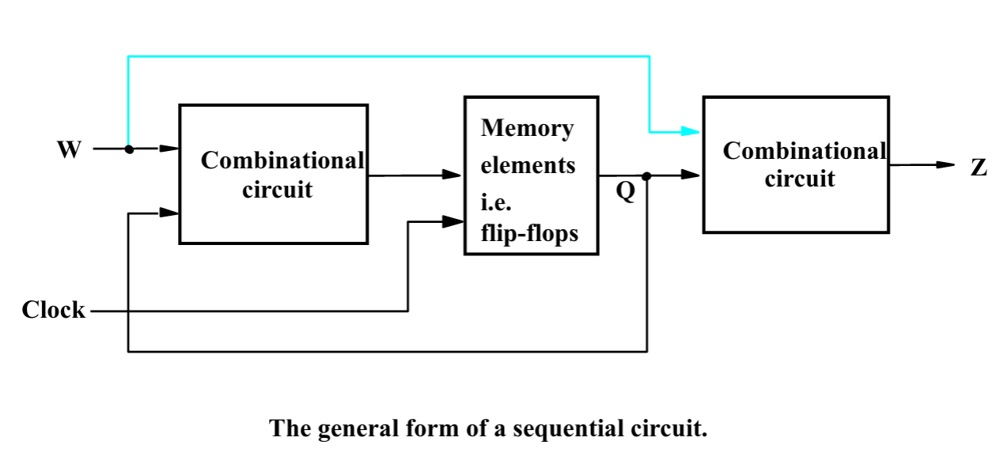
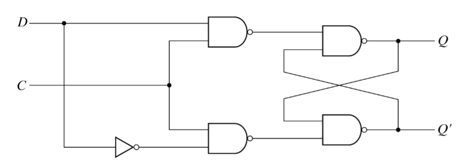

### Sequential Circuits
When we usually look at circuits we have an input and output who are independent on each other.
In a sequential circuit, as the name suggest, we have a sequence. Meaning we feed back our output as input.

We can easily define this as: Our output no longer depends on the present input - but on the past behavior of the circuit.

### State-Holding Memory Elements
We've encountered latches and flip-flops before, they have a so-called memory element to them.

Let's quickly go over the difference between a latch and a flip-flop.

* Latch
    * Latches are **level-sensitive**
        * When the clock is *high*, the latch is **transparent** (output $\leq$ input)
        * When the clock is *low*, the latch **keeps** its previous state.
* Flip-flop
    * Flip-flops are **edge-sensitive**
        * Data passes through only on a rising/falling edge of the clock.

Latches are also cheaper to implement than flip-flops, but flip-flops are easier to in designs than latches.

We'll primarily look over the so-called D flip-flop.

### D Latch

:::table[D-latch inputs.]{#d-latch-inputs}
| C |  D   |
|---|  --- |
| 0 |  X   |
| 1 |  0   |
| 1 |  1   |
:::

As we can see, we just "store" the value we have set.
To build a D flip-flop, we can use a master-slave architecture. We could also use a positive edge triggered architecture.

#### Setup and hold time
The D input signal must be stable when clock is changing from 0 -> 1 (setup).
The same D signal must remain stable for a while after the clock change (hold).

Good to note is that the reset of a D flip-flop can be asynchronous or synchronous.

### Registers, Shift Registers and Counters
A register is just a circuit which contains `N` flip-flops. Whilst a flip-flop stores 1-bit information.
A register will contain `N`-bit information. Usually a *common clock* is used for each flip-flop in the register.

Shift registers are just as the name implies, you shift around the given input into each flip-flop.

:::example[Sequence detector]
We can use what we've learned to build a sequential circuit which detects two 1's in a row in a sequence.

If we go back to our general picture of a sequential circuit, and list our specifications:

* The circuit should have one input, w, and one output, z.
* All changes occur on **positive** edge of the clock.
* The output, z, should be equal to 1 if two immediately preceding clock cycles the input w was 1.
Otherwise, z should be 0.

If we plan our stat diagram we can say that:

We begin in state A when the power is on or during a *reset* signal. We keep being in state A as long as w $\to$ 0.

When w $\to$ 1, we move to state B.

If w $\to$ 0, then we move back to state A.
If w $\to$ 1, then we move to state C and set z = 1

In state C, if w $\to$ 0, then move back to state A
if w $\to$ 1, remain in state C.

After this we draw our state table, followed by the Karnaugh maps that follow from the state tables.

Then we can at last implement this circuit.
:::

:::algorithm[Sequential circuit design procedure]
* Specifications
* Derive the states, and create a state diagram
* Create a state table
* (State minimization)
* State assignment
* Choose flip-flops
* Derive logic expressions for state and outputs
* Implementation
:::
