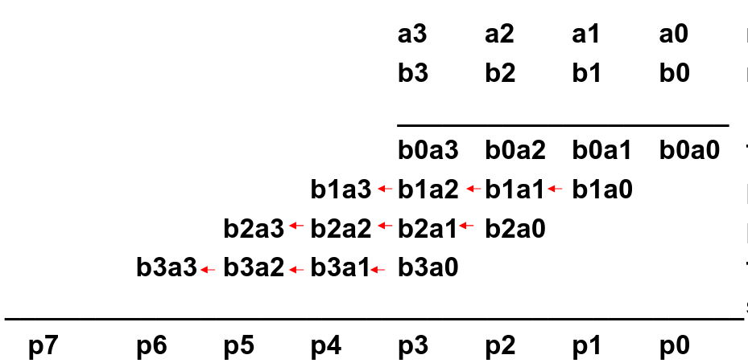

In this part we'll cover arithmetic units. Specifically multipliers and divers.

We'll also cover some number representations.

### Arithmetic Units

It may be common knowledge that, when we want to perform multiplication and division,
by powers of 2, we perform so-called shift operations on the bits.

If we for example want to multiply a number with the binary number `100`, or 4 in decimal.

We would just shift all bits two steps to the left. Same logic goes for division, but it is right shifts.

But we won't always have powers of 2 when multiplying. If we for example multiplied with `101` instead, or 5 in decimal

We can rewrite the multiplication as:
$$
5 * X = 4 * X + X
$$

So we perform a left shift with 2 bits, and add the initial value to that.

#### Multiplication Algorithm
When multiplying two binary numbers with each other, our usual 'partial products' algorithm works in base 2 as well.

So we can write out our algorithm as:

for i = 1 to n, where n = # of bits of the operands

If the $i$-th bit of the *multiplier* is 1:

Add *multiplicand* $\cdot\ 2^{i - 1}$ to the final product.

For any operands of size `N` bits, the final result will become `2N` in size.

If we want to make a multiplier circuit, we would firstly need a register of size `2N`.

Secondly, we would need to test the LSB `N` times of the multiplier, and per bit, we would need to perform 3 operations,
shift right, shift left and add.

This is a really slow and expensive circuit.

To speed up the process, we can share one register for both the result and multiplicand + 1 extra bit (for carry out).

So we have one single register that is `2N + 1` in size and our `N` sized multiplier.

We still test the LSB `N` times for the multiplier, but each bit we only perform 2 operations now.
Shift right and add, since each right shift handles the multiplicand and the result now.

### Multiplying with signs
If we encounter numbers with signs, we convert these numbers to their respective magnitudes.

Multiply the two magnitudes, if the signs differ of the operands, we negate our result.

So we can still use our circuit for the multiplication!

### Adding partial products
If we for example multiply two four bit numbers,
in the general case, we would need to perform three 4-bit additions due to the carryout(s) that can occur.

Which is slow! So as we have done before when adding numbers, we can do a so-called carry forward.

So the carry is added to the next partial product, and an image to illustrate.

This means we need to have a FA at each of the 'transition' states (the arrows) along the usual AND gates.

Even though it may seem like having this many FAs can be slow, it's better than the first solution.

### Binary Division
When performing binary division, we firstly **always** need to check so that the divisor is not 0.

Then we have two approaches:

* Long division approach
    * If divisor $\leq$ dividend bits:
        * 1 bit in quotient, subtract
    * Otherwise:
        * 0 bit in quotient, bring down next dividend bit.
* Restoring division
    * Do the subtraction, and if remainder goes $<$ 0, add divisor *back*
* Signed division
    * Divide using absolute values (magnitudes)
        * Adjust sign of quotient and remainder as required (if they differ, negate).

So we can use the same technique as before, the quotient and the dividend share one register together,
but now we need an extra remainder register. Then we just implement this algorithm into a sequential circuit.

### Fixed-point \& Floating-point numbers
Often we may need to represent rational numbers. Let's first define integers and rational numbers in binary.

An integer can be represented as:
$$
v = \sum_{i = 0}^{n - 1}\ a_i\ 2^i
$$

One way of representing a rational number is using something called a fixed-point number:

$$
v = r\ \sum_{i = 0}^{n - 1}\ a_i\ 2^i
$$

Where $r$ is called the resolution and is defined as $r = 2^{\text{number of fractional bits}}$

We represent the fixed point numbers with using the `.` separator.
So the `1.3`format and specifically `1.011`. Where the `.` is says what resolution we have.

So by our definition, `1.011` has integer value 11. The resolution is 3 bits or, $2^{-3} = \frac{1}{8}$

Therefore, our final value becomes $\frac{1}{8} \cdot\ 11 = \frac{11}{8}$.

Now floating-point numbers are a bit harder to grasp by their definition:
$$
v = m \cdot\ 2^{e - x} = r\ \sum_{i = 0}^{n - 1}\ m_i\ 2^{i - n} \cdot\ 2^{\sum_{i = 0}^{k - 1} e_i 2^k - x}
$$

Now we also have $m$ which is the *mantissa* or the binary fraction.
We also have $e$ which is the exponent, or the binary integer.

The floating-point numbers are derived from scientific notation.

So an example, say we have:
$$
m = 10010, e = 011
$$

Therefore, we have:
$$
10010E011
$$

Which represents:
$$
v = \frac{18}{32} \cdot\ 8
$$
