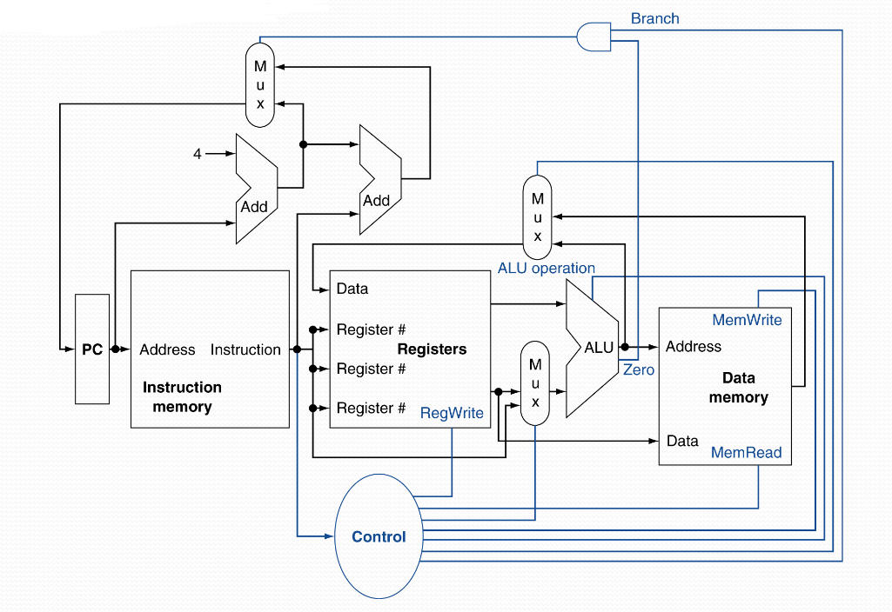
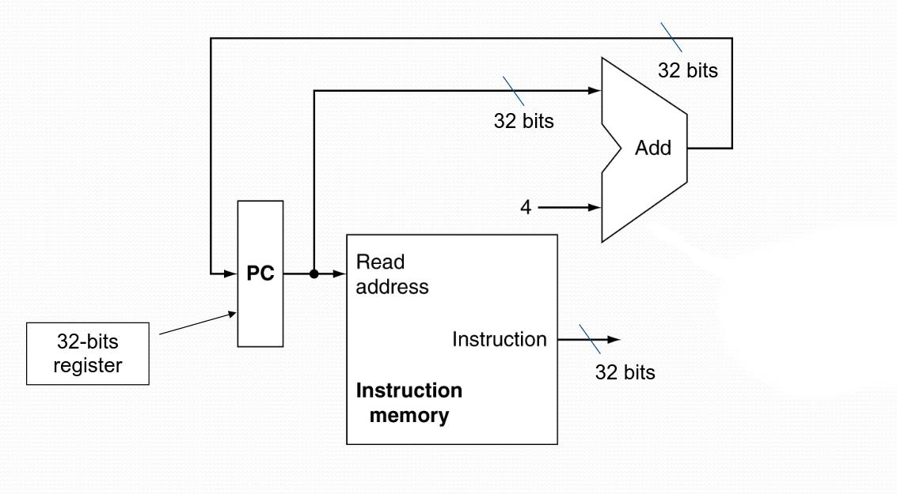
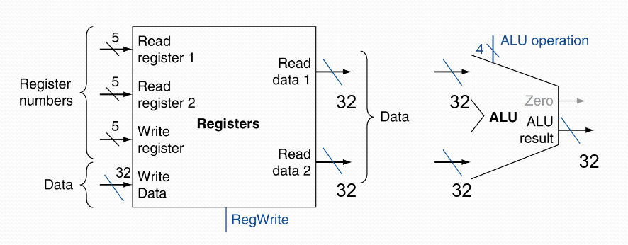
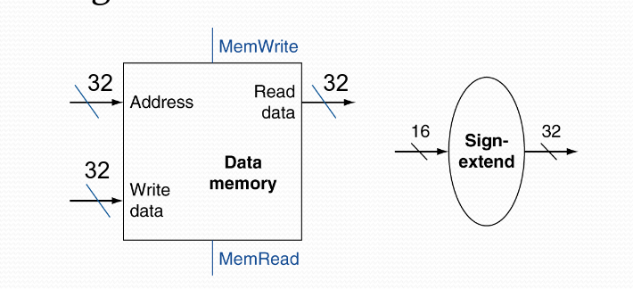
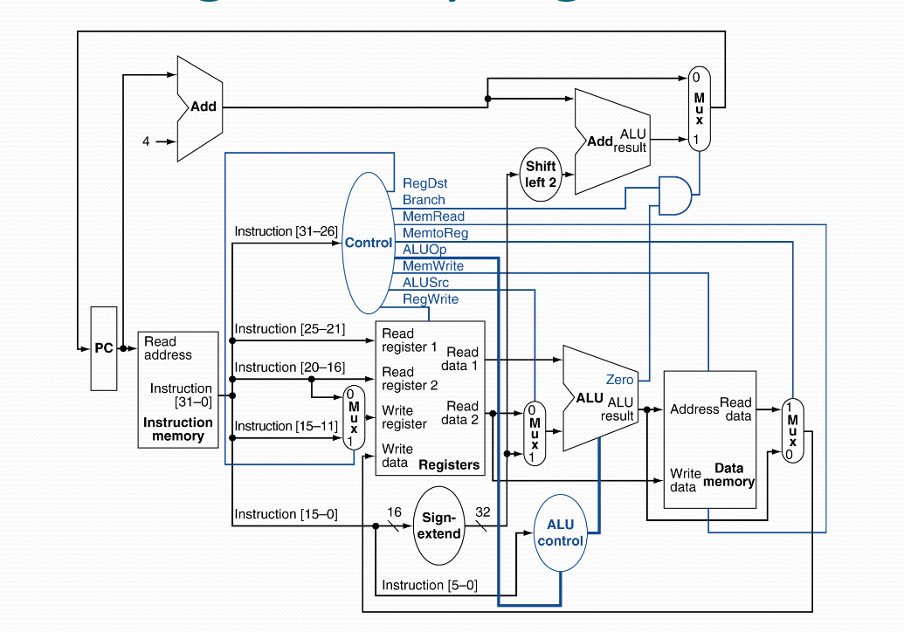
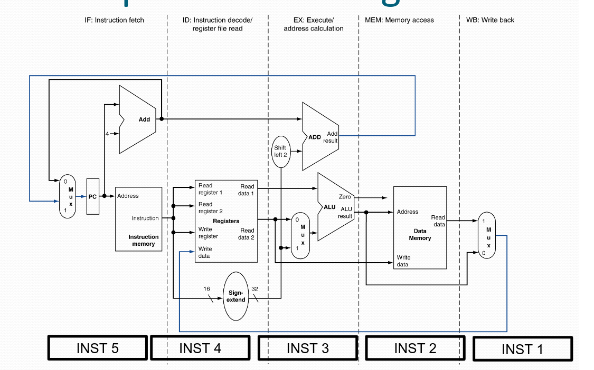

In this part we'll cover the idea of pipelining - and it's performance effects it has on computer systems.

Let's first cover what every computer does to perform complex tasks.

### Instruction execution
Every computer does these five stages:

1. **Fetch** Instruction. PC &rarr; Instruction memory.

2. **Decode** the instruction and read from registers.

3. **Execute** the instruction.

    * Arithmetic/logical computation.

    * Computation of effective memory address.

    * Computation of jump address/conditional address.

4. **Read / Write from / to memory** for load/store instructions.

5. **Write back** the result into the result register (RF).

Let's take a look how this logic is implemented:


:::recall
The longest critical path determines our clock frequency.
:::

Let's now look into each stage, so we understand them properly.

#### Instruction Fetch (IF)
Let's begin by dissecting the **fetch** stage:



We see that everything starts in PC, we read our current address (PC Value), we have this black box of a decoder which outputs the instruction (32-bits).

Notice that we also take our current PC value and add `4` to it, why `4`?, because each instruction is 32-bits, or 4 bytes.

#### R-Format Instructions
For instructions with the R-format, we have the following:


We take in our two register operands, compute the arithmetic/logical computation and store the result to the result register.

#### Load/Store Instructions
For instructions that we either load/store to memory:



Here we have two important parts, we need to read our register operands but also compute our offset.

Since the offset is 16-bits and the register operands 32-bits, we need to sign extend our 16-bit offset to 32-bits.

#### Conditional jump instructions
For these type of instructions, we need to compare our registers, we do this by doing a subtraction and looking at the "zero" output from our ALU.

But we also need to compute our jump address, to do this we do:

* Sign extend our offset

* Left shift by 2 bits, due to word displacement

* Now add this offset to PC.

### In-depth overview
Now let's take a look at the first picture, but with some more details:



If we try to deduce what our critical path is, we quickly find that load instructions are really slow.

Since they go through:

:::note
Instruction memory &rarr; Registers &rarr; ALU &rarr; Data memory &rarr; Registers
:::

Now, let's pipeline this processor to increase the *speed*.

### Pipelined version
Naturally, since we have five stages, let's pipeline it into 5 separate stages as well!


Note: The dotted lines represents registers that separate each stage

As we can see now, we can handle 5 separate instructions at once!

If our pipelining is "balanced", meaning each stage takes the same amount of time, then we can see a resulting speed up of:
$$
\textbf{Speedup} = \frac{T_{c \quad \| \quad \text{Non-pipelined version}}}{T_{c \quad \| \quad \text{Pipelined version}}} \approx \text{Number of pipeline stages}
$$

If our pipelining is unbalanced, we'll see a smaller increase.

However, doing 5 instructions at once comes with a cost, we no longer have a perfect CPU. We have several hazards that we need to consider now.

### Hazards
There are three different types of hazards that we'll need to take care off:

* Structural hazards

    * A stage is currently busy doing an operation

* Data hazards

    * An instruction that depends on a earlier instruction.

* Control hazards

    * The condition and potential address of a jump has not yet by the instruction fetch.

Let's look into how to solve each of these.

#### Structural hazards
As we defined earlier, it is when two or more instruction need to access the same stage simultaneously.

There are two main examples of this:

* Registers: Reading and writing to the same register:

    * Solution: Write and read in separate half cycles.

* If the pipeline only has one (1) shared memory:
    * Solution: Don't. All pipeline models use separate memory for instructions and data memory.

#### Data hazards
If we have the following MIPS:
```
add    $s0, $t0, $t1
add    $t2, $s0, $t3
```

Notice that both instructions either write or read `$s0`.

A data hazard occurs specifically after a RAW (**R**ead **A**fter **W**rite)

There are two solutions:

* If the case is like above we can do:

    * Forwarding (Bypassing)

        * Use the result instantly when computed from the ALU

        * Do not wait to store it until the Write Back phase.

        * But, does require more logic and path in our data path.

        * But, no stalling!

* Forwarding doesn't solve all cases, for example, load instructions.

    * We cannot do a forwarding, "back in time"

    * Therefore, requires a stalling cycle.


But consider this following example:
```
lw  $t1, 0($t0)
lw  $t2, 4($t0)
add $t3, $t1, $t2
sw  $t3, 12($t0)
lw  $t4, 8($t0)
add $t5, $t1, $t4
sw  $t5, 16($t0)
```

In this we'll have two stalling cycles, but with some smart thinking (or a smart compiler) we can instead do:
```
lw  $t1, 0($t0)
lw  $t2, 4($t0)
lw  $t4, 8($t0)
add $t3, $t1, $t2
sw  $t3, 12($t0)
add $t5, $t1, $t4
sw  $t5, 16($t0)
```

Just by changing one line we reduced our clock cycle count from 9 to 7!

#### Control hazards

* Problem: We want to compare registers and compute the jump address earlier in the program

    * Solution: Move/Add more logic to the instruction decode stage.

    * This will result that we only need to wait (stall) for one cycle!


But, often longer pipelines cannot do this approach, since it will still result in a lot of stalling cycles.

The solution in modern CPUs is, predict the jump! If we fail to predict, then we stall to restore our failed prediction.

There are two different types:

* At compile time/Static jump-predictions:

    * Based on typical jump-behavior

    * Examples: loops and if-conditions:

        * Predict backwards jump as "taken"

        * Predict forward jump as "not taken"

* At run time/Dynamic jump-predictions:

    * Hardware keeps track/notes the current jump-behavior
        * Keeps statistics of jumps

    * From the statistics tries to predict, can be as simple as, do as the last time.

### Summary
Okay, so we've seen the power and beauty of pipelining.

So let's make a little summary:

* Pipelining boosts the performance, by increasing the total instruction-flow to the CPU.

    * Multiple instructions execute in parallel.

* Although great, it comes with some hazards:

    * Structural hazards, data hazards (RAW), and control hazards.

    * Can both be solved with hardware and software.

* There is a strong correlation between the ISA and the complexity of the pipeline.

That last one might not be so clear from the start, but if we had very complex functions like
```
add M[$t0], M[$t1], M[$t2]
```

This would be a headache, since then we are in the execute stage and read/write to memory simultaneously.
