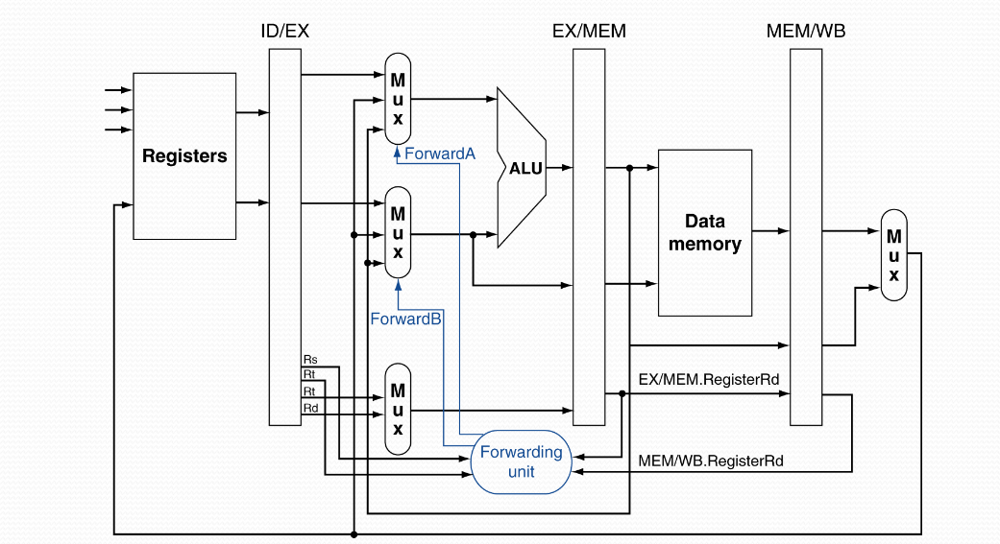
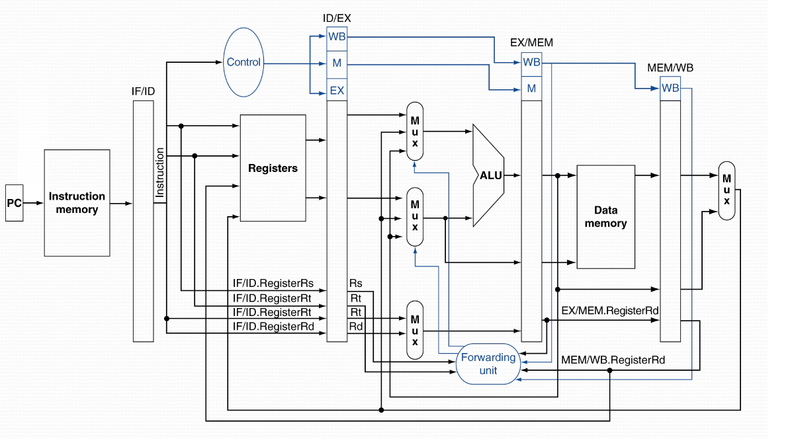
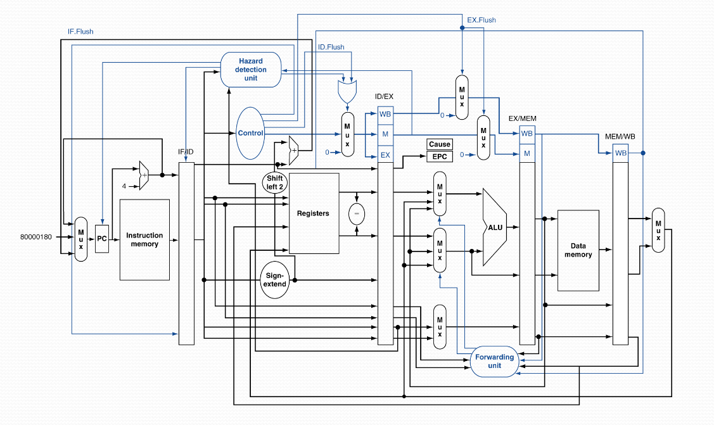
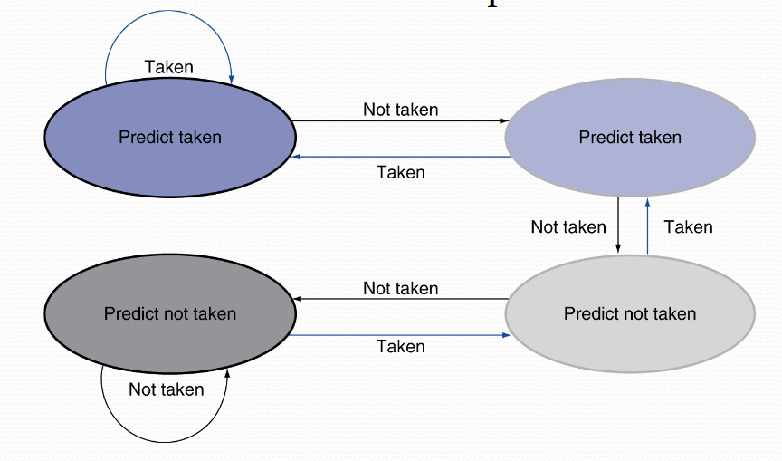

In this part we'll cover the actual hardware specifications/solutions to our potential problems with our newly pipelined CPU.

### Data hazards
If we have the following scenario:
```
sub    $2, $1, $3
and    $12, $2, $5
```

Here we will have a data hazard. As we covered in the last part the solution here is so-called "forwarding".

But how do we detect how to forward our result immediately?

The answer is sending along the register's number in the pipeline!

We use the convention that when we're in the registers in between stages we use the notation, `ID/EX`, for example.

So, we get data hazards when:
```
EX/MEM.RegisteRd = ID/EX.RegisterRs
EX/MEM.RegisteRd = ID/EX.RegisterRt
MEM/WB.RegisteRd = ID/EX.RegisterRs
MEM/WB.RegisteRd = ID/EX.RegisterRt
```

So we need to detect *when* we need to forward, it shall only forward if:

* Only if we're writing to one register:

    * `EX/MEM.RegWrite, MEM/WB.RegWrite`
* And, if `Rd` for the instruction isn't `$zero`:

    * `EX/MEM.RegisterRd != 0, MEM/WB.RegisterRd != 0`

The hardware would be:


We can write up some conditions:

* `EX` Hazard

    * ```
      If(EX/MEM.RegWrite and (EX/MEM.RegisterRd != 0)
        and(EX/MEM.RegisterRd = ID/EX.RegisterRs))
      ```

        * &rarr; `ForwardA = 10`

    * ```
      If(EX/MEM.RegWrite and (EX/MEM.RegisterRd != 0)
        and(EX/MEM.RegisterRd = ID/EX.RegisterRt))
      ```

        * &rarr; `ForwardB = 10`

* `MEM` Hazard

    * ```
      If(MEM/WB.RegWrite and (MEM/WB.RegisterRd != 0)
        and(MEM/WB.RegisterRd = ID/EX.RegisterRs))
      ```

        * &rarr; `ForwardA = 01`

    * ```
      If(MEM/WB.RegWrite and (MEM/WB.RegisterRd != 0)
        and(MEM/WB.RegisterRd = ID/EX.RegisterRt))
      ```

        * &rarr; `ForwardB = 01`

But there is another case we haven't talked about yet, that doesn't get solved with this solution, the double data hazard.

If we have the following MIPS:
```
add $1, $2, $3
add $1, $1, $3
add $1, $1, $4
```

Here we have two hazards, both will occur, but we want to use the *latest* result.

Therefore, we need to update our conditions for `MEM` hazards: Only forward from MEM *if* no EX hazards!

* `MEM` Hazard

    * ```
      If(MEM/WB.RegWrite and (MEM/WB.RegisterRd != 0)
        and not(EX/MEM.RegWrite and (EX/MEM.RegisterRd != 0)
            and(EX/MEM.RegisterRd = ID/EX.Register.Rs))
        and(MEM/WB.RegisterRd = ID/EX.RegisterRs))
      ```

        * &rarr; `ForwardA = 01`

    * ```
      If(MEM/WB.RegWrite and (MEM/WB.RegisterRd != 0)
        and not(EX/MEM.RegWrite and (EX/MEM.RegisterRd != 0)
            and(EX/MEM.RegisterRd = ID/EX.Register.Rt))
        and(MEM/WB.RegisterRd = ID/EX.RegisterRt))
      ```

        * &rarr; `ForwardB = 01`

Therefore, the final implementation would be:


### Load-use data hazards
As we discussed in the last part when we have:
```
lw $2, 20($1)
and $4, $2, $5
```

We either need to stall one whole clock cycle, or, place an uncorrelated instruction in between.
So we need a way to detect this:
* Check if the "using" instruction is present in the ID stage.

* The ALU operand register number in the ID stage is from:

    * `IF/ID.RegisterRs` or `IF/ID.RegisterRt`.

* We have a load-use hazard if:

    * ```
      ID/EX.MemRead and
      ((ID/EX.RegisterRd = IF/ID.RegisterRs) or
       (ID/EX.RegisterRd = IF/ID.RegisterRt))
      ```
    * If true, stall the pipeline.

Stalling essentially means we input a `NOP` instruction instead.
So the operations bits in the `ID/EX` register becomes all 0 (`NOP`).

We also stop the incrementation of `PC` (and the `IF/ID` register).

### Jump conflicts
Remember that conditional jump instructions evaluates in the `EX` stage.

Which means it takes three cycles for a conditional jump instruction to get determined where the next instruction is.

Which means our performance for jumps are, three cycles.

Let's cover some strategies for jump instructions.

#### Delay jumping
This stragety makes use of these stall cycles, so we **always** execute the next instruction after the jump.
This instruction is called the "delayed slot".

We fill this slot with either a "productive" instruction, if we can not do that, we fill it with a `NOP`.


### Exceptions and Interrupts
Exceptions and interrupts are crucial concepts for a processor.

Let's first define what these are:

* Exceptions

    * Internally in the processor:

        * For example: Invalid opcode, Overflow, Syscalls

* Interrupts

    * From an external I/O controller.

* MIPS handles exceptions by a so-called "System Control Coprocessor" (CPo)

* When we receive an exception, we need to first store `PC`. In MIPS we do this via the "Exception Program Counter" (EPC).

* We save the *cause* of this exception in the "Cause" register.

* Then we finally, jump to the exception handler

This approach works for a non-pipelined version.

Let's look at how we should handle it from a pipelined version.

Say we have an overflow exception in the `EX` stage from:
```
add $s1, $s2, $s1
```

What we need to make sure:

* Do no update the `$s1` register.

* Every instruction that was **before** this one needs to complete.

* Eliminate the effect the instruction had and "flush" the instructions that came after.a

* Set the cause and EPC registers.

* Jump to the exception handler.

So our final CPU looks like:


### Advanced methods
Now we'll cover some more advanced methods - note that this is a very quick overview, and we will not go in depth at all.

#### Dynamic jump prediction
In deeper and more complex pipelines, the performance loss for each jump is a lot larger.

Therefore, they usually use something called dynamic jump prediction:

* Use a "Branch prediction buffer"/"Branch history table".

* Indexes with the jumping address.

* The table stores the outcome (branch taken/not taken).

* So when a jump comes:

    * Read the table.

    * Get the next instruction by the jump prediction.

    * If wrong, flush the pipeline and update the prediction.

So, if we have a 1-bit jump table, our prediction is either "Take jump" or "Do not take jump".

But, if we instead use, for example, a 2-bit jump table, we can also keep the *previous* state.

This is a kind of FSM if you will:


### Instruction-level parallelism
To increase our parallelism, specifically our ILP, we need deeper pipelines.

:::intuition
Less work per stage &rarr; Less time per clock cycle
:::

But that always comes with the cost of more potential hazards!

One solution is, *Multiple issue CPU*.

We start up multiple instructions per clock cycle, using more pipelines (Functional Units, FUs).

This can result in CPI (Clock cycles per instruction) < 1. So therefore we instead use "Instructions per Cycle" now instead:
$$
\text{IPC} = \frac{1}{\text{CPI}}
$$

We have two types, static and dynamic multiple issue CPUs.

The static ones use the so-called "Very Long Instruction Word":

* The compiler groups up instructions that start simultaneously.

* Packets them into instruction words of a fixed size.

* The compiler detects and handles hazards.

The dynamic ones use the super scalar approach:

* The CPU hardware detects the instruction feed and chooses which one starts on what clock cycle.

* The compiler can help by reordering the instruction feed.

* The processor handles pipeline conflicts during execution time.

#### Speculative execution
One modern approach is also that we "guess" what will happen. If we were correct, great! Otherwise, go back to previous state.

Usually done with loads and jumps.

### Loop unrolling
Loop unrolling is a quite simple conecpt, we just replicate the loop code to achieve more parallelism.

Uses different registers per replication


### Summary
* Pipelining increases the instruction flow by parallelising.

    * More instructions per second

    * **But**, each individual instruction still takes the same amount of time.

* Multiple issue processors (VLIW and super scalar).

* Dynamical scheduling and speculative execution:

    * Hazards limits the achievable parallelism.

    * CPU complexity &rarr; "The power wall".
