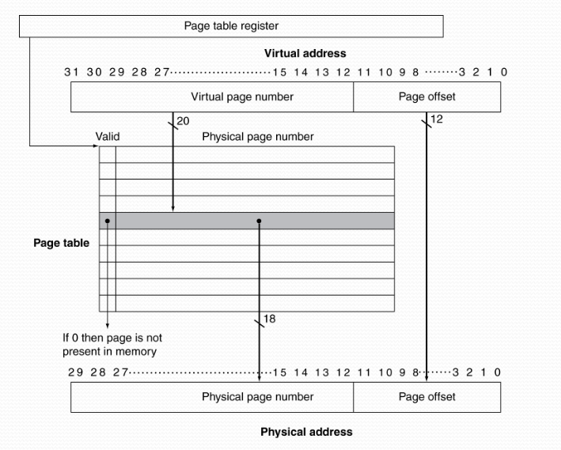
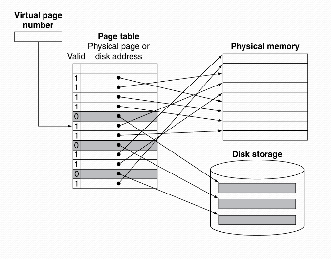
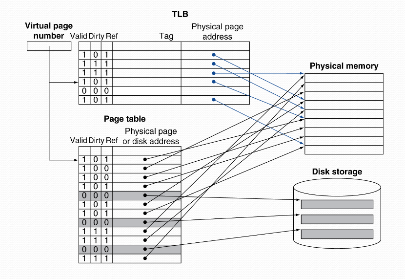

In this part we'll cover so-called virtual memory - which is an essential technique used in computer engineering.

Virtual memory is a technique used by computers to allow them to use more memory than *physically* exists in the system.
Now, this may seem odd at a first glance, how can we use more memory than **physically** exists?

It works by temporarily transferring data from the computer's main memory (RAM) to a designated area on the secondary memory (hard-drive).

With this we can also control the processor's memory access. Since we'll be using *virtual addresses*, compatibility will be very good with this approach.

### Virtual memory
Now that we have defined what virtual memory is very shortly - let's understand it!

VM will now use our primary memory as a kind of cache. Since this will operate at the OS level, the OS and the CPU hardware will take care of this.

One important thing to remember is that, programs share primary memory, if you have multiple programs we need to assign them to their own **virtual address spaces**.

These spaces are protected from other programs/processors.

The big computation that we now need to perform at the CPU level is - translating a virtual memory address to a physical address.

Some terminology that we'll use when talking about VM is:

* A VM "block" is called a **page**.

* A VM miss translation is called a **page fault**.

### Address translation
As we just saw, a VM is, naturally, divided into "blocks". These pages are a fixed size, usually ~ 4K.

To understand how we translate these addresses, we need to first understand a so-called page table.

#### Page table
A page table contains the necessary information that is needed for a translation.

The page table is a table that is stored in PM (essentially works like a cache in PM).
It is indexed with the virtual page number.

Since we'll probably need use of this, we keep the start address of this table in a register, **Page Table Register**, at the CPU.

If a given *page* is present in the PM:
* Page table will yield the physical page number
* Along with other status bits (Referenced, Dirty, ...)

If a given *page* is **not** present in the PM:
* Page table will yield a place/point in secondary memory.

### Overwriting Pages
Just as in the cache sense - we only have a limited space - meaning we'll probably need to overwrite pages eventually.

The most often algorithm used is, **L**east-**R**ecently **U**sed, LRU algorithm.
We keep a reference bit, when we access the page, we set it to 1. The OS will regularly reset all these reference bits.

When we need to overwrite a page - we'll just pick a page that hasn't been referenced recently (meaning their reference bit is 0).

Also note, since writing to secondary memory takes **a lot** of clock cycles - there is no way we'll be able to use a write through implementation here.

Therefore, we use the write-back implementation and keep track using a dirty bit - just like in caches!

### Translation Look-aside Buffer
One thing we haven't discussed is - does address translation need double memory references?
One to access the page table - and one for the actual memory access.

The answer is no! Thanks to good 'ol principle of locality.

Therefore, we can keep track of the most used translations in a cache at the CPU!

This is exactly what is known as **T**ranslation **L**ook-aside **B**uffer.

Misses at the TLB can both we handled by hardware and software.

#### TLB misses
If a given page is located at PM:
* Read the translation to the TLB and try again.

* Can be done via hardware
    * But can be hard when we have complex page table structures.

* Or done in software
    * By an exception (an optimized interrupt routine)

If a given page isn't:
* The OS reads the page from secondary memory and updates the page table.

* Read in the translation to TLB

* Restart the instruction which caused the miss.

#### Page fault routine
This subroutine should:

* Localize the page in secondary memory

* Choose which page should be replaced:
    * If dirty, need to write back to secondary memory.

* Read in the page to memory and update the table.

* Make the program runnable again (OS level).
    * Restart the instruction which caused the page fault.

### Virtual memory and cache interaction
We now have two cases for a cache:
* If a cache uses physical addresses:
    * Must translate VA &rarr; FA before cache access. A TLB will increase the critical path, therefore a slower CPU.

* Virtual addressed cache:
    * Only need to translate VA &rarr; FA when a cache miss occurs (Thus, we don't need a TLB in the critical path).

    * However, we lose the access control

    * We are now prone to "aliasing" problems - but there is a solution, so-called physical tagged cache!

### Virtual memory strategies for good performance
So, the idea of virtual memory is a very powerful one - but as we have seen they can be quite problematic to implement.

Here's what we need to remember:
* Processes can share their memory space with other processes

    * But, protection against faulty accesses are needed.

* Hardware support for memory protection:

    * TLB/Page table: *access bits* per virtual page (Protected, Read, Write)

    * Page tables and other status information can only be accessed in **supervisor mode** (Kernel mode).

    * Some instructions, those with higher "right", can only be run in supervisor mode.

### Memory hierarchy
Now that we have truly understood all the levels of memory in a computer - we can define what we need to consider at **each level**:

* Block placement

* How do we find a certain block?

* What block should be replaced on a miss?

* What should happen when we write to a block?

To answer all these questions:

#### Block placement:
* Depends on the *associativity*

    * Direct-mapped (1-way associativity)
        * Only one index possible

    * N-way set associative
        * N possible slots available within one "set".

    * Fully associative
        * Doesn't matter - any slot will do.

* Higher associativity leads to decreased miss rate - but increases, complexity, cost, and access time.

#### Block replacement:
* Replacement algorithms:

    * Least Recently Used
        * Will become costly for higher associativity.

    * Or, simply, random
        * Sometimes it will be at par with LRU, but much simpler to implement.

* Virtual memory
    * LRU approximation with hardware support.

#### Write policy:
* Write-through:
    * Write both in lower and higher levels.

    * Simplifies replacement, but requires a big store buffer.

* Write-back:
    * Only write at higher levels.

    * Update lower levels when the block is replaced.

    * Requires status bits for implementation.

* Virtual memory
    * Write-back is only sane option due to **long** access time to the disk.

### Memory summary
Small memories are fast - bigger memories come with the cost of longer access times.

Caches give us this illusion of big memory with short access times.
Much due to the principle of locality.

Remember that our hierarchy of memory is from smallest with the shortest access time to biggest with the longest access time!
