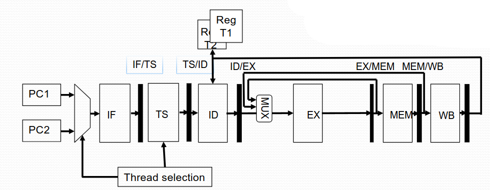
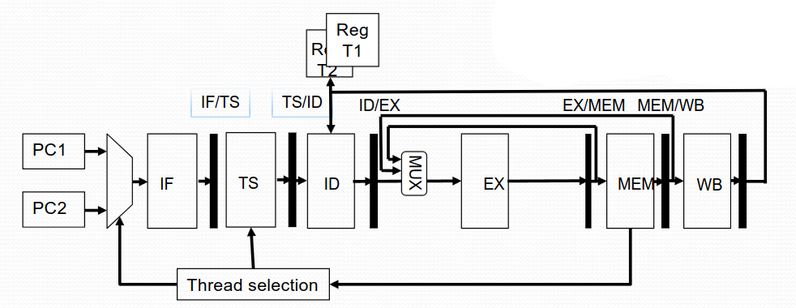
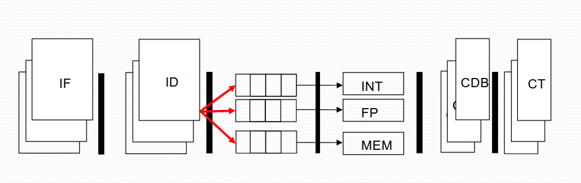
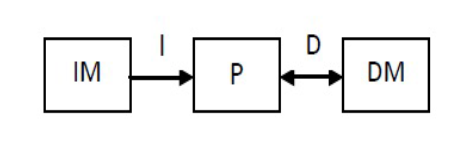
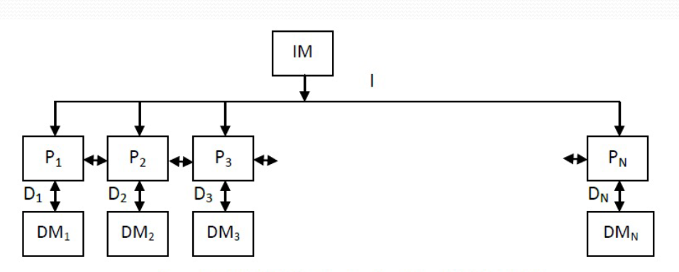
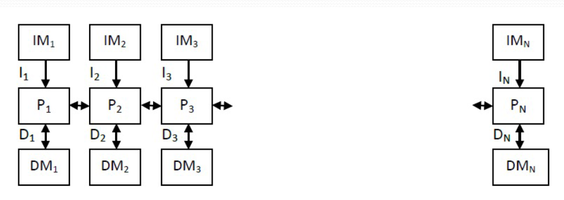

In this part we'll talk about parallel processors, multithreading and other different techniques that we can use to speed up our programs and computers.

### Multithreading
We've seen and learned about threads when we covered concurrent programming.

The idea here is same, if we can utilize threads to parallelize our programs, we can achieve a higher efficiency rate on our clock cycles.

But when and how do we decide choose what thread? There are three different approaches:

* Interleaved

    * Switch thread each clock cycle.

* Blocked

    * Switch thread when experience long latency (usually a cache miss).

* Simultaneous:

    * Threads share the architecture resources.

#### Interleaved multithreading
To achieve interleaved multithreading - we need to add a new stage into our pipeline. The **T**hread **S**elect stage.

This thread selection usually uses a round-robin to select thread. However, we also need to have a setup of all individual registers, but also program counters, for each thread.

Note, we have an inefficient use of CPU resources due to frequent context switching.

#### Blocked multithreading
To achieve blocked multithreading - our thread selection stages now relies on some kind of signal where we "have waited for too long".

Usually this is due to a cache miss. One important fact is that, when a cache miss arises, we need to flush the entire pipeline.

Which means we'll lose some clock cycles in the end. Cache misses are in the 100-500s number of clock cycles, so losing a few clock cycles for that price is still really good.

### Simultaneous multithreading
Is an interesting one. Instead of fetching just one instruction, we fetch multiple to our threads. To achieve this, we need to basically dupe all of our hardware.

But the efficiency on the CPU resources becomes immense.

### Amdahl's Law
We've discussed this law earlier, so I won't go into much detail - Amdahl's law describes to us that, the sequential part of a program is the bottleneck for potential speed up from parallelism.

Formula for speed up:
$$
Speed up = \dfrac{1}{x + \dfrac{(1 - x)}{N}}
$$

Where, $x$, is the portion of the program which is sequential. $N$, is the number of threads.

### Parallel processors/computers
The main goal with parallel processors and computers is that we want to connect multiple processors/computers to achieve better performance, natural.

**C**hip-**M**ulti-**P**rocessor, or CMP. They are parallel processors on a *singular* chip. They have so called on-chip communication.

But in today's computers we mostly see multicore processors. These are chips that consists of multiple processors (cores).

However, we can't just put as many cores and increase the frequency of these chips to whatever. The power wall, memory wall and, ILP (Instruction Level Programming) wall are all a huge road block.

### Flynn's classification of computers
You've probably heard of SIMD, we'll cover all four types that exist!

Let's begin with the most simple one, **SISD**. Single Instruction, Single Data.

We fetch a single instruction and use a single data-flow to memory.

SIMD, or, Single Instruction Multipe Data. This model is when we fetch a single instruction, but perform multiple instances of that instruction. This is a very powerful for performing vectorized operations.

Note, each processor has it own **local** memory and data.

The next class is, MIMD, or Multiple Instruction Multiple Data. As the name suggests, it's basically parallelizing SIMD.

We also have MISD, Multiple Instruction Single Data. This is a very niche class that is used basically only for machine learning areas (hardware accelerators).

### Cache Coherence
When we're dealing with multiple processors - we need to decide how we use our main memory.

Just as in concurrent programming, we have two paradigms, shared memory and message passing.

For our **S**hare **M**emory multi**P**rocessor, we need to use synchronization primitives, to avoid cache invalidation.

We can solve these problems using FSMs as well to set up a clear protocol.

For message passing, we do not share memory - but we send messages between processors to synchronize.
