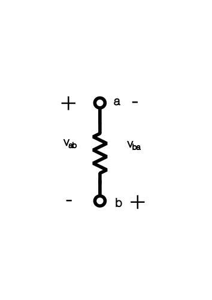

In this series we'll explore and cover the world of electrical circuit (and later on fields as well).

### Fundamental definitions
We'll begin with covering the three basic factors that we'll analyze in all circuits, **current**, **voltage** and, **resistance**.

Let's start with current.

:::definition[Current]
The rate of flow of electrical charge.
:::

We measure current in Ampere, 1 A is defined as, 1 coulomb of charge per 1 second.

Just a refresher, $1 C = 6.24 \cdot\ 10^{18}$.

We can also define current mathematically:
$$
i(t) = \frac{dq(t)}{dt}
$$

Which leads to the equation:
$$
q(t) = \int_{t_0}^{t}\ i(t)\ dt + q(t_0)
$$

:::definition[Voltage]
The difference in potential energy between two points, for one Coulomb of charge.

Which we can also define as the energy transferred (Joules) per unit of charge.

$$
V = \frac{\Delta E_p}{q} = \frac{W}{q}
$$
:::

:::definition[Resistance]
The opposition to the flow of current.
:::

We can define the resistance in the conductor:
$$
R = \frac{\rho L}{A} \newline
$$

$$
\rho = \text{resistivity of the material}
$$

### Ohm's law
Now that we have defined all the fundamental definitions, we can now look in the correlation between them.

Let's now dive into the famous Ohm's law that we'll use for basically all problems.
$$
V = R \cdot\ I
$$

### Kirchhoff's laws
Kirchhoff has two very important laws that come in handy when trying to solve electrical circuits.

Before we dive into the actual laws we'll need to define a very important concept in circuits, direction.

#### Direction

Both current and voltage has a direction in electrical circuits. Let's cover the notation so it becomes clear:

As we can see, voltage has a direction, from positive to negative.
Notice that the notation $v_{ab}$ and $v_{ba}$ indicates the direction.

The same notation and convention is applied for the current,
$i_{ab}$ and $i_{ba}$ indicates the direction of the current.

:::theorem[Kirchhoff's current law]
The **net** current entering a node is zero.

One could also formulate it as: the sum of current entering the node is equivalent to the sum of current leaving the node.

Or in math terms:
$$
\sum_{k = 1}^{n}\ I_k = 0
$$

or,

$$
\sum_{k = 1}^{n}\ I_{entering} = \sum_{k = 1}^{n}\ I_{leaving}
$$
:::

:::theorem[Kirchhoff's voltage law]
The sum of voltages equals zero, for any closed loop.

In math terms:
$$
\sum_{k = 1}^{n}\ V_k = 0
$$
:::

Since we earlier defined what is considered positive and negative voltage, we understand if we go from - to +, we need to subtract that voltage, and the other way around for + to -.

### Summary
This concludes this first part - in short - we'll use these concepts and formulas for all problems we encounter in the future, so it's important to precisely define and deeply understand them.
