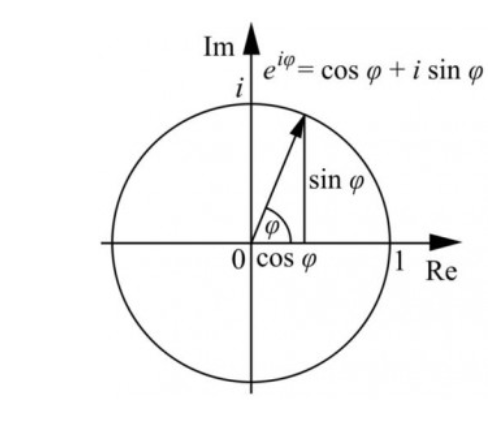
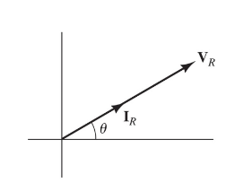
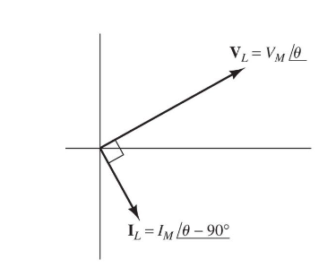
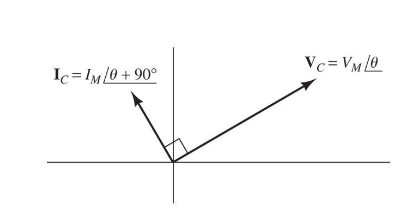
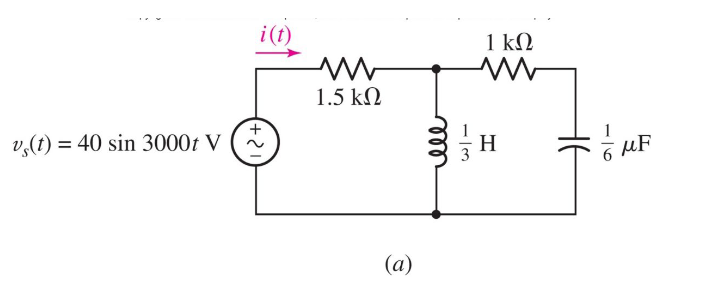

In this part we'll properly define and understand what alternating-current (AC) is.

### Alternating-current
As we have seen, AC is defined using sinusoidal functions:
$$
V(t) = V_m sin(\omega t)
$$

Where:
$$
V_m - \text{Amplitude}\ [V] \newline
\omega - \text{Angular frequency}\ \left[\dfrac{rad}{s}\right] \newline
T - \text{Period}\ [s] \newline
f - \text{Frequency}\ [Hz] \newline
$$

We can write:
$$
T = \dfrac{2\pi}{\omega} = \dfrac{1}{f}
$$

If we want to write this even more generally we also add a constant:
$$
V(t) = V_m sin(\omega t + \theta)
$$

We say that this sine function *leads* the previous by $\theta$.
The other way around works as well, the previous function *lags* this function by $\theta$.

### Root Mean Square
The **R**oot **M**ean **S**quare, or RMS, gives us a sensible comparision of our AC current/voltage to the equivalent DC current/voltage.

This is useful for the power consumption - we define the RMS as:
$$
V_{RMS} = \sqrt{\dfrac{1}{T} \int_0^T V^2(t) dt}
$$

Which means, in our sinusoidal case:
$$
V_{RMS} = \dfrac{V_m}{\sqrt{2}} \newline
I_{RMS} = \dfrac{I_m}{\sqrt{2}}
$$

Which means:
$$
P_{Avg} = \dfrac{(V_{RMS})^2}{R} = (I_{RMS})^2 R
$$

### Radians and degrees
If your like me and always forget how to convert radians to degrees or the other way around - here's a quick little reminder:
$$
rad = deg \cdot\ \dfrac{\pi}{180}
$$

Along with:
$$
sin(\omega t) = cos(\omega t - 90^\circ) \newline
cos(\omega t) = sin(\omega t + 90^\circ)
$$

This is really important since, if we want to compare the **phases** of two wave functions - we need to:

* Both must be written in *either* sine or cosine.

* Both must be written with **positive** amplitude.

* Each have the same constant frequency.

### Phasors
Now we're going to talk about this beautiful idea that happens to perfectly fit our electrical needs!

A phasor, is a complex number representing a sinusoidal function as vectors.

The magnitude of the phasor (meaning, the magnitude of the vector) equals the amplitude of the sinusoidal function:
$$
V_m = V_m
$$

The angle of the phasor equals the phase of the sinusoidal function:
$$
\theta = \theta
$$

If you're not familiar with complex numbers and their different representations, here is a quick overview:

Note: In maths we usually denote the imaginary unit with $i$, in electrical engineering, we rather use $j$ to avoid confusion with the current.

Rectangular form:
$$
z = x + jy \newline
z = |z|(cos(\varphi) + j sin(\varphi))
$$

Polar form:
$$
z = |z|\angle{\theta^\circ} \newline
z = |z|e^{j \theta^\circ}
$$

Polar *to* rectangular form:
$$
z = r\angle{\theta^\circ} \newline
x = r cos(\theta^\circ) \newline
y = r cos(\theta^\circ) \newline
z = x + j y
$$

Rectangular *to* polar form:
$$
z = x + jy \newline
r = \sqrt{x^2 + y^2} \newline
\theta = tan^{-1}\left(\dfrac{y}{x}\right) = \arctan{\left(\dfrac{y}{x}\right)} \newline
z = r\angle{\theta^\circ} \newline
z = re^{j \theta^\circ} \newline
z = r(cos(\theta) + j sin(\theta))
$$

Why do learn both forms and how to convert them? Because, if we want to perform multiplication or division - it's much easier done in Polar form.

If we want to perform addition or subtraction, it's easier done in rectangular form.

Multiplication:
$$
a = (b\angle{c^\circ}) \cdot\ (d\angle{e^\circ}) \newline
a = (b \cdot\ d \angle{c^\circ + e^\circ})
$$

Division:

$$
a = \dfrac{(b\angle{c^\circ})}{(d\angle{e^\circ})} \newline
a = (\dfrac{b}{d} \angle{c^\circ - e^\circ})
$$

### Phasor relations
Now that we've defined phasors, let's look at the relationship between different concepts we have encountered.

#### Resistance
As we know from Ohm's law: $V = RI$. If our $V$ and $I$ both are phasors - it means that they are in parallel:

#### Inductor
As we know, $V = L \dfrac{dI}{dt}$. Now, if both our $V$ and $I$ are phasors, it means that taking the deriviate of $I$ will make it either sine or cosine.

This means in the end that $V$ and $I$ will be $90^\circ$ apart!

As you may or may not know, but multiplying something with the imaginary unit rotates it by $90^\circ$.
This means that:
$$
V = j\omega LI
$$

#### Capacitor
We know that, $I = C \dfrac{dV}{dt}$. The same logic applies here, since taking the deriviate of a sinusoidal function will shift it by $90^\circ$ this means that:
$$
I = j\omega CV
$$

#### Summary
This means that we now have two different ways to calculate these equations - in the time domain or in the frequency domain:

Time domain:
$$
\begin{align*}
V &= RI \newline
V &= L \dfrac{dI}{dt} \newline
V &= \dfrac{1}{C} \int I dt
\end{align*}
$$

Frequency domain:
$$
\begin{align*}
V &= RI \newline
V &= j\omega LI \newline
V &= \dfrac{1}{j\omega C} I
\end{align*}
$$

### Impedance
The definiton of impedance can be quite dense and technical - but in this series we'll settle with the definition that:
$$
Z = \dfrac{V}{I}
$$

This means that:
$$
Z_{R} = R \newline
Z_{L} = j\omega L \newline
Z_{C} = \dfrac{1}{j\omega C}
$$

Impedance is therefore complex number, but in the unit Ohm!

We call the imaginary component of impedance **reactance**.

A purely resitive impedance is equal to the resistance. A purely reactive impedance has no real component.

Impedances in series and parallel apply to the same rules as resistors! So we can combine and simplifiy our circuits even more now!

But the most important thing here is that, we can, just from impedance, understand what dominates in a circuit:

$$
\begin{align*}
Z_{eq} & = 1.5 + \dfrac{(j)(1 - 2j)}{j + 1 - 2j} \newline
& = 1.5 + \dfrac{2 + j}{1 - j} \newline
& = 1.5 + \dfrac{(2 + j)(1 + j)}{(1 - j)(1 + j)} \newline
& = 1.5 + \dfrac{1 + j3}{2} \newline
& = 2.5\angle{36.87^\circ}\ k\Omega
\end{align*}
$$

From this, we can see that, since we have a positive impedance, means that it's mostly inductive than anything else. This tells us a lot about the circuit.

Since inductors resists change in the current, it will ultimately mean that the current is *late*, or *lags* behind the voltage!

Which is exactly what we'll see if we calcuate $I(t)$:
$$
\begin{align*}
I & = \dfrac{V}{Z_{eq}} \newline
& = \dfrac{40\angle{- 90^\circ}}{2.5\angle{36.87^\circ}} \newline
& = 16 \angle{-126.9^\circ} mA
\end{align*}
$$

Which means:
$$
I(t) = 16 cos(3000t - 126.9^\circ) mA
$$

Just as we predicted, the current lags behind by a lot!

As we can see, our new tools and knowledge about how we can use complex numbers are quite powerful!
