In this part we'll cover all calculation methods that we'll use for AC-circuits.

### Equivalent Impedance
Given the circuit and that $\omega = 5 \dfrac{rad}{s}$ - find the equivalent output impedance:

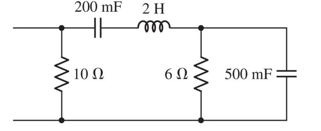

As we discussed in the last part, our resistor rules, for series and parallel apply for impedance as well.

Let's first quickly convert the capacitor and inductor to Ohm.

For our capacitor:
$$
\begin{align*}
Z_{C} & = \dfrac{1}{j\omega C} \newline
& = -j \cdot\ \dfrac{1}{\omega C} \newline
& = -j \cdot\ \dfrac{1}{5 \cdot\ 500 \cdot\ 10^{-3}}\ [\Omega] \newline
& = -j 0.4\ \Omega
\end{align*}
$$

Same procedure for our inductor:

$$
\begin{align*}
Z_{L} & = j\omega L \newline
& = j(5 \cdot\ 2)\ [\Omega] \newline
& = j10 \Omega
\end{align*}
$$

Which means we have the following circuit now:

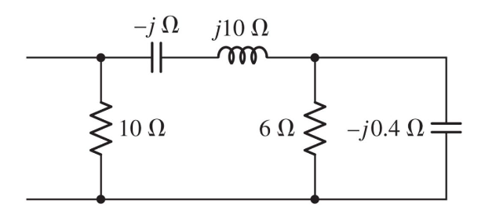

Now, let's simplify our impedance!

$$
\begin{align*}
Z_{eq\ 6\ ||\ -j0.4} & = \dfrac{(6)(-j0.4)}{6 - j0.4} \newline
& = \dfrac{-j2.4}{6 - j0.4} \newline
& = \dfrac{(-j2.4)(6 + j0.4)}{(6 - j0.4)(6 + j0.4)} \newline
& = \dfrac{(-j2.4)(6 + j0.4)}{36.16} \newline
& = \dfrac{(-j14.4 + 0.96)}{36.16} \newline
& = \dfrac{(-j14.4 + 0.96)}{36.16 \angle 0^{\circ}} \newline
& = \dfrac{(14.43 \angle -86.18^{\circ})}{36.16 \angle 0^{\circ}} \newline
& = \dfrac{14.43}{36.16} \angle -86.18^{\circ} \newline
& = \dfrac{14.43}{36.16} \angle -86.18^{\circ} \newline
& = 0.399 \angle -86.18^{\circ} \newline
& = 0.026 -j0.39 \Omega
\end{align*}
$$

$$
\begin{align*}
Z_{eq series} & = -j + j10 + 0.026 - j0.39 \newline
& = 0.026 + j8.61 \Omega
\end{align*}
$$

$$
\begin{align*}
Z_{eq\ 10 ||\ 0.026 + j8.61} & = \dfrac{(10)(0.026 + j8.61)}{10 + 0.026 + j8.61} \newline
& = \dfrac{0.26 + j86.1}{10.026 + j8.61} \newline
& = \dfrac{86.1 \angle 89.82^{\circ}}{13.21 \angle 40.65^{\circ}} \newline
& = \dfrac{86.1}{13.21} \angle 89.82 - 40.65^{\circ} \newline
& = \boxed{6.51 \angle 49.17^{\circ}\ \Omega}
\end{align*}
$$

### Multiple sources
Given this circuit, and that $\omega = 2 \dfrac{rad}{s}$ $I_{c} = 2 \angle 28^{\circ}$ - find $\mathbf{I}_S$ and $I(t)$

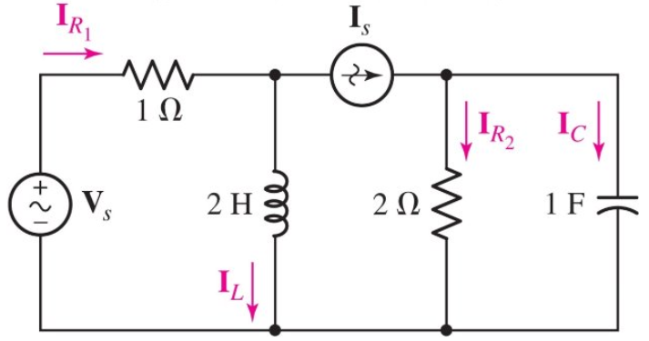

Here we can utilize Ohm's law:
$$
\begin{align*}
V_{c} & = I_{c} Z_{c} \newline
& = \dfrac{1}{j\omega C} I_{c} \newline
& = -j \dfrac{1}{\omega C} I_{c} \newline
& = -j \dfrac{1}{2} (2 \angle 28^{\circ}) \newline
& = (-j0.5)(2 \angle 28^{\circ}) \newline
& = (\dfrac{1}{2} \angle -90^{\circ})(2 \angle 28^{\circ}) \newline
& = \dfrac{1}{2} \cdot\ 2 -90 + 28^{\circ} \newline
& = 1 - 62^{\circ}
\end{align*}
$$

We know that $V_{R_2} = V_{C}$ since they are in parallel!

$$
\begin{align*}
I_{R_2} & = \dfrac{V_{R_2}}{Z_{R_{2}}} \newline
& = \dfrac{V_{C}}{Z_{R_{2}}} \newline
& = \dfrac{V_{C}}{2} \newline
& = \dfrac{1}{2} \angle - 62^{\circ}
\end{align*}
$$

Using Kirchhoff's current law we know that:
$$
\begin{align*}
\mathbf{I_S} & = I_{R_2} + I_{C} \newline
& = (\dfrac{1}{2} \angle - 62^{\circ}) + (2 \angle 28^{\circ}) \newline
& = (0.23 -j0.44) + (1.76 + j0.93) \newline
& = 1.99 + j0.49 \newline
& = \boxed{2.04 \angle 13.83^{\circ}}
\end{align*}
$$

Which means that $I(t)$:
$$
\boxed{I(t) = 2.04 cos(2t + 13.83^{\circ}) A}
$$

### Node Analysis

Given this circuit, find $V_1$ and $V_2$:

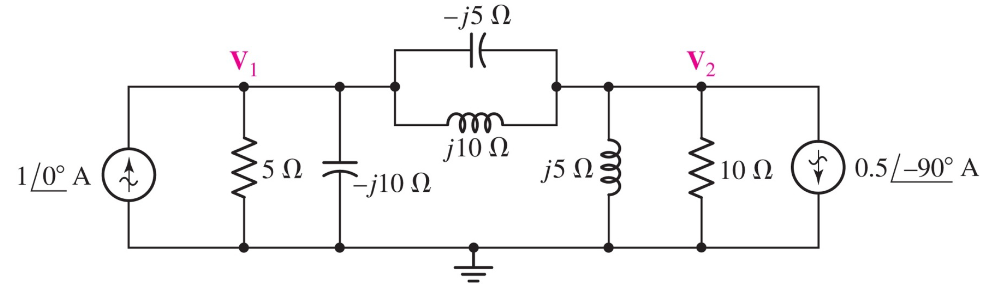

Let's perform our node analysis algorithm here:

For $V_1$:
$$
\begin{align*}
& -1 \angle 0^{\circ} + \dfrac{V_1}{5} + \dfrac{V_1}{-j10} + \dfrac{V_1 - V_2}{-j5} + \dfrac{V_1 - V_2}{j10} = 0 \newline
& \dfrac{V_1}{5} + j\dfrac{V_1}{10} + j\dfrac{V_1 - V_2}{5} - j\dfrac{V_1 - V_2}{10} = 1 \newline
& 0.2V_1 + j0.1V_1 + j0.2(V_1 - V_2) - j0.1(V_1 - V_2) = 1 \newline
& 0.2V_1 + j0.1V_1 + j0.2V_1 - j0.2V_2 -j0.1V_1 + j0.1V_2 = 1 \newline
& 0.2V_1 + j0.2V_1 - j0.1V_2 = 1 \newline
& (0.2 + j0.2)V_1 - j0.1V_2 = 1 \newline
& (0.2 + j0.2)V_1 = 1 + j0.1V_2 \newline
& V_1 = \dfrac{1 + j0.1V_2}{0.2 + j0.2}
\end{align*}
$$

For $V_2$:
$$
\begin{align*}
& \dfrac{V_2 - V_1}{-j5} + \dfrac{V_2 - V_1}{j10} + \dfrac{V_2}{j5} + \dfrac{V_2}{10} + 0.5 \angle 90^{\circ} = 0 \newline
& j\dfrac{V_2 - V_1}{5} - j\dfrac{V_2 - V_1}{10} - \dfrac{V_2}{5} + \dfrac{V_2}{10} - j0.5 = 0 \newline
& j0.2(V_2 - V_1) - j0.1(V_2 - V_1) - 0.2V_2 + 0.1V_2 - j0.5 = 0 \newline
& j0.2V_2 - j0.2V_1 - j0.1V_2 + j0.1V_1 - 0.2V_2 + 0.1V_2 - j0.5 = 0 \newline
& -0.1V_2 + j0.1V_2 - j0.1V_1 = j0.5 \newline
& (0.1 - j0.1)V_2 - j0.1V_1 = j0.5 \newline
& V_2 = \dfrac{j0.5 + j0.1V_1}{0.1 - j0.1}
\end{align*}
$$

Now finding $V_1$ and $V_2$, by substituting in $V_1$ in this:

$$
\begin{align*}
V_2 & = \ldots = -2 + j4\ V \newline
& = \boxed{4.47 \angle 116.6^{\circ}\ V}
\end{align*}
$$

Which means $V_2(t)$:
$$
\begin{align*}
V_2(t) & = \boxed{4.47 cos(\omega t + 116.6^{\circ})}
\end{align*}
$$

For $V_1$:
$$
\begin{align*}
V_1 & = \ldots = 1 - j2\ V \newline
& = \boxed{2.24 \angle -63.4^{\circ}\ V}
\end{align*}
$$

Which means $V_1(t)$:
$$
\begin{align*}
V_1(t) & = \boxed{2.24 cos(\omega t - 63.4^{\circ})}
\end{align*}
$$

### Mesh analysis

Given this circuit, find $I_1(t)$ and $I_2(t)$:

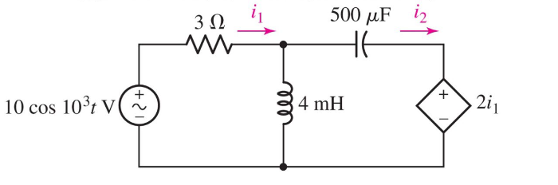

Let's first quickly convert our capacitor and inductor:

Our inductor:

$$
\begin{align*}
Z_{L} & = j\omega L \newline
& = j(10^3 \cdot\ 4 \cdot\ 10^{-3}) [\Omega] \newline
& = j4\ \Omega
\end{align*}
$$

Our capacitor:

$$
\begin{align*}
Z_{L} & = -j \dfrac{1}{\omega C} \newline
& = -j \dfrac{1}{10^3 \cdot\ 500 \cdot\ 10^{-6}}
& = -j2\ \Omega
\end{align*}
$$

Which gives us:
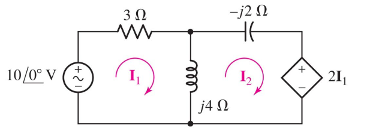

For Mesh 1:
$$
\begin{align*}
-10 \angle 0^{\circ} + 3I_1 + j4(I_1 - I_2) & = 0 \newline
(3 + j4)I_1 - j4I_2 & = 10
\end{align*}
$$

For Mesh 2:
$$
\begin{align*}
j4(I_2 - I_1) - j2I_2 + 2I_1 & = 0
(2 - j4)I_1 + j2I_2 & = 0
\end{align*}
$$

Finding $I_1$ and $I_2$:

$$
\begin{align*}
I_1 & = \dfrac{14 + j8}{13}
& = \boxed{1.24 \angle 29.7^{\circ}\ A}
\end{align*}
$$

$$
\begin{align*}
I_2 & = \dfrac{20 + j30}{13}
& = \boxed{2.77 \angle 56.3^{\circ}\ A}
\end{align*}
$$

Meaning that:
$$
\begin{align*}
I_1(t) & = 1.24 cos(10^3t + 29.7^{\circ})
\end{align*}
$$

$$
\begin{align*}
I_2(t) & = 2.77 cos(10^3t + 56.3^{\circ})
\end{align*}
$$

### Superposition
Looking at this circuit again:

One can see that we can solve this via the principle of superposition.

We fist need to simplify our circuit impedance:
$$
\begin{align*}
Z_{eq\ -j5\ ||\ j10} & = \dfrac{(-j5)(j10)}{-j5 + j10} \newline
& = \dfrac{50}{j5} \newline
& = \dfrac{50 \angle 0^{\circ}}{j5} \newline
& = \dfrac{50 \angle 0^{\circ}}{5 \angle 90^{\circ}} \newline
& = \dfrac{50}{5} \angle -90^{\circ} \newline
& = -10 \angle -90^{\circ} \newline
& = -j10 \Omega \newline
\end{align*}
$$

$$
\begin{align*}
Z_{eq\ 5\ ||\ -j10} & = \dfrac{(5)(-j10)}{5 + j10} \newline
& = \dfrac{(5)(-j10)(5 - j10)}{(5 + j10)(5 - j10)} \newline
& = \dfrac{(-j50)(5 - j10)}{5^2 + 10^2}\newline
& = \dfrac{-j250 - 500}{125}\newline
& = 4 - j2\ \Omega
\end{align*}
$$

$$
\begin{align*}
Z_{eq\ j5\ ||\ 10} & = \ldots = 2 + j4\ \Omega
\end{align*}
$$

Which means:

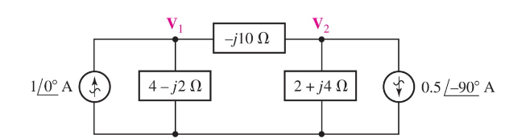

When right source is off:
$$
\begin{align*}
(4 - j2) || (-j10 + 2 + j4) \newline
V_{1L} & = 1 \angle 0^{\circ} \dfrac{(4 - j2)(-j10 + 2 + j4)}{(4 - j2) + (-j10 + 2 + j4)} \newline
& = \ldots \newline
& = 2 - j2\ V
\end{align*}
$$

Left source turned off:
$$
\begin{align*}
(4 - j2 - j10) || (2 + j4) \newline
V_{1R} & = (-0.5 \angle -90^{\circ}) (\dfrac{2 + j4}{4 - j2 - j10 + 2 + j4}) (4 - j2) \newline
& = \ldots \newline
& = -1\ V
\end{align*}
$$

Which means:
$$
\begin{align*}
V_1 & = V_{1L} + V_{1R} \newline
& = 2 - j2 - 1
& = 1 - j2\ V
\end{align*}
$$

Same procedure for $V_2$

### Thévenin equivalent
Given this circuit, find the Thévenin equivalent circuit:

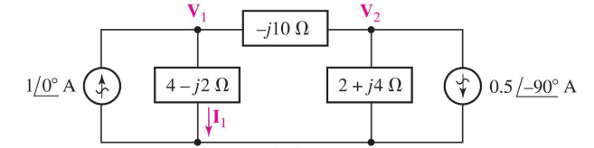

Let's first disconnect the load:

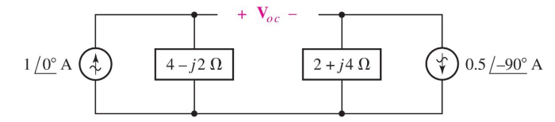

Which means $V_oc$:
$$
\begin{align*}
V_{oc} & = V_1 - V_2 \newline
& = (1 \angle 0^{\circ})(4 - j2) - (-0.5 \angle -90^{\circ})(2 - j4) \newline
& = 6 - j3
\end{align*}
$$

For our equivalent impedance:

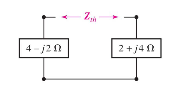

Which means:
$$
\begin{align*}
Z_{th} & = (4 - j2) + (2 + j4) \newline
& = 6 + j2\ \Omega
\end{align*}
$$

### Resonance
A network is in resonance (or resonant) when the
voltage and current at the network input
terminals are in phase.

A maximum-amplitude response is produced in
the resonant condition

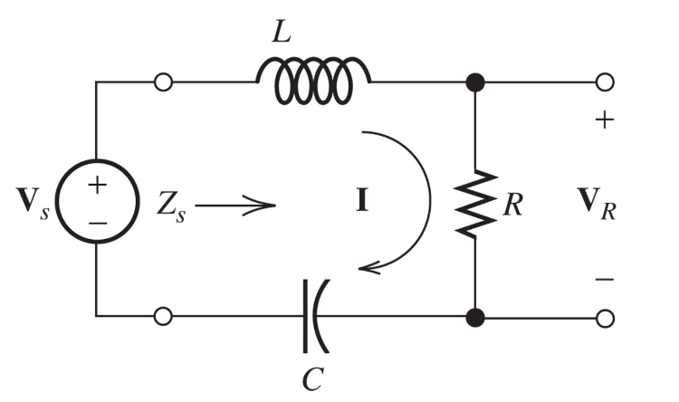

From this we can see that:
$$
\begin{align*}
Z_{s} & = j2\pi f L + R - j \dfrac{1}{2\pi f C}
\end{align*}
$$

At the **resonant** frequency:
$$
\begin{align*}
j2\pi f_0 L = j \dfrac{1}{2\pi f_0 C} \newline
f_0 = \dfrac{1}{2\pi \sqrt{LC}}
\end{align*}
$$

We call the ratio of the reactance of the impedance to the resistance at the resonant frequency for **quality factor**:
$$
\begin{align*}
Q_{s} = \dfrac{2\pi f_0 L}{R}
& = \dfrac{1}{2\pi f_0 CR}
\end{align*}
$$

Which means:
$$
\begin{align*}
Z_{s} = R\left[1 + jQ_s \left(\dfrac{f}{f_0} - \dfrac{f_0}{f}\right)\right]
\end{align*}
$$

$$
\begin{align*}
I & = \dfrac{V_s}{Z_s} \newline
& = \dfrac{V_s}{R\left[1 + jQ_s \left(\dfrac{f}{f_0} - \dfrac{f_0}{f}\right)\right]} \newline
\end{align*}
$$

$$
\begin{align*}
RI = \dfrac{V_s}{\left[1 + jQ_s \left(\dfrac{f}{f_0} - \dfrac{f_0}{f}\right)\right]} \newline
\end{align*}
$$

$$
\begin{align*}
\dfrac{V_R}{V_s} = \dfrac{1}{1 + jQs \left(\dfrac{f}{f_0} - \dfrac{f_0}{f}\right)} \newline
\end{align*}
$$

$$
\begin{align*}
B & = f_H - f_L \newline
& = \dfrac{f_0}{Q_s}
\end{align*}
$$
