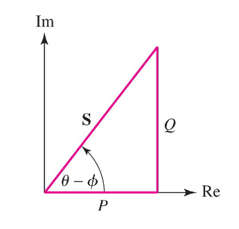

In this part we'll define Power for AC circuits, we've had all the tools now for a while, but just never applied them.

Power in AC circuits and be divided into three categories:
* **Resistive load** $(\theta = 0)$.
* **Inductive load** $(Z = \omega L \angle 90^{\circ})$.
* **Capacitive load*** $(Z = \dfrac{1}{\omega C} \angle -90^{\circ})$.

### Resistive Load
When we have a resistive load, meaning no phase shift. Then our Voltage and Current are:
$$
V(t) = V_m cos(\omega t) \newline
I(t) = I_m cos(\omega t)
$$

Which, naturally means our power is:
$$
P(t) = V_m I_m cos^2(\omega t)
$$

This is the so-called, **instantaneous power**.

Our *average power* is:
$$
P_{avg} = \dfrac{V_m I_m}{2}
$$

Recall that the Root-mean-square is:
$$
V_{rms} = \dfrac{V_m}{\sqrt{2}}
$$

$$
I_{rms} = \dfrac{I_m}{\sqrt{2}}
$$

This also means:
$$
P_{avg} = V_{rms} I_{rms}
$$

### Inductive Load
In an inductive load, the voltage leads the current by $90^\circ$.
$$
V(t) = V_m cos(\omega t) \newline
I(t) = I_m cos(\omega t - 90^\circ)
$$

Or, we can write $I(t)$ as:
$$
I(t) = I_m sin(\omega t)
$$

Which means, our instantaneous power is:
$$
P(t) = V_m I_m cos(\omega t) sin(\omega t)
$$

Using one of the trigonometry identities:
$$
P(t) = \dfrac{V_m I_m}{2} sin(2\omega t)
$$

Our average power then? Well, the period of our power, $P$, is *half* the period of $V$ or $I$.

This means that when either $V(t)$, or $I(t)$ are equal to 0, so is $P$.

Therefore, the average power will also be zero!
$$
P_{avg} = 0
$$

### Capacitive Load
In a capacitive load, the current now leads by $90^\circ$.
$$
V(t) = V_m cos(\omega t) \newline
I(t) = I_m cos(\omega t + 90^\circ)
$$

We can again rewrite $I(t)$ as:
$$
I(t) = I_m -sin(\omega t)
$$

Which means our instantaneous power is:
$$
P(t) = -V_m I_m cos(\omega t) sin(\omega t)
$$

Or using the same trigonometry identity:
$$
P(t) = -\dfrac{V_m I_m}{2} sin(2\omega t)
$$

Since we've only flipped our signed, the average power behaves the same
$$
P_{avg} = 0
$$

:::example[Average power]
Let's try to understand the average power with an example:

If we have:
$$
Z_{L} = 8 - j11 \newline
I = 5 \angle 20^\circ
$$

What's average power in $Z_{L}$?

We know that the reactive part is going to be zero:
$$
P_{avg:\ Z_{reactive}} = 0
$$

The resistive part:
$$
P_{avg:\ Z_{resistive}} = \dfrac{V_m I_m}{2}
$$

Which we can rewrite with Ohm's law:
$$
P_{avg:\ Z_{resistive}} = \dfrac{I_m^2 R}{2}
$$

$$
P_{avg:\ Z_{resistive}} = \dfrac{(5^2) \cdot\ 8}{2} = \boxed{100 W}
$$
:::

### Power in AC circuits - general
Let's now write this as general we can:
$$
V(t) = V_m cos(\omega t + \theta_V) \newline
I(t) = I_m cos(\omega t + \phi_I)
$$

Which means our instantaneous power:
$$
P(t) = V_m I_m cos(\omega t + \theta_V) cos(\omega t + \phi_I)
$$

We can rewrite this as:
$$
P(t) = \dfrac{1}{2} V_m I_m cos(\theta_V - \phi_I) + \dfrac{1}{2} V_m I_m cos(2 \omega t + \theta_V + \phi_I)
$$

As we can see, this has one constant part and one periodic part.

This means our average power is:
$$
P_{avg} = \dfrac{V_m I_m}{2} cos(\theta_V - \phi_I)
$$

Or using RMS:
$$
P_{avg} = V_{rms} I_{rms} cos(\theta_V - \phi_I)
$$

### Different types of power in AC
Since we always deal with a complex part and a real part in AC, we can also define different types of power:

* Real Power: $P = V_{rms} I_{rms}\ cos(\theta_V - \phi_I)\ [W]$
    * Unit is in Watts, if this is purely resistive, meaning no phase shift, $P = V_{rms} I_{rms}$.
* Reactive Power: $Q = V_{rms} I_{rms} sin(\theta_V - \phi_I) [VAR]$
    * Unit is in **Volts Amperes Reactive**, if purely resistive, $Q = 0$.
* Complex Power: $S = P + jQ$ or in polar form, $S = V_{rms} I_{rms} \angle \theta_V - \phi_I [VA]$
    * Unit is in Volt Ampere.
* Apparent Power: $|S| = V_{rms} I_{rms} [VA]$.
    * Unit is in Volt Ampere.

This also means that:
$$
P^2 + Q^2 = (V_{rms} I_{rms})^2
$$

### Power Factor
The last thing we'll talk about is the so-called power factor.

We define the power factor as:
$$
PF = cos(\theta_V - \phi_I) \leq 1
$$

We call the angle, for the power angle:
$$
\text{Power Angle} = \theta_V - \phi_I
$$

Which means we can define the power factor as:
$$
PF = \dfrac{P}{|S|}
$$

The power factor and the power angle say a lot about the type of circuit we have.

An inductive load will always have a positive power angle, on the other hand, a capacitive load will have a negative power angle!

### Power Relationships
Now, with all these tools, let's write down some relationships. There's a lot.

$$
P = V_{rms} I_{rms} = I_{rms}^2 R = \dfrac{V_{rms}^2}{R}
$$

Note, here $X$ is equal to the **reactance**
$$
Q = I_{rms}^2 X = \dfrac{V_{rms}^2}{X}
$$

$$
S = P + j Q
$$

$$
S = V_{rms} I_{rms} \angle \theta_V - \phi_I
$$

$$
S = \dfrac{V_m I_m}{2} \angle \theta_V - \phi_I
$$
