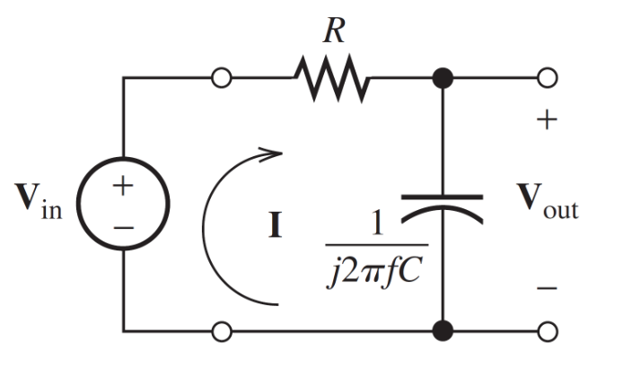
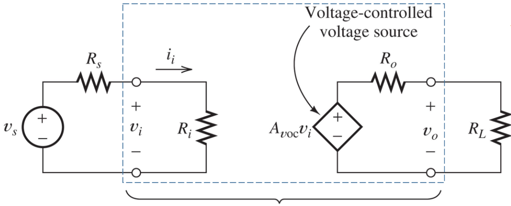
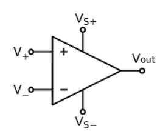
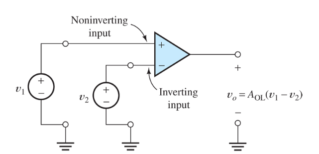
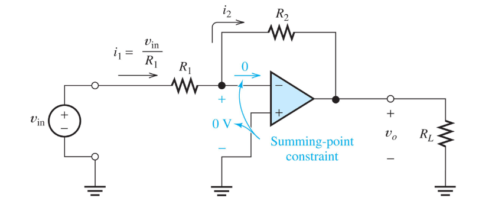
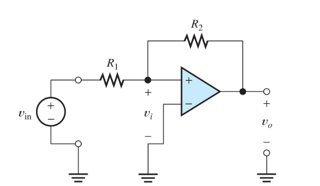

In this part we'll cover circuit response, filter and amplifiers.

### Transfer Function
Recall from the last part that, the *transfer function* is defined as:
$$
H(f) = \dfrac{V_{out}}{V_{in}}
$$

Let's find the transfer function of this circuit:

Let's find $V_{out}$
$$
\begin{align*}
V_{out} & = I \cdot\ Z_C \newline
& = \left(\dfrac{V_{in}}{Z_R + Z_C}\right) Z_C \newline
& = \left(\dfrac{V_{in}}{R + \dfrac{1}{j2\pi fC}}\right) \left(\dfrac{1}{j2\pi fC}\right)
\end{align*}
$$

Which means that $H(f)$:
$$
\begin{align*}
H(f) & = \dfrac{V_{out}}{V_{in}}
& = \dfrac{\left(\dfrac{V_{in}}{R + \dfrac{1}{j2\pi fC}}\right) \left(\dfrac{1}{j2\pi fC}\right)}{V_{in}} \newline
& = \cdots
& = \dfrac{1}{1 + j2\pi fRC}
\end{align*}
$$

We can define $f_B$ as:
$$
\begin{align*}
f_B & = \dfrac{1}{2\pi RC}
\end{align*}
$$

Which means:
$$
\begin{align*}
H(f) & = \dfrac{1}{1 + j \left( \dfrac{f}{f_B} \right)}
\end{align*}
$$

Therefore, the magnitude of $H(f)$ is:
$$
\begin{align*}
|H(f)| & = \dfrac{1}{\sqrt{1 + \left( \dfrac{f}{f_B} \right)^2}}
\end{align*}
$$

The angle:
$$
\begin{align*}
\angle{H(f)} & = - \arctan \left(\dfrac{f}{f_B} \right)
\end{align*}
$$

### Decibels
We all have heard (yes, pun intended) of decibels. Let's properly define what decibels are:
$$
|H(f)|_{dB} = 20 log(|H(f)|)
$$

### Amplifier
Is just as the name suggests:
$$
V_{0}(t) = A_{v}V_{i}(t)
$$

Note that, $A_{v}$, can be of any sign, which means we also have inverting amplifiers!

A typical model would look something like:

### Operational Amplifier (Op-Amp)

An Op-Amp looks like:

We use the Op-Amp like:

An **Ideal** Op-Amp has:

* Infinite input impedance
* Infinite gain for differential signal
* Zero gain for the common-mode signal
* Zero output impedance
* Infinite bandwidth

Differential signal:
$$
V_d = V_1 - V_2
$$

Common-mode signal:
$$
V_cm = \dfrac{1}{2} \left(V_1 + V_2 \right)
$$

Let's take a look at this Op-Amp circuit:
$$
I_1 = I_2 = \dfrac{V_{in}}{R_1}
$$

KVL:
$$
0 + I_2 R_2 + V_{o} = 0 \newline
I_2 = - \dfrac{V_{o}}{R_2} = \dfrac{V_{in}}{R_1}
$$

Which means:
$$
A_{v} = \dfrac{V_{o}}{V_{in}} = \boxed{- \dfrac{R_2}{R_1}}
$$

Let's take a look at this Op-Amp:

Here we'll quickly discover that we have positive feedback. Positive feedback saturates the output - which means we can not use the derived formulas from above!

**Always check if there is positive or negative feedback**.

For non-inverting amplifiers, we get:
$$
A_{v} = \dfrac{V_{o}}{V_{in}} = \boxed{1 + \dfrac{R_2}{R_1}}
$$

So, steps to analyze an ideal Op-Amp circuit:

* Verify that negative feedback is present
* Assume that the voltage between the terminals and input current are forced to 0.
* Apply standard circuit analysis principles (KCL, KVL, and Ohm's Law).
