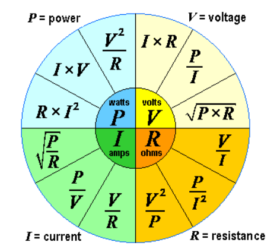
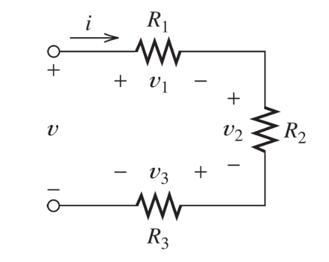
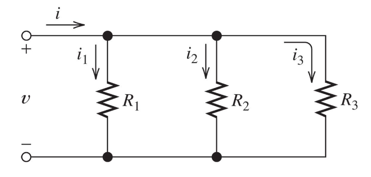
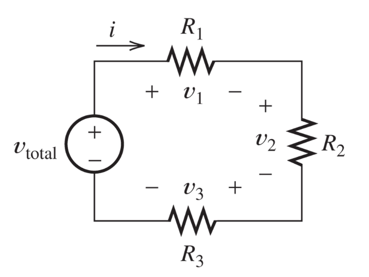
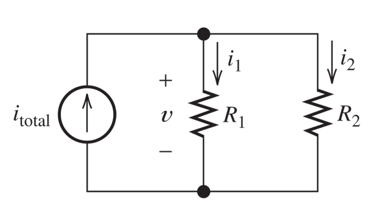

In this part we'll cover and properly define a very misunderstood concept in physics, power and energy.

Let's start with defining power properly.

### Power
Power can be defined as:

:::definition[Power]
**Rate** of energy transferred, *or* work done, per unit of time.
:::

In electrial circuits, we can define power, $P$, as:
$$
P = V \cdot\ I
$$

We measure power in watts, which we can define as:
$$
1\ W = \frac{1\ J}{s} = \frac{1\ N \cdot\ m}{s} = 1 kg \cdot\ m^{2} \cdot\ s^{-3}
$$

We'll mainly only encounter the $P = V \cdot\ I$ variant, however.

Using Ohm's law that we learned from Part 1 we find that:
$$
P = V \cdot\ I = \frac{V^2}{R} = I^2\ R
$$

We can throw around this equation as much as we want and need, here's a picture that illustrates all the possible combinations:

### Energy
Energy can be defined as:

:::definition[Energy]
The **capacity** to do *work* in a given time.

Or in math terms:
$$
W = \int_{t_1}^{t_2} P(t) dt
$$
:::

So, therefore:

* **Power** is **Energy** *per unit of time*.
* **Energy** is **Power** *over time*.

#### Positive and negative power
One small note here is that, power can end up being negative, which can be confusing at first.

We view this as **we're supplying power** into a system. Therefore, positive power is **consuming** the power.

So:

* Positive: Power being *consumed*
* Negative: Power being *supplied*

### Equivalent resistance
As we saw in the first part, we covered that in series circuits, the current needs to be the same.
While in a parallel circuit, the voltage will need to be the same. We can use this to our advantage and find how we can simplify our circuits when we have a lot of resistors.

#### Equivalent resistance in series circuits
If we have a simple circuit of three resistors like this:

Using Ohm's law and the fact that we know this is a series circuit we can find:
$$
V = v_1 + v_2 + v_3 \newline
V = I \cdot\ R_1 + I \cdot\ R_2 + I \cdot\ R_3 \newline
V = (R_1 + R_2 + R_3) \cdot\ I \newline
V = R_{eq} \cdot\ I
$$

Where $R_{eq}$ is:
$$
R_{eq} = R_1 + R_2 + R_3
$$

Or, more generally, if we have $N$ resistors in series, we can find the equivalent resistors as:
$$
R_{eq} = R_1 + R_2 + \ldots\ + R_N
$$

#### Equivalent resistance in parallel circuits
Now, if we instead have three parallel resistors instead like:

Again, using Ohm's law and the fact that this is a parallel circuit we can find:
$$
I = I_1 + I_2 + I_3 \newline
I = \frac{V}{R_1} + \frac{V}{R_3} + \frac{V}{R_3} \newline
I = (\frac{1}{R_1} + \frac{1}{R_3} + \frac{1}{R_3}) \cdot\ V \newline
$$

Which means our $R_{eq}$ is:
$$
\frac{1}{(\frac{1}{R_1} + \frac{1}{R_3} + \frac{1}{R_3})}
$$

Another way of writing this is:
$$
\frac{R_1\ R_2\ R_3}{R_1\ R_2 + R_2\ R_3 + R_1\ R_3}
$$

### Current and Voltage dividers
If we have this circuit:

$$
R_{eq} = R_1 + R_2 + R_3 \newline
I = \frac{V_{total}}{R_{eq}}
$$

We can find equations for the relative voltages:
$$
V_1 = I \cdot\ R_1 = V_{total} \cdot\ \frac{R_1}{(R_1 + R_2 + R_3)} \newline
V_2 = I \cdot\ R_2 = V_{total} \cdot\ \frac{R_2}{(R_1 + R_2 + R_3)} \newline
V_3 = I \cdot\ R_3 = V_{total} \cdot\ \frac{R_3}{(R_1 + R_2 + R_3)} \newline
$$

This is what we call a voltage divider.

If we instead have this circuit:

$$
R_{eq} = \frac{R_1\ R_2}{(R_1 + R_2)} \newline
V = i_{total}\ R_{eq} \newline
$$

We can find equations for the relative currents:
$$
I_1 = \frac{V}{R_1} = I_{total}\ \frac{R_2}{(R_1 + R_2)} \newline
I_2 = \frac{V}{R_2} = I_{total}\ \frac{R_1}{(R_1 + R_2)} \newline
$$
