When analyzing and computing with circuits, it's often a good idea to try to simply as much as possible.

But when met with a circuit like:
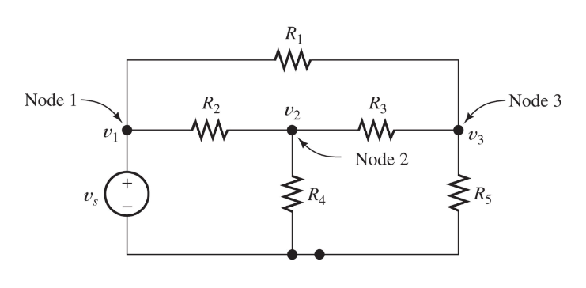

We can try all we want to simplify it, with our current knowledge, we simply can't.

So let's learn about **Node-Voltage** analysis.

### Node-Voltage analysis
Below is a picture that illustrates the idea:
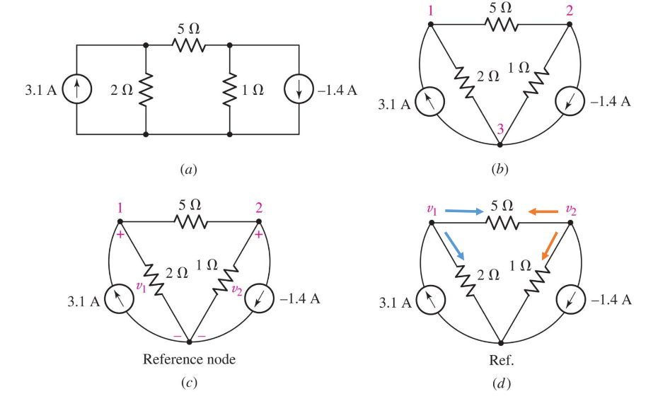

Here's the idea:

1. Find the nodes
2. Assign a reference node (usually, we pick the node with most connections)
3. Assign node voltages (Note, in a circuit with, $N$, nodes we have, $N - 1$, voltages)
4. Then we solve these using KCL on each node ($\sum\ i_{out} = \sum\ i_{in}$)

The convention is also the following:

* Consider $i_{out}$ in resistors

* Consider $i_{out}$ as positive

* $V_{current} - V_{adjacent}$

So, if we solve the example we get:

Using KCL on the first node:
$$
\frac{v_1}{2} + \frac{v_1 - v_2}{5} = 3.1
$$

For the second node:
$$
\frac{v_2}{1} + \frac{v_2 - v_1}{5} = -(-1.4)
$$

Solving for $v_1$ and $v_2$ we get:
$$
v_1 = 5 V \newline
v_2 = 2 V \newline
$$

Notice that we can do this in a matrix form as well:
$$
\begin{bmatrix}
0.7 & -0.2 \newline
-0.2 & 1.2
\end{bmatrix}
$$

### Supernode

Voltage source between nodes that are not the reference node.

Solution: we treat it as one node.

### Mesh-Current analysis
Is the opposite of Node-voltage analysis. Therefore, we just apply KVL instead of KCL. Note that this only forks for **planar circuits**.

:::definition[Planar circuit]
It is possible to draw it in a plane without crossing wires.
:::

Example:
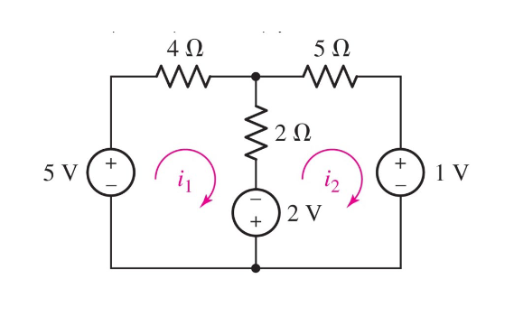
$$
-5 + 4i_1 + 2(i_1 - i_2) - 2 = 0 \newline
2 + 2(i_2 - i_1) + 5i_2 + 1 = 0
$$

### Supermesh
Same principle as super node but for the mesh-current.

### Superposition
As the name suggest, it's the principle that, given a linear system, the net response caused by two or more stimuli is the sum of these respones.

In our case, the stimuli are voltage/current sources.

So our method is:

* Leave **one** source ON and turn all other sources OFF.

    * Voltage sources: $v = 0$, these become *short circuits*.

    * Current sources: $i = 0$, these become *open circuits*.

* Add the resulting responses to find the total response.

Example:
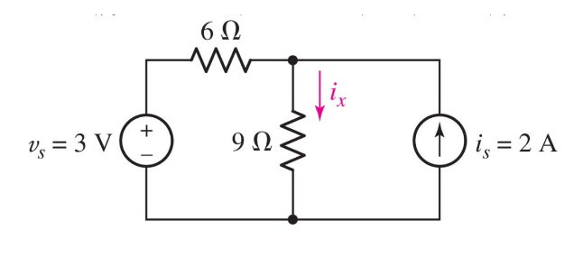

Let's call the circuit when we turn off the current source for $i^\prime_{x}$,
and the circuit when we turn off the voltage source for $i^{\prime \prime}_{x}$.

The circuit for $i^\prime_x$ becomes:
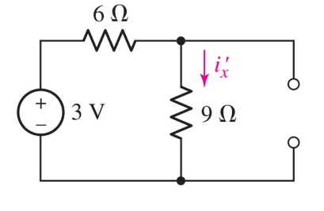

We can easily solve this:

$$
V   = R \cdot\ I \newline
3 V = R_{eq} \cdot\ i^{\prime}_{x} \newline
i^\prime_x = \frac{3 V}{6 \Omega + 9 \Omega} = 0.2 A
$$

The circuit for $i^{\prime \prime}_x$ becomes:a
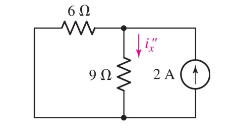

We can solve this by:
$$
R_{eq} = \frac{R_1 R_2}{(R_1 + R_2)} \newline
V = i_{total} \cdot\ R_{eq} \newline
$$

$$
i_x^{\prime \prime}= \frac{V}{R_{i^{\prime \prime}_x}}
$$

$$
i_x^{\prime \prime} = i_{total} \cdot\ \frac{R_6}{(R_6 + R_{i^{\prime \prime}_x})} \newline
i_x^{\prime \prime} = 2 A \cdot\ \frac{6 \Omega}{6 \Omega + 9 \Omega} = 0.8 A
$$

Finally, using the actual superposition principle:
$$
i_x = i^\prime_x + i^{\prime \prime}_x = 0.2 + 0.8 A = \boxed{1.0 A}
$$

### Equivalent circuits
When dealing with complex circuits, like the one we encountered earlier, with our current knowledge it takes a lot of time and effort to simplify circuits.

Luckily, there's more powerful method to find equivalent circuits.

It's called the *Thévenin equivalent circuits* and *Norton equivalent circuits*.

The idea is the following:
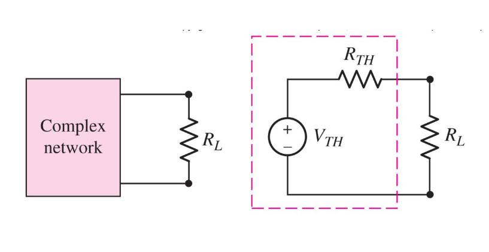

We take a complex network and transform it to just a single voltage source and resistor.

These are called the Thévenin voltage and resistance. We'll see later why we'll want to name these.

But how do we actually do this transformation?

1. Disconnect the "load", $R_L$.
2. Find the open circuit voltage, $V_{oc}$.
3. Find the equivalent resistance, $R_{eq}$, of the network with all independent sources turned off.
4. Then:

    * $V_{TH} = V_{oc}$

    * $R_{TH} = R_{eq}$

Example:
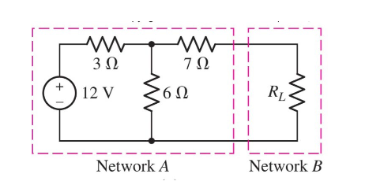

Let's now disconnect $R_L$ and find the open circuit voltage:
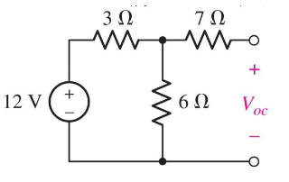

$$
V_{oc} = V_6 \quad \| \quad \text{Since they are in parallel} \newline
V_6 = V_{total} \cdot\ \frac{R_6}{(R_3 + R_6)} = 12 V \cdot\ \frac{6 \Omega}{3 \Omega + 6 \Omega} = 8 V \newline
V_{TH} = V_{oc} = 8 V
$$

Notice how we didn't include the $R_7$, this is due to the fact that, no current is going through that resistor!

Next step, let's find the $R_eq$ for this circuit. **Don't forget to turn OFF all independent sources!**:
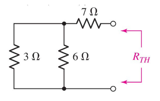

$$
R_{eq} = R_{3 || 6} + R_7 = 2 \Omega + 7 \Omega = 9 \Omega \newline
R_{TH} = R_{eq} = 9 \Omega
$$

Therefore, the final equivalent circuit is:
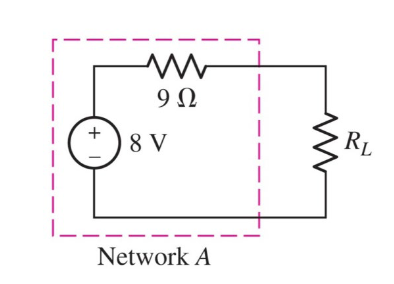

### Norton equivalent circuits
Norton equivalent is the same idea, but we replace the voltage source with a current source, and make the resistors parallel instead:
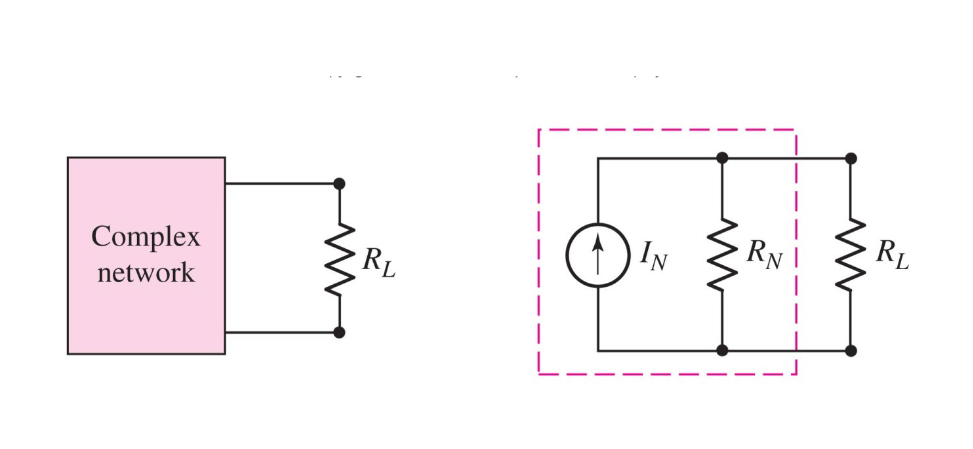

The method for finding a Norton equivalent circuit is:

1. Replace the load with a **short circuit**.
2. Find the **short circuit** current, $I_{sc}$.
3. Find the equivalent resistance, $R_{eq}$, of the network with all independent sources turned off.
4. Then:

    * $I_N = I_{sc}$
    * $R_N = R_{eq}$

### Source transformation
Now comes the beauty with all of this, we can transform a Thévenin equivalent circuit to a Norton equivalent circuit!

It's quite obvious because:
$$
R_{TH} = R_{N} = R_{eq} \newline
$$

But the beauty is:
$$
V_{TH} = I_{N} \cdot\ R_{eq}
$$

Using Ohm's law, we can easily just convert one type of circuit to the corresponding other type!

We'll be using this tool a lot in future for analyzing circuits!
