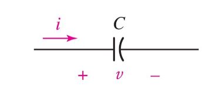
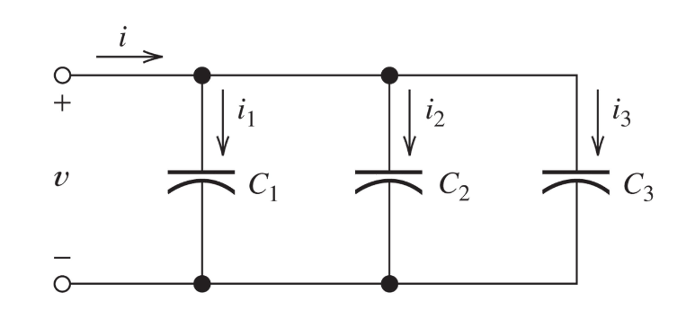
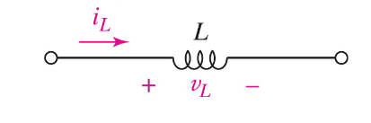
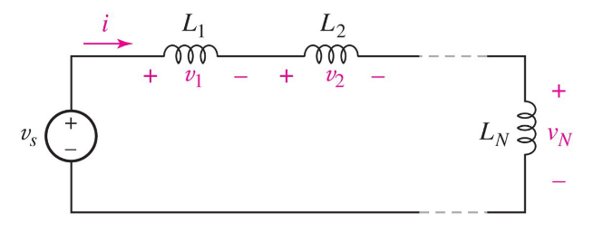
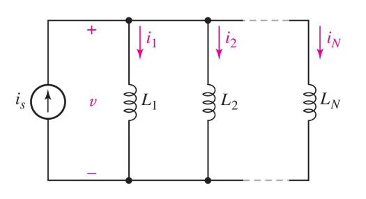
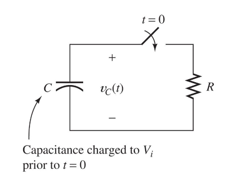
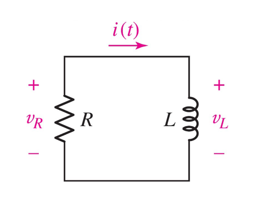

In this part we'll cover two very crucial component that are often used in electrical circuits.

Capacitors and inductors, we will see why these are so important later on as well.

Let's start with looking at capacitors.

### Capacitors
Let's start by properly defining what a capacitor is:

:::definition[Capacitor]
A capacitor is a device that stores electric charge by creating an electric field between two conductive plates separated by an insulating material.
:::

So, essentially, it is a component that stores electric energy.

The ideal capacitor is a **passive** component with the following circuit symbol:

The *capacitance* is measured in farads ($F$) - typically $pF$ to $\mu F$

Let's jump right into some formulas that we'll need to understand:

Charge is proportional to the voltage
$$
q = C \cdot\ V
$$

Further, the current-voltage relation is therefore:
$$
I = \frac{dq}{dt} = C\ \frac{dV}{dt}
$$

Let's now look at the power \& energy when using capacitors:

#### Power \& Energy in Capacitors
$$
I = \frac{dq}{dt} = C\ \frac{dV}{dt} \newline
P = I \cdot\ V = CV \frac{dV}{dt}
$$

We know that:
$$
W(t) = \int_{t_0}^{t}\ P(t)\ dt \newline
W(t) = \int_{t_0}^{t}\ CV \frac{dV}{dt}\ dt \newline
W(t) = C \cdot\ \int_{t_0}^{t}\ V\ dV \newline
W(t) = \frac{C}{2} [v(t)^2 - v(t_0)^2]
$$

**If $V = 0$ at $t_0$ then:**
$$
W(t) = \frac{C \cdot\ v(t)^2}{2} \quad \| \quad q = CV \newline
W(t) = \frac{v(t)\ q(t)}{2} \quad \| \quad C = \frac{q}{V} \newline
W(t) = \frac{q(t)^2}{2C} \quad \| \quad V = \frac{q}{C}
$$

Let's now take a look on charge and voltage *in terms of current* in capacitors.

### Charge and Voltage in Capacitors
Charge in terms of current:
$$
q(t) = \int_{t_0}^{t}\ i(t)\ dt + q(t_0) \quad \| \quad q = Cv
$$

Voltage in terms of current:
$$
CV(t) = \int_{t_0}^{t}\ i(t)\ dt + CV(t_0) \newline
V(t) = \frac{1}{C} \int_{t_0}^{t}\ i(t)\ dt + V(t_0)
$$

#### Capacitors in parallel
If we now take a look at a circuit which has three capacitors in parallel like such:

We can derive the following:
$$
i = i_1 + i_2 + i_3 \newline
$$

$$
i = C \frac{dV}{dt} \newline
$$

$$
i = C_1 \frac{dV}{dt} + C_2 \frac{dV}{dT} + C_3 \frac{dV}{dT} \newline
$$

$$
i = (C_1 + C_2 + C_3) \frac{dV}{dt}
$$

$$
\boxed{C_{eq} = C_1 + C_2 + C_3}
$$

#### Capacitors in series
In series, this becomes:
$$
V = v_1 + v_2 + v_3 \newline
$$

$$
V = \frac{Q}{C_1} + \frac{Q}{C_2} + \frac{Q}{C_3}
$$

$$
V = (\frac{1}{C_1} + \frac{1}{C_2} + \frac{1}{C_3}) \cdot\ Q
$$

$$
\boxed{C_{eq} = \frac{1}{C_1} + \frac{1}{C_2} + \frac{1}{C_3}}
$$

So, let's try to summarize capacitors

#### Capacitors summary

* Capacitors are open circuits to DC voltage (If $V$ is constant, then $I = 0$).

* The voltage on a capacitor **cannot** *jump* (Change instantaneously, since then we would have infinite current).

* Capacitors *store* energy ($I \cdot\ V > 0$), or, deliver energy ($I \cdot\ V < 0$).

### Inductors
Let's first properly define what an inductor is:

:::definition[Inductor]
An inductor is a component in an electrical circuit that utilizes electromagnetic induction to resist changes in current flow by generating a voltage that opposes the change.
:::

An ideal inductor is a **passive** element with the following circuit symbol:

Let's dive into the formulas now!

The current-voltage relation is:
$$
V(t) = L\ \frac{dI}{dt}
$$

The unit of inductance, $L$, is henry (H).

Now with the above formula we can derive:
$$
dI = \frac{1}{L}\ V(t) dt
$$

$$
\int_{I(t_0}^{I(t)}\ dI = \frac{1}{L} \int_{t_0}^{t}\ V(t) dt
$$

Which means:
$$
I(t) = \frac{1}{L} \int_{t_0}^{t}\ V(t) dt + I(t_0)
$$

#### Power \& Energy in Inductors
$$
P(t) = I(t)\ V(t) = I(L\ \frac{dI}{dt}) = \frac{dW}{dt}
$$

Which means:
$$
W = \frac{LI^2}{2}
$$

As you can see, the formulas for inductors and capacitors are nearly identical.

#### Inductors in series
If we have the following circuit:

We can derive:
$$
V_s = V_1 + V_2 + \ldots + V_N \newline
V_s = L_1\ \frac{dI}{dt} + L_2\ \frac{dI}{dt} + \ldots + L_N\ \frac{dI}{dt} \newline
V_s = (L_1 + L_2 + \ldots + L_N) \frac{dI}{dt} \newline
\boxed{L_{eq} = L_1 + L_2 + \ldots + L_N}
$$

#### Inductors in parallel
If we have the following circuit:

We can derive:
$$
V = L\ \frac{d}{dt}(I_1 + I_2 + \ldots + I_N) \newline
$$

$$
V = L\ (\frac{dI_1}{dt} + \frac{dI_2}{dt} + \ldots + \frac{dI_N}{dt}) \newline
$$

$$
V = L\ (\frac{V}{L_1} + \frac{V}{L_2} + \ldots + \frac{V}{L_N})
$$

Which means:
$$
\boxed{L_{eq} = \frac{1}{\frac{1}{L_1} + \frac{1}{L_2} + \ldots + \frac{1}{L_N}}}
$$

#### Inductors summary

* Inductors are **short circuits** to DC voltages (If $I$ constant, then $V = 0$).

* The current through an inductor *cannot* jump (change instantaneously, otherwise we would have infinite voltage).

* Inductors *store* energy ($I \cdot\ V > 0$), or, deliver energy ($I \cdot\ V < 0$).

### Time-Varying Circuits

When we're dealing with circuits like this, meaning, we have time aspect to consider. We need new ways to describe our circuits.

So let's introduce our new formulas:
$$
V_{C}(t) = V_{i}\ e^{\frac{-t}{\tau}} \quad \text{, where $\tau$ is:} \newline
\tau = RC
$$

For the inductor case:

Formulas:
$$
I(t) = I_{0}\ e^{\frac{-Rt}{L}} \newline
\tau = \frac{L}{R}
$$
