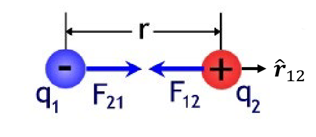
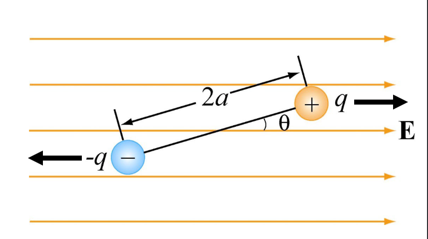
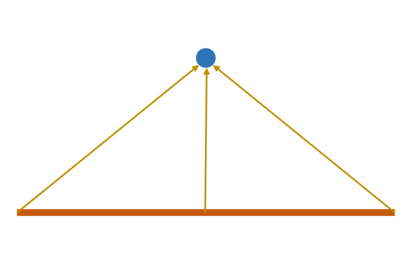
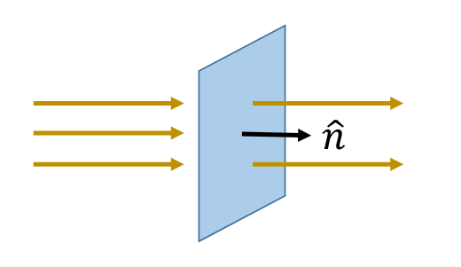
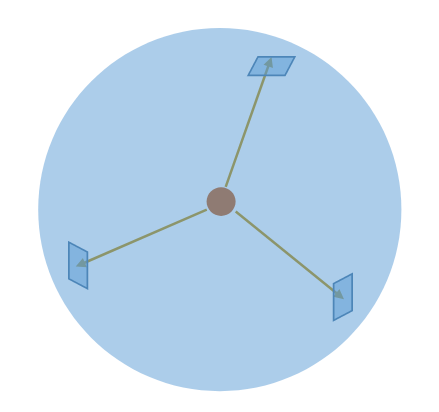
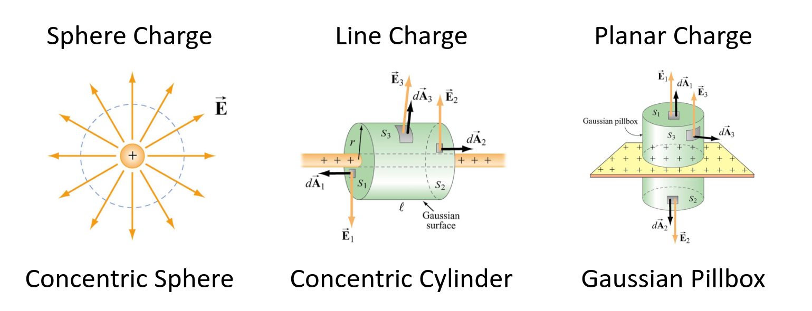

In this part we'll discuss electrical fields and some tools we'll begin to use.

So far we've only analyzed the electrical circuits at a macro level. In this part we'll try to dissect them at a micro-level, so let's zoom in!

### Electrical charge
To understand electrical circuits, let's first understand electrical *charge*.

As we've seen, we use $q$, as the notation for charge.
The elementary charge (the charge carried by a single proton) is:
$$
e^{-} = 1.602 \cdot\ 10^{-19} C
$$

We also need to remember this very important law:

:::theorem[Conservation of charge]
The total charge within a **closed** system cannot change. It can only be **redistributed**.
:::

Now that we've defined electrical charge, we can define electrical **fields**!

### Electrical fields
Let's start by defining what an electrical field is!

:::definition[Electrical field]
An electrical field is a force field created by electric charges.
:::

Always remember:

* **Repulsive** if charges are the **same**.

* **Attractive** if charges are **different**.

#### Coulomb's law

This force field that is created by the charges, we can mathematically compute these forces:
$$
\mathbf{\vec{F_{12}}} = k_{e}\ \frac{q_1 q_20}{r^2} \mathbf{\vec{r_{12}}}
$$

Where $k_{e}$ is Coulomb's constant:
$$
k_e = \frac{1}{4\pi\varepsilon_{0}}
$$

Where $\varepsilon_{0}$ is the vacuum permittivity, we'll actually derive this later on!
$$
\varepsilon_{0} = \frac{10^{-9}}{36\pi}
$$

Alright with all of these tools, we can *finally* define electrical fields with some maths!

$$
\mathbf{\vec{E}} = k_{e}\ \frac{q}{r^2}\mathbf{\vec{r}}
$$

Also, given an *electrical field* we can calculate the force on a point of charge:
$$
\mathbf{\vec{F_{E}}} = q\ \mathbf{\vec{E}}
$$

Notice how these formulas are really similar to formulas of gravitation.

### Superposition
As you could have guessed, yes, the superposition principle applies to the electrical forces and fields:
$$
\mathbf{\vec{F_{j}}} = \sum_{i = 1}^{N}\ \mathbf{\vec{F_{ij}}} \newline
\mathbf{\vec{E}} = \sum_{i = 1}^{N}\ \mathbf{\vec{E_{i}}}
$$

### Dipoles
Two equals and opposite charges are known as a *dipole*.

A *dipole moment* is a measure of the density of the electrical field *of a dipole*.

The formula
$$
\mathbf{\vec{p}} = q\mathbf{\vec{d}}
$$

Where $\mathbf{\vec{d}}$, is the direction vector, which is defined as, from negative charge to positive charge by convention.

This means, placing a dipole in an electrical field, applies a *torque* on the dipole:

Which means we can calculate the torque:
$$
\mathbf{\vec{\tau}} = \mathbf{\vec{p}} \times \mathbf{\vec{E}} \newline
\tau = p \cdot\ E\ sin(\theta)
$$

### Electrical flux
So far we've discussed discrete number of charges and points. Imagine now instead that we have a continuous line:

So instead of:
$$
\mathbf{\vec{E}} = \sum_{i = 1}^{N}\ \mathbf{\vec{E_{i}}}
$$

We get:
$$
\mathbf{\vec{E}} = \int_{L_{1}}^{L_{2}}\ \mathbf{\vec{E_{l}}} dl
$$

Now, let's flip it around. We instead have a single point of charge and want to know how much of its electrical field passes through a line.

This is precisely electrical flux! We denote electrical flux with the $\Phi$.
$$
\Phi = \sum_{i = 1}^{N}\ \mathbf{\vec{E}} \cdot\ \hat{n}
$$

And for the continuous case:
$$
\Phi = \int_{L_{1}}^{L_{2}}\ \mathbf{\vec{E_{l}}} \cdot\ \hat{n} \cdot\ dl
$$

Let's now add another dimension, so it's a surface

$$
\Phi = \iint \mathbf{\vec{E}} \cdot\ \hat{n} \cdot\ d\mathbf{\vec{A}} = \iint \mathbf{\vec{E}} \cdot\ d\mathbf{\vec{A}}\ cos(\theta)
$$

If we're instead within a **closed contour**:

For this we use the special integral symbol:
$$
\Phi = \oiint\ \mathbf{\vec{E}} \cdot\ d\mathbf{\vec{A}}
$$

What is the total flux through this surface (circle).
$$
\mathbf{\vec{E}} = \frac{q}{4\pi r^2 \varepsilon_{0}} \newline
A = 4\pi r^2
$$

Therefore:
$$
\Phi = \frac{q}{4\pi r^2 \varepsilon_{0}}\ 4\pi r^2 \newline
$$

$$
\Phi = \frac{q}{\varepsilon_{0}}
$$

### Gauss's law
This is Gauss's law!
$$
\Phi_{E} = \oiint \mathbf{\vec{E}} \cdot\ d\mathbf{\vec{A}} = \frac{q}{\varepsilon_{0}}
$$

#### Gaussian surfaces
Since this is from a specific surface, we'll need to consider the different types:

These are the gaussian surfaces that we'll be looking into!
