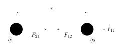
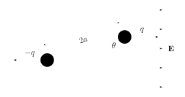
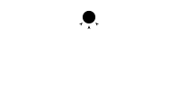
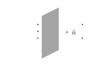
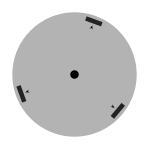
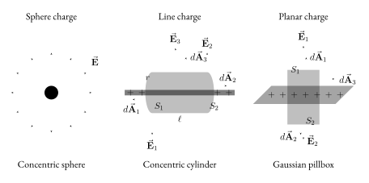

In this part we'll discuss electrical fields and some tools we'll begin to use.

So far we've only analyzed the electrical circuits at a macro level. In this part we'll try to dissect them at a micro-level, so let's zoom in!

### Electrical charge
To understand electrical circuits, let's first understand electrical *charge*.

As we've seen, we use $q$, as the notation for charge.
The elementary charge (the charge carried by a single proton) is:
$$
e = 1.602 \cdot 10^{-19} \ \mathrm{C}.
$$

We also need to remember this very important law:

:::theorem[Conservation of charge]
The total charge within a **closed** system cannot change. It can only be **redistributed**.
:::

Now that we've defined electrical charge, we can define electrical **fields**!

### Electrical fields
Let's start by defining what an electrical field is!

:::definition[Electrical field]
An electrical field is a force field created by electric charges.
:::

Always remember:

* **Repulsive** if charges are the **same**.
* **Attractive** if charges are **different**.

#### Coulomb's law

This force field that is created by the charges, we can mathematically compute these forces:

:::theorem[Coulomb's law]
$$
\vec{\mathbf{F}}_{12} = k_e \frac{q_1 q_2}{r^2} \hat{\mathbf{r}}_{12},
$$

where $k_e$ is Coulomb's constant,

$$
k_e = \frac{1}{4\pi\varepsilon_0}.
$$
:::

Where $\varepsilon_0$ is the vacuum permittivity, we'll actually derive this later on!

$$
\varepsilon_0 \approx \frac{10^{-9}}{36\pi} \ \mathrm{F/m}.
$$

Alright with all of these tools, we can *finally* define electrical fields with some maths!

$$
\vec{\mathbf{E}} = k_e \frac{q}{r^2} \hat{\mathbf{r}}.
$$

Also, given an *electrical field* we can calculate the force on a point of charge,

$$
\vec{\mathbf{F}}_E = q \vec{\mathbf{E}}.
$$

Notice how these formulas are really similar to formulas of gravitation.

### Superposition
As you could have guessed, yes, the superposition principle applies to the electrical forces and fields,

$$
\begin{align*}
\vec{\mathbf{F}}_j & = \sum_{i = 1}^{N} \vec{\mathbf{F}}_{ij}, \newline
\vec{\mathbf{E}} & = \sum_{i = 1}^{N} \vec{\mathbf{E}}_i.
\end{align*}
$$

### Dipoles
:::definition[Dipole]
Two equal and opposite charges are known as a *dipole*.
:::

A *dipole moment* is a measure of the density of the electrical field *of a dipole*.

The formula,

$$
\vec{\mathbf{p}} = q \vec{\mathbf{d}},
$$

where $\vec{\mathbf{d}}$ is the direction vector, which is defined as, from negative charge to positive charge by convention.

This means, placing a dipole in an electrical field, applies a *torque* on the dipole:

Which means we can calculate the torque,

$$
\begin{align*}
\vec{\boldsymbol{\tau}} & = \vec{\mathbf{p}} \times \vec{\mathbf{E}}, \newline
\tau & = p E \sin(\theta).
\end{align*}
$$

### Electrical flux
So far we've discussed a discrete number of charges and points. Imagine now instead that we have a continuous line:

So instead of,

$$
\vec{\mathbf{E}} = \sum_{i = 1}^{N} \vec{\mathbf{E}}_i,
$$

we get,

$$
\vec{\mathbf{E}} = \int_{L_1}^{L_2} \vec{\mathbf{E}}_l \, dl.
$$

Now, let's flip it around. We instead have a single point of charge and want to know how much of its electrical field passes through a line.

This is precisely electrical flux! We denote electrical flux with $\Phi$.

$$
\Phi = \sum_{i = 1}^{N} \vec{\mathbf{E}}_i \cdot \hat{n}.
$$

And for the continuous case,

$$
\Phi = \int_{L_1}^{L_2} \vec{\mathbf{E}}_l \cdot \hat{n} \, dl.
$$

Let's now add another dimension, so it's a surface.

$$
\Phi = \iint \vec{\mathbf{E}} \cdot \hat{n} \, dA = \iint E \, dA \cos(\theta).
$$

If we're instead within a **closed contour**:

For this we use the special integral symbol,

$$
\Phi = \oiint \vec{\mathbf{E}} \cdot d\vec{\mathbf{A}}.
$$

What is the total flux through this surface (circle)?

$$
\begin{align*}
E & = \frac{q}{4\pi r^2 \varepsilon_0}, \newline
A & = 4\pi r^2.
\end{align*}
$$

Therefore,

$$
\Phi = \frac{q}{4\pi r^2 \varepsilon_0} 4\pi r^2 = \frac{q}{\varepsilon_0}.
$$

### Gauss's law
This is Gauss's law!

:::theorem[Gauss's law]
$$
\Phi_E = \oiint \vec{\mathbf{E}} \cdot d\vec{\mathbf{A}} = \frac{q}{\varepsilon_0}
$$
:::

#### Gaussian surfaces
Since this is from a specific surface, we'll need to consider the different types:

These are the gaussian surfaces that we'll be looking into!
