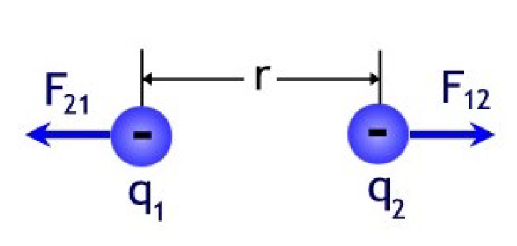
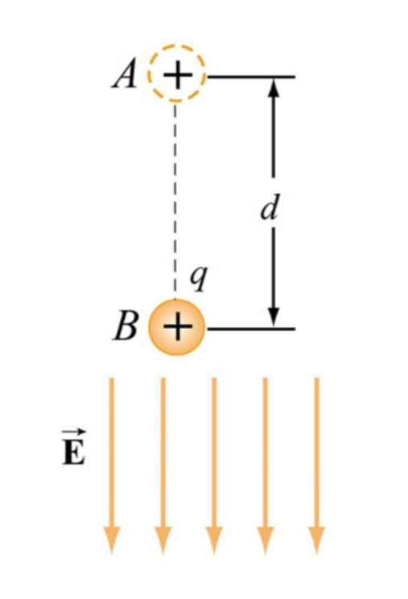
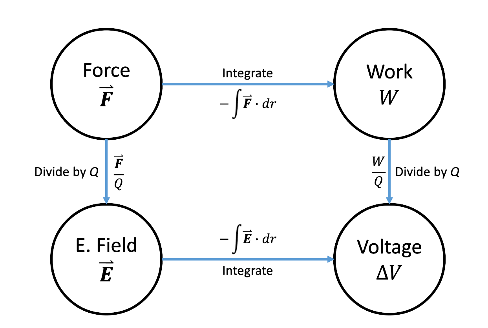
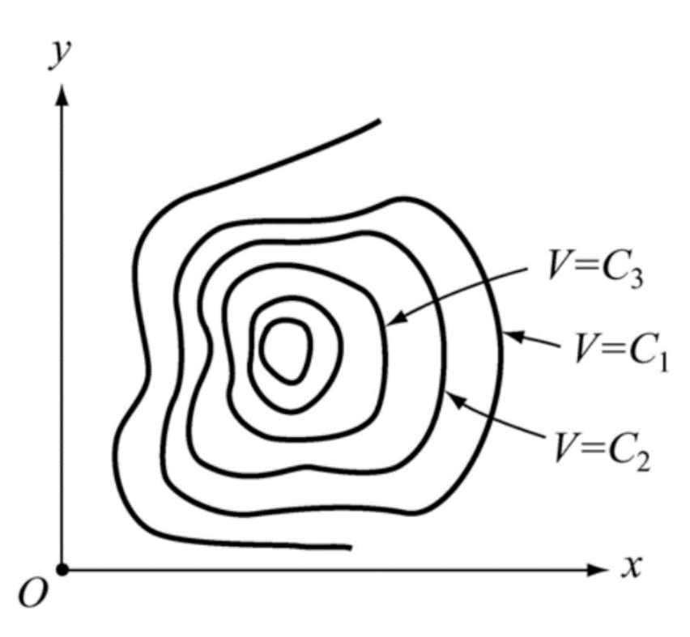

In this part we'll work in electrical fields, the connection between electrical fields and voltages as well as how we can use electrical fields with capacitors.

### Work
We've briefly went over work before in this series - but let's consider the work required to *move* charges apart from eachother.

For example:

$$
W = F \cdot\ d\mathbf{\vec{r}} \newline
$$

$$
\mathbf{\vec{F_{12}}} = k_{e}\ \dfrac{q_1 q_2}{r^2} \mathbf{\vec{r_{12}}}
$$

$$
\begin{align*}
W & = \int_{R}^{\infty} \mathbf{\vec{F}} \cdot\ d\mathbf{\vec{r}} \newline
& = -k_e q_1 q_2 \int_{R}^{\infty} \dfrac{d\mathbf{\vec{r}}}{r^2} \newline
& = k_e q_1 q_2 \cdot\ \dfrac{-1}{r} \Big|_R^{\infty} \newline
& = \boxed{\dfrac{k_e q_1 q_2}{R}}
\end{align*}
$$

### Work in an electrical field
Now, if we consider a charge moving inside an electrical field:

Let's calculate the work to move from A to B.
$$
W = \mathbf{\vec{F}} \cdot\ d\mathbf{\vec{r}}
$$

$$
\mathbf{\vec{F}_E} = q \mathbf{\vec{E}}
$$

$$
\begin{align*}
W & = - \int_A^B \mathbf{\vec{F}} \cdot\ d\mathbf{\vec{r}} \newline
& = - \int_A^B q\mathbf{\vec{E}} \cdot\ d\mathbf{\vec{r}} \newline
& = -qE_0 \int_A^B d\mathbf{\vec{r}} \newline
& = -qE_0d
\end{align*}
$$

Note, in the case when we move perpendicular to the field, the work is **0**.

Another way we can write work is:
$$
\begin{align*}
W & = \Delta U \newline
& = - \int_A^B \mathbf{\vec{F}} \cdot\ d\mathbf{\vec{r}}
\end{align*}
$$

This means that the potential is proportional to the charge:
$$
\mathbf{\vec{F}_E} = q\mathbf{\vec{E}}
$$

If we normalize the work with the charge we'll see a very interesting result:
$$
\begin{align*}
\dfrac{W}{q} & = - \int_A^B \mathbf{\vec{E}} \cdot\ d\mathbf{\vec{r}}
\end{align*}
$$

If we just interpret this integral, we move a charged particle a distance.

Let's go back to our definition of voltage from the first part - this is precisely the difference in voltage!
$$
[\Delta V] = \dfrac{Joules}{Coulumb}
$$

Just as **Kirchoff's voltage law** tells us that, within a closed loop, the sum of the voltages are 0.

This means that the work done within a closed path:
$$
W = - \oint \mathbf{\vec{F}} \cdot\ d\mathbf{\vec{r}} = 0
$$

With all these new formulas, here is a little cheat sheet so that we remember:

### Electrical fields
If we work backwards from a known voltage - we can find the electrical field!
$$
\Delta V = - \int_A^B \mathbf{\vec{E}} \cdot\ d\mathbf{\vec{r}}
$$

$$
dV = -\mathbf{\vec{E}} \cdot d\mathbf{\vec{r}}
$$

$$
\mathbf{\vec{E}} = - \dfrac{dV}{d\mathbf{\vec{r}}}
$$

We can define this as the gradient of the voltage:
$$
\mathbf{\vec{E}} = - \nabla V
$$

### Equipotential curves
As we just discovered - the electrical field is equal to the gradient of the voltage.
Equipotential curves are way of visualizing the electric potential in a region of space.
They are just like geographical maps!

Now the interesting part is that these curves are always perpendicular to the electrical field lines!

### Capacitance
Capacitance is the ability for an electrical potential to *hold a charge*

We define capacitance as:
$$
C = \dfrac{q}{|\Delta V|}
$$

#### Capacitors
Capacitors are two isolated plates with **equal** and **opposite** charges: $\pm q$

When they are charged, they create a voltage diffrence between the plates, naturally.

How can we calculate this voltage?

Assume we have a surface area of $A$, a *surface charge density* of $\sigma$.

We can define charge as:
$$
q = \sigma A
$$

Let's recall our Gaussian pillbox:
$$
\begin{align*}
\Phi & = \oiint \mathbf{\vec{E}} \cdot\ d\mathbf{\vec{A}} \newline
& = \dfrac{q_{enc}}{\varepsilon_0}
\end{align*}
$$

For a given area, say, $A_1$, we can write:
$$
\begin{align*}
EA_1 & = \dfrac{q}{\varepsilon_0} \newline
& = \dfrac{\sigma A_1}{\varepsilon_0}
\end{align*}
$$

Which means:
$$
\begin{align*}
E & = \dfrac{\sigma}{\varepsilon_0} \newline
& = \boxed{\dfrac{q}{\varepsilon_0 A}}
\end{align*}
$$

Let's apply this on capacitors:
$$
\Delta V = - \int_+^- \mathbf{\vec{E}} \cdot\ d\mathbf{\vec{r}} = -Ed
$$

$$
Ed = \dfrac{q}{\varepsilon_0 A} d
$$

$$
\begin{align*}
C & = \dfrac{q}{|\Delta V|} \newline
& = \dfrac{q}{\dfrac{q}{\varepsilon_0 A} d} \newline
& = \boxed{\varepsilon_0 \dfrac{A}{d}}
\end{align*}
$$

This means, the capacitance is **solely** dependent of the geometry of the capacitor!

### Energy stored in capacitors
Recall from earlier that we deduced that:
$$
\dfrac{W}{q} = - \int_A^B \mathbf{\vec{E}} \cdot\ d\mathbf{\vec{s}} = \Delta V
$$

This means:
$$
dW = dq \Delta V = dq \dfrac{q}{C}
$$

$$
W = \int dW = \dfrac{1}{C} \int_0^Q q\ dq = \boxed{\dfrac{1}{C}\ \dfrac{Q^2}{2}}
$$

How is the (potential) energy stored?

$$
U = \dfrac{1}{C}\ \dfrac{Q^2}{2} = \dfrac{1}{2} Q |\Delta V| = \dfrac{1}{2} C |\Delta V|^2 \newline
$$

$$
\dfrac{1}{2} C |\Delta V|^2 = \dfrac{1}{2}\ \dfrac{\varepsilon_0 A}{d} (Ed)^2 = \dfrac{1}{2} \varepsilon_0 E^2 Ad = u\ \times volume
$$

Where, $u$, is called the electrical field density:
$$
u = \dfrac{\varepsilon_0 E^2}{2}
$$
