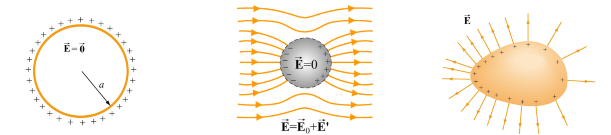
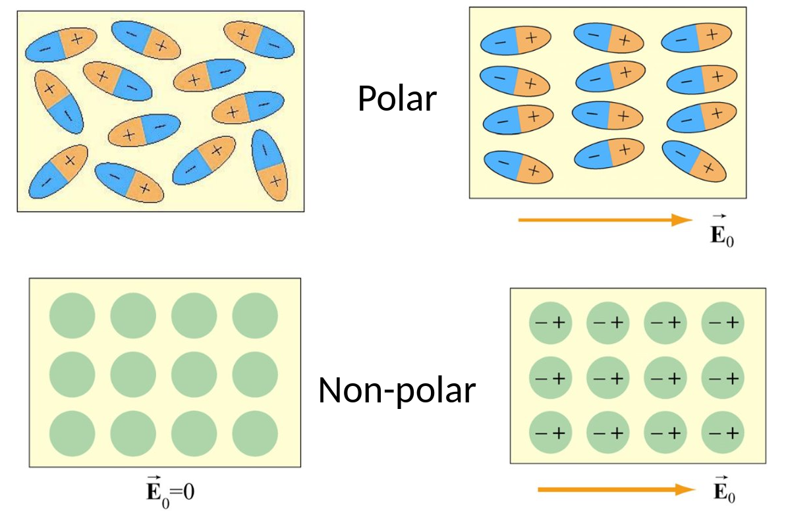
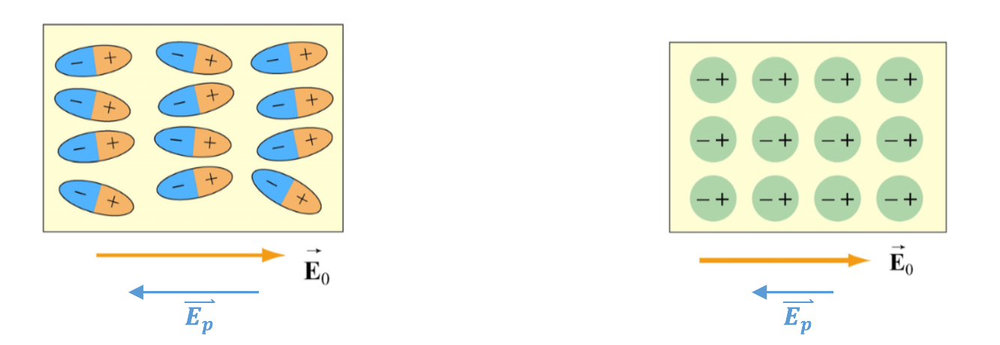

In this part we'll finally cover magnetic fields and some very important laws for these.
We'll see how electrical and magnetic fields interact with each other as well.

### Materials in electrical fields
We have lightly touched on this before but - different type of materials will behave differently in electrical fields.

We can roughly say we have three categories of types - conductors, semiconductors and insulators.

A conductor is, as the name suggest, where the electrons are weakly bound to the atoms.
An insulator is the opposite, the electrons are strongly bound to the atoms.

The interesting area of semiconductors is where the electrons bonds are temperature dependent!

### Conductors in electrical fields
Say if we have an iron sphere, the electrical field **inside** the sphere will be exactly **0**.
Why is that? Since the electrons are free to move, they will arrange in a way that maximizes the distance between each one.

This means all the charge will be at the surface of the sphere, therefore the electrical field inside the sphere is 0.

However, if we put this iron sphere inside an external electrical field, we will create a dipole field!

But just as we discussed, the electrical field **inside** will still be **0**!

We say that:

:::note
Any *net* charge must reside on the surface
:::

### Insulators in electrical fields
One important thing about insulators is that - there are two different types - Polar dielectric and Nonpolar dielectric materials.

Polar dielectric materials will *align* the dipole moment, while nonpolar dielectric materials will gain an *induced dipole moment*.

### Dielectric constant
Since our molecules now align with the electrical field, this will result in an electrical field in the **opposite** direction!

Since, generally, capacitors don't have vacuum between the plates.

We can write the total net electrical field as:
$$
\mathbf{\vec{E}} = \mathbf{\vec{E}_0} + \mathbf{\vec{E}_p}
$$

Note that this is vector addition - with direction of course!

The point here was, how does this affect the capacitance? Recall that:
$$
\Delta V = - \int_+^- \mathbf{\vec{E}} \cdot\ d\mathbf{\vec{r}} = -Ed
$$

$$
C = \dfrac{q}{|\Delta V|} = \dfrac{q}{|Ed|}
$$

This means that:
$$
C \propto \dfrac{1}{|E|}
$$

This means we can essentially control our capacitance or electrical field!

The capacitance increases as the electrical field is reduced!

We model this increase with a constant, the dielectric constant!
$$
C = k_e C_0
$$

### Conductivity & Resistivity
One very important detail we have yet to covered in electrical circuits are - what causes the current to move?

Imagine if we put a conductor inside an external electrical field - the charge will move due to the electrical field and creates a current.

With an active current, the conductor is no longer an equipotential surface.

We can write the total current as:
$$
I = \iint \mathbf{\vec{J}} \cdot\ d\mathbf{\vec{A}}
$$

Where $\mathbf{\vec{J}}$ is the **current density**

Let's also discuss this, electron movement is not linear, but on *average*, it is moving in a set direction.

This means that the rate of electron movement depends on the *conductivity*, $\sigma$, of the material:
$$
\mathbf{\vec{J}} = \sigma \mathbf{\vec{E}}
$$

If we assume $\mathbf{\vec{E}}$ is **uniform** meaning the electrical field lines are evenly spaced apart.

We have:
$$
\begin{align*}
J & = \sigma E = \sigma \dfrac{\Delta V}{l} \newline
& = \dfrac{I}{A}
\end{align*}
$$

This means:
$$
\begin{align*}
\Delta V & = \dfrac{l}{\sigma}\ J \newline
& = \dfrac{l}{\sigma A}\ I \newline
& = RI
\end{align*}
$$

Where $R$:
$$
R = \dfrac{\Delta V}{I} = \dfrac{l}{\sigma A}
$$

Therefore, resistivity is the inverse of conductivity:
$$
\rho = \dfrac{1}{\sigma}
$$

### Magnetic fields
Now, finally, magnetic fields.

They behave similarly to electrical fields! However, magnetic fields **always** exist as dipoles!

Magnetic fields arise *due to the motion of charge*

So how do we define the magnetic field, $\mathbf{\vec{B}}$

We can't use electrical field equations to define magnetic fields, due to the absence of magnetic monopoles.

So let's instead consider a particle of charge, $q$, moving at velocity, $\mathbf{\vec{v}}$.

$$
\mathbf{\vec{F}_B} = q\mathbf{\vec{v}} \times \mathbf{\vec{B}} = |q|vB\ sin(\theta)
$$

The unit for magnetic field strength is Tesla:
$$
1\ T = \left[1 \dfrac{N}{A \cdot\ m}\right]
$$

### Biot-Savarts law

Given current through a wire, the magnetic field *from a single point on the wire is*:
$$
d\mathbf{\vec{B}} = \dfrac{\mu_0}{4\pi} \dfrac{I\ d\mathbf{\vec{s}} \times \mathbf{\vec{r}}}{r^2}
$$

Where, $\mu_0$ is the *permeability of free space*:
$$
\mu_0 = 4\pi \cdot\ 10^{-7}\ \left[\dfrac{Tm}{A}\right]
$$

We can also calculate the total magnetic field at a point, $P$, is the sum across all points along the current source:
$$
\mathbf{\vec{B}} = \int d\mathbf{\vec{B}} = \dfrac{\mu_0 I}{4\pi} \int \dfrac{d\mathbf{\vec{s}} \times \mathbf{\vec{r}}}{r^2}
$$

### Ampere's law
If we want to calculate the magnetic field strength along a circular path:

$$
\oint \mathbf{\vec{B}} \cdot\ d\mathbf{\vec{s}} = B \oint ds = \dfrac{\mu_0 I}{2\pi r}(2\pi r) = \mu_0 I
$$

Therefore, the total field strength, around any closed *Amperian* loop is proportional to $I_{enc}$, the current encircled by the loop:
$$
\oint \mathbf{\vec{B}} \cdot\ d\mathbf{\vec{s}} = \mu_0 I_{enc}
$$

Note that this equation requires symmetry (in this case infinite symmetry!).
