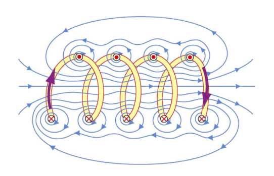
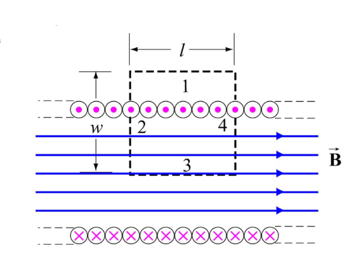
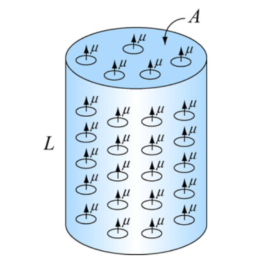
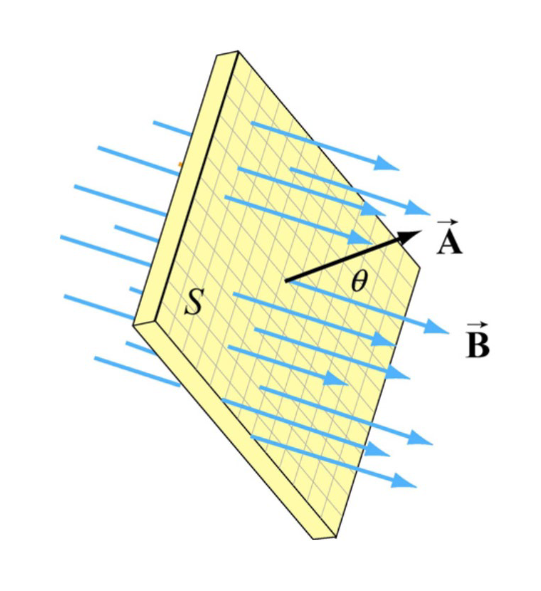
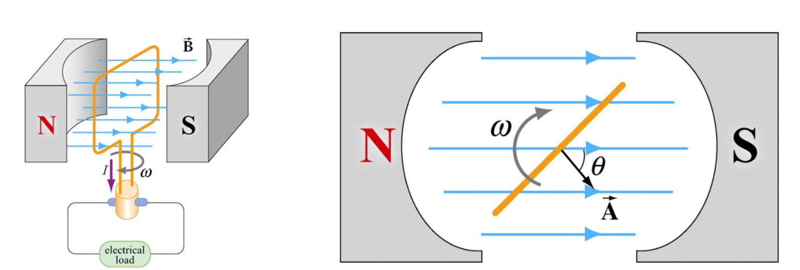

In this part we'll cover more in-depth about magnetic fields and their interactions.

Recall Biot-Savart's Law:
$$
\mathbf{\vec{B}} = \int d\mathbf{\vec{B}} = \dfrac{\mu_0 I}{4\pi}\ \int \dfrac{d\mathbf{\vec{s}} \times \mathbf{\vec{r}}}{r^2}
$$

This means that, the magnetic field strength, $B$, at any given is:
$$
B = \dfrac{\mu_0 I}{2\pi r}
$$

The direction, $\mathbf{\vec{B}}$, is given by the (lazy) right-hand rule.

### Magnetic field from a solenoid
First, let's draw how the field lines would look like:

If we zoom in, and look at the magnetic field on a square:

If we write this as an integral:
$$
\oint \mathbf{\vec{B}} \cdot\ d\mathbf{\vec{s}} = \int_1 \mathbf{\vec{B}} \cdot\ d\mathbf{\vec{s}} + \int_2 \mathbf{\vec{B}} \cdot\ d\mathbf{\vec{s}} + \int_3 \mathbf{\vec{B}} \cdot\ d\mathbf{\vec{s}} + \int_4 \mathbf{\vec{B}} \cdot\ d\mathbf{\vec{s}}
$$

But we can see that only, $3$, will contribute to our magnetic field, since it's parallel with it.

Which means:
$$
\oint \mathbf{\vec{B}} \cdot\ d\mathbf{\vec{s}} = Bl = \mu_0 I_{enc}
$$

One thing we'll need to remember is that, we can make our solenoid more densely coiled. This will, naturally, increase our magnetic field strength.

$$
I_{enc} = NI
$$

$$
\oint \mathbf{\vec{B}} \cdot\ d\mathbf{\vec{s}} = Bl = \mu_0 NI
$$

Which means:
$$
B = \dfrac{\mu_0 NI}{l} = \mu_0 nl
$$

Where, $n$, are the number of turns *per length unit*.

### Lorentz Force
If we have a charged particle, in presence of both an electrical field, $\mathbf{\vec{E}}$, and a magnetic field, $\mathbf{\vec{B}}$.

The total force on the charged particle, is naturally, the sum of the two forces:
$$
\mathbf{\vec{F}_E} = q\mathbf{\vec{E}}
$$

$$
\mathbf{\vec{F}_B} = q\mathbf{\vec{v}} \times \mathbf{\vec{B}}
$$

$$
\boxed{\mathbf{\vec{F}} = q(\mathbf{\vec{E}} + \mathbf{\vec{v}} \times \mathbf{\vec{B}})}
$$

### Magnetic materials
As we have seen earlier, introduction of materials in electrical fields - *always* reduced the electrical field strength, $E$.

However, we'll see that, introduction of materials in a magnetic may decrease *or* increase the magnetic field strength, $B$.

To understand this - let's begin with looking at this:

Here we have a cylinder with uniformly distributed magnetic dipoles.

The net dipole moment is:
$$
\mathbf{\vec{M}} = \dfrac{1}{LA}\sum \mathbf{\vec{u}_i}
$$

Therefore, the magnetic field strength is just:
$$
\mathbf{\vec{B}_M} = \mu_0 \mathbf{\vec{M}}
$$

However, these dipoles will probably not be uniformly distributed, rather quite chaotic and random. Thus, there is no net dipole moment

If we however, exert an external magnetic field, $\mathbf{\vec{B}_0}$, these dipoles will begin to align and *enhance* the field.a

$$
\mathbf{\vec{M}} = \chi_m \dfrac{\mathbf{\vec{B}_0}}{\mu_0}
$$

$$
\mathbf{\vec{B}} = (1 + \chi_m) \mathbf{\vec{B}_0} = \kappa_m \mathbf{\vec{B}_0}
$$

Where, $\kappa_m$, is the *relative permeability* of the material.

As we discussed earlier, materials that **greatly** *enhance* the magnetic field, is called **ferromagnetic materials**.

The very cool and interesting thing is that, ferromagnetic materials induce the dipoles so strongly that, the dipoles themselves begin to strongly influence neighboring dipoles!

I find that very fascinating.

### Faraday's Law
From what we have assumed and used - our fields have been produced by stationary and moving *charges*.

Now, let's do this opposite: varying a magnetic field with time to produce an electrical field.

To understand this we'll first have to define *magnetic* flux.

#### Magnetic flux
Just as electrical flux, we can define how much magnetic field passes through as surface.

We can define this as:
$$
\Phi_B = \int \int \mathbf{\vec{B}} \cdot\ d\mathbf{\vec{A}} = BA\ cos(\theta)
$$

The unit for magnetic flux is weber:
$$
1 Wb = 1T \cdot\ m^2
$$

Now, back to Faraday's law. The **induced** *electromagnetic field*, $\varepsilon$, in a coil is **proportional** to the negative rate of change of the magnetic flux.

Or, in symbols:
$$
\varepsilon = -N \dfrac{d \Phi_B}{dt}
$$

Where, $N$, is the number of loops in the coil.

This also means that:
$$
\varepsilon \propto - \dfrac{d}{dt} (BA\ cos(\theta))
$$

We can also write this as:
$$
-\left(\dfrac{dB}{dt}\right) A cos(\theta) - \left(\dfrac{dA}{dt}\right) B cos(\theta) + \left(\dfrac{d\theta}{dt}\right) BA\ sin(\theta)
$$

Here, we can clearly see that the induced electromagnetic field, depends on, the magnetic field, the area and the angle!

The direction of the induced current is determined by Lenz's law, which says the following:

:::theorem[Lenz's law]
The induced current produces a magnetic field, which oppose the change in magnetic flux that induces such currents.
:::

### Generators and motors
As the magnetic flux changes with time, an induced current begins to flow!

This, naturally, suggest that a potential different is at play:
$$
\varepsilon = \Delta V = \oint \mathbf{\vec{E}} \cdot\ d\mathbf{\vec{s}}
$$

$$
\oint \mathbf{\vec{E}} = - \dfrac{d \Phi_B}{dt}
$$

Now, by using Faraday's law - we can design *generators*, to convert mechanical energy into electrical energy and vice versa!

$$
\Phi_B = \int \int \mathbf{\vec{B}} \cdot d\mathbf{\vec{A}} = BA\ cos(\theta) = BA\ cos(\omega t)
$$

If we take the derivate:
$$
\dfrac{d \Phi_B}{dt} = -BA \omega sin(\omega t)
$$

Therefore:
$$
\varepsilon = -N \dfrac{d \Phi_B}{dt} = NBA \omega sin(\omega t)
$$

And also:
$$
I = \dfrac{ | \varepsilon |}{R} = \dfrac{NBA \omega}{R} sin(\omega t)
$$

Finally, we have defined, *alternating current*. We'll start to dive into this world into the future parts.

One last interesting formula that we're going to look at:
$$
P = I |\varepsilon| = \dfrac{(NBA \omega)^2}{R} sin^2 (\omega t)
$$

We can see that, it's just the absolute value of the alternating current!
