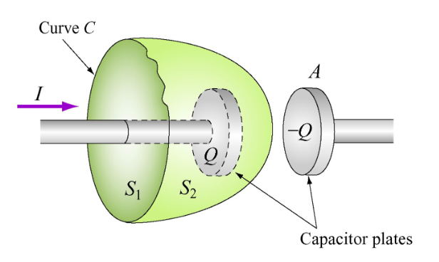
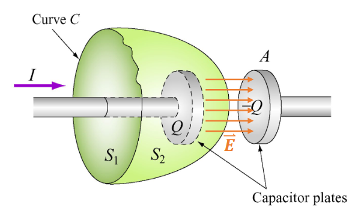
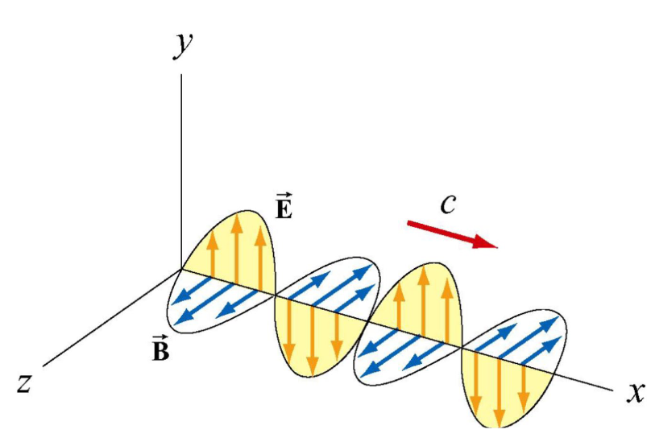
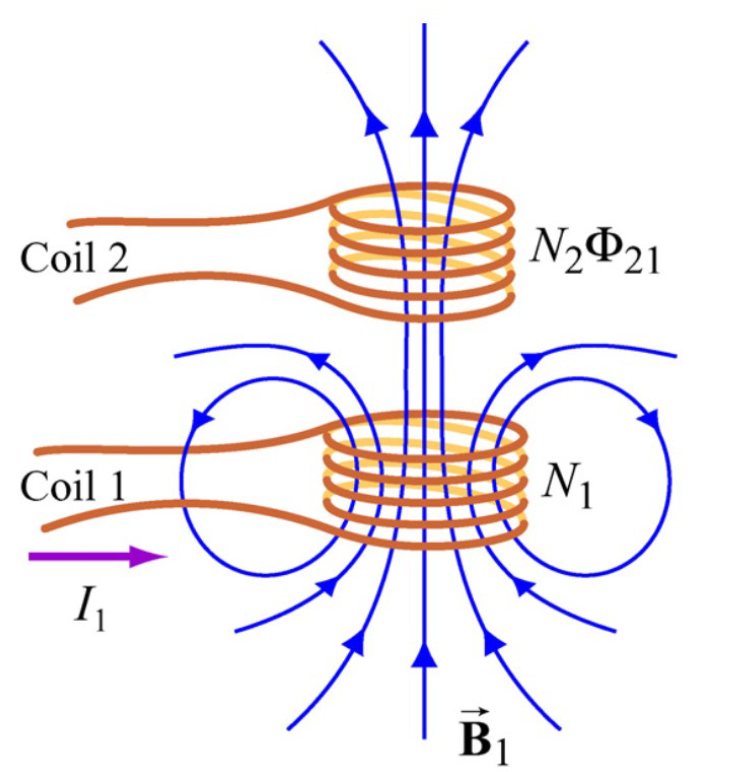
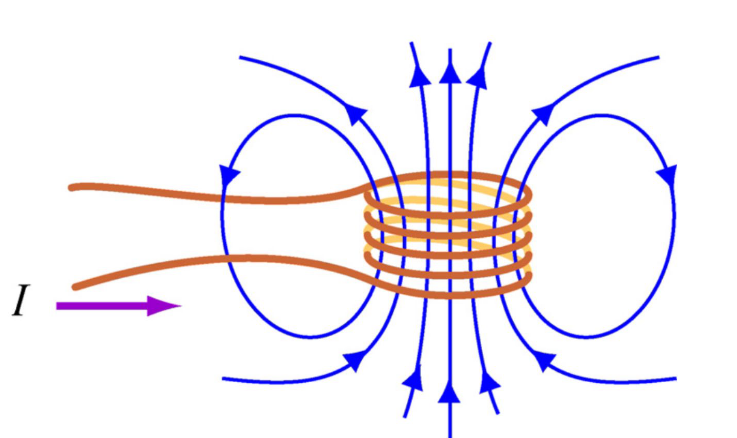
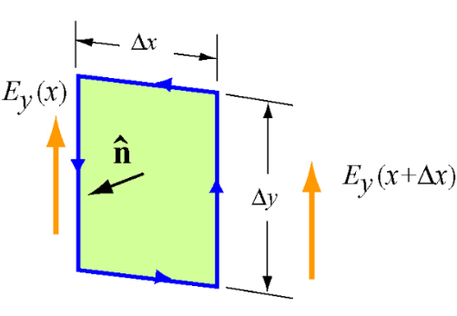

In this part we'll cover electromagnetic waves - we'll see why electrical and magnetic fields always appear together.

### Displacement current
If we recall Faraday's law:
$$
\oint \mathbf{\vec{E}} \cdot d\mathbf{\vec{s}} = -\dfrac{d \Phi_B}{dt}
$$

This says that a change in the magnetic field will produce an electrical field. But how about the converse?

Does a change in an electrical field produce a magnetic field?

If we consider this example with a capacitor being charged:

Using Ampere's law:
$$
\oint \mathbf{\vec{B}}  \cdot\ d\mathbf{\vec{s}} = \mu_0 I_{enc}
$$

If we look at $S_1$, we see that $I_{enc} = I$ - however, for $S_2$, $I_{enc} = 0$ - but the current does continue?

So we will need to add an extra term to Ampere's law:
$$
\oint \mathbf{\vec{B}}  \cdot\ d\mathbf{\vec{s}} = \mu_0(I + I_d)
$$

Where the **displacement** current, $I_d$:
$$
I_d = \varepsilon_0 \dfrac{d \Phi_E}{dt}
$$

In practice, $I = I_d$, thus the choice of the Amperian loop is inconsequential!

### Gauss's Law
For electrostatics, Gauss's law said that:
$$
\Phi_E = \oiint \mathbf{\vec{E}} \cdot\ d\mathbf{\vec{A}} = \dfrac{q}{\mu_0}
$$

But in the case for magnetism - magnetic *monopoles* do not exist (meaning that $q = 0$). Therefore:
$$
\Phi_B = \oiint \mathbf{\vec{B}} \cdot\ d\mathbf{\vec{A}} = 0
$$

### Maxwell's Equations
With these new tools in mind - we have now learned the four Maxwell equations that form the basis of electromagnetism!

Let's write them all down:

**Gauss's Law for electrostatics**:
$$
\Phi_E = \oiint \mathbf{\vec{E}} \cdot\ d\mathbf{\vec{A}} = \dfrac{q}{\mu_0}
$$

**Gauss's Law for magnetism**:
$$
\Phi_B = \oiint \mathbf{\vec{B}} \cdot\ d\mathbf{\vec{A}} = 0
$$

**Faraday's Law**:
$$
\varepsilon = \oint \mathbf{\vec{E}} \cdot d\mathbf{\vec{s}} = -\dfrac{d \Phi_B}{dt}
$$

**Ampere-Maxwell Law**:
$$
\varepsilon = \oint \mathbf{\vec{B}} \cdot d\mathbf{\vec{s}} = \mu_0(I + I_d) = \mu_0\left(I + \varepsilon_0 \dfrac{d \Phi_E}{dt}\right)
$$

If the absence of sources is present (meaning that q = 0 and I = 0) - all of these become quite compact and tidy:

**Gauss's Law for electrostatics**:
$$
\Phi_E = \oiint \mathbf{\vec{E}} \cdot\ d\mathbf{\vec{A}} = 0
$$

**Gauss's Law for magnetism**:
$$
\Phi_B = \oiint \mathbf{\vec{B}} \cdot\ d\mathbf{\vec{A}} = 0
$$

**Faraday's Law**:
$$
\varepsilon = \oint \mathbf{\vec{E}} \cdot d\mathbf{\vec{s}} = -\dfrac{d \Phi_B}{dt}
$$

**Ampere-Maxwell Law**:
$$
\varepsilon = \oint \mathbf{\vec{B}} \cdot d\mathbf{\vec{s}} = \mu_0(I + I_d) = \mu_0 \varepsilon_0 \dfrac{d \Phi_E}{dt}
$$

Now we can see, from Faraday's law and Ampere-Maxwell's Law that, if we have a change in one field - we'll see a change in the other!

We'll see why this picture will make a lot of sense soon:

### Inductance
We have seen some aspect of inductances already - the induced current.

Imagine this scenario:

We can see that our $\mathbf{\vec{B_1}}$ passes through the second coil, therefore a flux is generated, $\Phi_{21}$

As we learned last time, varying $I_1$ will induce an emf!

Which means:
$$
\varepsilon_{21} = -N_{2} \dfrac{d \Phi_{21}}{dt}
$$

If we want to write this in terms of $I_1$ we get:
$$
\varepsilon_{21} = M_{21} \dfrac{d I_1}{dt}
$$

Where $M_{21}$:
$$
M_{21} = \dfrac{N_2 \Phi_{21}}{I_1}
$$

But let's say that we vary $I_2$, this will also lead to an EMF, but in the first coil:
$$
\varepsilon_{12} = -N_{1} \dfrac{d \Phi_{12}}{dt} = M_{12} \dfrac{d I_2}{dt}
$$

Then, if we use the theorem of reciprocity - which states that:

:::theorem[Reciprocity]
The current at one point in a circuit due to a voltage at a second point is the same as the current at the second point due to the same voltage at the first.
:::

Using this and combining Ampere's law and the Biot-Savart law - we get:
$$
M_{12} = M_{21} = M
$$

This means - sending varying current (AC) through coil 1 - will generate an AC current in coil 2 as well!

We can also connect this to voltage, potential drop:
$$
\dfrac{V_2}{V_1} = \dfrac{N_2}{N_1}
$$

### Self-Inductance
Say we only have one coil

If we vary, $I$, an induced EMF will oppose the change in flux, according to Faraday's law.

We denote this self-inducted EMF with, $\varepsilon_L$.

We can write it as:
$$
\varepsilon_L = -N \dfrac{d \Phi_B}{dt}
$$

We can relate this self-inductance with self-inductance, $L$:
$$
\varepsilon_L = -L \dfrac{dI}{dt}
$$

We can also write:
$$
L = \dfrac{N \Phi_B}{I} = \dfrac{\mu_0 N^2 A}{l}
$$

Therefore, the inductance, is a measure of an inductor's resistance to change of the current!

In even simpler terms - inductors oppose change in the current!

So, since inductors oppose changes to the current - work must be done to establish a current in the inductor.
Thus, energy must be stored in the magnetic field in an inductor! Similar to electrical fields in a capacitor.

The power, or the rate at an external EMF, $\varepsilon_{ext}$, *works* to overcome the self-induced EMF, $\varepsilon_L$, to pass the current $I$:
$$
P_L = \dfrac{d W_{ext}}{dt} = I \varepsilon_{ext} = -I \varepsilon_L = IL \dfrac{dI}{dt}
$$

This assumes that only $\varepsilon_{ext}$ and the inductor is present.

The total work done by an external source to increase the current from 0 to $I$ is:
$$
W_{ext} = \int dW_{ext} = \int_0^I IL\ dI = \boxed{\dfrac{1}{2}LI^2}
$$

### Electromagnetic waves
We'll now cover a very cool phenomena - we'll cover why electromagnetic waves travel at light speed!

To prove this we'll need to rewrite our definition for $\mathbf{\vec{E}}$ and $\mathbf{\vec{B}}$:
$$
\mathbf{\vec{E}} = E_y(x, t)\mathbf{\vec{J}} = E\ cos(kx - \omega t)\mathbf{\vec{J}}
$$

$$
\mathbf{\vec{B}} = B_z(x, t)\mathbf{\vec{K}} = B\ cos(kx - \omega t)\mathbf{\vec{K}}
$$

Using Faraday's law:
$$
\oint \mathbf{\vec{E}} \cdot\ d\mathbf{\vec{s}} = - \dfrac{d}{dt} \iint \mathbf{\vec{B}} \cdot\ d\mathbf{\vec{A}}
$$

If we take our ring integral inside a arbitrary rectangle - on the xy-plane:

$$
E_y(x + \Delta x) - E_y(x) = - \dfrac{d}{dt} \iint \mathbf{\vec{B}} \cdot dxdy
$$

We get that:
$$
\dfrac{\partial E_y}{\partial x} = - \dfrac{\partial B_z}{\partial t}
$$

Let's calculate both:
$$
\dfrac{\partial E_y}{\partial x} = -kE\ sin(kx - \omega t)
$$

$$
\dfrac{\partial B_z}{\partial t} = \omega B\ sin(kx - \omega t)
$$

Which, finally, means:
$$
\boxed{\dfrac{E}{B} = \dfrac{\omega}{k} = c}
$$

### EMFs in circuits
Now that we have learned this beauty of electromagnetic waves - let's tie it back to our electrical circuits.

As we learned with electrical fields and capacitor:

:::recall
Electrical field opposes change in voltage
:::
$$
C = \varepsilon_0 \dfrac{A}{d} \newline
U = \dfrac{1}{2} C|V^2| \newline
I(t) = C \dfrac{dV}{dt}
$$

We have now seen that, magnetic fields and inductors:

:::recall
Magnetic field opposes change in the current
:::
$$
L = \mu_0 N^2 \dfrac{A}{l} \newline
U = \dfrac{1}{2} LI^2 \newline
V(t) = L \dfrac{dI}{dt}
$$

We can now use this knowledge to understand LC and RLC circuits - and see how and why the energy oscillates between the electrical and magnetic field!
