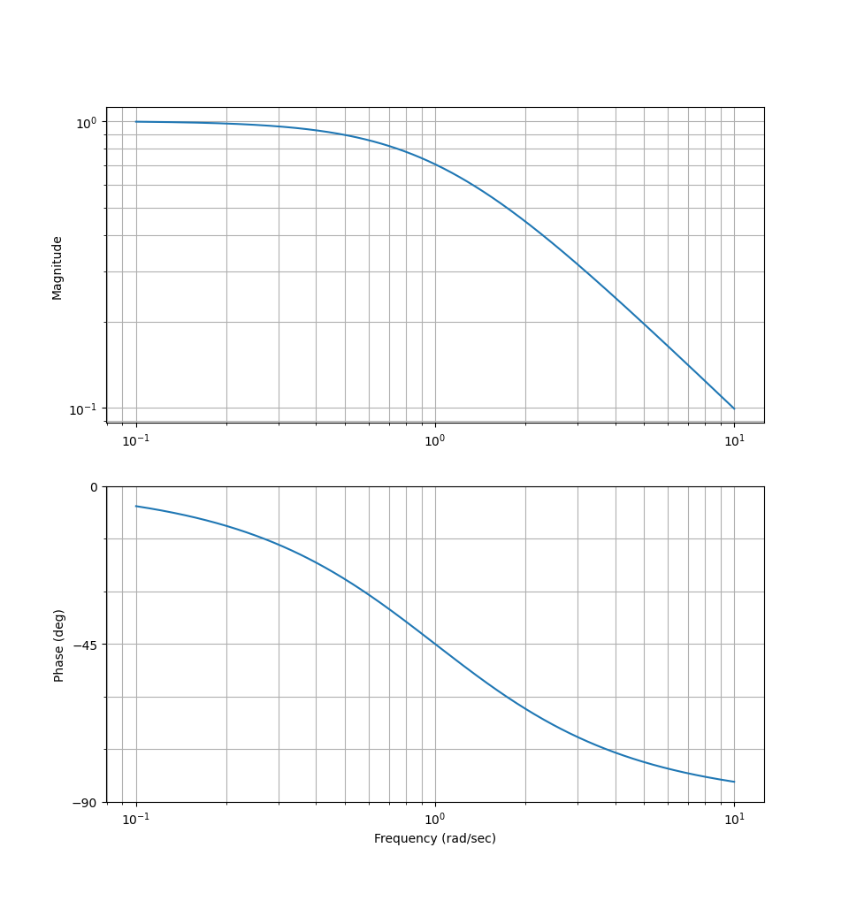
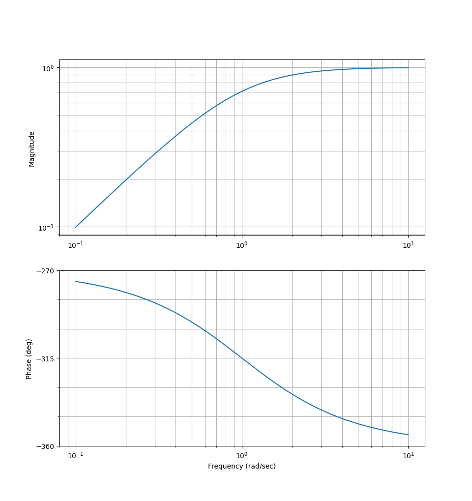

### Introduction
In this part we'll understand the concept of filters.

### Filters
We usually use filters for two different purposes:

* Frequency elimination
* Frequency detection

:::example
Say we have the following system:
$$
G(s) = \dfrac{a}{s + a}
$$

What type of filter is this? Let's find out. Plotting the bode plot will help us.

Note: This is for $a = 1$

We can see that this is a low-pass filter! We will call the part that lets through the frequency for passband.
The range that gets eliminated/attenuated is the stopband.

For a high-pass filter, the general form is:
$$
G(s) = \dfrac{s}{s + b} = \dfrac{\frac{s}{b}}{1 + \frac{s}{b}}
$$

Note: This is for $b = 1$
:::

### Filter types
So far we've seen low-pass and high-pass filters. Let's list all the filters that we'll work with:

* Low-pass (LP - low pass, high gets filtered out)
* High-pass (HP - high pass, low gets filtered out)
* Band-stop filter (BS - frequencies within a specific range gets attenuated, rest are unfiltered)
* Band-pass filter (BP - frequencies within a specific range pass, rest are attenuated)
* Notch filter (Filters exactly one frequency)

### Butterworth filters
When we need to perform filter realization, we usually will restort to Butterworth:

$$
\text{Order 1: } G(s) = \dfrac{\omega_1}{s + \omega_1} \newline
\text{Order 2: } G(s) = \dfrac{\omega_1^2}{s^2 + 2 \zeta \omega_1 s + \omega_1^2} \ | \ \zeta = \frac{1}{\sqrt{2}}
$$

### Filter transformation
Say we have this filter:
$$
G(s) = \dfrac{1}{s + 1}
$$

This is a low-pass filter. Say we want another type of filter from this - what should we do?

1. Switch of break-frequency point to $\omega_c$ (cut-off)

Say we want to go from LP $\to$ HP, then we need to set:
$$
s \to \frac{s}{\omega_c}
$$

$$
G(s) = \dfrac{1}{\frac{s}{\omega_c} + 1} = \dfrac{\omega_c}{s + \omega_c}
$$

In the case we had a second order filter:
$$
G(s) = \dfrac{1}{\frac{s^2}{\omega_c^2} + \sqrt{2} \frac{s}{\omega_c} + 1} = \dfrac{\omega_c^2}{s^2 + \sqrt{2}\omega_c s + \omega_c^2}
$$
