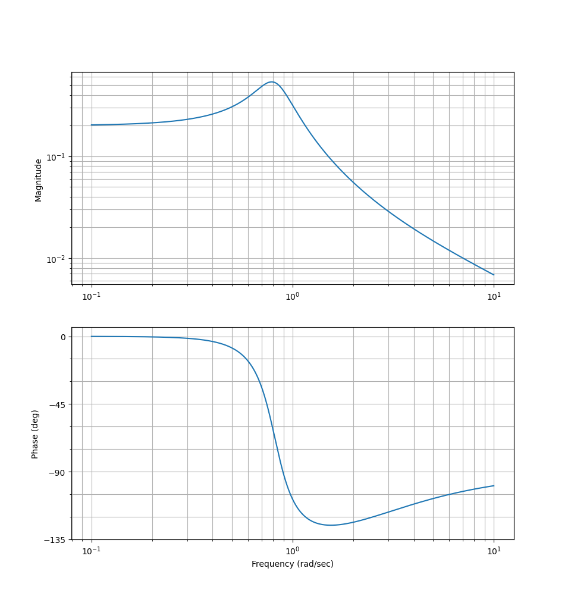
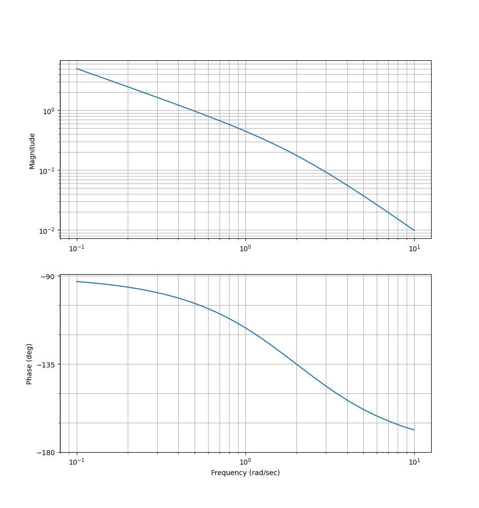
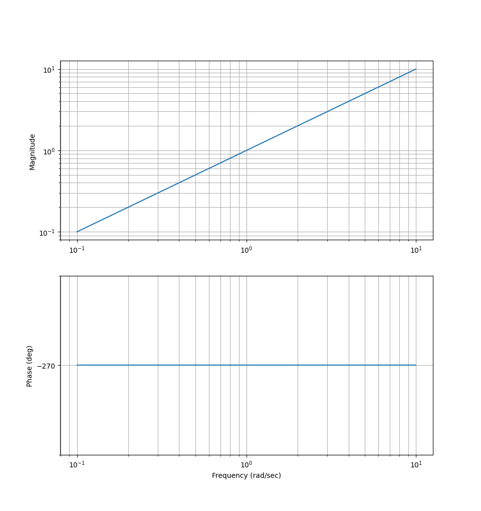
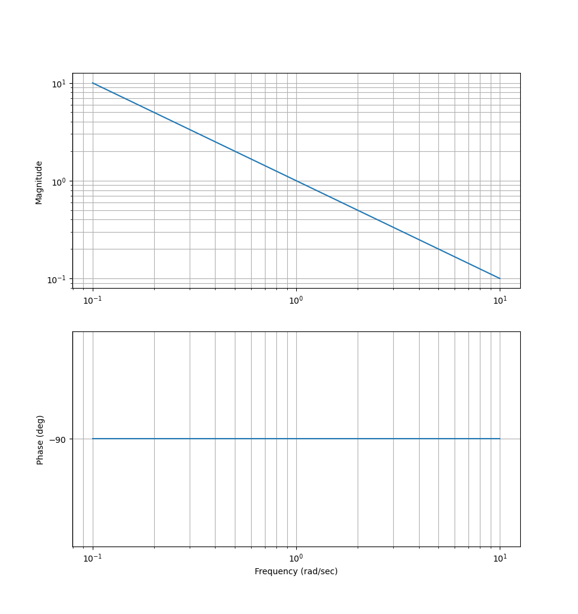
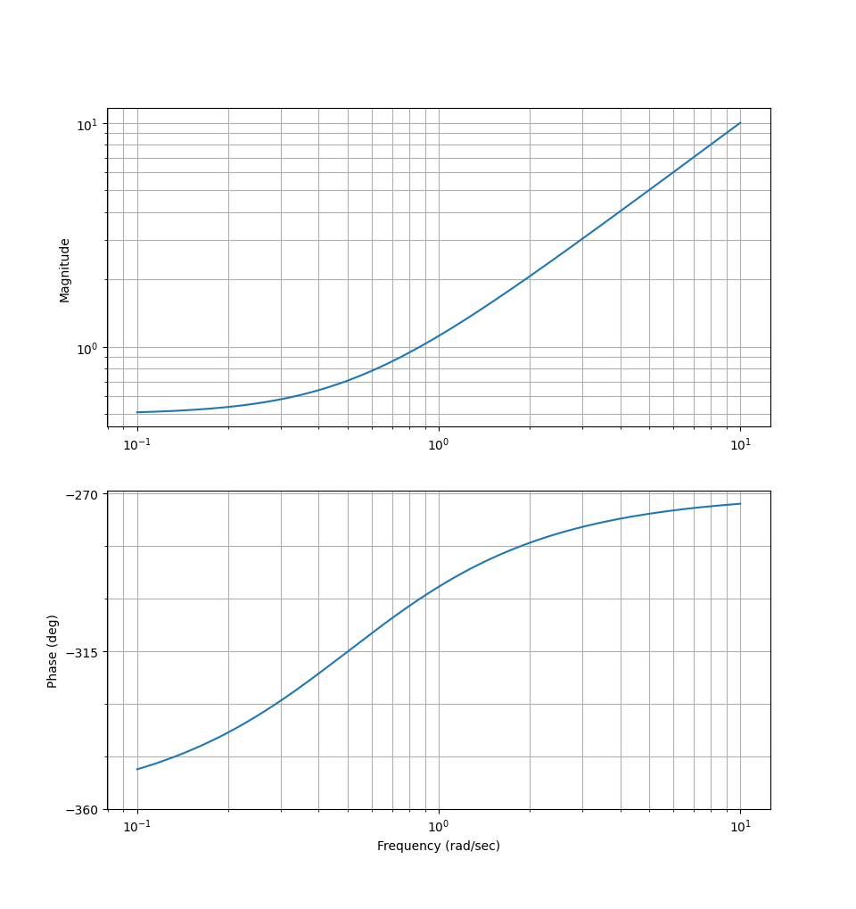
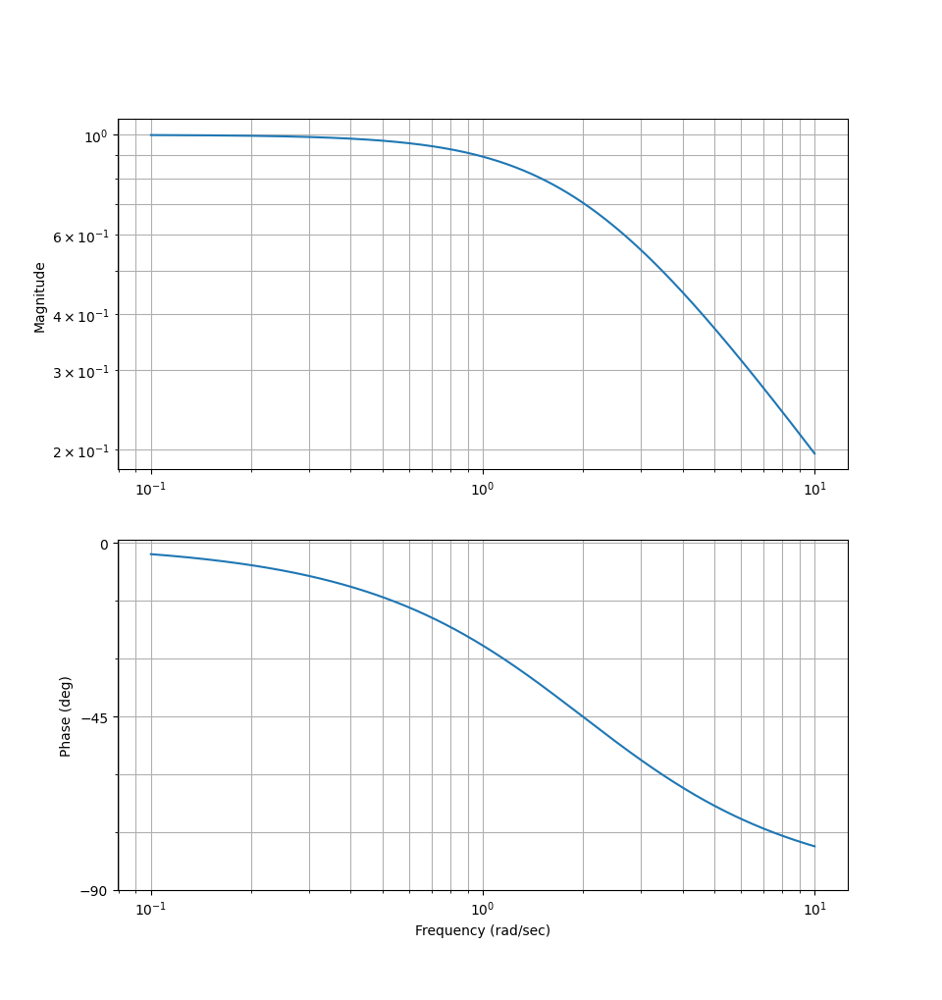

### Introduction
In this part we'll begin with the part about frequency analysis.

### Test functions
Often when we want to test our system to determine the overall stability, time it takes and the response we get.

We often test with our unit step function:
$$
\sigma(t) =
\begin{cases}
1 & t \leq 0 \newline
0 & t < 0
\end{cases}
$$

We call a system response to the unit step function for *unit step response*.

Given a system of form:
$$
G(s) = \dfrac{K}{1 + Ts}
$$

We get a unit step response of $y(t) = K(1 - e^{-\dfrac{t}{\tau}})$.

We also have our beloved impulse function, $\delta(t)$.

$$
\delta(t) = \lim_{\epsilon \to 0}
\begin{cases}
\dfrac{1}{\epsilon} & 0 \leq t \leq \epsilon \newline
0 & t > \epsilon, t < 0
\end{cases}
$$

We also have the properties:
$$
\int_{-\infty}^{\infty} \delta(t)\ dt = 1
$$

$$
\int_{-\infty}^{\infty} \delta(t - T) f(t)\ dt = f(T)
$$

$$
\mathcal{L}\{\delta(t)\} = \int_0^{\infty} \delta(t) e^{-st} \ dt = e^{0t} = 1
$$

### Delay rate
We can "delay" a function using a unit step with a delay:
$$
\mathcal{L}\{y(t -T)\sigma(t - T)\} = e^{-Ts} \cdot \mathcal{L}\{y(t)\} = e^{-Ts}\ Y(s)
$$

:::definition[Stable system]
A system is stable if:
$$
\lim_{t \to \infty} \{\text{Impulse response}\} = 0
$$
:::

### Ramp function
Another function that we'll perform a lot of tests with is the ramp function. Which we define as:
$$
t\ \sigma(t)
$$

The Laplace transform of this is (using partial integration):
$$
\mathcal{L} \{t\ \sigma(t) \} = \dfrac{1}{s^2}
$$

:::example
Determine the long term error, when the insignal is a ramp function, $t\ \sigma(t)$.

Given that:
$$
F(s) = \dfrac{s + 2}{s}
$$

$$
G(s) = \dfrac{1}{s + 1}
$$

We know that:
$$
E(s) = R(s) - Y(s)
$$

$$
Y(s) = \dfrac{L(s)}{1 + L(s)} \cdot R(s)
$$

$$
L(s) = F(s)G(s) = \dfrac{s + 2}{s(s + 1)}
$$

So:
$$
\begin{align*}
E(s) & = R(s) - \dfrac{L(s)}{1 + L(s)} \cdot R(s) \newline
& = R(s) \left(1 - \dfrac{L(s)}{1 + L(s)} \right) \newline
& = R(s) \left(\dfrac{1}{1 + L(s)} \right) \newline
& = \dfrac{1}{s^2} \left(\frac{1}{1 + \frac{s + 2}{s(s + 1)}} \right) \newline
& = \dfrac{1}{s^2} \left(\frac{s(s + 1)}{s(s + 1) + s + 2} \right) \newline
& = \dfrac{1}{s^2} \left(\frac{s(s + 1)}{s^2 + 2s + 2} \right) \newline
& = \frac{(s + 1)}{s(s^2 + 2s + 2)} \newline
\end{align*}
$$

Using the final value theorem:
$$
\lim_{t \to \infty} e(t) = \lim_{s \to 0} s \cdot E(s) \newline
e(\infty) = \lim_{s \to 0} s \cdot \frac{(s + 1)}{s(s^2 + 2s + 2)} \newline
e(\infty) = \lim_{s \to 0} \frac{(s + 1)}{(s^2 + 2s + 2)} \newline
e(\infty) = \boxed{\dfrac{1}{2}}
$$
:::

### Frequency analysis

:::definition[Frequency function]
The frequency function, $G(j\omega)$ for a system is given by:
$$
G(j\omega) = G(s) \biggr\rvert_{s = j \omega}
$$

The polar form of this function will be written as:
$$
G(j\omega) = |G(j\omega)| \cdot e^{arg(G(j\omega))}
$$
:::

:::example
Let $u(t) = A sin(\omega t + \phi)$ with the system, $G(s)$ what will our $y(t)$ be?

$$
y(t) = |G(j\omega)| \cdot A sin(\omega t + \phi + arg(G(j\omega)) (+ e^{-\lambda t})
$$

That last part is called the transient part and should in reality just be zero.
:::

### Bode plot
Bode plots are plots that show the system magnitude and phase shift in a system.

Usually the magnitude can/will be in decibels.

:::example

Where the $y$-axis is either the phase ($arg(G(j\omega))$) or the magnitude ($|G(j \omega)|$).
:::

Remember that decibels are just:
$$
dB = 20 log(|G(j\omega)|)
$$

:::example
Given:
$$
G(s) = \dfrac{1}{s(s + 2)}
$$

This means that:
$$
G(j\omega) = \dfrac{1}{j\omega(j\omega + 2)}
$$

The magnitude is:
$$
|G(j\omega)| = \dfrac{1}{\omega \sqrt{\omega^2 + 2^2}} = \dfrac{1}{\omega \sqrt{4 + \omega^2}}
$$

The phase is:
$$
\begin{align*}
arg(G(j\omega)) & = arg\left( \dfrac{1}{j\omega(j\omega + 2)} \right) \newline
& = \dfrac{arg(1)}{arg(j\omega(j\omega + 2))} \newline
& = arg(1) - arg(j\omega(j\omega + 2)) \newline
& = arg(1) - (arg(j\omega) + arg(j\omega + 2)) \newline
& = 0^\circ - \left(90^\circ + \arctan{\left(\dfrac{\omega}{2}\right)}\right) \newline
& = -90^\circ - \arctan{\left(\dfrac{\omega}{2}\right)}
\end{align*}
$$

If we now plot these:

:::

### Type of factors
In our systems we'll deal/want these type of factors:
$$
s, 1 + \dfrac{s}{\omega_1}, e^{-Ts}, s^2 + 2 \zeta \omega_n s + \omega_n^2
$$

Also, good to remember, if $\zeta > 1$, then we can split up this second-order term into first-order term(s).

Let's do the bode plot for each term.

$$
G(s) = s
$$

$$
G(j\omega) = j\omega
$$

$$
|G(j\omega)| = \omega
$$

$$
arg(G(j\omega)) = 90^\circ
$$

Plotting this:

Simple!

Now, for $\dfrac{1}{s}$
$$
G(s) = \dfrac{1}{s}
$$

$$
G(j\omega) = \dfrac{1}{j\omega}
$$

$$
|G(j\omega)| = \dfrac{1}{\omega}
$$

$$
arg(G(j\omega)) = -90^\circ
$$

Plotting this:

Now for $1 + \dfrac{s}{\omega_1}$
$$
G(s) = 1 + \dfrac{s}{\omega_1}
$$

$$
G(j\omega) = 1 + \dfrac{j\omega}{\omega_1}
$$

For this we'll need to understand some cases.

Case $\omega \ll \omega_1$:
$$
G(j\omega) \approx 1
$$

$$
|G(j\omega)| = 1
$$

$$
arg(G(j\omega)) = 0^\circ
$$

Case $\omega = \omega_1$:
$$
G(j\omega) =  1 + j
$$

$$
|G(j\omega)| = \sqrt{1^2 + 1^2} = \sqrt{2}
$$

$$
arg(G(j\omega)) = 45^\circ
$$

Case $\omega \gg \omega_1$:
$$
G(j\omega) \approx j \dfrac{\omega}{\omega_1}
$$

$$
|G(j\omega)| = \dfrac{\omega}{\omega_1}
$$

$$
arg(G(j\omega)) = 90^\circ
$$

Plotting for $\omega_1 = 2$:

This is what we'll call for low and high frequency asymptotes.

Last factor before an example
$$
G(s) = \dfrac{1}{1 + \dfrac{s}{\omega_1}}
$$

$$
G(j\omega) = \dfrac{1}{1 + \dfrac{j\omega}{\omega_1}}
$$

Case $\omega \ll \omega_1$:
$$
G(j\omega) \approx 1
$$

$$
|G(j\omega)| = 1
$$

$$
arg(G(j\omega)) = 0^\circ
$$

Case $\omega = \omega_1$:
$$
G(j\omega) =  \dfrac{1}{1 + j}
$$

$$
|G(j\omega)| = \dfrac{1}{\sqrt{1^2 + 1^2}} = \dfrac{1}{\sqrt{2}}
$$

$$
arg(G(j\omega)) = -45^\circ
$$

Case $\omega \gg \omega_1$:
$$
G(j\omega) \approx \dfrac{1}{j \dfrac{\omega}{\omega_1}}
$$

$$
|G(j\omega)| = \dfrac{1}{\dfrac{\omega}{\omega_1}} = \dfrac{\omega_1}{\omega}
$$

$$
arg(G(j\omega)) = -90^\circ
$$

### Standard form
We'll usually want to rewrite our transfer functions into these standard factor forms.

Let's take an example to see why

:::example
$$
\begin{align*}
G(s) & = \dfrac{3(1 + s)e^{-0.5s}}{s(s + 2)(s + 3)} \newline
& = \dfrac{3(1 + s)e^{-0.5s}}{2s(1 + \frac{s}{2})(s + 3)} \newline
& = \dfrac{3(1 + s)e^{-0.5s}}{6s(1 + \frac{s}{2})(1 + \frac{s}{3})} \newline
& = \boxed{\dfrac{0.5(1 + s)e^{-0.5s}}{s(1 + \frac{s}{2})(1 + \frac{s}{3})}}
\end{align*}
$$

This is now in standard form.
$$
G(j\omega) = \boxed{\dfrac{0.5(1 + j\omega)e^{-0.5j\omega}}{j\omega(1 + \frac{j\omega}{2})(1 + \frac{j\omega}{3})}}
$$
:::
