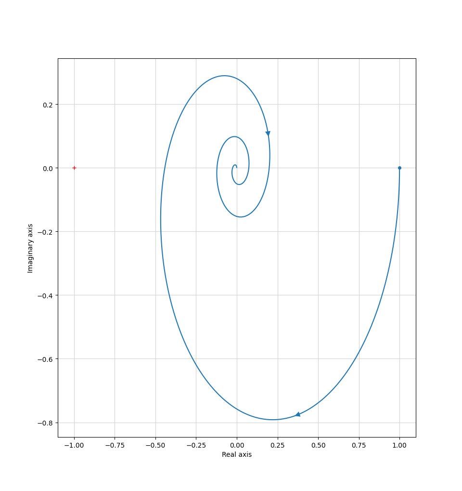
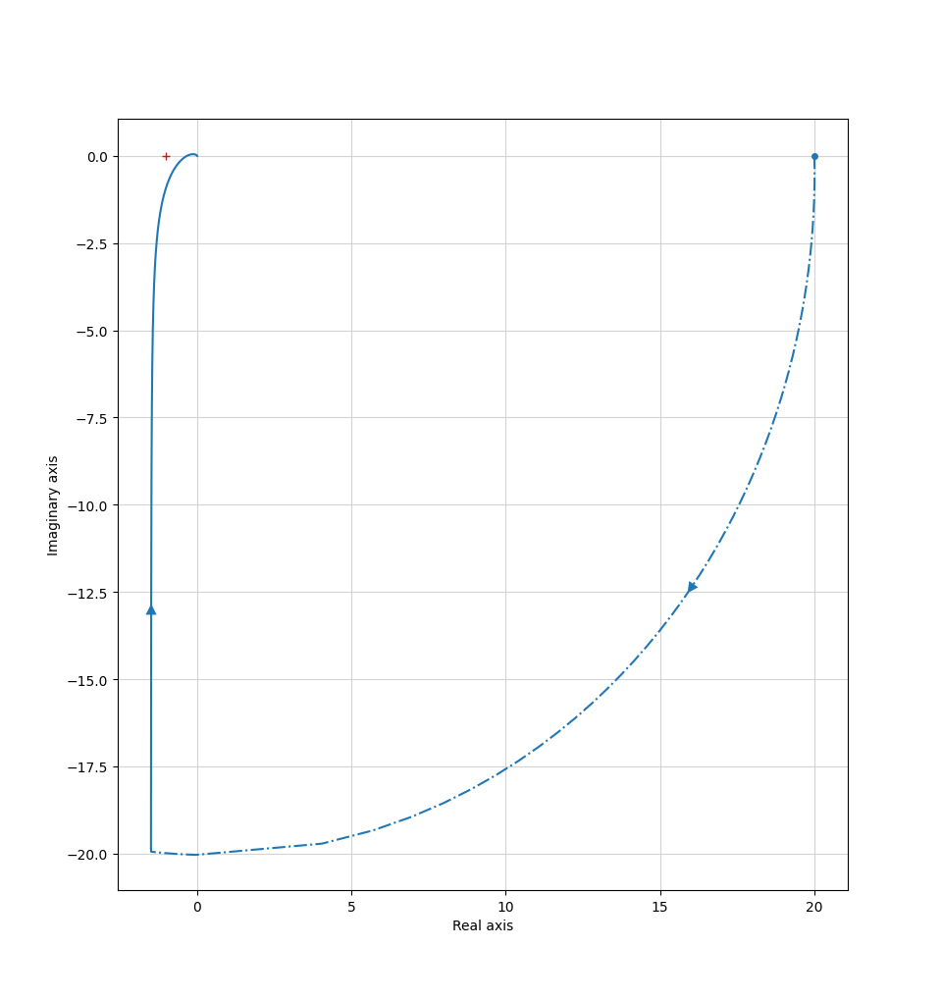
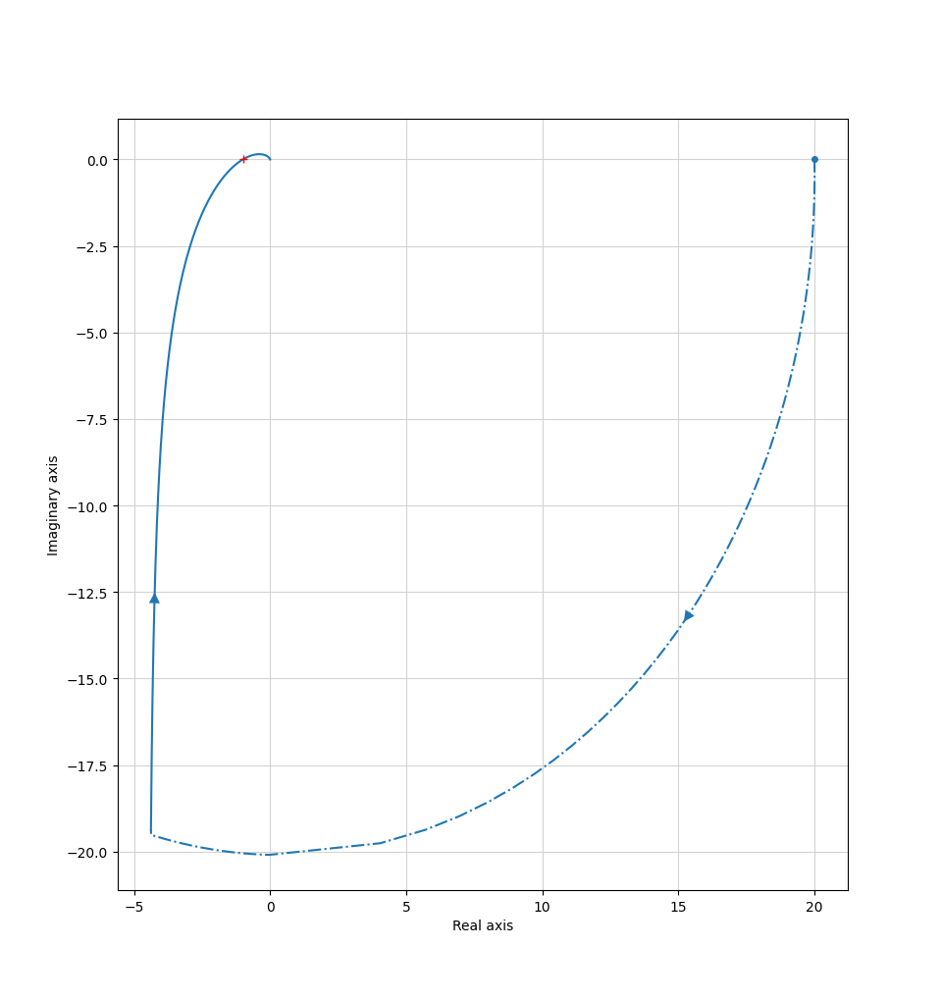
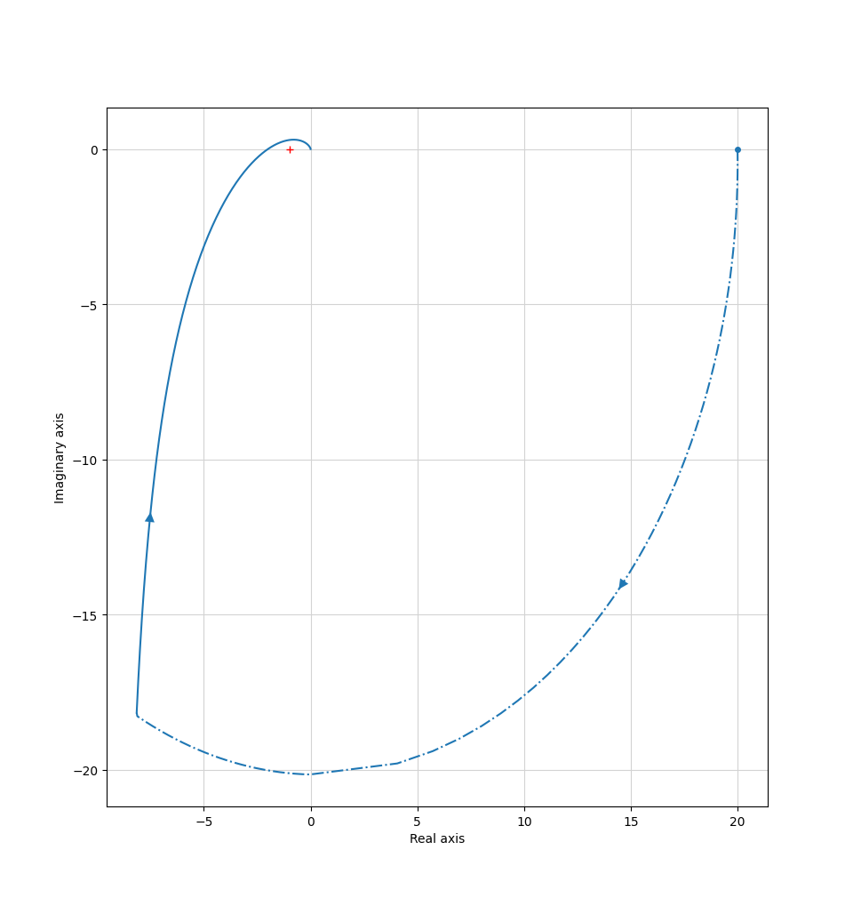

### Introduction
In this part we'll properly define what stability is for different kind of systems.

:::definition[Stability]
$G(s)$ is a stable system when:

$$
\lim_{t \to \infty} g(t) = 0
$$

Where $g(t)$ is the system impulse response, meaning $u(t) = \delta(t)$, which yields:

$$
g(t) = \mathcal{L}^{-1}\{G(s) = \dfrac{Y(s)}{U(s)} = Y(s) \}
$$
:::

:::example
$G(s) = \dfrac{1}{s^2 + 4s - 5}$

We can rewrite it as:
$$
G(s) = \dfrac{1}{s^2 + 4s - 5} = \dfrac{1}{(s - 1)(s + 5)}
$$

Using partial fraction decomposition:
$$
G(s) = \dfrac{A}{(s - 1)} + \dfrac{B}{(s + 5)}
$$

Taking the inverse Laplace transform yields:
$$
g(t) = A \cdot e^{t} + B \cdot e^{-5t}
$$

If we take:
$$
\lim_{t \to \infty} g(t) = \infty
$$

Since the first term explodes off to infinity.
:::

This means that our condition in stability, can be defined as. The poles need to lie within the left-hand plane, meaning they have a real part that is negative.

But this is for simple systems, how does stability look like in a feedback system?

### Stability for feedback systems
When dealing with feedback systems we need to look at the loop transfer function, $L(s) = F(s) G(s)$.

Remember that, the transfer function from $r(t)$ to $y(t)$ is:
$$
G_{ry}(s) = \dfrac{L(s)}{1 + L(s)}
$$

We will call $1 + L(s)$ for the characteristic equation. From the last part we can say that $1 + L(s) = 0$

:::example
Given the system:

$$
G(s) = \dfrac{1}{s^2 + s - 2}
$$

We use a P-controller:
$$
F(s) = K_p
$$

This means $L(s) = \dfrac{K_p}{s^2 + s - 2}$

$$
1 + L(s) = 0 \newline
1 + \dfrac{K_p}{s^2 + s -2} = 0 \newline
s^2 + s - 2 + K_p = 0 \newline
$$

This means:
$$
s_{1, 2} = -\dfrac{1}{2} \pm \sqrt{\dfrac{9}{4} - K_p}
$$

For our roots to not be positive, the square root term can at max be $\dfrac{1}{2}$. Meaning that:
$$
\dfrac{9}{4} - K_p < \dfrac{1}{4}
$$

Which means:
$$
\boxed{K_p > 2}
$$
:::

### Bode plots for feedback systems
Given:

$$
G_{ry}(s) = \dfrac{L(s)}{1 + L(s)}
$$

What happens if $L(s) = -1$?

This means that $|L(j\omega)| = 1$ and $arg(L(j\omega)) = -180^\circ$

Let's call those specific frequencies for $\omega_c$ and $\omega_\pi$. We'll call them the crossover and phase crossover frequency respectievly.

Meaning that:
$$
|L(j\omega_c)| = 1 \newline
arg(L(j\omega_\pi)) = -180^\circ
$$

If $L(j\omega) = -1$, it is equivalent to $\omega_c = \omega_\pi$. If this happens, the system is unstable.

Therefore, we will introduce two new variables that will tell us how near instability we are.

:::definition[Phase and amplitude margin]
Phase margin:
$$
\phi_m = arg(L(j\omega_c)) - -180^\circ = arg(L(j\omega_C)) + 180^\circ \ | \ \text{ given that } |L(j\omega_c)| = 1
$$

Amplitude margin:

$$
A_m = \dfrac{1}{|L(j\omega_\pi)|} \ | \ \text{ given that } arg(L(j\omega_\pi)) = -180^\circ
$$
:::

:::example
Given
$$
L(s) = \dfrac{K}{s(s + 1)^2} \ K > 0
$$

Given that $A_m = 2$, find $K$.

$$
2 = \dfrac{1}{|L(j\omega_\pi)|}
$$

This means that $|L(j\omega_\pi)| = \dfrac{1}{2}$

$$
L(j\omega) = \dfrac{K}{j\omega(j\omega + 1)^2}
$$

$$
arg(L(j\omega)) = 0 - 90^\circ - 2 \cdot arctan(\omega)
$$

Let's find $\omega_\pi$

$$
-90^\circ - 2 \cdot arctan(\omega_\pi) = -180^\circ \newline
-2 \cdot arctan(\omega_\pi) = -90^\circ \newline
arctan(\omega_\pi) = 45^\circ \newline
\omega_\pi = 1
$$

Therefore:
$$
|L(j\omega_\pi)| = \left| \dfrac{K}{j(1 + j)^2} \right| = \dfrac{1}{2}
$$

$$
\dfrac{K}{1 \cdot \left(\sqrt{1^2 + 1^2}\right)^2} = \dfrac{1}{2}
$$

$$
\dfrac{K}{2} = \dfrac{1}{2}
$$

$$
\boxed{K = 1}
$$
:::

### Routh–Hurwitz stability criterion
If we happen to get a polynomial of higher degrees than 2, then we need to find the poles still to determine stability. Solving a 3rd degree polynomial is not the most trivial task.

If we ever happen to get a polynomial of degree 4 than it is even worse. But if we reflect, we only want to know the sign of the poles, the actual values are useless if we want to just determine stability of a system.

Using this method we can easily find if a system is stable or not.

$1 + L(s)$ is a polynomial of degree higher than 2.
$$
1 + L(s) = a_0 s^n + a_1 s^{n - 1} + a_2 s^{n - 2} + \ldots + a_n
$$

To find the poles we set:
$$
a_0 s^n + a_1 s^{n - 1} + a_2 s^{n - 2} + \ldots + a_n = 0
$$

We write the following table:
:::table[General Routh array.]{#general-routh-array}
| | | | | |
| :---: | :---: | :---: | :---: | :---: |
| $s^n$ | $a_0$ | $a_2$ | $a_4$ | $a_6$ |
|$s^{n - 1}$ | $a_1$ | $a_3$ | $a_5$ | $a_7$ |
|$s^{n - 2}$ | $c_0$ | $c_1$ | $c_2$ | $c_3$ |
|$s^{n - 3}$ | $d_0$ | $d_1$ | $d_2$ | $d_3$ |
:::

And so on

We'll define these new characters as:
$$
c_0 = \dfrac{a_1 a_2 - a_0 a_3}{a_1} \newline
c_1 = \dfrac{a_1 a_4 - a_0 a_5}{a_1} \newline
c_2 = \dfrac{a_1 a_6 - a_0 a_7}{a_1} \newline
$$

$$
d_0 = \dfrac{c_0 a_3 - a_1 c_1}{c_0} \newline
d_1 = \dfrac{c_0 a_5 - a_1 c_2}{c_0} \newline
d_2 = \dfrac{c_0 a_7 - a_1 c_3}{c_0} \newline
$$

If the first column only contains positive numbers, then the system is stable!

:::example
For what $K$ values is the system stable?
$$
L(s) = \dfrac{K}{s} \cdot \dfrac{3}{(s + 1)^2} = \dfrac{3K}{s(s^2 + 2s + 1)} = \dfrac{3K}{s^3 + 2s^2 + s}
$$

$$
1 + L(s) = 0\newline
1 + \dfrac{3K}{s^3 + 2s^2 + s} = 0 \newline
s^3 + 2s^2 + s + 3K = 0 \newline
$$

:::table[Routh array for the closed-loop characteristic polynomial.]{#closed-loop-routh-array}
| | | | | |
| :---: | :---: | :---: | :---: | :---: |
| $s^3$ | $1$ | $1$ | $0$ | $0$ |
|$s^2$ | $2$ | $3k$ | $0$ | $0$ |
|$s^1$ | $c_0$ | $c_1$ | $c_2$ | $c_3$ |
|$s^0$ | $d_0$ | $d_1$ | $d_2$ | $d_3$ |
:::

$$
c_0 = \dfrac{a_1 a_2 - a_0 a_3}{a_1} = \dfrac{2 - 3K}{2} \newline
c_1 = \dfrac{a_1 a_4 - a_0 a_5}{a_1} = 0\newline
$$

$$
d_0 = \dfrac{c_0 a_3 - a_1 c_1}{c_0} = \dfrac{\dfrac{2 - 3K}{2} \cdot 3K}{\dfrac{2 - 3K}{2}} = 3K \newline
$$

It is stable if $c_0$ and $d_0 > 0$.
$$
\dfrac{2 - 3K}{2} > 0 \newline
3K > 0 \newline
$$

This means that:
$$
\boxed{0 < K < \dfrac{2}{3}}
$$
:::

### Systems with non-rational transfer function
In reality, we will deal with transfer function that may not always be rational functions, for example
$$
L(s) = e^{-3s}{s(s + 1)}
$$

This has a time delay, which makes it a non-rational function.

For these kinds we will use:
* Nyquists simplified criterion
* Nyquists criterion

### Nyquists simplified criterion
This is only applicable if $L(s)$ does not have any poles in the right-hand plane.

What you will do is that you plot $L(j\omega)$ for $0 \leq \omega \leq \infty$.

If the curve for $L(j\omega)$ passes through the negative real-axis with the point $(-1, 0)$ to the **left**, it is stable. If it is to the **right**, then it is unstable.

:::example
$$
L(s) = \dfrac{e^{-s}}{s(1 + s)}
$$

Gives us the following plot:

Which means this system is stable!
:::

:::example
Say we have the process, $G(s) = \dfrac{1}{(s + 1)(s + 2)}$. Say we have the controller, $F(s) = \dfrac{K}{s}$.

For what values on $K$ is the system stable?

$$
L(s) = \dfrac{K}{s(s + 1)(s + 2)}
$$

All poles lie in the left-hand plane, we can use the simplified criterion.

$$
L(j\omega) = \dfrac{K}{j\omega(j\omega + 1)(j\omega + 2)}
$$

Let's now split this fraction into the real and imaginary part. For this we'll need to multiply by the conjugates:
$$
L(j\omega) = \dfrac{K(1 - j\omega)(2 - j\omega)}{j\omega(1 + \omega^2)(2^2 + \omega^2)}
$$

Let's simplify:
$$
L(j\omega) = \dfrac{K(2 - 3j\omega -\omega^2)}{j\omega(1 + \omega^2)(2^2 + \omega^2)}
$$

$$
L(j\omega) = \dfrac{2K - 3Kj\omega - K\omega^2}{j\omega(1 + \omega^2)(2^2 + \omega^2)}
$$

$$
L(j\omega) = \dfrac{-3Kj\omega - K(2 - \omega^2)}{j\omega(1 + \omega^2)(2^2 + \omega^2)}
$$

$$
L(j\omega) = \dfrac{-3Kj\omega - K(2 - \omega^2)}{j\omega(1 + \omega^2)(2^2 + \omega^2)}
$$

$$
L(j\omega) = \dfrac{-3Kj\omega}{j\omega(1 + \omega^2)(2^2 + \omega^2)} - \dfrac{K(2 - \omega^2)}{j\omega(1 + \omega^2)(2^2 + \omega^2)}
$$

$$
L(j\omega) = \dfrac{-3K}{(1 + \omega^2)(2^2 + \omega^2)} + j\dfrac{K(2 - \omega^2)}{\omega(1 + \omega^2)(2^2 + \omega^2)}
$$

When we cross the negative real-axis is equivalent to $\Im(L(j\omega)) = 0$

$$
\dfrac{K(2 - \omega^2)}{\omega(1 + \omega^2)(2^2 + \omega^2)} = 0 \newline
K(2 - \omega^2) = 0
$$

This means that when $\omega = \sqrt{2}$

This means that:
$$
\Re(L(j\sqrt{2})) = \dfrac{-3K}{1 + \sqrt{2})^2(4 + \sqrt{2})^2} = \ldots = -\dfrac{K}{6}
$$

We want this to the **left**, meaning:
$$
-\dfrac{K}{6} > -1 \newline
-K > -6 \newline
K < 6 \newline
$$

Let's plot for different K values and see.

For $K = 2$:

For $K = 6$:

For $K = 12$:

:::

### Nyquist criterion
The proof and intution behind the Nyquist criterion is quite a lot and requires knowledge in complex analysis. We don't do that here.

Simply, if we have a system with poles in the right-hand plane, we will need to use the general Nyquist criterion.

What we will use is:
$$
Z = N + P
$$

Where:

$Z$ is the number of **zeroes** $1 + L(s)$ has in the right-hand plane.
$P$ is the number of **poles** $L(s)$ has in the right-hand plane.
$N$ is the number of turns $L(s)$ has around $(-1, 0)$ in the clockwise direction.

If:
$$
Z = N + P = 0
$$

Then the system is said to be stable.
