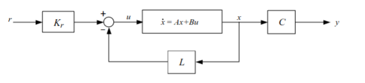

### Dynamic systems
$u(t)$ - Input signal

$y(t)$ - Output signal

We usually represent our systems with ODEs of the form:
$$
\dot{y} + ay = bu
$$

### Feedback systems
Using (positive or negative) feedback, meaning our input depends on the output as well!

$r(t)$ - Reference value/Setpoint

$e(t)$ = $r(t) - y(t)$ - Control error

### Laplace Domain
$F(s)$ - Controller

$G_{uy}(s)$ = $\dfrac{Y(s)}{U(s)}$ - Transfer function

$L(s) = G_{uy}(s) F(s)$ - Loop transfer function

$G_{ry}(s)$ = $\dfrac{Y(s)}{R(s)} = \dfrac{L(s)}{1 + L(s)}$ - Closed-loop transfer function

### Poles \& Zeroes
Poles are given by $1 + L(s) = 0$ - the denominator in $G_{ry}(s)$ to determine the stability of a system.

Zeroes are given by $L(s) = 0$ - the numerator in $G_{ry}(s)$ to determine the system's response

### Controllers

#### P-controller
$$
u(t) = K_p \cdot e(t)
$$

$$
U(s) = K_p \cdot E(s)
$$

#### PI-controller
$$
u(t) = K_p \cdot e(t) + K_i \int_0^t e(\tau)\ d\tau
$$

$$
U(s) = K_p \cdot E(s) + \frac{K_i}{s} \cdot E(s)
$$

#### PD-controller
$$
u(t) = K_p \cdot e(t) + K_d \cdot \dfrac{d(e(t))}{dt}
$$

$$
U(s) = K_p \cdot E(s) + sK_d \cdot E(s)
$$

#### PID-controller
$$
u(t) = K_p \cdot e(t) + K_i \int_0^t e(\tau)\ d\tau + K_d \cdot \dfrac{d(e(t))}{dt}
$$

$$
U(s) = K_p \cdot E(s) + \frac{K_i}{s} \cdot E(s) + sK_d \cdot E(s)
$$

### Feedback systems with noise/disturbance
Remaining control error, $e(\infty)$ when:
$$
r(t) = r_0 \cdot \sigma(t)
$$

$$
R(s) = \dfrac{r_0}{s} \ | \ \text{set } v(t) = 0
$$

$$
\begin{align*}
\lim_{t \to \infty} e(t)
& = \lim_{s \to 0} s \cdot E(s) \newline
& = \lim_{s \to 0} s \cdot \left(R(s) - \dfrac{L(s)}{1 + L(s)} R(s)\right) \newline
& = \lim_{s \to 0} s \cdot \left(R(s) \cdot \left(1 - \dfrac{L(s)}{1 + L(s)}\right)\right) \newline
& = \lim_{s \to 0} s \cdot \left(R(s) \cdot \left(\dfrac{1 + L(s) - L(s)}{1 + L(s)}\right)\right) \newline
& = \lim_{s \to 0} s \cdot \left(R(s) \cdot \left(\dfrac{1}{1 + L(s)}\right)\right) \newline
& = \lim_{s \to 0} s \cdot \left(\dfrac{r_0}{s} \cdot \dfrac{1}{1 + L(s)}\right) \newline
& = \lim_{s \to 0} \left(\dfrac{r_0}{1 + L(0)}\right) \newline
& = \boxed{\lim_{s \to 0} \left(\dfrac{r_0}{1 + F(0)G(0)}\right)}
\end{align*}
$$

Remaining control error, $e(\infty)$ when:
$$
v(t) = v_0 \cdot \sigma(t)
$$

$$
V(s) = \dfrac{v_0}{s} \ | \ \text{set } r(t) = 0
$$

$$
E(s) = R(s) - Y(s) \newline
$$

$$
E(s) = -Y(s) \newline
$$

$$
E(s) = -\left(G(s) \cdot \left(V(s) + F(s) E(s)\right)\right) \newline
$$

$$
E(s) = -G(s) V(s) - L(s) E(s) \newline
$$

$$
E(s) + L(s) E(s) = -G(s) V(s) \newline
$$

$$
E(s) \left(1  + L(s)\right) = -G(s) V(s) \newline
$$

$$
E(s) = -\dfrac{G(s) V(s)}{1 + L(s)} \newline
$$

$$
E(s) = -\dfrac{G(s)}{1 + L(s)} \cdot V(s) \newline
$$

$$
\begin{align*}
\lim_{t \to \infty} e(t)
& = \lim_{s \to 0} s \cdot E(s) \newline
& = \lim_{s \to 0} s \cdot -\dfrac{G(s)}{1 + L(s)} \cdot V(s) \newline
& = \lim_{s \to 0} s \cdot -\dfrac{G(s)}{1 + L(s)} \cdot \dfrac{v_0}{s} \newline
& = \lim_{s \to 0} -\dfrac{G(s) \cdot v_0}{1 + L(s)} \newline
& = \boxed{\lim_{s \to 0} -\dfrac{G(0) \cdot v_0}{1 + L(0)}}
\end{align*}
$$

To eliminate the remaining control error all together, meaning that $e(\infty) = 0$ it means that $F(0) = \infty$. In others words, we need a $\frac{1}{s}$ component (an integral in the time domain) in our controller.

### Physical models
Physical models are often model with ODEs, for example:
$$
m\ddot{y}(t) = F(t) - ky(t) - b\dot{y}(t)
$$

$$
m\ddot{y}(t) + b\dot{y}(t) + ky(t) = F(t)
$$

Taking the Laplace transform
$$
ms^2 Y(s) + bs Y(s) + kY(s) \stackrel{\mathcal{L}}{=} F(s)
$$

$$
Y(s) \left(ms^2 + bs + k\right) = F(s)
$$

$$
\boxed{G(s) =  \dfrac{F(s)}{\left(ms^2 + bs + k\right)}}
$$

We can also do this with state-space representation.

Rewriting our original ODE:
$$
\ddot{y}(t) = -\frac{b}{m} \dot{y}(t) - \frac{k}{m} y(t) + \frac{1}{m} F(t)
$$

Let $x_1 = y$ and $x_2 = \dot{y}$.

This means that:
$$
\begin{cases}
\dot{x_1} & = x_2 \newline
\dot{x_2} & = -\dfrac{b}{m} x_2 - \dfrac{k}{m} x_1 + \dfrac{1}{m} F
\end{cases}
$$

Using Matrix notation:
$$
x =
\begin{bmatrix}
\dot{x_1} \newline
\dot{x_2}
\end{bmatrix} =
\begin{bmatrix}
0 & 1 \newline
-\frac{k}{m} & -\frac{b}{m}
\end{bmatrix}
\begin{bmatrix}
x_1 \newline
x_2
\end{bmatrix} +
\begin{bmatrix}
0 \newline
\frac{1}{m}
\end{bmatrix} F
$$

$$
y =
\begin{bmatrix}
1 & 0
\end{bmatrix}
\begin{bmatrix}
x_1 \newline
x_2
\end{bmatrix} +
\begin{bmatrix}
0
\end{bmatrix}
F
$$

### Generalization
$$
\dot{x} = Ax + Bu \newline
y = Cx + Du
$$

$$
G_{uy}(s) = \dfrac{Y(s)}{U(s)} = C(sI - A)^{-1} B + D
$$

### Characteristics equation
To find the poles of the system in matrix notation we use the fact that the denominator of the transfer function is:
$$
det(sI - A)
$$

So, to find the poles we simply:
$$
det(sI - A) = 0
$$

Reminder that:
$$
A =
\begin{bmatrix}
a & b \newline
c & d
\end{bmatrix}
$$

$$
det(A) =
\dfrac{1}{ad - bc}
$$

$$
A^{-1} =
\dfrac{1}{ad - bc}
\begin{bmatrix}
d & -b \newline
-c & a
\end{bmatrix}
$$

NB: This rule only applies for 2x2 matrices.

### State feedback

$$
u = K_r \cdot r - Lx \newline
y = Cx
$$

$$
\dot{x} = Ax + Bu = Ax + B(K_r r - Lx) \newline
sX(s) = AX(s) + B(K_r R(s) - LX(s)) \newline
sX(s) = AX(s) + BK_r R(s) - BLX(s) \newline
sX(s) - AX(s) + BLX(s) = BK_r R(s) \newline
X(s) (sI - A + BL) = BK_r R(s) \newline
X(s) = (sI - A + BL)^{-1} BK_r R(s) \newline
$$

$$
Y(s) = CX(s) \newline
Y(s) = C (sI - A + BL)^{-1} B K_r R(s) \newline
G_{ry}{s} = \dfrac{Y(s)}{R(s)} = C (sI - A + BL)^{-1} B K_r
$$

We can determine K_r for a system with the knowledge that $G(0) = 1$

So:
$$
K_r = \dfrac{1}{C(-A + BL)^{-1}) B}
$$

Poles are given by:
$$
det(sI - A + BL) = 0
$$

### Stability
A system is stable if and only if its characteristic equation has roots in the LHP, meaning that $\Re(s) < 0$.

For systems of order 2, this means that all the coefficients are $> 0$

For systems or order 3 or higher we use Routh–Hurwitz method.

### Nyquists simplified criterion
To use the Nyquists simplified criterion, $L(s)$ can not have a pole in the RHP. If this criterion is met, plot $L(j\omega)$ for $0 \leq \omega \leq \infty$.

If $L(j\omega)$ passes through the negative real axis with $(-1, 0)$ to its left, then the system is stable.

### Nyquists criterion
If $L(s)$ has a pole in the RHP, we can still use Nyquists criterion.

$$
Z = P + N = \text{Number of zeroes } 1 + L(s) \text{ has in RHP.}
$$

$$
P = \text{Number of poles } L(s) \text{ has in RHP.}
$$

$$
N = \text{Number of turns } L(j\omega) \text{ has around } (-1, 0) \text{ clockwise.}
$$
