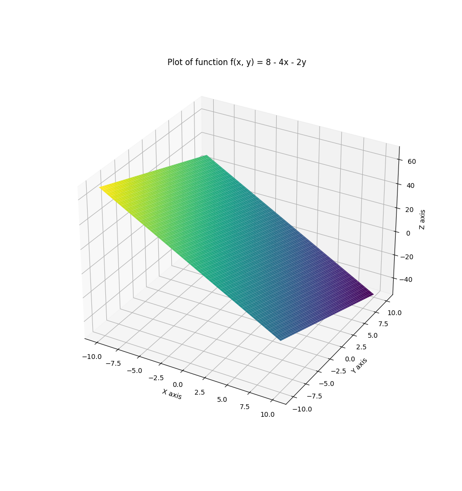
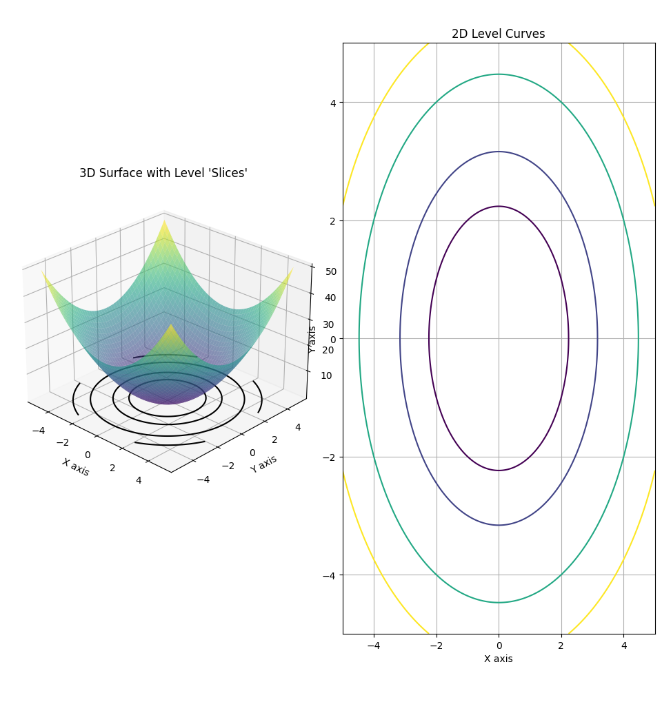
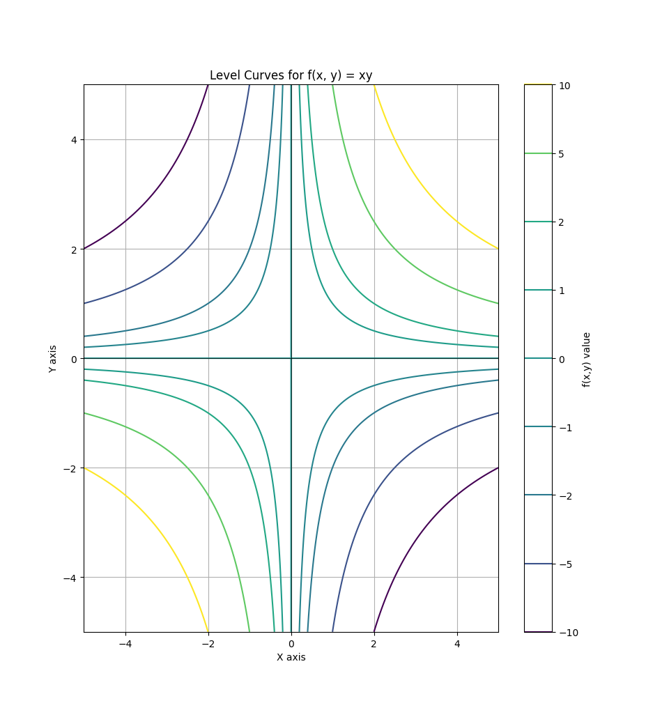

### Introduction
Analysis of one variable is very powerful, but most of the time, functions will have several variables.

This series will cover analysis in several variables.

### Formal definition
Let's properly define what a function of several variables is

:::definition[Function of two variables]
A function of two variables is a rule that associates to each pair, $(x, y)$ of real numbers, in a set, $D$, a unique number denoted as, $f(x, y)$.

$D$ is the so-called *domain*. The domain is the allowed values of our variable parameters.

The *range* of $f$, is the set of all values that $f$ can take.

$$
\{ f(x, y) \ | \ (x, y) \in D \}
$$
:::

:::example
$$
f(x, y) = \dfrac{x^3 y}{y - 1}
$$

Range:
$$
\{ f(x, y) \ | \ y - 1 \neq 0 \}
$$

Domain:
$$
\{ (x, y) \ | \ y \neq 1 \}
$$
:::

### Graphs
Let's define graphs in several variables.

:::definition[Graph]
The graph of a function of two variables is the set of all points, $(x, y)$, which, $(x, y) \in D$.

In other words, it's a surface with equation:
$$
z = f(x, y)
$$
:::

:::example
Evaluate $f(0, 4)$ and graph the surface.

$$
f(x, y) = 8 - 4x - 2y
$$

$$
f(0, 4) = 8 - 0 - 8 = 0
$$

:::

### Level curves
Level curves are a very important topic when dealing with several variables.

:::definition[Level curves]
The *level curves* of a function of two variables are the curves with the equation:
$$
f(x, y) = k, \text{where $k$ is constant}
$$
:::

:::example
Sketch the level curves for $f(x, y) = xy$

Case $k = 0$:
$$
xy = 0 \ | \ \text{$x = 0$ or $y = 0$}
$$

Case $k \neq 0$:
$$
xy = k \ | \ \text{$x = \dfrac{k}{y}$ or $y = \dfrac{k}{x}$}
$$

If we plot for different k values:

:::

### Limits
Let's compare limits in one variable to several.
$$
\lim_{x \to a} f(x) = L
$$

$$
\lim_{(x, y) \to (a, b)} f(x) = L
$$

They work quite similiar, let's see the limit laws:

1)
$$
\lim_{(x, y) \to (a, b)} f(x, y) \pm h(x, y) = L + M
$$

2)
$$
\lim_{(x, y) \to (a, b)} f(x, y) \cdot h(x, y) = L \cdot M
$$

3)
$$
\lim_{(x, y) \to (a, b)} \dfrac{f(x, y)}{h(x, y} = \dfrac{L}{M} , M \neq 0
$$
