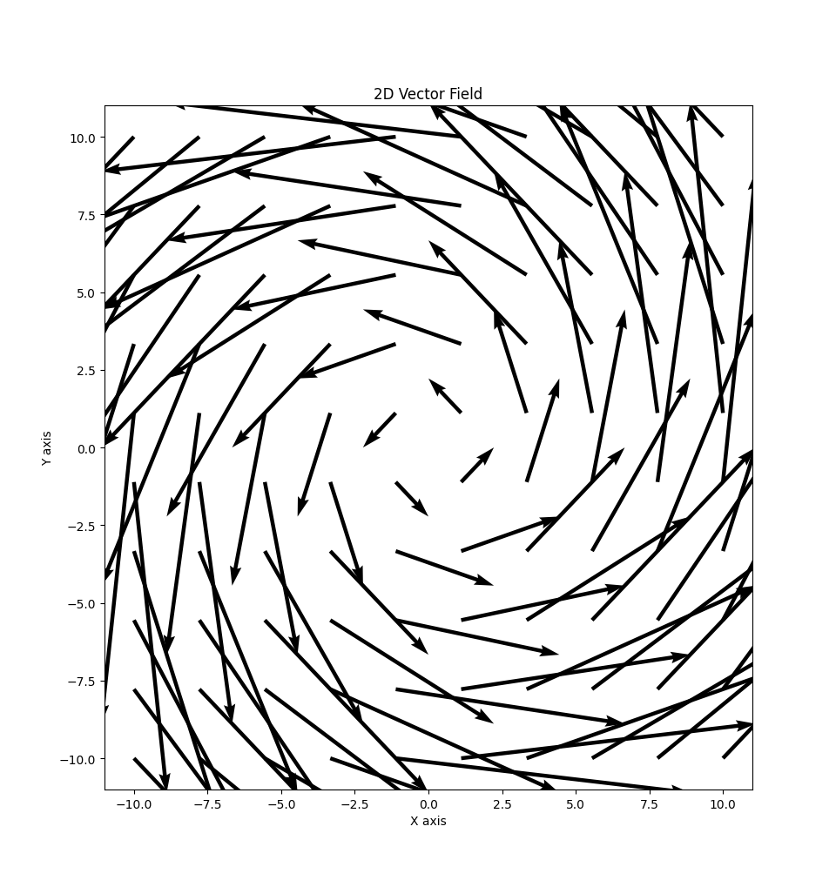

### Introduction
In this part we'll cover so-called vector fields.

:::definition[Vector field]
A **vector field** is a function, $F$:
$$
F: D \subset \mathbb{R}^2 \rarr \mathbb{R}^2 \ | \ \text{2D} \newline
F: D \subset \mathbb{R}^3 \rarr \mathbb{R}^3 \ | \ \text{3D}
$$
:::

:::example
Consider $F(x, y) = (-y, x)$ (which is the same as $-y \vec{i} + x\vec{j}$).

The graph for this looks like:

:::

### Gradient field
By this definiton, we can say that.

Let $f: D \subset \mathbb{R}^2 \rarr \mathbb{R}$ be a differentiable function. The gradient is $\nabla f(x, y) = \langle f_x(x, y), f_y(x, y) \rangle$.

The gradient is therefore a vector field!

$$
\nabla f: D \rarr \mathbb{R}^2
$$

Let's quickly just do a simple gradient example to refresh our memory.

:::example
Find $\nabla f$ for $f(x, y) = x^2 y - y^3$
$$
\nabla f(x, y) = \langle f_x(x, y), f_y(x, y) \rangle \newline
\nabla f(x, y) = \langle 2xy, x^2 - 3y^2 \rangle \newline
$$
:::

Let's also remember that $\nabla f(x, y)$ is perpendicular to the level curves of $f$.

Which means, $\nabla f$ has larger (vector) length when the level curves are tighter together.

:::definition[Conservative vector field]
A vector field, $F$, is called *conservative*, if there is a function, $f$, for which $\nabla f = F$.

In this case, $f$, is called a *potential* for $F$.
:::

### Integrating over vector fields
Suppose the vector field, $F$, represents some force on the plane/space and suppose there is a string, curved of the shape of a curve, $C$.

If a particle moves along the curve, the work done by $F$, to move it a distance:
$$
\int_C F \cdot dr
$$

We call this the line integral of $F$ over $C$.

:::definition[Line integral over a vector field]
If $C$ is parameterized as $\vec{r}(t) = \langle x(t), y(t), z(t) \rangle$ in the interval, $a \leq t \leq b$. Then:

$$
\int_C F \cdot dr = \int_a^b F(x(t), y(t), z(t)) \cdot \vec{r^\prime}(t)\ dt
$$
:::

:::example
Evaluate $\int_C F \cdot dr$ for $F(x, y, z) = (y, z, x)$ on the straight line from $(2, 0, 0)$ to $(3, 4, 5)$.

Let's first parameterize our curve.

$$
\vec{r}(t) = \langle x_0 + ta, y_0 + tb, z_0 + tc \rangle \newline
\vec{r}(t) = \langle 2 + t(3 - 2), 0 + t(4 - 0), 0 + t(5 - 0) \rangle \newline
\vec{r}(t) = \langle 2 + t, 4t, 5t \rangle \ | \ 0 \leq t \leq 1
$$

Which means:
$$
\vec{r^\prime}(t) = \langle 1, 4, 5 \rangle \ | \ 0 \leq t \leq 1
$$

Using our definition:
$$
\int_C F \cdot dr = \int_0^1 \langle 4t, 5t, 2 + t \rangle \cdot \langle 1, 4, 5 \rangle \ dt
$$

$$
\int_0^1 4t + 20t + 10 + 5t\ dt
$$

$$
\int_0^1 29t + 10\ dt
$$

$$
\dfrac{29}{2} t^2 + 10t \bigg\rvert_{t = 0}^{t = 1}
$$

$$
\boxed{\dfrac{29}{2} + 10}
$$
:::

:::example
Evaluate $\int_C F \cdot dr$ for $F(x, y, z) = xy \vec{i} + yz \vec{j} + zx \vec{k}$.

$C$ is given by, $\vec{r}(t) = \langle t, t^2, t^3 \rangle$. For $0 \leq t \leq 1$.

Let's first rewrite $F$:
$$
F(x, y, z) = \langle xy, yz, zx \rangle
$$

Let's differentiate:
$$
\vec{r^\prime}(t) \langle 1, 2t, 3t^2 \rangle
$$

Use our definition:
$$
\int_C F \cdot dr = \int_0^1 \langle t^3, t^5, t^4 \rangle \cdot \langle 1, 2t, 3t^2 \rangle \ dt
$$

$$
\int_0^1 t^3 + 2t^6 + 3t^6\ dt
$$

$$
\int_0^1 5t^6 + t^3\ dt
$$

$$
\dfrac{5}{7} t^7 + \dfrac{1}{4} t^4 \bigg\rvert_{t = 0}^{t = 1}
$$

$$
\boxed{\dfrac{5}{7} + \dfrac{1}{4}}
$$
:::
