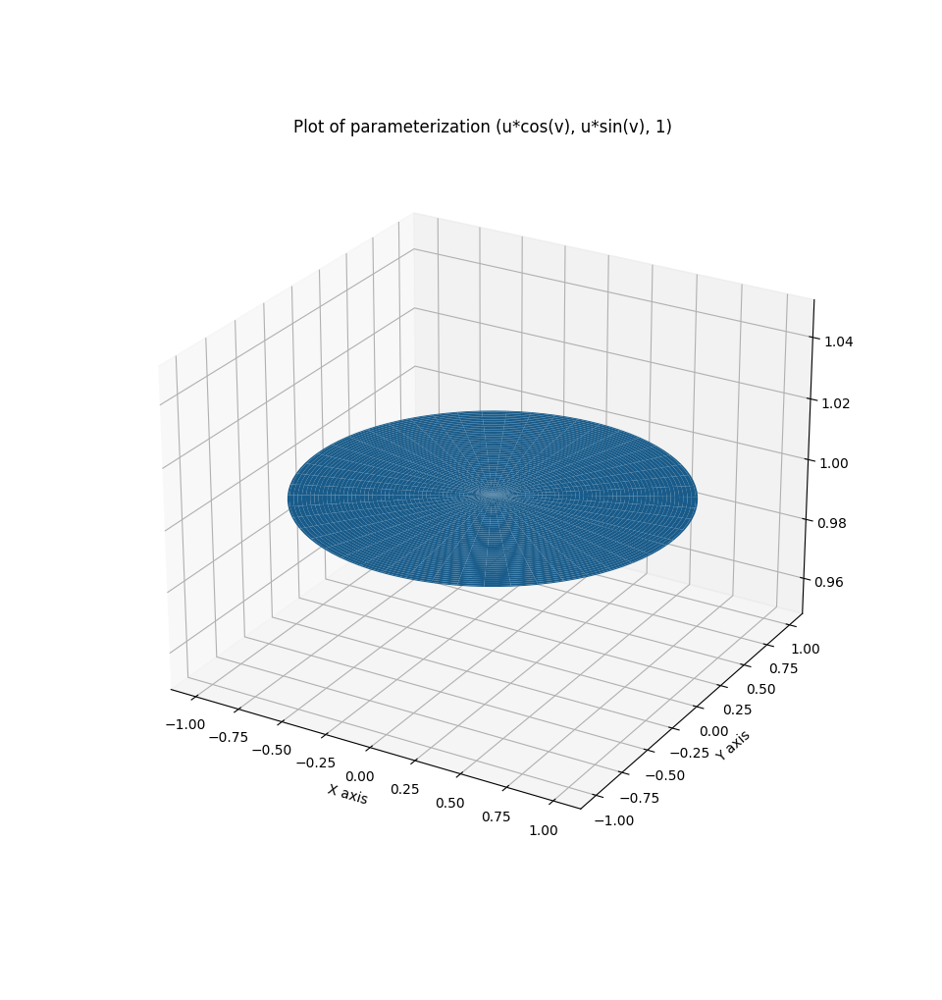
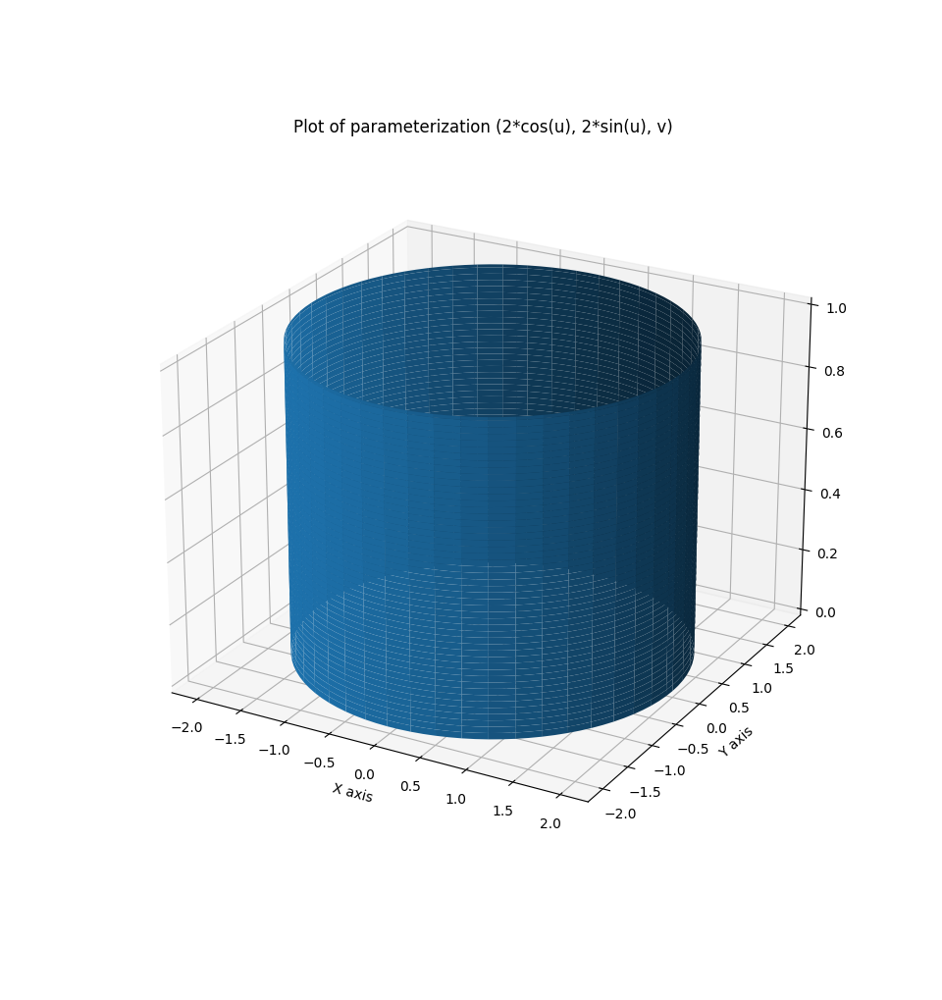

### Introduction
In this part we'll cover Green's Theorem, which will allow us to have a relationship between integrals and double integrals.

Before starting, we will only work with *simple* curves. Which essentially just means that the curves have no self-injections (only exception is when it starts and ends at the same point).

If $C$ is a simple and closed curve, e.g a circle. Then $C$ determines a inner region, $D$. In this case, we write $\partial D = C$. Meaning the border of $D$.

NB: "Positive" orientation is counter-clockwise and "Negative" orientation is clockwise.

:::theorem[Green's Theorem]
Let $C$ be a simple, closed curve oriented positively. Let $D$ be the region it surrounds and let $P, Q: D \rarr \mathbb{R}$.

$$
\int_C P\ dx + Q\ dy = \iint_D \dfrac{\partial Q}{\partial x} - \dfrac{\partial P}{\partial y}\ dx\ dy
$$

Equivalently:
$$
\int_{\partial D} P\ dx + Q\ dy = \iint_D \dfrac{\partial Q}{\partial x} - \dfrac{\partial P}{\partial y}\ dx\ dy
$$
:::

:::example
Evaluate $\int_C x^4\ dx + xy\ dy$ where C is the triangle going from $(0, 0)$ to $(1, 0)$ to $(0, 1)$ then back to $(0, 0)$.

$$
\int_C x^4\ dx + xy\ dy = \iint_D \dfrac{\partial Q}{\partial x} - \dfrac{\partial P}{\partial y}\ dx\ dy = \iint_D y - 0\ dx\ dy
$$

Which then just becomes:
$$
\int_0^1 \int_0^{1 - x} y\ dy\ dx
$$

$$
\int_0^1 \dfrac{y^2}{2} \bigg\rvert_{y = 0}^{y = 1 - x}
$$

$$
\int_0^1 \dfrac{(1 - x)^2}{2}\ dx
$$

$$
\dfrac{1}{2} \int_0^1 (1 - x)^2\ dx
$$

$$
\dfrac{1}{2} \int_0^1 1 - 2x + x^2\ dx
$$

$$
\dfrac{1}{2} \left[x - x^2 + \dfrac{x^3}{3} \bigg\rvert_{x = 0}^{x = 1}\right]\ dx
$$

$$
\boxed{\dfrac{1}{6}}
$$
:::

:::example
Evaluate $\int_C (3y - e^{sin(x)})\ dx + (7x + \sqrt{y^4 + 1})\ dy$

For, $C = \{(x, y) | x^2 + y^2 = 9\}$, with positive orientation.

$$
\int_C (3y - e^{sin(x)}\ dx + (7x + \sqrt{y^4 + 1})\ dy = \iint_D \dfrac{\partial Q}{\partial x} - \dfrac{\partial P}{\partial y}\ dx\ dy = \iint_D (7 - 3)\ dx\ dy
$$

$$
\iint_D 4\ dx\ dy
$$

$$
4 \iint_D 1\ dx\ dy
$$

We can either, do a change of variables to polar coordinates, or just use the definition that this is just the area of the circle.

$$
4 \cdot \pi 3^2 = 36\pi
$$

With polar coordinates:
$$
S = \{(r, \theta) | 0 \leq r \leq 3, 0 \leq \theta \leq 2\pi\}
$$

$$
4 \int_0^{2\pi} \int_0^3 1 \cdot r\ dr\ d\theta
$$

$$
4 \int_0^{2\pi} \dfrac{9}{2}\ d\theta
$$

$$
4 \cdot 9 \pi = 36\pi
$$
:::

### Applications
As we just saw, this could maybe be useful to compute areas, using Green's Theorem "backwards".

$$
\text{Area}(D) = \iint_D 1\ dA
$$

Which, by Green's Theorem, means that:
$$
P(x, y) = 0 \newline
Q(x, y) = x
$$

or

$$
P(x, y) = -y \newline
Q(x, y) = 0
$$

Yields this result.

:::example
Find the area of the ellipse $\dfrac{x^2}{a^2} + \dfrac{y^2}{b^2} = 1$.

$$
\iint_D 1\ dA = \int_{\partial D} x\ dy
$$

We need to parameterize the border of this ellipse. The parameterization for a circle is:
$$
\vec{r}(t) = \langle cos(t), sin(t) \rangle \ | \ 0 \leq t \leq 2\pi
$$

For an ellipse, we could take a naive guess and guess that it is:
$$
\vec{r}(t) = \langle a cos(t), b sin(t) \rangle \ | \ 0 \leq t \leq 2\pi
$$

One can prove that this works, but it does :)

So:
$$
\int_0^{2\pi} x\ dy = \int_0^{2\pi} a cos(t) \cdot b cos(t)\ dt = ab \int_0^{2\pi} cos^2(t)\ dt = \ldots = \boxed{ab\pi}
$$
:::

### Parametric surfaces

:::definition[Parametric surface]
A **parametric surface** is a region, $S \subset \mathbb{R}^3$, which is the image of a function, $r: D \rarr \mathbb{R}^3$, defined on a region $D \subset \mathbb{R}^2$ of the plane.

Which means we can parameterize:
$$
\vec{r}(u, v) = \langle x(u, v), y(u, v), z(u, v) \rangle
$$
:::

:::example
$$
\vec{r}(u, v) = \langle u cos(v), u sin(v), 1 \rangle \ | \ 0 \leq u \leq 1, 0 \leq v \leq 2\pi
$$

Plotting this parameterization:

:::

:::example
Elliptic paraboloid is the surface with equation:
$$
z = x^2 + 2y^2
$$

The parameterization is therefore:
$$
\vec{r}(x, y) \langle x, y, x^2 + 2y^2 \rangle
$$
:::

:::example
Find a parameterization of:
$$
x^2 + y^2 = 2 \newline
0 \leq z \leq 1
$$

$$
\vec{r}{u, v} = \langle 2 cos(u), 2 sin(u), v \rangle \ | \ 0 \leq u \leq 2\pi, 0 \leq v \leq 1
$$

Plot:

:::
