### Introduction
In this series we'll cover what we mean with transforms, signals and systems. How they relate and are used in the real world.

### Signals
In this part we'll try to understand signals, *classify* these. Perform different signal *operations* and lastly understand and use signal *models*.
Let's first define what a signal is

:::definition[Signal]
A signal is a set of information or data. Any physical quantity that varies over time, space or any other variable or variables.
:::

We will usually define signals with mathematical functions.

### Signal classifications
There are different types of signals and representations of signals. Let's list these:

* Continuous VS Discrete (Time)
* Continuous VS Discrete (Amplitude)
* Periodic VS Aperiodic
* Deterministic VS Stochastic

We'll properly define each of these, let's start with the time representation:

#### Continuous VS Discrete (Time)
As we can see, the discrete representation, is points that are spread with a time interval $T$.

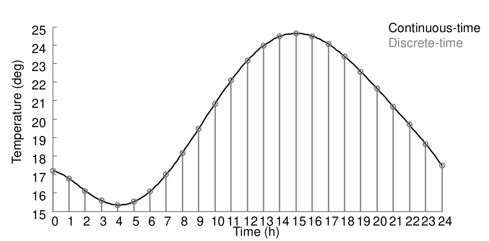

#### Continuous VS Discrete (Amplitude)
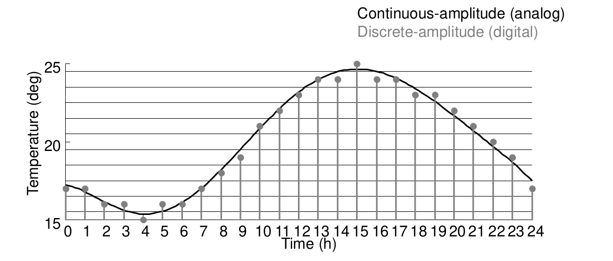

As we can see, this is *quantization*, analog $\to$ digital.

#### Even, Odd & Periodic
Let's also define what an even, odd and periodic functions are.

An even function is *symmetrical* about the vertical axis. Mathematically this means:
$$
f(t) = f(-t) \newline
f[k] = f[-k]
$$
An odd function is *anti-symmetrical* about the vertical axis. Mathematically this means:
$$
f(t) = -f(-t) \newline
f[k] = -f[-k]
$$

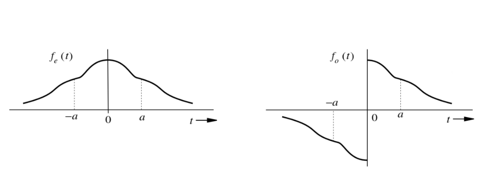

A periodic function has a *fundamental period* (minimum), $T_0$. Which also means it has a *fundamental frequency*, $f_0 = \dfrac{1}{T_0}$.
$$
f(t) = f(t + nT_0) \newline
f[k] = f[k + nK_0]
$$

We sometimes define the fundamental frequency in angular velocity instead of Hz, which means, $\omega_0 = 2\pi f_0 = \dfrac{2\pi}{T_0}$.
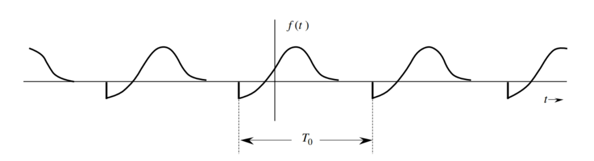

#### Deterministic VS Stochastic
These are quite easy to define.

:::definition[Deterministic and stochastic signals]
**Deterministic** signal: Its physical description is known completely (mathematical or graphical).

**Stochastic** signal: Values are only known in probabilistic terms.
:::

### Energy VS Power
We'll see these later on, but let's define them.

:::definition[Energy and power signals]
An energy signal is a signal whose energy is finite and power is zero.

A power signal is a signal whose power is finite and energy is infinite.
:::

#### Signal energy
Real signal:
$$
E_f = \int_{-\infty}^{\infty} f^2(t)\ dt
$$

Complex signal:
$$
E_f = \int_{-\infty}^{\infty} |f^2(t)|\ dt
$$

$$
0 < E_f < \infty
$$

#### Signal power
Real signal:
$$
P_f = \lim_{T \to \infty} \dfrac{1}{T} \int_{- \tfrac{T}{2}}^{\tfrac{T}{2}} f^2(t)\ dt
$$

Complex signal:
$$
P_f = \lim_{T \to \infty} \dfrac{1}{T} \int_{- \tfrac{T}{2}}^{\tfrac{T}{2}} |f^2(t)|\ dt
$$

$$
0 < P_f < \infty
$$

### Signal operations
Now that we have defined what signals are, what operations can we perform? Since they are mathematical functions, we can perform a whole row of operations.

Let's start in the time-continuous world. We'll list all the operations we can perform.

* Amplitude scaling (Gain)

* DC (Offset)

* Time scaling

* Reflection (Time inversion)

* Time shift

Let's go through them all and define them.

#### Amplitude scaling
$$
f(t) \newline
\Phi(t) = A \cdot f(t)
$$

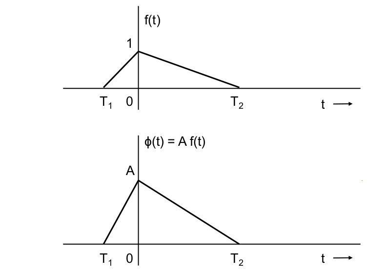

$$
A > 1 \ | \ \text{Amplification} \newline
0 < A < 1 \ | \ \text{Attenuation} \newline
A < 0 \ | \ \text{Amplitude reversal}
$$

#### DC (Offset)
$$
f(t) \newline
\Phi(t) = f(t) + B
$$

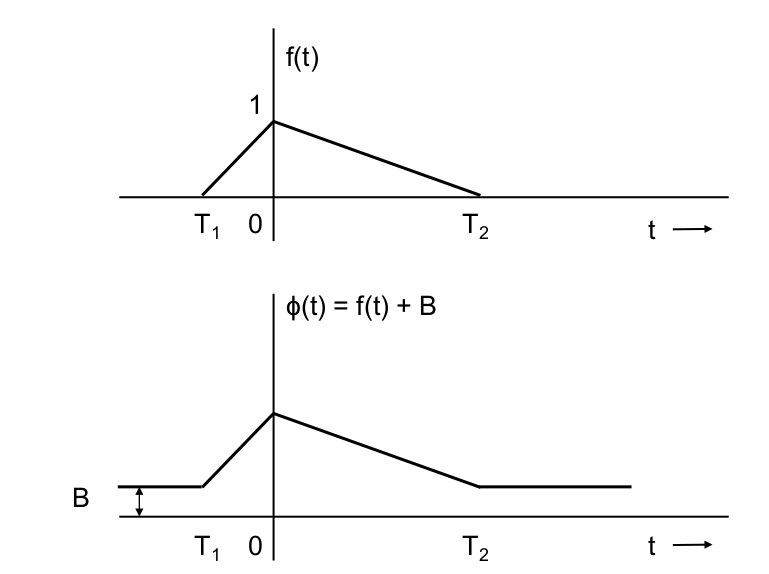

#### Time scaling
Given our input signal
$$
f(t)
$$

We can perform different operations.

##### Compression \& expansion
$$
\Phi(t) = f(2t)
$$

$$
\Phi(t) = f(\dfrac{t}{2})
$$

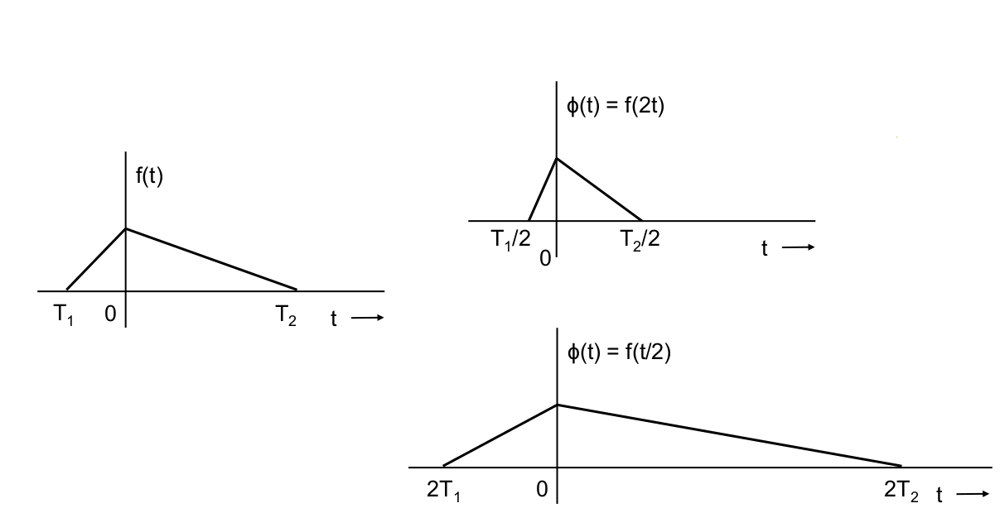

##### Reflection
$$
\Phi(t) = f(-t)
$$

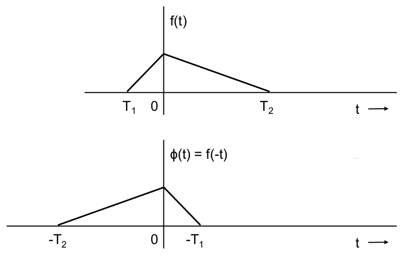

##### Time shift
$$
\Phi(t) = f(t \pm T)
$$

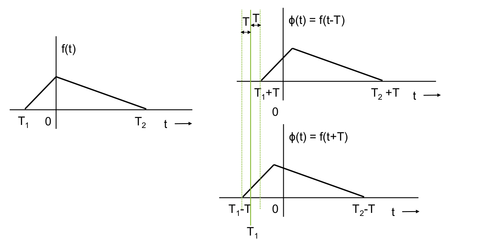

##### Summary of operations

:::table[Continuous-time signal operations.]{#continuous-signal-operations}
| Operation |  Continuous   |
|:---------:|:-------------:|
| DC |$f(t) \to A + f(t)$|
| Amplitude scaling |$f(t) \to Af(t)$|
| Time scaling |$f(t) \to f(at)$|
| Reflection |$f(t) \to f(-t)$|
| Time shift |$f(t) \to f(t \pm t_0)$|
:::

### Signal models
We'll now cover how we can (usually) model these signals, we'll look at three functions which model signals.

These are:

* Unit step function

* Unit impulse function (also called the Dirac delta function)

* Exponential function

#### Unit step function
The unit step function is defined as:
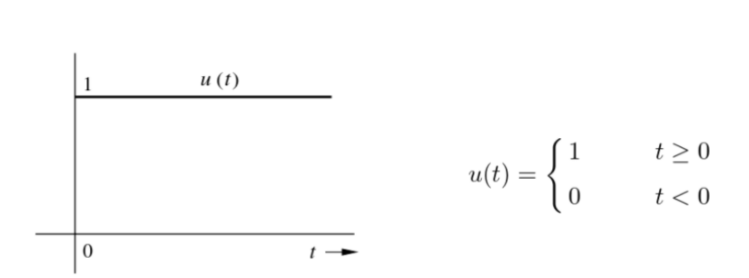

$$
u(t) =
\begin{cases}
1 & t \geq 0 \newline
0  & t < 0
\end{cases}
$$

In the discrete case:
$$
u[k] =
\begin{cases}
1 & k \geq 0 \newline
0  & k < 0
\end{cases}
$$

This means we can represent rectangular signals as linear combination of the unit step function. For example:

$$
f(t) = u(t - 2) - u(t - 4)
$$

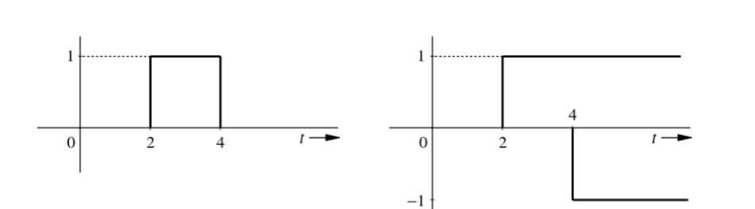

#### Unit impulse function (Dirac delta function)
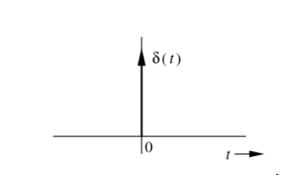

We define dirac delta function as the following:
$$
\delta(t) = 0 \ | \ t \neq 0
$$

$$
\int_{-\infty}^{\infty} \delta(t)\ dt = 1
$$

In the discrete case:
$$
\delta[k] =
\begin{cases}
1 & k = 0 \newline
0  & k \neq 0
\end{cases}
$$

We'll see that we can define discrete time-signals with this function! But the main power with the dirac delta function is property to sample/sift:

Suppose we have a function, $\phi(t)$, which is continuous at $t = 0$. We can perform:
$$
\phi(t)\delta(t) = \phi(0)\delta(t)
$$

$$
\int_{-\infty}^{\infty} \phi(t)\delta(t)\ dt = \phi(0) \int_{-\infty}^{\infty} \delta(t)\ dt= \phi(0)
$$

This also is true if, $\phi(t)$, is continuous at $t = T$
$$
\phi(t)\delta(t - T) = \phi(T)\delta(t - T)
$$

$$
\int_{-\infty}^{\infty} \phi(t)\delta(t - T)\ dt = \phi(T)
$$

The area under the product of a function with an impulse, $\delta(t)$, is equal to the value of that function at the instant where the unit impulse is located.

#### Exponential function
We define the exponential function with complex numbers:

$$
e^{st} \ | \ s = \sigma + j\omega
$$

This means:
$$
e^{st} = e^{t(\sigma + j\omega)} = e^{t\sigma + j\omega t} = e^{t\sigma} \cdot e^{j\omega t} = e^{t\sigma}(cos \omega t + j sin \omega t)
$$

We have some special cases where we get:

1) A constant $k = ke^{0t} \ | \ (s = 0)$
2) A monotonic exponential $e^{\sigma t} \ | \ (\omega  = 0, s = \omega)$
3) A sinusoid $cos \omega t \ | \ (\sigma = 0, s = \pm j\omega)$
4) A exp. varying $e^{\sigma t} cos \omega t \ | \ (s = \omega \pm j\omega)$

### Discrete time
Operations for discrete time behave the same.

:::table[Continuous- and discrete-time signal operations.]{#continuous-discrete-signal-operations}
| Operation |  Continuous   | Discrete |
|:---------:|:-------------:|:--------:|
| DC |$f(t) \to A + f(t)$ | $f[k] \to A + f[k]$|
| Amplitude scaling |$f(t) \to Af(t)$| $f[k] \to Af[k]$|
| Time scaling |$f(t) \to f(at)$|$ f[k] \to f[nk]$|
| Reflection |$f(t) \to f(-t)$| $f[k] \to f[-k]$|
| Time shift |$f(t) \to f(t \pm t_0)$| $f[k] \to f[k \pm n_0]$|
:::
