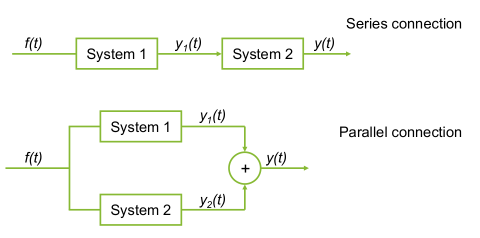
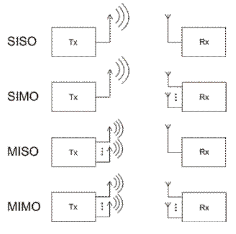

### Introduction
In this part we will learn to classify systems and recognize a **L**inear-**T**ime **I**nvariant System

Let's first define what a system is.

### Systems
Our definition of a system will be:

:::definition[System]
An entity that processes a signal/a set of signals to yield another signal/set of signals.
:::

The input, also called excitation, goes through the system and the system spits out an output, also called response.

### Interconnection
We can have multiple systems.

If they are in sequence, we call it a series connection.
We can also have parallel connection.

### Number of inputs and outputs
* **S**ingle **I**nput **S**ingle **O**utput
* **S**ingle **I**nput **M**ultiple **O**utput
* **M**ultiple **I**nput **S**ingle **O**utput
* **M**ultiple **I**nput **M**ultiple **O**utput

:::definition[Linearity]
A system is said to be **linear** if a linear combination of inputs yields the same linear combination of the outputs to each individual input:
$$
x_1(t) \to y_1(t) \newline
x_2(t) \to y_2(t)
$$

$$
a x_1(t) + b x_2(t) \to a y_1(t) + b y_2(t) \ | \ \text{Superposition principle}
$$
:::

Recall that, Superposition $=$ homogeneity + additivity.

Homogeneity:
$$
a x(t) \to a y(t)
$$

Additivity:
$$
x_1(t) + x_2(t) \to a y_1(t) y_2(t)
$$

:::definition[Time-invariance]
A system is said to be **time-invariant** if a time shift in the input signal results in the same time shift in the output signal:
$$
x(t) \to y(t) \newline
x(t - t_0) \to y(t - t_0)
$$
:::

:::example
$$
y(t) = (sin(t))x(t)
$$

$$
y(t - t_0) = (sin(t - t_0))x(t - t_0) \neq (sin(t))x(t - t_0)
$$

Which means this function is time variant!
:::

:::definition[BIBO-stability]
A system is BIBO-stable if a bounded input results in a bounded output
:::

:::example
$$
y(t) = 3x(t) + 2
$$

$$
|x(t)| \leq C \to |y(t)| \leq 3C + 2
$$

Bounded means the input/output is stable!
:::

:::definition[Causality]
A system is **causal** if the value of the output at the present
instant depends only on the present and past values of the input. Therefor all physical systems are causal!
:::

:::example
$$
y[n] = \dfrac{1}{3}\{x[n - 2] + x[n - 1] + x[n]\}
$$

Note that this input is discrete, this is because all of these system properties apply to both continuous and discrete cases!
:::

:::definition[Instantaneous and dynamic systems]
A system is **instantaneous** or **memoryless** if it's output at a
certain time instant depends only on the input at the same time
instant. If this doesn't hold, this must mean the system is **dynamic**!
:::

:::example
$$
y[n] = \dfrac{1}{3}\{x[n - 2] + x[n - 1] + x[n]\} \ | \ \text{dynamic!}
$$

Note, if it said to be instantaneous or memoryless, this also implies that the system is causal!
:::

:::definition[Invertibility]
If a system is said to be invertible, this means that observing one output leads us to a single input.
:::

:::example
$$
y(t) = x^2(t) \ | \ \text{\textbf{not} invertible!}
$$
:::

### LTI
Now, LTI, as we defined earlier, are system that are both liner and time time-invariant!. We'll see why these are important later on!
