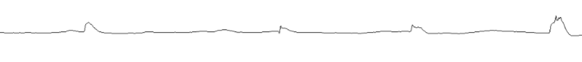
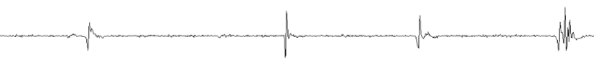
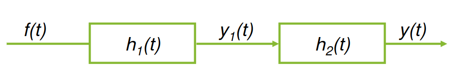
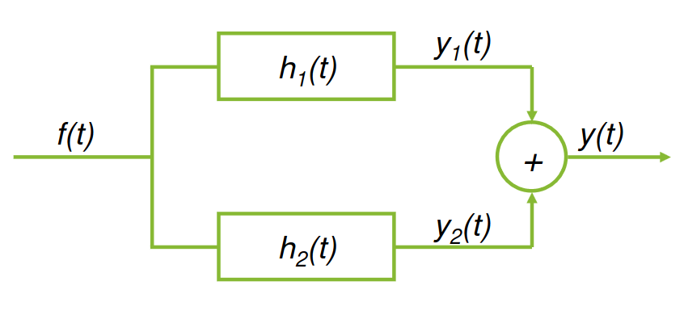

### Introduction
In this part we will learn about the convolution operation and how it's used.

Let's start at how it's used.

### Use case

Given this signal, we want to find activity on the graph, besides the notice. A kind of high-pass filter will do the job. A high-pass filter is precisely doing the convolution operation to filter.

For example the output for this input can be:

### Definition and properties
Let's call our input signal $x(t)$, our system operation for $h(t)$ and our output for $y(t)$. Assume that all of these are continuous functions, the convolution operation is denoted with $*$.
$$
y(t) = x(t) * h(t)
$$

:::definition[Convolution]
The convolution operation is defined as:
$$
y(t) = x(t) * h(t) = \int_{-\infty}^{+\infty} x(\tau)h(t - \tau) d\tau
$$

In the discrete case:
$$
c[k] = f[k] * g[k] = \sum_{m = -\infty}^{+\infty} f[m]g[k - m]
$$
:::

This operation is also:

Commutative:
$$
f_1(t) * f_2(t) = f_2(t) * f_1(t)
$$

Distributive:
$$
f_1(t) * (f_2(t) + f_3(t)) = f_1(t)* f_2(t) + f_1(t) * f_3(t)
$$

Associative:
$$
f_1(t) * (f_2(t) * f_3(t)) = (f_1(t) * f_2(t)) * f_3(t) =
$$

Suppose we have:

Using these properties we can say that:
$$
\begin{align*}
y(t) & = y_1(t) * h_2(t) \newline
& = f(t) * h_1(t)) * h_2(t) \newline
& = f(t) * (h_1(t) * h_2(t)) \newline
\end{align*}
$$

We usually reduce this to:
$$
y(t) = f(t) * h(t) \ | \ h(t) = h_1(t) * h_2(t)
$$

In the parallel case:

$$
\begin{align*}
y(t) & = y_1(t) + h_2(t) \newline
& = (f(t) * h_1(t)) +(f(t) * h_2(t)) \newline
& = f(t) * (h_1(t) + h_2(t)) \newline
& = f(t) * h(t) \ | \ h(t) = h_1(t) + h_2(t)
\end{align*}
$$

We also have some more specific properties:

Shift:
$$
f_1(t) * f_2(t) = c(t) \newline
f_1(t) * f_2(t - T) = c(t - T) \newline
f_1(t - T) * f_2(t) = c(t - T) \newline
f_1(t - T_1) * f_2(t - T_2) = c(t - T_1 - T_2) \newline
$$

Convolution with an impulse:
$$
f(t) * \delta(t) = f(t)
$$

We can combine these two:
Convolution with an impulse:
$$
f(t) * \delta(t - T) = f(t - T)
$$

One of the most important properties is the width property. The width of the convolution will be the combined width of the functions.

All of these apply for both the continuous and discrete, I've just chosen to write it for continuous.

### LTI system properties
Systems can also have properties, depending on the impulse response function, $h(t)$.

We covered these in the systems part of this series, but let's redefine them again.

#### Causality
For a causal continuous-time LTI system, the convolution integral:
$$
\int_{-\infty}^{\infty} f(t - \tau)h(\tau) \ d\tau = \int_{-\infty}^{\infty} f(\tau)h(t -\tau) \ d\tau
$$

Can be expressed as:
$$
\int_{0}^{\infty} f(t - \tau)h(\tau) \ d\tau = \int_{-\infty}^{t} f(\tau)h(t -\tau) \ d\tau
$$

#### BIBO-stability
For an LTI system to be BIBO stable, the impulse response
must be absolutely integrable:

$$
\int_{-\infty}^{\infty} |h(t)|\ dt < \infty
$$

If the system is also causal, then this integral is:
$$
\int_{0}^{\infty} |h(t)|\ dt < \infty
$$

#### Instantaneous
An LTI system is instantaneous if and only if:
$$
h(t) = K \delta(t)
$$

If this is the case, then:
$$
y(t) = K f(t)
$$

#### Invertibility
An LTI system with impulse response $h(t)$ is invertible if there is a $h_i(t)$ such that:
$$
h(t) * h_i(t) = \delta(t)
$$

:::remark
As always, all of these also apply for discrete-time as well, just sum instead of an integral.
:::
