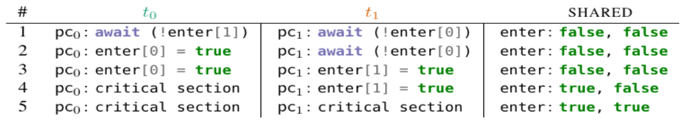

In this part we'll cover how we can achieve mutual exclusion in a program using
only atomic read and writes.

### Analyzing Concurrency
When analyzing concurrent programs we often look at *states* and *transitions*.

A *state* in these diagrams are *possible program states*.
*Transitions* on the other hand, *connects* these states to an execution order.

One to thing to note is that, the structural properties in these diagrams,
captures the semantics properties of the corresponding program.

#### States
A *state*, as we defined it, captures a possible state in a program.
Meaning it captures both shared and local variables and states in a concurrent program.

The initial state (starting point) is usually marked with an incoming arrow to indicate the start.
While, the final state of a program are usually marked with double-line edges.

#### Transitions
Transitions, as we defined them, connects these states. So it's natural that,
a transition is an arrow that connects two states.

Usually locking and unlocking are considered atomic operations, so each
lock and unlock will have their own visible transition.


#### Structural properties
As we said earlier, the structural properties of a transition diagrams tells
the semantics properties about the program.

This means for example that:

* Mutual Exclusion:
    * If there are no states where two (or more) threads are in their critical section
* Deadlock Freedom:
    * For every (non-final) state, there is at least one outgoing transition to another state.
* Starvation Freedom:
    * There is (looping) path such that a thread never enters its critical section while trying to do so.
* No Race Conditions:
    * All the final states have the same correct result.

So we can see that it is very powerful to have these diagrams to analyze
programs and see what we achieve.

### Mutual exclusion with only atomic read and writes
We know that we can achieve mutual exclusion using (good) locks and semaphores.
But can we achieve mutual exclusion in programs using only atomic read and writes?

It is in fact possible - but it's tricky however - but let's try to implement it.

#### Problem description
Lets quickly go over what our problem is, so we have an easier time solving it.

```
while(true) {
    entry protocol

    critical section {
        .
        .
        .
    }

    exit protocol
}
```

We want to design a (concurrent) program were we achieve, mutual exclusion,
freedom from deadlocks and freedom from starvation, in the following program.


#### Busy-waiting
In the following attempts, we'll use something called busy-waiting.

```
while(!condition) {
    // Do nothing
}
```

We will use the keyword `await(c)` which is not an actual keyword.
But we will use it as a synonym to the busy wait loop.

Note, we don't really want to use this in actual programs since there are better ways of waiting.
But for now this will do.

### Naive attempt

One of the most naive attempts one might try is to use a boolean list, called
`enter`.

So when thread $t_k$ wants to enter it sets `enter[k]` to true.

For example, if we use `k = 2` a program could look like:

```
while(true) {

    await(!enter[1]);

    enter[0] = true;

    critical section { ... }

    enter[0] = false;

}
```

In this, $t_0$ will wait until `enter[1]` becomes false.

While it seems like it *should* work, in reality it doesn't.
This does not guarantee mutual exclusion.

For example, this diagram illustrates well how:


So $t_0$ enters into the line where it sets `enter[0]` to `true`.
But then $t_1$ does the same, before `enter[0]` actually becomes `true`.

So they will, in sequence set their respective flag to entered, and both enter the critical section.

So the problem seems to be that we have `await`.

### Second naive attempt
```
while(true) {

    enter[0] = true;

    await(!enter[1]);

    critical section { ... }

    enter[0] = false;

}
```

So, if we make the change we noticed.

This solution actually achieves mutual exclusion! However, we still have a problem.
It does not guarantee freedom from deadlock.

It's quite easy to see a scenario where that happens, if $t_0$ first sets `enter[0]`to `true`,
then in turn $t_1$ sets `enter[1]` to `true`. They both now will wait on the other thread, a simple deadlock.

So it seems using independent variables will not work.

### Third naive attempt
By introducing a variable `yield` we can make sure that $t_k$ waits for its turn
while `yield` is `k`.

```
while(true) {
    await(yield != 0);

    critical section { ... }

    yield = 0;
}
```

It's important now that `await(condition)` was short for `while(!condition) { }`.
This means we will keep waiting until `yield`is something other than 0.

This means we either make the starting value of yield random, or just choose a default.

Thus, this solution does guarantee mutual exclusion, and freedom from deadlock.
But however, not from starvation.

Why? If a thread stops executing in its **non-critical** section, the other thread will starve.

### Final solution - Peterson's algorithm

Our final solution will be a combination of our second and third attempt.

This means:

$t_k$ *first* sets `enter[k]` to `true`, but then *lets other threads go first*, by setting `yield`.

```
while(true) {

    enter[0] = true;
    yield = 0;

    await(!enter[1] || yield != 0);

    /* Eqv. to
        while(enter[1] = true && yield 0) { }

        Which means only enter when:

        enter[1] = false OR yield = 1
    */

    critical section { ... }

    enter[0] = false;
}
```

Peterson's algorithm ensure all three points that we want to achieve.

We can prove this but really isn't that interesting :P. However, we can use Peterson's algorithm
for `N`threads as well. It's a bit tricker to implement, but the idea is that we use a kind of "filtering".
At each "level" we "remove" (yield) 1 thread and keep doing this until we have one singular thread left who "won".

This thread will be allowed to enter the critical section.


### Fairness
Although Peterson's algorithm ensure all three properties we listed,
but threads may access the critical section again before "older" threads.

There are several methods to make sure the algorithm is fair:

* Finite waiting:
    * When a thread, $t$, is waiting to enter its critical section,
    it will *eventually* enter it
* Bounded waiting:
    * When a thread, $t$ is waiting to enter its critical section, the maximum
    number of times *others* arriving threads are allowed to enter their critical section
    before $t$, is **bounded** by a function of the number of contending threads.
* $r$-Bounded waiting:
    * when a thread $t$ is waiting to enter its critical section, the
    maximum number of times other arriving threads are allowed to enter their critical
        section before $t$ is less than $r + 1$
* First-come-first-served:
    * 0-bounded waiting

Lamport's Bakery Algorithm is one algorithm which uses the First-come-first-served.


### Implementation
Now that we know the theory behind it - we would want to implement it right?
Well, no, there are great implementations already out there,
but sometimes we can't always rely on existing libraries.


```
class PetersonLock implements Lock {
    private volatile boolean enter0 = false, enter1 = false;
    private volatile int yield;

    public void lock() {
        int myID = getThreadId();
        if (myID == 0) {
            enter0 = true;
        }

        else {
            enter1 = true;
        }

        yield = myID;

        while ((myID == 0) ? (enter1 && yield == 0)
            : (enter0 && yield == 1)) {

            // Do nothing
        }
    }

    public void unlock() {
        int myID = getThreadId();

        if (me == 0) {
            enter0 = false;
        }

        else {
            enter1 = false;
        }

    }

    private volatile long id0 = 0;
```

Now the thing is that we humans assume that the program will execute in the same order we wrote it.

This isn't always the case, especially not with concurrent programs. The compiler likes to do a lot of optimizations,
that we may find odd, but it thinks it's better.

This is where we need to use the `volatile` keyword, which says to the compiler to not optimize this variable at all.

In Java however we can't have volatile arrays, but there is so called `AtomicArrays` we can use.

```
class PetersonAtomicLock implements Lock {
    private AtomicIntegerArray
        enter = new AtomicIntegerArray(2);

    private volatile int yield;

    public void lock() {
        int myID = getThreadId();
        int otherID = 1 - myID;
        enter.set(myID, 1);
        yield = myID;

        while (enter.get(otherID) == 1 && yield == myID) {
            // Do nothing
        }
    }

    public void unlock() {
        int myID = getThreadId();
        enter.set(myID, 0);
    }
```

### Summary

This concludes this part, there was a lot of info in this one - but writing and implementing
good concurrent programs from scratch is a pain. I even left out how to implement a semaphore from scratch.

I'll maybe update and put it in later :).
