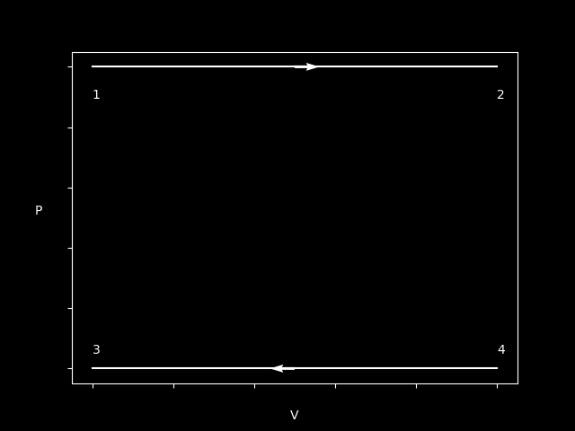
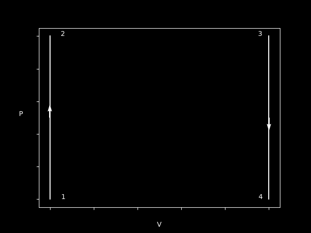

In this part we'll cover the 2nd law of thermodynamics - as well as summarize this field of physics.

### Direction for $W$ and $Q$

As we've seen the work, $W$ and $Q$ is quite important. So let's set up some general guide lines.

Generally, in a given thermal system:

A expansion, $(V_f > V_i), \rightarrow W > 0$ \
A compression, $(V_f < V_i), \rightarrow W < 0$

Increase in **temperature** $\Delta T > 0, (T_f > T_i), \rightarrow Q > 0$ \
Decrease in **temperature** $\Delta T < 0, (T_f < T_i), \rightarrow Q < 0$

Sometimes it can be quite tricky to know if the temperature increase or decreases - but there's a general rule for that as well.

Since we have $PV = nRT$, the farther away you are from the origin, the higher the temperature.

But we can always use $PV = nRT$ and see what kind of change we have in T.

### Directions of the Different Processes
Now that we have a general understanding of directions, let's go back to our 4 different processes and see what directions they have.

#### Isobaric Process

Here's a plot of a Isobar process - with two different directions.

In the above case, the gas **increases** in volume - therefore it has done a positive work. Using $PV = nRT$
we can see that T has to increase since P stays constant.

In the other case, it's just the opposite,  we decrease in V therefore a negative work has been done - same reasoning as before,
since P is constant T has to decrease as well.

$$
W_{12} > 0
\newline
Q_{12} > 0
$$

$$
W_{34} < 0
\newline
Q_{34} < 0
$$

#### Isochoric Process

Here's a plot of a Isochoric process - with two different directions.

As we can can see, no work is being done by either of the processes. But we can say something about the temperature and Q.

In the case we increase in pressure, it also means T increases. Same logic goes for when P decreases, T decreases.

$$
W_{12} = 0
\newline
Q_{12} > 0
$$

$$
W_{34} = 0
\newline
Q_{34} < 0
$$

#### Isothermal Process
In the isothermal process is a bit more tricky, but it becomes:

Positive direction
$$
W_{12} > 0
\newline
Q_{12} > 0
$$

Negative direction
$$
W_{34} < 0
\newline
Q_{34} < 0
$$

#### Adiabatic Process
In a adiabatic process, $Q = 0$ therefore it becomes:
$$
W_{12} > 0
\newline
Q_{12} = 0
$$

Negative direction
$$
W_{34} < 0
\newline
Q_{34} = 0
$$

### The Carnot Cycle
The Carnot Cycle is a famous thermodynamic cycle since it's the 'upper-limit' of any thermodynamic engine that transfers heat into work.
The proof of the carnot cycles efficiency is quite long and complicated one so I'm not going to prove it but - the efficiency of a 'Carnot machine' would be:
$$
e = \frac{T_h - T_c}{T_h}
$$

Or generally written as:

$$
e = 1 - \frac{T_c}{T_h}
$$

### The Reverse Carnot Cycle
Instead of using heat to perform work - we might want to cool something down or just transfer heat from one place to another. Then the efficiency doesn't tell us much.

Instead we look at something called coefficient of performance:

For a refrigeration cycle:
$$
K = \frac{Q_{in}}{Q_{out} - Q_{in}} = \frac{T_c}{T_h - T_c}
$$

For heat pump:
$$
K = \frac{Q_{out}}{Q_{out} - Q_{in}} = \frac{T_h}{T_h - T_c}
$$

### Thermodynamics 2nd Law
Before we formally define the 2nd law - we first need to refresh our memory of what **entropy** and **exergy** is.
Very briefly, we can explain entropy as how 'unorganized' a substance is. Exergy could be defined as the quality of energy, for example.

It takes $\approx$ 300 000 J of energy to heat 1 kg of $0^{\circ}C$ water to $70^{\circ}C$. If we *could* transfer all of this energy to kinetic energy, the water could have a speed of $\approx$ 770 m/s - but as we know, it's not possible.

But alright time to formally define the 2nd law:
$$
dS = \frac{dQ}{T}, dS_{System} \geq 0
$$

### Combing 1st and 2nd Law
If we combine the 1st and the newly 2nd law - we will get:
$$
dU = T\ dS - P\ dv
$$

So now we can utilize something called 'TS' diagrams instead of always using 'PV' diagrams. In TS diagrams it's really easy to calculate Q.

### Conclusion
This concludes this part and the series as a whole (probably). I really enjoyed writing and will probably continuing writing all my notes here, since I learn **a lot** doing this.
