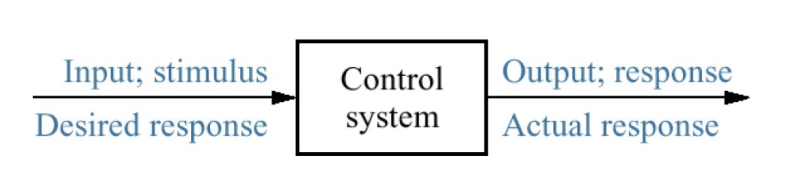
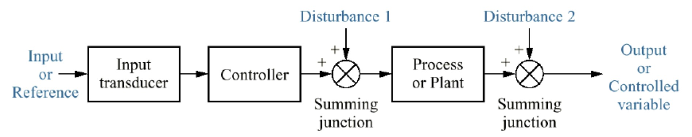
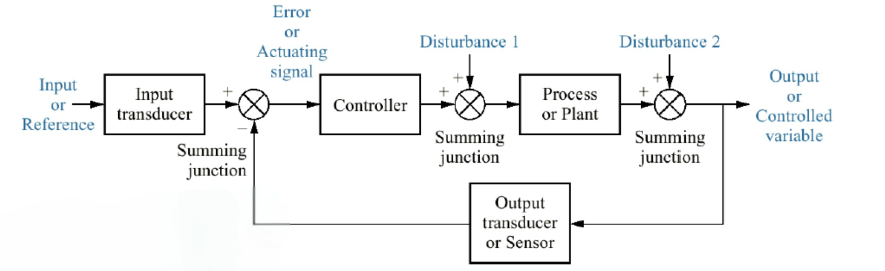
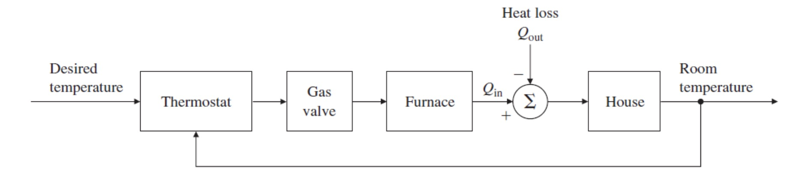

### Control Systems in Nature
Control systems are not just limited to engineered systems; they exist in nature as well.
Our bodies are home to numerous control systems that regulate various processes.
One such example is the *circadian* (24-hour) biological clock, which governs our sleep-wake cycle.
This rhythm is caused by oscillations of protein concentrations in **g**ene **r**egulatory **n**etworks (GRNs).

Biomedical and engineering applications of control systems include:
* Sleep disorder diagnosis
* Control of drug delivery systems for optimal dosing during surgeries

### Gene Regulatory Networks
**G**ene **r**egulatory **n**etworks (GRNs) play a crucial role in regulating protein production in cells.
This process involves genes, messenger RNA (mRNA), and the eventual production of proteins.
Understanding GRNs is essential for comprehending biological rhythms and developing biomedical applications.

### Control Systems in Engineering
Control systems are not limited to biomedical applications; they are ubiquitous in engineering as well. Some examples include:

* Robotics: Manipulators, spacecraft, unmanned aerial vehicles (UAVs), and robot teams
* Rehabilitation devices
* Thermostats
* Eye tracking and precise object placement by hands

:::definition[Control system]
A control system consists of *subsystems* and *processes* assembled to obtain a *desired output* with *desired performance*, given a *specified input*.
:::

Control systems can be classified as *open-loop* or *closed-loop* systems.

Open-loop systems are simpler and less expensive, where the response is determined solely by the *controlling input*.
Examples include toasters, fan-heaters, and "cold-blooded" animals.

Closed-loop systems, also known as *feedback control systems*, use feedback to adjust the system's behavior based on the output.
This feedback loop allows for more precise control and stability, as seen in thermostats, cruise control systems, and human body temperature regulation.

### Linear and Nonlinear Systems
Control systems can be classified as *linear* or *nonlinear* based on the mathematical models that describe their behavior.

We'll exactly define what makes a system linear or nonlinear in a later part of this course.
