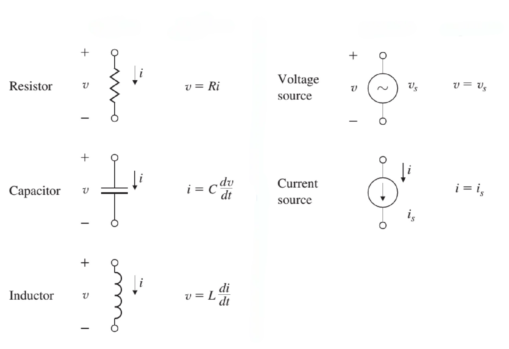

### Introduction
When dealing with (dynamic) systems and control, it is always important to develop a mathematical model of the process that we are interested in.

The term **model**, as we will use it onward, describes a set of differential equations that describe the dynamic behavior of the process.

#### Mathematical Modelling
A model can be obtained by,
* Using principles of the underlying physics; or
* Testing a prototype of the device, measuring its response to inputs. and using the data to construct an analytical model.

#### Generalized System Properties
Models of very different nature, often contain the same properties that can be characterized using equivalent mathematical expressions.

The three generalized system properties that we will be focusing on are:
* Resistive
* Storage
* Inertance

:::example[Electrical Systems]
The resistive property is obviously,
$$
V = R \cdot I \ | \ \text{Ohm's Law}
$$

The storage property is,
$$
C = \frac{q}{V} \ | \ \text{Capacitance}
$$

The inertance property is,
$$
V = L\ \frac{dI}{dt} \ | \ \text{Inductance}
$$
:::

### Models of Mechanical Systems
For mechanical systems, we will often deal with Newton's laws of motion, let's quickly define them so we know.

* Newton's 1st Law:
    - An object at rest stays at rest, and an object in motion stays in motion unless acted upon by a force.
* Newton's 2nd Law:
    - The acceleration of a particle is proportional to the resultant applied force acting on it, and is in the same direction as the resultant force.
* Newton's 3rd Law:
    - Forces acting between two particles in contact are equal and opposite.

Newton's law for translational motion is (2nd law),
$$
\mathbf{F} = m \mathbf{a}
$$

* $\mathbf{F}$: the vector sum of all forces applied to each body in a system. [N]
* $m$: mass of the body [kg]
* $\mathbf{a}$: the vector acceleration of each body with respect to an inertial frame [m/s^2]

Newton's law for rotational motion is,
$$
\mathbf{M} = I \mathbf{\alpha}
$$

* $\mathbf{M}$: the sum of all external moments about the center of mass of a body [Nm]
* $\mathbf{I}$: the body's mass moment of inertia about its center of mass [kgm^2]
* $\alpha$: the angular acceleration of the body [rad/s^2]

### Models of Mechanical Systems
The basic equations of electrical circuits are Kirchhoff's laws,
* **K**irchhoff's **C**urrent **L**aw (KCL):
    - The algebraic sum of currents leaving a junction or node equals the algebraic sum of currents entering that node.
* **K**irchhoff's **V**oltage **L**aw (KVL):
    - The algebraic sum of voltages taken around a closed path in a circuit is zero.

Let's also quickly review the basic circuit elements.

### Linear Systems
Most of the models that we will be considering are linear systems.
In reality, this will often not be the case.
An electrical resistor will heat up and as the current that passes through it increases, thereby raising its resistance.

But let's properly define linear systems now, we will use this definition onward.

:::definition[Linear system]
Linear systems can be characterized by linear ordinary or partial differential equations.
:::

A differential equation is linear when all its terms that contain the output and input variables and its derivatives are of the first degree,
$$
a_2 \frac{d^2y}{dt^2} + a_1 \frac{dy}{dt} + y = b_2 \frac{d^2x}{dt^2} + b_1 \frac{dx}{dt} + b_0 x
$$

If the coefficients are constants, then it is also *time-invariant*.
If one or more of these coefficients are functions of time, for example $a_1 = t$, it is *linear* but *time-varying*.

If one or more of the coefficients are functions of $y$ or $x$, it becomes nonlinear.

With these in mind, let's define a principle that is important in systems and control.

:::definition[Superposition Principle]
The response of a linear system to the sum of two different inputs is **equal** to the sum of the responses of the system to the individual inputs.
:::

In mathematical terms,
$$
x_1(t) \rightarrow y_1(t)
x_2(t) \rightarrow y_2(t)
a x_1(t) + b x_2(t) \rightarrow a y_1(t) + b y_2(t)
$$

Important to note is that, **any** linear system holds true to this principle, so we can really define a linear system with this principle as well.

For clarification, the superpostion principle is just homogeneity and additivity.

Homogeneity,
$$
a x(t) \rightarrow a y(t)
$$

Additivity,
$$
x_1(t) + x_2(t) \rightarrow y_1(t) + y_2(t)
$$
