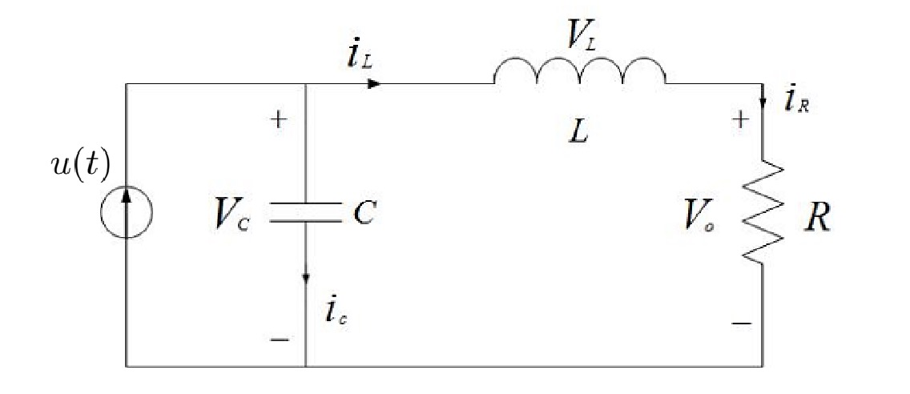

### Introduction
In this part, we will be discussing the state space approach to modeling systems. This approach is a powerful tool that allows us to model systems in a way that is independent of the input and output signals. This makes it easier to analyze and design control systems for complex systems.

This is a "modern" approach to modeling systems, as opposed to the "classical" approach that we have been using so far. The state space approach is more general and can be used to model a wide range of systems, including systems with multiple inputs and outputs.

We'll derive a linear state space equation,

* From a higher order ODE or transfer function.
* From physical laws.
* From the Jacobian linearization of nonlinear systems.

### State Space Approach
When we are modeling a set of first order $n$-dimensional ODEs,

$$
\begin{aligned}
\dot{x} & = f(x, u, t) \newline
y & = h(x, u, t) \newline
x(0) & = x_0, t \geq 0.
\end{aligned}
$$

where,

$$
\begin{aligned}
f(x, u, t) & =
\begin{bmatrix}
f_1(x, u, t) \newline
f_2(x, u, t) \newline
\vdots \newline
f_n(x, u, t)
\end{bmatrix} \in \mathbb{R}^n \newline
h(x, u, t) & =
\begin{bmatrix}
h_1(x, u, t) \newline
h_2(x, u, t) \newline
\vdots \newline
h_m(x, u, t)
\end{bmatrix} \in \mathbb{R}^p.
\end{aligned}
$$

$x = [x_1, x_2, \ldots, x_n]^T \in \mathbb{R}^n$ is called the state of the system (the component of x can stand for position, velocity, voltage and current).

$u = [u_1, u_2, \ldots, u_m]^T \in \mathbb{R}^m$ is called the input of the system.

$y = [y_1, y_2, \ldots, y_p]^T \in \mathbb{R}^p$ is called the output of the system, and $n$ is called the dimension or the order of the system.

**Remark**:
When $m = p = 1$, single input, single output, we have a SISO system.

When $m > 1 or p > 1$, multi input, multi output, we have a MIMO system.

When $f$ and $h$ do not explicitly depend on $t$, that is,

$$
\begin{aligned}
\dot{x} & = f(x, u) \newline
y & = h(x, u),
\end{aligned}
$$

we have a time-invariant control system.

When $f$ and $h$ are linear functions of $x$ and $u$, that is,

$$
\begin{aligned}
\dot{x} & = F(t) x + G(t) u \newline
y & = H(t) x + J(t) u,
\end{aligned}
$$

for some matrices $F(t) \in \mathbb{R}^{n \times n}$, $G(t) \in \mathbb{R}^{n \times m}$, $H(t) \in \mathbb{R}^{p \times n}$, and $J(t) \in \mathbb{R}^{p \times m}$, we have a linear time-varying control system.

When $F(t), G(t), H(t)$ and $J(t)$ are constant matrices, that is,

$$
\begin{aligned}
\dot{x} & = F x + G u \newline
y & = H x + J u,
\end{aligned}
$$

we have a linear time-invariant (LTI) control system.

Morever, $F \in \mathbb{R}^{n \times n}$ is called the system matrix, $G \in \mathbb{R}^{n \times m}$ is called the input matrix, $H \in \mathbb{R}^{p \times n}$ is called the output matrix, and $J \in \mathbb{R}^{p \times m}$ is called the direct transmission matrix.

In our case, we will be focusing on LTI systems and in most cases we will assume $m = p = 1$ and $J = 0$.

### Deriving a Linear State Space Equation
Let's firstly look at how we derive this from a higher order ODE or transfer function.

Recall the spring-mass-damper system with the ODE,

$$
M \frac{d^2 y}{dt^2} + f \frac{dy}{dt} + ky = u(t)
$$

In the Laplace domain, we have,
$$
G(s) = \frac{Y(s)}{U(s)} = \frac{1}{Ms^2 + fs + k},
$$

where $y$ is the position and $u$ is the force.

Now, to derive the state space equation, we define the state variables as $x_1 = y$ and $x_2 = \dot{y}$.

Then, we have the state equations,

$$
\begin{aligned}
\dot{x}_1 & = x_2 \newline
\dot{x}_2 & = -\frac{f}{M} x_2 - \frac{k}{M} x_1 + \frac{1}{M} u.
\end{aligned}
$$

This can be written in matrix form as,

$$
\begin{aligned}
\begin{bmatrix}
\dot{x}_1 \newline
\dot{x}_2
\end{bmatrix} & =
\begin{bmatrix}
0 & 1 \newline
-\frac{k}{M} & -\frac{f}{M}
\end{bmatrix}
\begin{bmatrix}
x_1 \newline
x_2
\end{bmatrix} +
\begin{bmatrix}
0 \newline
\frac{1}{M}
\end{bmatrix} u \newline
y & = \begin{bmatrix} 1 & 0 \end{bmatrix} \begin{bmatrix} x_1 \newline x_2 \end{bmatrix}.
\end{aligned}
$$

This is the state space representation of the spring-mass-damper system.

The problem of deriving a linear state space equation from a higher order ODE or transfer function is called **realization**.

#### Physical Laws
We can also derive a state space equation from physical laws. For example, consider the electrical circuit below,

Where $u(t)$ is the input and $V_0$ is the output.

Applying KCL gives us $i_c + i_L = u(t)$.

Applying KVL gives us $V_L + V_0 - V_c = 0$.

Applying element laws gives us $i_c = C \frac{d V_c}{dt}$, $V_L = L \frac{di_L}{dt}$, $V_0 = R i_R = R i_L$.

Thus, we have the equations,

$$
\begin{aligned}
C \frac{d V_c}{dt} + i_L & = u \newline
L \frac{d i_L}{dt} + R i_L + V_c & = 0.
\end{aligned}
$$

Let $x_1 = V_c$ and $x_2 = i_L$, then we have the state equations,

$$
\begin{aligned}
\begin{bmatrix}
\dot{x}_1 \newline
\dot{x}_2
\end{bmatrix} & =
\begin{bmatrix}
0 & -\frac{1}{C} \newline
\frac{1}{L} & -\frac{R}{L}
\end{bmatrix}
\begin{bmatrix}
x_1 \newline
x_2
\end{bmatrix} +
\begin{bmatrix}
\frac{1}{C} \newline
0
\end{bmatrix} u \newline
V_0 & = \begin{bmatrix} 0 & R \end{bmatrix} \begin{bmatrix} x_1 \newline x_2 \end{bmatrix}.
\end{aligned}
$$

However, as we have seen before, the solutions are not unique, if we instead write our systems of equations like this.

$$
\begin{equation}
\label{eq:capacitor-current-balance}
\begin{aligned}
C \frac{d V_c}{dt} + i_L & = u \newline
\end{aligned}
\end{equation}
$$

$$
\begin{equation}
\label{eq:inductor-voltage-balance}
\begin{aligned}
L \frac{d i_L}{dt} + R i_L + V_c & = 0.
\end{aligned}
\end{equation}
$$

We can rewrite @eq:inductor-voltage-balance as,

$$
\begin{aligned}
V_c & = L \frac{di_L}{dt} + R i_L \newline
\dot{V_c} & = L \frac{d^2 i_L}{dt^2} + R \frac{di_L}{dt} \newline
\end{aligned}
$$

Substitute this into @eq:capacitor-current-balance, we get,

$$
\begin{aligned}
C \frac{d V_c}{dt} + i_L & & = u \newline
C \left( L \frac{d^2 i_L}{dt^2} + R \frac{di_L}{dt} \right) + i_L & = u \newline
CL \frac{d^2 i_L}{dt^2} + CR \frac{di_L}{dt} + i_L & = u \newline
\end{aligned}
$$

Thus, our state variables are $x_1 = i_L$ and $x_2 = \frac{di_L}{dt}$, and our state equations are,

$$
\begin{aligned}
\begin{bmatrix}
\dot{x}_1 \newline
\dot{x}_2
\end{bmatrix} & =
\begin{bmatrix}
0 & 1 \newline
-\frac{1}{CL} & -\frac{R}{L}
\end{bmatrix}
\begin{bmatrix}
x_1 \newline
x_2
\end{bmatrix} +
\begin{bmatrix}
0 \newline
\frac{1}{CL}
\end{bmatrix} u \newline
V_0 & = \begin{bmatrix} R & 0 \end{bmatrix} \begin{bmatrix} x_1 \newline x_2 \end{bmatrix}.
\end{aligned}
$$

#### Jacobian Linearization of Nonlinear Systems
Consider a nonlinear time-invariant system,

$$
\begin{aligned}
\dot{x} & = f(x, u) \quad x \in \mathbb{R}^n, u \in \mathbb{R}^m \newline
y & = h(x, u) \quad y \in \mathbb{R}^p.
\end{aligned}
$$

Assume $f(0, 0) = 0$ and $h(0, 0) = 0$, Let,

$$
F = \frac{\partial f}{\partial x} \bigg|_{x = 0, u = 0} \in \mathbb{R}^{n \times n}
$$

$$
G = \frac{\partial f}{\partial u} \bigg|_{x = 0, u = 0} \in \mathbb{R}^{n \times m}
$$

$$
H = \frac{\partial h}{\partial x} \bigg|_{x = 0, u = 0} \in \mathbb{R}^{p \times n}
$$

$$
J = \frac{\partial h}{\partial u} \bigg|_{x = 0, u = 0} \in \mathbb{R}^{p \times m}
$$

Then, by Taylor's Theorem,

$$
\begin{aligned}
f(x, u) = Fx + Gu + \text{higher order terms} \newline
h(x, u) = Hx + Ju + \text{higher order terms}.
\end{aligned}
$$

We call the system of equations,

$$
\begin{aligned}
\dot{x} & = Fx + Gu \newline
y & = Hx + Ju
\end{aligned}
$$

as the (Jacobian) linerization of the above or small signal model.

Remark, for example, if the nonlinear functio is,

$$
f(x, u) =
\begin{bmatrix}
f_1(x, u) \newline
f_2(x, u)
\end{bmatrix}
$$

Then,

$$
F =
\begin{bmatrix}
F_{11} & F_{12} \newline
F_{21} & F_{22}
\end{bmatrix} =
\begin{bmatrix}
\frac{\partial f_1}{\partial x_1} & \frac{\partial f_1}{\partial x_2} \newline
\frac{\partial f_2}{\partial x_1} & \frac{\partial f_2}{\partial x_2}
\end{bmatrix}
$$

Similarly, we can get other matrices in the linear model.

:::example[Pendulum]
Consider the pendulum system we have seen before, the equation of motion is,

$$
\ddot{\theta} + \frac{g}{l} \sin(\theta) = \frac{T_c}{ml^2}
$$

Let's denote $\omega = \sqrt{\frac{g}{l}}$ and $u = \frac{T_c}{ml^2}$.

The state-variable form with $x = \begin{bmatrix} x_1 & x_2 \end{bmatrix}^T = \begin{bmatrix} \theta & \dot{\theta} \end{bmatrix}^T$ is,

$$
\dot{x} =
\begin{bmatrix}
\dot{x}_1 \newline
\dot{x}_2
\end{bmatrix} =
\begin{bmatrix}
x_2 \newline
-\omega^2 \sin(x_1) + u
\end{bmatrix} = f(x, u)
$$

We can linearize this system by finding the Jacobian matrices.

The partial derivatives evaluated at $x = 0$ and $u = 0$ are,

$$
\begin{aligned}
\frac{\partial f_1}{\partial x_1} & = 0 \newline
\frac{\partial f_1}{\partial x_2} & = 1 \newline
\frac{\partial f_2}{\partial x_1} & = -\omega^2 \newline
\frac{\partial f_2}{\partial x_2} & = 0 \newline
\frac{\partial f_1}{\partial u} & = 0 \newline
\frac{\partial f_2}{\partial u} & = 0.
\end{aligned}
$$

Thus, the Jacobian matrices are,

$$
F = \begin{bmatrix} 0 & 1 \newline -\omega^2 & 0 \end{bmatrix}
$$

$$
G = \begin{bmatrix} 0 \newline 1 \end{bmatrix}
$$

$$
H = \begin{bmatrix} 0 & 0 \end{bmatrix}
$$

$$
J = \begin{bmatrix} 0 \end{bmatrix}
$$

Thus, the linearized system is,

$$
\dot{x} =
\begin{bmatrix}
0 & 1 \newline
-\omega^2 & 0
\end{bmatrix} x +
\begin{bmatrix}
0 \newline
1
\end{bmatrix} u
$$
:::

:::remark
The state of a system at time $t_0$ is a set of variables at $t_0$ that together with input functions determines uniquely the behavior of the system for all $t \geq t_0$.

A system can have different states and the states do not have to have physical meaning.
:::

### Solution of State Space Equation
The solution of the state space equation that satifies an initial condition can be a bit tricky.

Given $\dot{x}(t) = Fx(t) + Gu(t) \quad t \geq t_0, x \in \mathbb{R}^n, u \in \mathbb{R}^m$ and $x_0, u(t), t \geq t_0$ are given.

Find $x(t), t \leq t_0$ subject to $x(t_0) = x_0$ and $x(t)$ satisfies the above.

Here $x_0$ is called the initial condition and $u(t)$ is called the input.

The solution is,

$$
x(t) = e^{F(t - t_0)} \left[ x_0 + \int_{t_0}^{t} e^{-F \tau} G u(\tau) d\tau \right].
$$

#### Special Case: $n=m=1$

Given $\dot{x}(t) = Fx(t) + Gu(t) \quad t \geq t_0, x \in \mathbb{R}^n, u \in \mathbb{R}^m$ and $x_0, u(t), t \geq t_0$ are given.

Since $e^{Ft}(e^{-Ft} x(t))^{\prime} = -Fx(t) + \dot{x}(t)$, the above implies,

$$
\begin{aligned}
e^{Ft}(e^{-Ft} x(t))^{\prime} & = e^{-Ft} G u(t) \newline
e^{-Ft} x(t) - e^{-Ft_0} x(t_0) & = \int_{t_0}^{t} e^{-F \tau} G u(\tau) d\tau \newline
x(t) & = e^{F(t - t_0)} x_0 + \int_{t_0}^{t} e^{F(t - \tau)} G u(\tau) d\tau \newline
& = e^{F(t - t_0)} \left[ x_0 + \int_{t_0}^{t} e^{-F \tau} G u(\tau) d\tau \right].
\end{aligned}
$$

### Transfer Function of SISO Systems
Consider the SISO system,

$$
\begin{aligned}
\dot{x}(t) & = Fx(t) + Gu(t) \newline
y(t) & = Hx(t) + Ju(t).
\end{aligned}
$$

where $u \in \mathbb{R}, y \in \mathbb{R}, x \in \mathbb{R}^n, F \in \mathbb{R}^{n \times n}, G \in \mathbb{R}^{n \times 1}, H \in \mathbb{R}^{1 \times n}, J \in \mathbb{R}$.

The transfer function of the system is defined as,

$$
P(s) = \frac{Y(s)}{U(s)} \bigg|_{x(0) = 0}.
$$

Performing Laplace Transform on the state equations gives,

$$
\begin{aligned}
sX(s) - x_0 & = FX(s) + GU(s) \newline
Y(s) & = HX(s) + JU(s).
\end{aligned}
$$

Thus,

$$
\begin{aligned}
X(s) & = (sI - F)^{-1} GU(s) + (sI - F)^{-1} x_0 \newline
Y(s) & = H(sI - F)^{-1} GU(s) + (H(sI - F)^{-1} x_0 + JU(s)).
\end{aligned}
$$

The transfer function is then,

$$
P(s) = \frac{Y(s)}{U(s)} = H(sI - F)^{-1} G + J.
$$

**Remarks**

$P(s) = H(sI - F)^{-1} G + J = \frac{\beta(s)}{\alpha(s)}$ is a rational function.

where $\alpha(s)$ is the characteristic polynomial of $F$ with degree $n$, $\beta{s}$ is polynomial of degree $n$ when $J \neq 0$ or degree $< n$ when $J = 0$.

1. $P(s)$ is a proper rational if degree of $\beta(s) \leq $ degree of $\alpha(s)$.
2. $P(s)$ is a strictly proper rational function when $J = 0$, i.e., degree of $\beta(s) < $ degree of $\alpha(s)$.

In general, we can write,

$$
P(s) = \frac{b_{n - m} s^m + b_{n - m - 1} s^{m - 1} + \ldots + b_n}{s^n + a_1 s^{n - 1} + \ldots + a_n}.
$$

where $b_{n - m} \neq 0$ and $0 \leq m \leq n$ and the integer $(n - m)$ is called the relative degree of the system.

$P(s) = H(sI - F)^{-1} G + J = \frac{\det \begin{bmatrix} sI - F & -G \newline H & J \end{bmatrix}}{\det(sI - F)}$.

The eigenvalues of $F$ are called **natural frequency** or **natural mode** of the system.

Let,

$$
P(s) = \frac{\beta(s)}{\alpha(s)} = \frac{\gamma(s) \beta_d(s)}{\gamma(s) \alpha_d(s)} = \frac{\beta_d(s)}{\alpha_d(s)},
$$

where $\gamma(s)$ is the greatest common divisor of $\beta(s)$ and $\alpha(s)$.
Thus, $\beta_d(s)$ and $\alpha_d(s)$ are coprime (the greatest common divisor of them is a constant).

The roots of $\alpha_d(s)$ are called the poles of $P(s)$ and the roots of $\beta_d(s)$ are called the zeros of $P(s)$.

All poles of $P(s)$ are the eigenvalues of $F$, but some eigenvalues of $F$ may not be the poles of $P(s)$!
