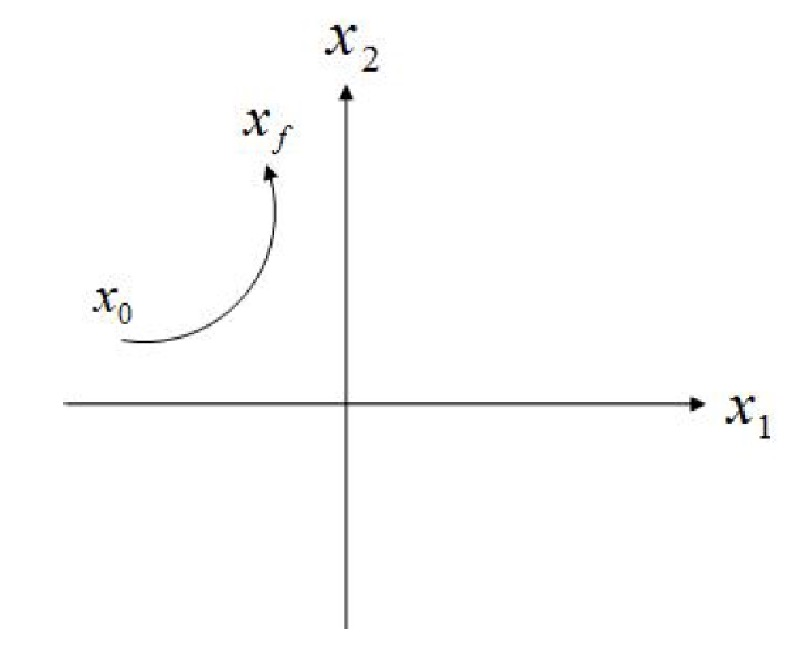

### State Space Realization
The problem of deriving a linear state space equation from a higher ODE or transfer function is called *realization*.

we have seen some realization examples from ODEs to the state space equation, we also introduced how to get a transfer function from the state space function.

But now, if we have a transfer function, what is the state space equation?

Given,

$$
P(s) = \frac{\beta(s)}{\alpha(s)} = \frac{b_0s^n + b_1s^{n - 1} + \ldots + b_{n - 1} s + b_n}{s^n + a_1 s^{n - 1} + \ldots + a_{n - 1} s + a_n}
$$

We want to find $\hat{n} \geq n, F \in \mathbb{R}^{\hat{n} \times \hat{n}}, G \in \mathbb{R}^{\hat{n} \times 1}, H \in \mathbb{R}^{1 \times \hat{n}}$ and $J \in \mathbb{R}$ such that,

$$
P(s) = H(sI - F)^{-1}G + J
$$

We call the system,

$$
\begin{aligned}
\dot{x} &= Fx + Gu \newline
y &= Hx + Ju
\end{aligned}
$$

a state space realization of $P(s)$ or $(F, G, H, J)$ a realization. $\hat{n}$ is the dimension of the realization.

### From Transfer Function to State Space
Consider the following system which has a simple transfer function,

$$
P(s) = \frac{s + 2}{s^2 + 7s + 12}
$$

Let $F = \begin{bmatrix} -7 & -12 \newline 1 & 0 \end{bmatrix}, G = \begin{bmatrix} 1 \newline 0 \end{bmatrix}, H = \begin{bmatrix} 1 & 2 \end{bmatrix}$ and $J = 0$.

Therefore,

$$
\begin{aligned}
\begin{bmatrix}
\dot{x}_1 \newline
\dot{x}_2
\end{bmatrix} &=
\begin{bmatrix}
-7 & -12 \newline
1 & 0 \end{bmatrix}
\begin{bmatrix}
x_1 \newline
x_2
\end{bmatrix} +
\begin{bmatrix}
1 \newline
0
\end{bmatrix} u \newline
y &=
\begin{bmatrix}
1 & 2
\end{bmatrix}
\begin{bmatrix}
x_1 \newline
x_2
\end{bmatrix}
\end{aligned}
$$

This is a realization of the transfer function $P(s)$.

If we observe the solution and our original transfer function, we can see a pattern.

#### Control Canonical Form Realization
Let,

$$
F =
\begin{bmatrix}
-a_1 & -a_2 & \ldots & -a_{n - 1} & -a_n \newline
1 & 0 & \ldots & 0 & 0 \newline
0 & 1 & \ldots & 0 & 0 \newline
\vdots & \vdots & \ddots & \vdots & \vdots \newline
0 & 0 & \ldots & 1 & 0
\end{bmatrix} \triangleq A_c
$$

$$
G =
\begin{bmatrix}
1 \newline
0 \newline
\vdots \newline
0
\end{bmatrix} \triangleq B_c,
H =
\begin{bmatrix}
b_1 & b_2 & \ldots & b_{n}
\end{bmatrix} \triangleq C_c, J = 0 \triangleq D_c
$$

$$
C_c(sI - A_c)^{-1}B_c = \frac{b_1s^{n - 1} + b_2s^{n - 2} + \ldots + b_n}{s^n + a_1s^{n - 1} + \ldots + a_n}
$$

##### Companion Matrix
The matrix $A_c$ is determined by the coefficients of the polynomial $\alpha(s)$ and is called the companion matrix of $\alpha(s)$.

We have a nice property of the companion matrix,

::::proposition
$\det(sI - A_c) = \alpha(s) = s^n + a_1s^{n - 1} + \ldots + a_n$
:::proof
For $n = 3$:

$$
A_c =
\begin{bmatrix}
-a_1 & -a_2 & -a_3 \newline
1 & 0 & 0 \newline
0 & 1 & 0
\end{bmatrix} \implies
sI - A_c =
\begin{bmatrix}
s + a_1 & a_2 & a_3 \newline
-1 & s & 0 \newline
0 & -1 & s
\end{bmatrix}
$$

Thus,

$$
\begin{aligned}
\det(sI - A_c) & = -(-1) \begin{vmatrix} s + a_1 & a_3 \newline -1 & 0 \end{vmatrix} + s \begin{vmatrix} s + a_1 & a_2 \newline -1 & s \end{vmatrix} \newline
& = a_3 + s((s + a_1)s + a_2) \newline
& = s^3 + a_1s^2 + a_2s + a_3
\end{aligned}
$$
:::
::::

### Observer Canonical Form Realization
Let,

$$
A_o = A_c^T =
\begin{bmatrix}
-a_1 \newline
\vdots & I_{n - 1} \newline
-a_{n - 1} \newline
-a_n & \mathbf{0}_{1 \times (n - 1)}
\end{bmatrix}
$$

$$
B_o = C_c^T = \begin{bmatrix} b_1 \newline \vdots \newline b_n \end{bmatrix}, C_o = B_c^T = \begin{bmatrix} 1 & 0 & \ldots & 0 \end{bmatrix}, D_o = 0
$$

Then,

$$
C_o(sI - A_o)^{-1}B_o = P(s) = \frac{b_1s^{n - 1} + b_2s^{n - 2} + \ldots + b_n}{s^n + a_1s^{n - 1} + \ldots + a_n}
$$

I.e.,

$$
\begin{aligned}
\dot{x} &= A_o x + B_o u \newline
y &= C_o x + D_o u
\end{aligned}
$$

is also a realization of $P(s)$.

:::example
Let,

$$
P(s) = \frac{b_1 s^2 + b_2 s + b_3}{s^3 + a_1 s^2 + a_2 s + a_3}
$$

Find the control canonical form realization and observer canonical form realization.

Let's start with control canonical form realization,

$$
A_c =
\begin{bmatrix}
-a_1 & -a_2 & -a_3 \newline
1 & 0 & 0 \newline
0 & 1 & 0
\end{bmatrix}
$$

$$
B_c =
\begin{bmatrix}
1 \newline
0 \newline
0
\end{bmatrix}
$$

$$
C_c =
\begin{bmatrix}
b_1 & b_2 & b_3
\end{bmatrix}
$$

For observer canonical form realization,

$$
A_o = A_c^T =
\begin{bmatrix}
-a_1 & 1 & 0 \newline
-a_2 & 0 & 1 \newline
-a_3 & 0 & 0
\end{bmatrix}
$$

$$
B_o = C_c^T =
\begin{bmatrix}
b_1 \newline
b_2 \newline
b_3
\end{bmatrix}
$$

$$
C_o = B_c^T =
\begin{bmatrix}
1 & 0 & 0
\end{bmatrix}
$$
:::

:::remark
1. Nonuniquess of realization, as we have seen previously, the realizations are not unique (we will discuss this shortly).
2. The dimension of a realization can be any integer greater or equal to $n$. If $\alpha(s)$ and $\beta(s)$ are coprime, then the minimal dimension of a realization of a transfer function is equal to n.
3. The transfer function of a state equation is invariant under a state transformation.
:::

### What is a Good Realization?
A realization can be viewed as a modeling method of physical system.

Since realizations are not unique, they can be good and bad realizations.

From the control point of view, we need to determine what makes a good realization.

**Controllability** and **observability** are two criterions to determine a good realization.

#### Controllability Matrix & Observability Matrix
The matrix,

$$
\begin{bmatrix}
B_c & A_cB_c & \ldots & A_c^{n - 1}B_c
\end{bmatrix}
$$

is called the controllability matrix of the system.

The matrix,

$$
\begin{bmatrix}
C_o \newline
C_oA_o \newline
\vdots \newline
C_oA_o^{n - 1}
\end{bmatrix}
$$

is called the observability matrix of the system.

NB: The elements of these matrices are matrices, for example,

Let $A = \begin{bmatrix} 1 & 2 \newline 3 & 4 \end{bmatrix}$ and $B = \begin{bmatrix} 5 & 6 \newline 7 & 8 \end{bmatrix}$, then the matrix $[A B]$ is,

$$
\begin{bmatrix}
1 & 2 & 5 & 6 \newline
3 & 4 & 7 & 8
\end{bmatrix}
$$

We are not going into the formal proof, but it can be verified that,

$$
\text{rank}
\begin{bmatrix}
B_c & A_cB_c & \ldots & A_c^{n - 1}B_c
\end{bmatrix} = n
$$

and

$$
\text{rank}
\begin{bmatrix}
C_o \newline
C_oA_o \newline
\vdots \newline
C_oA_o^{n - 1}
\end{bmatrix} = n
$$

**Remark**

One can always transform a given state description to control canonical form if and only if the controllability matrix is nonsingular (i.e., full rank).

#### Controllability
From the name, it suggests that, to what extent can the input $u$ affect the state $x$.

Let's go with this intuition for a moment.

Let's say we have two state variables $x_1$ and $x_2$.

The system is described by the following equations,

$$
\begin{aligned}
\dot{x_1} & = x_1, x_1(0) x_{10} \newline
\dot{x_2} & = x_2 + u, x_2(0) = x_{20}
\end{aligned}
$$

Thus, $x_1$ and $x_2$ in the time domain are,

$$
\begin{aligned}
x_1(t) & = e^t x_{10} \newline
x_2(t) & = e^t x_{20} + e^t \int_0^t e^{-\tau} u(\tau) d\tau
\end{aligned}
$$

No matter how $u(t)$ is chosen or designed, it cannot affect $x_1(t)$.

Note, this doesn't mean we can *specifically* design a system as a whole to go from a starting point $x_0$ to a final point $x_f$ given the right conditions.

But since this **generally** doesn't, hold, meaning we can not go from an arbitrary starting point to an arbitrary final point, we say the system is uncontrollable.

Let's now properly define controllability.

:::definition[Controllability]
The LTI system,
$$
\dot{x} = Fx + Gu, x(0) = 0, t \geq 0
$$
where $F \in \mathbb{R}^{n \times n}$ and $G \in \mathbb{R}^{n \times 1}$ is **controllable** on $[0, t_f]$ for some $t_f > 0$, if given any initial state $x_0$ and final state $x_f$, there exists a pieacewise continuous input $u(t)$ subject to the solutuion of the system, satifies
$$
x(t_f) = x_f
$$
:::

:::remark
It will be seen later that whether a system is controllable depends on $F$ and $G$, we also say that the pair $\{F, G\}$ is controllable or uncontrollable.
:::

:::theorem[Criterion for Controllability]
The system is controllable if and only if,
$$
\text{rank}
\begin{bmatrix}
G & FG & \ldots & F^{n - 1}G
\end{bmatrix} = n
$$
:::

:::example
Let's consider the system,

$$
F =
\begin{bmatrix}
0 & 1 \newline
-2 & -1
\end{bmatrix}, G =
\begin{bmatrix}
0 \newline
1
\end{bmatrix}
$$

We can see that this system is of order two, so let's first calculate $FG$.

$$
FG =
\begin{bmatrix}
1 \newline
-1
\end{bmatrix}
$$

Thus, the controllability matrix is,

$$
\begin{bmatrix}
0 & 1 \newline
1 & -1
\end{bmatrix}
$$

For matrices of size $2 \times 2$, we can easily calculate the determinant,

$$
\det
\begin{bmatrix}
0 & 1 \newline
1 & -1
\end{bmatrix} = (0 \cdot -1) - (1 \cdot 1) = -1
$$

Since the determinant is not zero, the controllability matrix is full rank, and the system is controllable.

On the other hamd, if

$$
F =
\begin{bmatrix}
1 & 0 \newline
0 & 1
\end{bmatrix}, G =
\begin{bmatrix}
0 \newline
1
\end{bmatrix}
$$

$$
FG =
\begin{bmatrix}
0 \newline
1
\end{bmatrix}
$$

Then, the controllability matrix is,

$$
\begin{bmatrix}
0 & 0 \newline
1 & 1
\end{bmatrix}
$$

The determinant of this matrix is zero, so the system is uncontrollable.
:::

:::recall[Rank of a matrix]
(This is just a refresher, skip if you are already familiar with this)

Let $A = [a_{ij}]$ be a $n \times m$ matrix. If $n = m$, then $A$ has full rank if and only if $A$ is nonsingular if and only if $\det(A) \neq 0$.

If $n < m$, then A has full rank if and only if $A$ contains a nonsingular $n \times n$ submatrix. An $n \times n$ submatrix of $A$ can be obtained from $A$ by removing any $m - n$ columns of $A$.

If $n > m$ then $A$ has full rank if and only if $A$ contains a nonsingular $m \times m$ submatrix. An $m \times m$ submatrix of $A$ can be obtained from $A$ by removing any $n - m$ rows of $A$.
:::

#### Observability
Observability is the dual of controllability. It is the extent to which the state $x$ can be determined from the output $y$.

The state $x$ may not have any physical meaning and may not be measurable. It is desirable to be able to estimate $x(t)$ from the information of $y(t)$ and $u(t)$.

If this is indeed the case, the state $x(t)$ is said to be observable from the input and output.

:::definition[Observability]
The LTI system,
$$
\begin{aligned}
\dot{x} & = Fx + Gu \quad x(0) = x_0 \newline
y & = Hx + Ju \quad t \geq 0
\end{aligned}
$$
is observable if for any $t > 0$, $x(t)$ can be determined from $y(t)$ and $u(t)$.
:::

:::theorem[Criterion for Observability]
The system is observable if and only if,
$$
\text{rank}
\begin{bmatrix}
H \newline
HF \newline
\vdots \newline
HF^{n - 1}
\end{bmatrix} = n
$$
:::

:::example
Let's consider the system,

$$
F =
\begin{bmatrix}
0 & 0 & 2 \newline
0 & 0 & 1 \newline
-2 & 0 & 0
\end{bmatrix}, G =
\begin{bmatrix}
1 & 0 \newline
0 & 0 \newline
0 & 1
\end{bmatrix}, H =
\begin{bmatrix}
1 & 0 & 0
0 & 0 & 1
\end{bmatrix}
$$

We can see that this system is of order three, so let's first calculate $F^2$, $HF$, and $HF^2$.

$$
F^2 =
\begin{bmatrix}
-4 & 0 & 0 \newline
-2 & 0 & 0 \newline
0 & 0 & -2
\end{bmatrix}
$$

$$
HF =
\begin{bmatrix}
0 & 0 & 2 \newline
-2 & 0 & 0
\end{bmatrix}
$$

$$
HF^2 =
\begin{bmatrix}
-4 & 0 & 0 \newline
0 & 0 & -2
\end{bmatrix}
$$

Thus, the observability matrix is,

$$
\begin{bmatrix}
1 & 0 & 0 \newline
0 & 0 & 1 \newline
0 & 0 & 2 \newline
-2 & 0 & 0 \newline
-4 & 0 & 0 \newline
0 & 0 & -2
\end{bmatrix}
$$

We can see that we have a zero column in the matrix, which means the columns are not linearly independent which means not full rank, so the system is not observable.
:::

:::example
Let's consider the system,

$$
F =
\begin{bmatrix}
0 & -0.1 \newline
1 & -0.2
\end{bmatrix}, H =
\begin{bmatrix}
0 & 1
\end{bmatrix}
$$

We can see that this system is of order two, so let's first calculate $HF$.

$$
HF =
\begin{bmatrix}
1 & -0.2
\end{bmatrix}
$$

Thus, the observability matrix is,

$$
\begin{bmatrix}
0 & 1 \newline
1 & -0.2
\end{bmatrix}
$$

Which we can see has a non-zero determinant, so the system is observable.
:::

### Properties and Remarks
1. $\{A_c, B_c, C_c\}$ is always controllable, but may not be observable. But if $C_c(sI - A_c)^{-1} B_c$ is irreducible, then $\{A_c, B_c, C_c\}$ is also observable.
2. $\{A_o, B_o, C_o\}$ is always observable, but may not be controllable. But if $C_o(sI - A_o)^{-1} B_o$ is irreducible, then $\{A_o, B_o, C_o\}$ is also controllable.
3. Define $C(F, G) = \begin{bmatrix} G & FG & \ldots & F^{n - 1}G \end{bmatrix}$ and call it the controllability matrix, and $O(H, F) = \begin{bmatrix} H \newline HF \newline \vdots \newline HF^{n - 1} \end{bmatrix}$ and call it the observability matrix.
