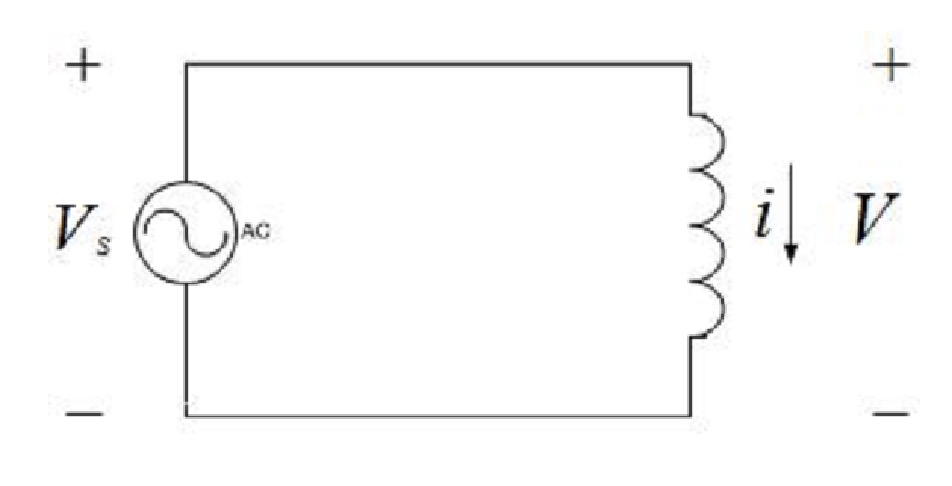
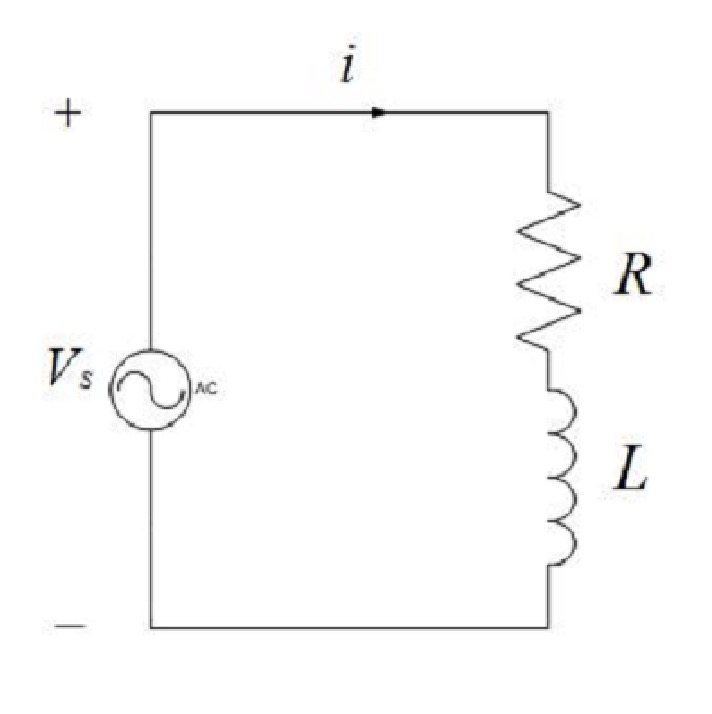
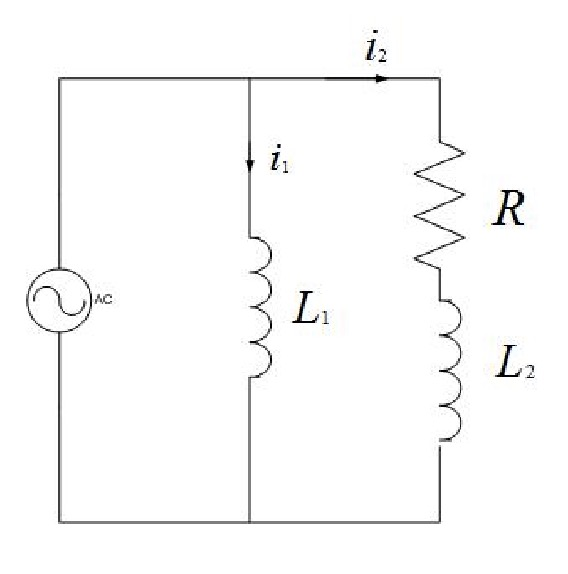

### Internal Stability
Consider the LTI system,

$$
\begin{align*}
\dot{x} &= Fx + Gu \quad x(0) = x_0, t \geq 0 \newline
y &= Hx + Ju
\end{align*}
$$

where $F \in \mathbb{R}^{n \times n}$, $G \in \mathbb{R}^{n \times 1}$, $H \in \mathbb{R}^{1 \times n}$, and $J \in \mathbb{R}^{1 \times 1}$.

:::definition[Internal stability]
The LTI system is said to be *internally stable* if the zero input solution approaches 0 as $t \to \infty$ for any $x(0)$, or in mathematical terms,
$$
\lim_{t \to \infty} x(t) = \lim_{t \to \infty} e^{Ft}x(0) = 0, \quad \forall x_0.
$$
:::

:::theorem[Internal Stability Theorem]
The LTI system is said to be internally stable if and only if all the eigenvalues of $F$ have negative real parts.
:::

Let's take a look at an example.

:::example
Consider this simple circuit with one inductor.

We consider the current $i$ as the output and the voltage source $V_s$ as the input.

We know that the voltage across the inductor is given by,

$$
V = L \frac{di}{dt}
$$

From KVL, we get,

$$
V_s = V
$$

Solving $i$ in terms of $V_s$, we get

$$
i = i(0) + \int_0^t \frac{V_s}{L} dt
$$

If we assume $V_s = 1, t \geq 0$, then

$$
i = i(0) + \frac{t}{L}, \quad t \geq 0
$$

Thus, the transfer function is

$$
\frac{I(s)}{V_s(s)} = \frac{1}{Ls}
$$

Since the poles of the system are at $s = 0$, the system is not internally stable.

We can also see this from the time domain solution.
If the time goes to infinity, the current will go to infinity.
:::

:::example
Let's add a resistor before the inductor.

With KVL we know that,

$$
V_s = Ri + L \frac{di}{dt}
$$

Thus, the transfer function is

$$
\frac{I(s)}{V_s(s)} = \frac{1}{Ls + R}
$$

The poles of the system are at $s = -\frac{R}{L}$.
Since both $R$ and $L$ are positive, the poles are negative, and the system is internally stable.

:::

:::example
Now, let's combine these two circuits and also find the state space equations for it.

From KVL, we get

$$
\begin{align*}
L_1 \frac{di_1}{dt} = V_s \newline
R i_2 + L_2 \frac{di_2}{dt} = V_s
\end{align*}
$$

Let $x = \begin{bmatrix} x_1 \newline x_2 \end{bmatrix} = \begin{bmatrix} i_1 \newline i_2 \end{bmatrix}$, then the state space equations are

$$
\begin{align*}
\begin{bmatrix} \dot{x_1} \newline \dot{x_2} \end{bmatrix} &= \begin{bmatrix} 0 & 0 \newline 0 & -\frac{R}{L_2} \end{bmatrix} \begin{bmatrix} x_1 \newline x_2 \end{bmatrix} + \begin{bmatrix} \frac{1}{L_1} \newline \frac{1}{L_2} \end{bmatrix} V_s \newline
y &= \begin{bmatrix} 1 & 0 \end{bmatrix} \begin{bmatrix} x_1 \newline x_2 \end{bmatrix}
\end{align*}
$$

We can see that $F = \begin{bmatrix} 0 & 0 \newline 0 & -\frac{R}{L_2} \end{bmatrix}$.

Remember that the eigenvalues of a matrix can be found by,

$$
\begin{align*}
\det(F - \lambda I) &= 0 \newline
\det\left(\begin{bmatrix} -\lambda & 0 \newline 0 & -\frac{R}{L_2} - \lambda \end{bmatrix}\right) &= 0 \newline
\lambda^2 + \frac{R}{L_2} \lambda &= 0 \newline
\lambda(\lambda + \frac{R}{L_2}) &= 0
\lambda_0 = 0, \lambda_1 = -\frac{R}{L_2}
\end{align*}
$$

Since we have one eigenvalue which is not negative, the system is not internally stable.
:::

### State Feedback Control
Given the LTI system,

$$
\begin{align*}
\dot{x} &= Fx + Gu \quad x(0) = x_0, t \geq 0 \newline
y &= Hx + Ju
\end{align*}
$$

where $F \in \mathbb{R}^{n \times n}$, $G \in \mathbb{R}^{n \times m}$, $H \in \mathbb{R}^{p \times m}$, and $J \in \mathbb{R}^{p \times m}$.

The **control law** of the form

$$
u = -Kx + Mr, K \in \mathbb{R}^{m \times n}, M \in \mathbb{R}^{m \times m},
$$

is called a **state feedback control**.

If we substitute the control law into the state space equations, we get

$$
\begin{align*}
\dot{x} &= (F - GK)x + GMr = F_cx + G_c r \newline
y &= Hx + Ju
\end{align*}
$$

whihc is called the **closed-loop system** under the state feedback control.

**Remark**

1. $K$ and $M$ can modify $F$ and $G$, thus the behavior of the entire system.
2. $K$ is called the **feedback** gain. It can be used to *stabilize* the system and modify the *trasnient* response.
3. $M$ is called the **feedforward** gain. It can be used for *tracking and disturbance rejection* and modify the *steady state* response.
4. The state space equation above is called the state feedback since the state is the feedback signal.

### State Feedback Stabilization
Let's first look at this when we have $r = 0$. In other words,

$$
u = -Kx
$$

and the closed loop system becomes,

$$
\dot{x} = (F - GK)x
$$

We denote the $n$ eigenvalues of the matrix $F - GK$ with $\lambda_I(F - GK), i = 1, 2, \ldots, n$.

Then, the system is said to be internally stable if and only if,

$$
\Re(\lambda_i(F - GK)) < 0, \quad i = 1, 2, \ldots, n,
$$

where $\Re(\lambda_i)$ denotes the real part of the eigenvalue $\lambda_i$.

We call the problem of fidning $K \in \mathbb{R}^{m \times n}$ subject to the above as the **state feedback stabilization problem**.

#### Eigenvalue Placement Problem
Before we figure out how we find (and place) our eigenvalues, let us make some preparations.

1. Let $\lambda = x + iy$ be a complex number where $i = \sqrt{-1}$. Then the *complex conjugate* of $\lambda$ is a complex number $x - iy$ denoted by $\bar{\lambda}$.
2. As set of $n$ complex numbers $\{\lambda_{d_1}, \lambda_{d_2}, \ldots, \lambda_{d_n}\}$ is said to be *self-conjugate* if and only if,
$$
\lambda \in \{\lambda_{d_1}, \lambda_{d_2}, \ldots, \lambda_{d_n}\} \Rightarrow \bar{\lambda} \in \{\lambda_{d_1}, \lambda_{d_2}, \ldots, \lambda_{d_n}\}
$$

3. If $\lambda$ is a root of a polynomial with real coefficients, so is $\bar{\lambda}$.

Now, for the problem.

:::problem[Eigenvalue placement]
Given a set of $n$ self-conjugate complex numbers $\{\lambda_{d_1}, \lambda_{d_2}, \ldots, \lambda_{d_n}\}$, find $K \in \mathbb{R}^{m \times n}$ such that,
$$
\{\lambda_i(F - GK), i = 1, 2, \ldots, n\} = \{\lambda_{d_1}, \lambda_{d_2}, \ldots, \lambda_{d_n}\}
$$
:::

:::remark
If all $\lambda_{d_1}, \lambda_{d_2}, \ldots, \lambda_{d_n}$ are chosen such that they have negative real parts, then the solution of the eigenvalue placement problem leads to the solution of the state feedback stabilization problem.
:::

Let,

$$
\begin{align*}
q(s) & = (s - \lambda_{d_1}) \ldots (s - \lambda_{d_n}) \newline
& = s^n + \alpha_1 s^{n-1} + \ldots + \alpha_{n-1} s + \alpha_n
\end{align*}
$$

Then the eigenvalue placement problem is equivalent to that of finding $K \in \mathbb{R}^{m \times n}$ such that,

$$
\det(sI - (F - GK)) = q(s)
$$

We will only focus on single input systems, i.e., $m = 1$.

#### Ackermann's Formula
Let $q(s) = s^n + \alpha_1 s^{n-1} + \ldots + \alpha_{n-1} s + \alpha_n$ be the desired polynomial.

:::theorem[Ackermann's Formula]
Assume $[F, G]$ is controllable. Then,
$$
K = \begin{bmatrix} 0 & 0 & \ldots & 0 & 1 \end{bmatrix} C^{-1}(F, G) q(F)
$$

where $q(F) = F^n + \alpha_1 F^{n-1} + \ldots + \alpha_{n-1} F + \alpha_n I$ and $C^{-1}(F, G)$ is the inverse of the controllability matrix.
:::

:::example[Pendulum]
Suppose you have a pendulum with frequency $\omega_0$ described by,

$$
\dot{x} = \begin{bmatrix} 0 & 1 \newline -\omega_0^2 & 0 \end{bmatrix} x + \begin{bmatrix} 0 \newline 1 \end{bmatrix} u
$$

Find the control law that places the closed loop eigenvalues of the system at $-2\omega_0$.

Since we have a double pole, the desired polynomial is,

$$
q(s) = (s + 2\omega_0)^2 = s^2 + 4\omega_0 s + 4\omega_0^2
$$

##### Ackermann's Formula
Since we have a system of order two, the controllability matrix is,

$$
C(F, G) = \begin{bmatrix} G & FG \end{bmatrix}
$$

Firstly, let's find $FG$,

$$
FG =
\begin{bmatrix}
1 \newline
0
\end{bmatrix}
$$

Then, we can find $C(F, G)$,

$$
C(F, G) =
\begin{bmatrix}
0 & 1 \newline
1 & 0
\end{bmatrix}
$$

Now, we can find the inverse of $C(F, G)$,

$$
C^{-1}(F, G) =
\begin{bmatrix}
0 & 1 \newline
1 & 0
\end{bmatrix}
$$

Now, for $q(F)$, we need to find $F^2$,

$$
F^2 =
\begin{bmatrix}
-\omega_0^2 & 0 \newline
0 & -\omega_0^2
\end{bmatrix}
$$

Then, we can find $q(F)$,
$$
\begin{align*}
q(F) &= F^2 + 4\omega_0 F + 4\omega_0^2 I \newline
&=
\begin{bmatrix}
-\omega_0^2 & 0 \newline
0 & -\omega_0^2
\end{bmatrix} + 4\omega_0
\begin{bmatrix}
0 & 1 \newline
-\omega_0^2 & 0
\end{bmatrix} + 4\omega_0^2 I \newline
&=
\begin{bmatrix}
3\omega_0^2 & 4\omega_0 \newline
-4\omega_0^3 & 3\omega_0^2
\end{bmatrix}
\end{align*}
$$

Which finally means,

$$
K =
\begin{bmatrix} 0 & 1 \end{bmatrix}
\begin{bmatrix}
0 & 1 \newline
1 & 0
\end{bmatrix}
\begin{bmatrix}
3\omega_0^2 & 4\omega_0 \newline
-4\omega_0^3 & 3\omega_0^2
\end{bmatrix} =
\begin{bmatrix}
3\omega_0^2 & 4\omega_0
\end{bmatrix}
$$

##### Direct Method
Let $K = \begin{bmatrix} k_1 & k_2 \end{bmatrix}$. Then,

$$
F - GK =
\begin{bmatrix}
0 & 1 \newline
-\omega_0^2 & 0
\end{bmatrix} -
\begin{bmatrix}
0 \newline
1
\end{bmatrix}
\begin{bmatrix} k_1 & k_2 \end{bmatrix} =
\begin{bmatrix}
0 & 1 \newline
-\omega_0^2 - k_1 & -k_2
\end{bmatrix}
$$

For the matrix equation $sI - (F - GK)$, we get

$$
sI - (F - GK) =
\begin{bmatrix}
s & -1 \newline
\omega_0^2 + k_1 & s + k_2
\end{bmatrix}
$$

The determinant of this matrix is,

$$
\begin{align*}
\det(sI - (F - GK)) &= s(s + k_2) - (-1)(\omega_0^2 + k_1) \newline
&= s^2 + k_2 s + \omega_0^2 + k_1
\end{align*}
$$

If we compare this with the desired polynomial,

$$
s^2 + 4\omega_0 s + 4\omega_0^2
$$

we can see that $k_1 = 3\omega_0^2$ and $k_2 = 4\omega_0$.
:::

:::remark
1. For lower order systems such as $n = 2,3$, the direct method is more convenient.
Otherwise use built in functions if available.

2. How to decide $q(s)$ or desirable eigenvalues of $(F - GK)$? This is an important question, the locations of the closed loop poles mainly depend on the requirements of transient response such as the rise time, overshoot, and settling time. Also, it is important to achieve a balance between a good system response and control effort.

3. To move the poles a long way requires large gains, which is not always possible.
:::

### Asymptotic Tracking
Given a plant,

$$
\begin{align*}
\dot{x} &= Fx + Gu \quad x(0) = x_0, t \geq 0 \newline
y &= Hx + Ju
\end{align*}
$$

where $F \in \mathbb{R}^{n \times n}$, $G \in \mathbb{R}^{n \times m}$, $H \in \mathbb{R}^{p \times n}$, and $J \in \mathbb{R}^{p \times m}$.

and a reference input $r$, the control law of the form

$$
u = -Kx + Mr
$$

such that $(F - GK)$ is stable, or in other words $\Re(\lambda_i(F - GK)) < 0, i = 1, 2, \ldots, n$. and,
$lim_{t \to \infty} (y(t) - r(t)) = 0$ is called an **asymptotic tracking control**.

#### Solution with $r$ constant
Let $K \in \mathbb{R}^{1 \times n}$ be such that $F - GK$ is stable, and $N_x \in \mathbb{R}^{n \times 1} and N_u \in \mathbb{R}^{1 \times 1}$ be given by,

$$
\begin{bmatrix}
N_x \newline
N_u
\end{bmatrix} =
\begin{bmatrix}
F & G \newline
H & J
\end{bmatrix}^{-1}
\begin{bmatrix}
\mathbf{0}_{n \times 1} \newline
1
\end{bmatrix}
$$

This is equivalent to,

$$
\begin{align*}
F N_x + G N_u &= \mathbf{0}_{n \times 1} \newline
H N_x + J N_u &= 1
\end{align*}
$$

Then, the following control law solves the asymptotic tracking problem,

$$
u = -Kx + Mr, \quad M = N_u + K N_x
$$

##### Proof
Under $u = -Kx + Mr = N_u r - K(x - N_x r)$, the closed loop system satisfies,

$$
\begin{align*}
\dot{x} &= Fx + GN_u r - GK(x - N_x r) \newline
&= F(x - N_x r) + F N_x r 0 G N_u r - GK(x - N_x r) \newline
&= (F - GK)(x - N_x r) + (F N_x + G N_u) r \newline
&= (F - GK)(x - N_x r)
\end{align*}
$$

Similarly,

$$
\begin{align*}
y &= Hx + Ju = Hx + J(N_u r - K(x - N_x r)) \newline
&= H(x - N_x r) + H N_x r + J N_u r - JK(x - N_x r) \newline
&= (H - JK)(x - N_x r) + (H N_x + J N_u) r \newline
&= (H - JK)(x - N_x r) + r
\end{align*}
$$

Clearly if $lim_{t \to \infty} (x(t) - N_x r) = 0$, then $lim_{t \to \infty} y(t) = r(t)$.

But let $z = x - N_x r$, then $\dot{z} = \dot{x} - 0 = \dot{x}$.

Which means,

$$
\dot{z} = (F - GK)z
$$

it follows from the stability of $(F - GK)$ that $\lim_{t \to \infty} z(t) = 0$.

Let $x_{ss} = N_x r$. Then $\lim_{t \to \infty} z(t) = 0$ implies $\lim_{t \to \infty} x(t) = x_{ss}$.

We call $x_{ss}$ the steady state value of $x$.

**Remark**

It is also possible to obtain an output feedback control law as follows,

$$
\begin{align*}
u &= -K\hat{x} + Mr \newline
\dot{\hat{x}} &= F\hat{x} + Gu + L(y - H\hat{x})
\end{align*}
$$

where $L$ i such taht $(F -LH)$ is stable.

**Remark**

The control law can also be written as follows,

$$
\begin{align*}
u &= -Kx + Mr = -Kx + (N_u + K N_x)r \newline
&= N_u r - K(x - N_x r)
&= u_{ss} - k(x - x_{ss})
\end{align*}
$$

where $u_{ss} = N_u r$.

It can be seen that,

$$
\lim_{t \to \infty} u(t) = u_{ss}
$$

which is the steady state input.

When $r = $, $u_{ss} = 0$ and $x_{ss} = 0$.

the control law becomes,

$$
u = -Kx
$$

Thus, the stabilization problem is a special case of the asymptotic tracking.

:::example
Given,

$$
\begin{align*}
\dot{x} &=
\begin{bmatrix}
0 & 1 \newline
-\omega_0^2 & 0
\end{bmatrix} x +
\begin{bmatrix}
0 \newline
1
\end{bmatrix} u = Fx + Gu \newline
y &=
\begin{bmatrix}
1 & 0
\end{bmatrix} x = Hx
\end{align*}
$$

Find $u = -Kx + Mr$ such that,

$$
\det(sI - (F - GK)) = s^2 + 4\omega_0 s + 4\omega_0^2
$$

and

$$
\lim_{t \to \infty} y(t) = r(t)
$$

Let $\omega_0 = 1$.

##### Solution
As we previously have found $K$ to be,

$$
K =
\begin{bmatrix}
3\omega_0^2 & 4\omega_0
\end{bmatrix} =
\begin{bmatrix}
3 & 4
\end{bmatrix}
$$

Then, we can find $N_x$ and $N_u$ which satisfies,

$$
F N_x + G N_u = \mathbf{0}_{2 \times 1}
$$

and

$$
H N_x + J N_u = 1
$$

By solving these equations, we get,

$$
N_x =
\begin{bmatrix}
1 \newline
0
\end{bmatrix}, N_u = 1
$$

Then, let $M = N_u + K N_x = 1 + 3 = 4$.

Thus, the control law is,

$$
u = -Kx + Mr = -3x_1 - 4x_2 + 4r
$$
:::
