### Image Classification
Goal: Given a photographic image, predict the object class (a.k.a., object recognition).
Typically, we only have one main object present, but we can have more (multi-label classification).

If enough classes are considered, then it is a generic high-level vision task.

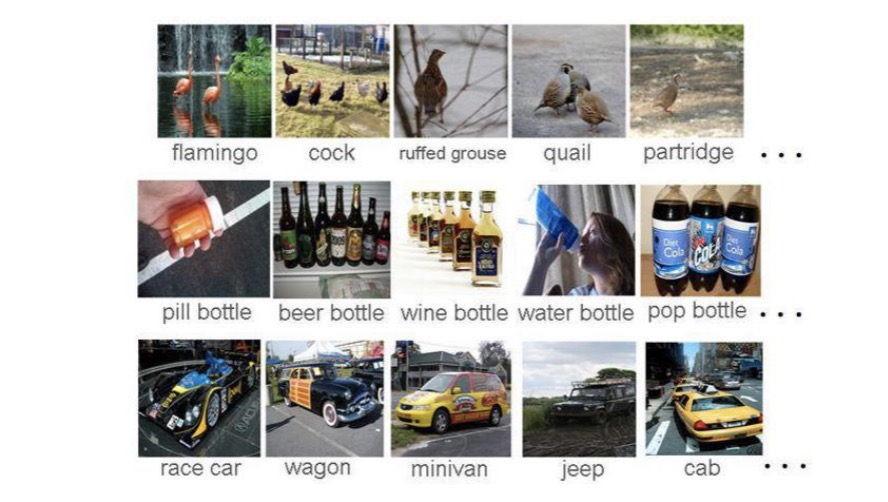

#### ImageNet
ImageNet is a large-scale dataset for image classification. It has 1.2 million images and 1000 classes. It is used for the ImageNet Large Scale Visual Recognition Challenge (ILSVRC).

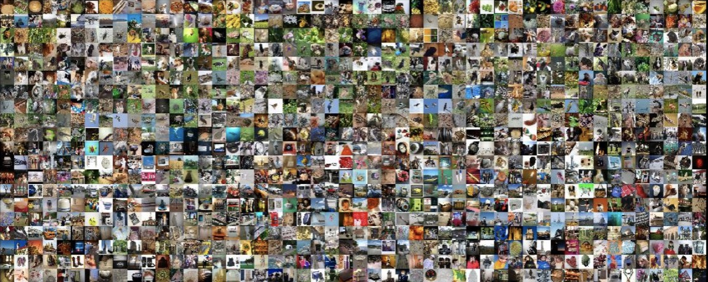

#### Performance of Deep Learning
The introduction of ILSVRC coincided with the emergence of deep learning.

The top-5 error rates decreased as deeper neural networks were developed (note, not just deeper, but the architecture designs were smarter).

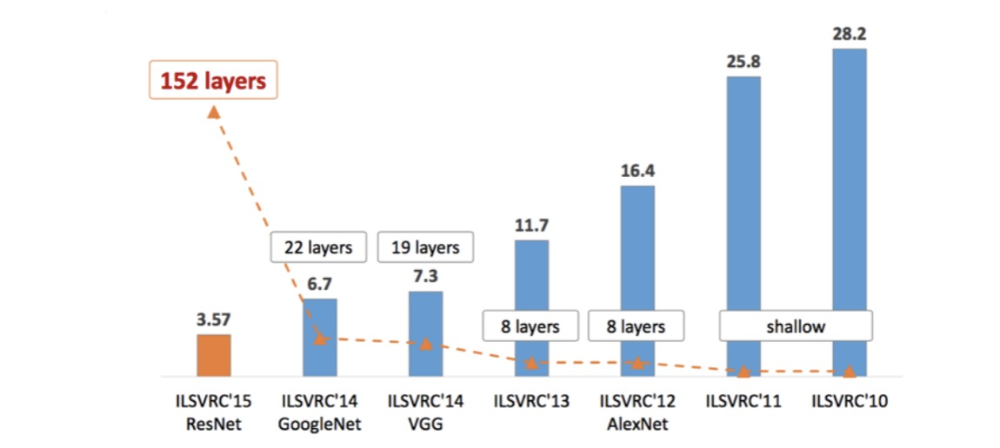

#### LeNet-5 (1998)
LeNet-5 was one of the first convolutional neural networks (CNNs) for image classification. It was developed by Yann LeCun @cite:lecun1998gradient.

It has a total of 7 layers, it includes convolutions & pooling and a final fully-connected layer.
The architecture was designed for hand-written digit recongition (MNIST).

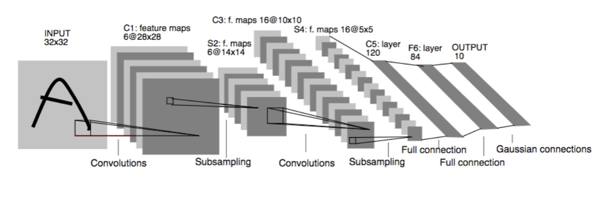

#### AlexNet
AlexNet was the first deep CNN to win the ILSVRC in 2012. It was developed by Alex Krizhevsky, Ilya Sutskever, and Geoffrey Hinton @cite:krizhevsky2012imagenet.

It has a similiar architecture to LeNet, but deeper (14 layers). It has $11 \times 11$, $5 \times 5$, and $3 \times 3$ convolutions.

But the architecture is not the only new thing, they used some clever new tricks as well.
For example, ReLU is used, they use so called 'local response normalization', dropout is utilized, as well as max pooling, some data augmentation techniques and SGD with momentum.

Many consider AlexNet as the start of the deep learning revolution.
Partly because of the deep(er) architecture and the tricks used along with it, but also since it was one of the first networks to be trained on GPUs.

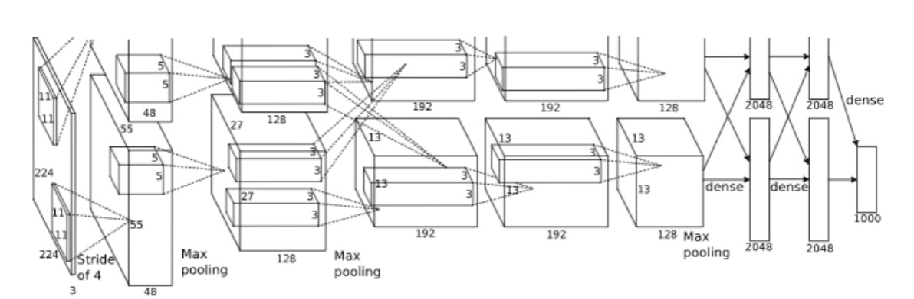

We can see that in @fig:an, it is split in two pipelines because it was trained on 2 GPUs simultaneously.

#### VGGNet
VGGNet was the runner-up in ILSVRC 2014. It was developed by the Visual Geometry Group at the University of Oxford @cite:simonyan2014vgg.

It has the same style as LeNet and AlexNet, but made some other design choices.

The VGGNet only uses $3 \times 3$ convolutional filters (since it is fewer parameters).

They stack several convolutional layers on top of each other before pooling.

But the main difference is that the number of feature channels doubles after each stage.
This ensures they can capture more higher-level features, VGG features are very effective in modeling aspects of human perception because of this.

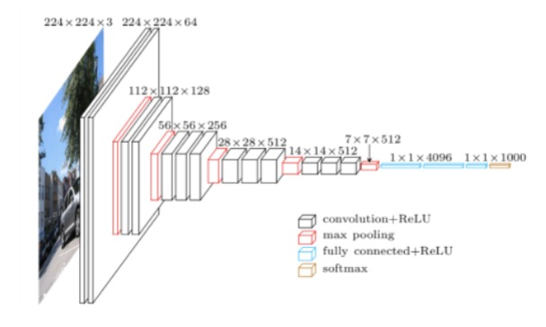

#### Inception Module
The Inception Module was introduced in the GoogLeNet architecture, which won ILSVRC 2014 @cite:szegedy2015going.

It is called a "Network-in-Network" architecture, because it has several convolutional layers in parallel.
The idea is that they extract features at different scales ($1 \times 1$, $3 \times 3$, $5 \times 5$).

Then they pool these features with a $3 \times 3$ max pooling layer.
Features are also concatenated and passed to the next block (which we will become more important later).

#### InceptionNet (V1)
The InceptionNet (V1) architecture is a combination of several Inception Modules.

It has 9 inception modules, 22 layers and 50 convolutional blocks.

The InceptionNet were made for auxiliary classification tasks.
It uses features in the middle of the network to perform classification.

#### Residual Learning
The network is learning a function (image to class).
We can think of this as we are building the function block-by-block.

We can allow blocks to learn a *residual*, which is added to the previous block.
This allows us to keep all the previous information and make small changes with the residual.

A novel intuition here is that this behaves like ensembles of relatively shallow networks.

#### Residual Network (ResNet)
The ResNet architecture was introduced in 2015 and won ILSVRC 2015 @cite:he2016resnet.

There are different sizes of ResNet, but the most famous one is the ResNet-50 (50 layers).
ResNet uses $3 \times 3$ filters and have residual connections every two layers.

#### ResNeXt
ResNeXt combines the split-transform-aggregate strategy in the Inception network and the residual learning in ResNet.

The number of paths inside the ResNeXt block is defined as **cardinality**.
All the paths contain the same topology.

Instead of having high depth and width, having high cardinality helps in decreasing validation error.

#### Squeeze-and-Excitation Networks (SENets)
A block for CNNs that improves channel interdependencies.
Adds a parameter to each channel of a convolutional block so that the network adaptively adjusts the weighting of each feature map.

#### Vision Transformers (ViTs)
Vision Transformers (ViTs) emerge as a competetive alternative to CNNs that are currently the state-of-the-art (SOTA) in computer vision and widely used for various image recognition tasks @cite:dosovitskiy2021vit.

Three major processing elements in transformer encoder: Layer normalization, multi-head attention, and multi-layer perceptron (MLP).

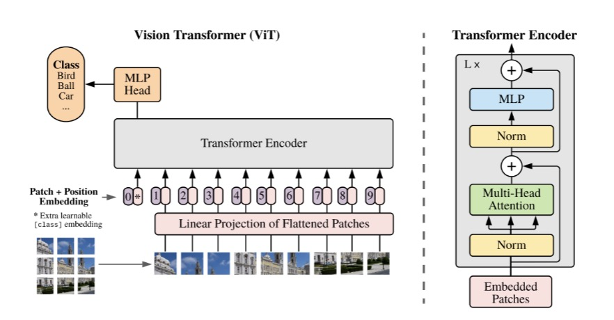

#### Contrastive Language-Image Pretraining (CLIP)
CLIP is an open-source, multi-modal, zero-shot model.

It uses both a text encoder (transformers) and a image encoder (ViT or ResNet architectures).

These encoders are trained to maximize the similarity of a dataset of 400 million (image, text) pairs.

### Object Detection
Goal: Identify and locate objects within an image or video.
Not only does this involve recognizing the object categories within an image, but also accurately detemining their locations in it.

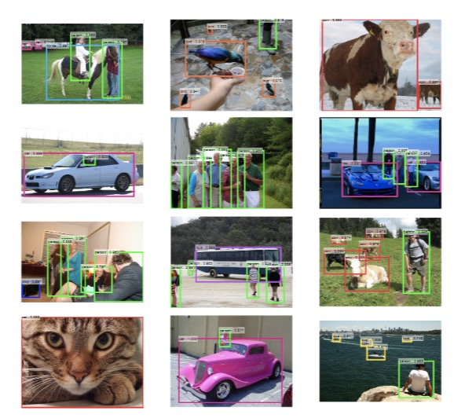

Typically, represented as bounding boxes, as seen in @fig:od.

#### MS COCO
Microsoft Common Objects in Context (MS COCO) is a large-scale dataset for object detection, segmentation, and captioning.

It consists of over a million images, encompassing 80 different object categories.

#### Region-based CNN (R-CNN)
R-CNN was the first deep learning model for object detection.

It consists of four steps:

1. Region Proposal
2. Feature Extraction
3. Classification
4. Bounding Box Regression

But R-CNN has some limitations.
We can get bad candidate region proposals, since we are using a selective search algorithm.

It is also very time-consuming, 2000 forward propagations for each image.

#### Fast R-CNN
Fast R-CNN was introduced to address the limitations of R-CNN.

The four steps are instead:

1. Input and Convolutional Feature Extraction
2. Region Proposal
3. Region of Interest (RoI) Pooling
4. Classification and Bounding Box Regression

The RoI pooling layer is used to extract a fixed-size feature map from the feature map of the CNN.

However, Fast R-CNN still has some limitations.
Since the RoI are fixed in size, this will reduce accuracy for objects of different scales or aspect ratios.

Also the region proposal is a non-learnable step.

#### Faster R-CNN
This is the third iteration of the R-CNN family.

1. Input and Convolutional Feature Extraction
2. Region Proposal Network
3. Region of Interest (RoI) Pooling
4. Classification and Bounding Box Regression

The Region Proposal Network (RPN) is a learnable network that predicts the region proposals.

#### Object Detection: Lots of Variables
One-stage, two-stage, and Transformer series are three main frameworks in object detection.

* One-stage focus on speed and may sacrifice some accuracy.
* Two-stage has high accuracy, but the speed is relatively slow.
* Transformer series is based on Vision Transformers.

Which framework to choose depends on the application and performance requirements.

:::table[Examples of one-stage, two-stage, and Transformer object-detection frameworks.]{#object-detection-frameworks}
| **One-Stage** | **Two-Stage** | **Transformer Series** |
| --- | --- | --- |
| YOLOv1 | R-CNN | DETR |
| YOLOv2 | Fast R-CNN | DN-DETR |
| $\vdots$ | $\vdots$ | $\vdots$ |
| YOLOv8 | Faster R-CNN | Focus-DETR |
:::

### Semantic Segmentation
Goal: Assign a semantic class label to each pixel in an image.

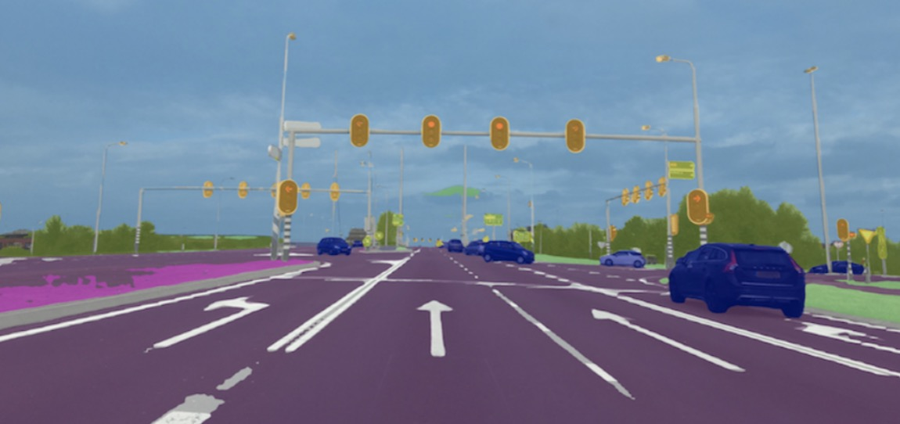

#### PASCAL VOC
PASCAL visual object classes (VOC) is a dataset for object detection, segmentation, and classification.

It consists of 20 object classes, 9.9k (VOC2007) and 23k (VOC2012) images, and 24.6k (VOC2007) and 54.9k (VOC2012) objects.

#### Fully Convolutional Networks (FCN)
Fully Convolutional Networks (FCN) is a framework for image semantic segmentation @cite:long2015fcn.
The core idea is:

* A fully convolutional network without fully connected layers, capable of adapting to inputs of arbitrary sizes.
* A skip architecture that combines results from different depth layers while ensuring both robustness and precision.

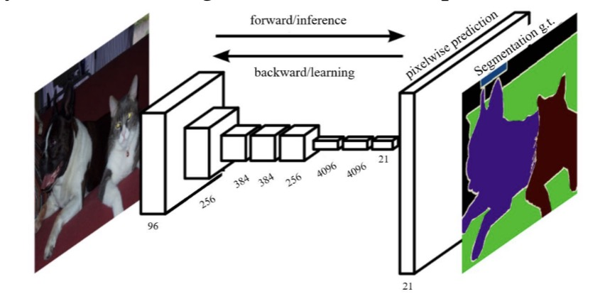

However, the limitation of FCNs are that it directly upsamples the compact features.

#### DeConv
DeConv proposes a deconvolution network with unpooling operation to predict the segmentation map.

First, the convolution network downsamples the feature representations.
Then, the deconvolution network upsamples the compact features maps and refine the dense predictions.

### Instance Segmentation
Goal: Detect objects in an image and label each pixel at the same time.

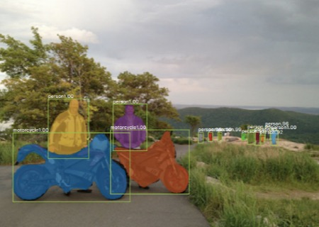

Compared with object detection, it outputs a mask instead of a bounding box.
Compared with semantic segmentation, it distinguishes between different instances in the same class.

#### Mask R-CNN
Mask R-CNN is a framework for instance segmentation.

1. Input and Convolutional Feature Extraction
2. Region Proposal Network (RPN)
3. Region of Interest (RoI) Align
4. Classification, Bounding Box Regression, and Mask Prediction

The RoI Align layer is used to extract a fixed-size feature map from the feature map of the CNN.

### Model Comparison
The conventional model comparison methodology is,

* Pre-select a number of images from the space of all possible natural images (i.e., natural images manifold) to form the test set.
* Collect the human label for each image in the test set to identify its ground-truth category.
* Rank the competing classifiers according to their goodness of fit (e.g., accuracy) on the test set.

However, as always we will have limitations.

* The test sets are small, fixed, and extensively reused.
* More fundamentally, the underlying philosophy is to **prove** a classifier to be correct, which is impossible to achieve.

#### MAximum Discrepancy (MAD) Competition
MAximum Discrepancy (MAD) attempts to **falsify** two classifiers by maximizing their prediction discrepancy.

A classifier that is harder to be falsified in MAD is considered to be better.

#### Quantify the Discrepancy
We can not use the zero-one loss to quantify the discrepancy between two classifiers.

* The zero-one loss is not continuous and not differentiable.
* Lack of sensitivity to the prediction confidence.
* Instability and lack of robustness.

### Low-Level Vision
Low-level vision tasks are the fundamental building blocks of high-level vision tasks.
For example, image denoising, image deblurring, image super-resolution, and image inpainting.

#### General Formulation
$$
\mathbf{y} = \mathbf{A} \mathbf{x} + \mathbf{e}.
$$

where $\mathbf{x}$ is the signal to be recovered.

$\mathbf{e}$ is the measurement noise.

$\mathbf{A}$ is the Sensing Matrix.

$\mathbf{y}$ is the measurements.

*Fidelity* is the closeness between the recovered signal and the original signal, i.e.,

$$
\underset{\mathbf{x}}{\min} \Vert \mathbf{y} - \mathbf{A} \mathbf{x} \Vert_2^2
$$

However, we can't just rely on fidelity, we can obtain the same fidelity with different solutions.
Where one solution is better than the other. Thus, prior knowledge is needed.

#### Maximum a Posteriori (MAP) Estimation for Image Enhancement
$$
\underset{\mathbf{x}}{\min} \Vert \mathbf{y} - \mathbf{A} \mathbf{x} \Vert_2^2 + \lambda \phi(\mathbf{x})
$$

where $\mathbf{x}$ is the signal to be recovered.

$\mathbf{e}$ is the measurement noise.

$\mathbf{A}$ is the Sensing Matrix.

$\mathbf{y}$ is the measurements.

$\phi(\mathbf{x})$ is the signal regularizer (i.e., image prior).

#### Denoising
Denoising is the process of removing noise from a signal.

Given,

$$
\mathbf{y} = \mathbf{A} \mathbf{x} + \mathbf{e}
$$

$\mathbf{A} = \mathbf{I}$ (identity matrix).

Thus, we only have the noisy measurements $\mathbf{y} = \mathbf{x} + \mathbf{e}$.

This is the simplest and most "boring" low-level vision problem.

##### Denoising by Residual Learning (DnCNN)
The DnCNN is a deep learning-based denoising method.

It utilizes residual learning to learn the noise from the noisy image.
MSE is the perfect loss in this setting and it is easy to optimize.

##### Bias-Free CNN for Denoising
The key technical feature here is that we remove all the bias term from the DnCNN.

This makes it interpretable via linear algebra tools and generalizable to noise levels beyond the training range.

#### Deblurring
Deblurring is the process of removing blur from a signal.

Given,

$$
\mathbf{y} = \mathbf{A} \mathbf{x} + \mathbf{e}
$$

$\mathbf{A}$ acts as a blurring operator (i.e., convolution with a blur kernel).

##### Deblurring by Estimating Blurring Kernel
The key idea here is to estimate the blur kernel from the blurred image.
Here, we can also use the MSE as loss function.

#### Super-Resolution
Super-resolution is the process of enhancing the resolution of an image.

Given,

$$
\mathbf{y} = \mathbf{A} \mathbf{x} + \mathbf{e} = \mathbf{D} \mathbf{H} \mathbf{x} + \mathbf{e}
$$

$\mathbf{H}$ is a blurring operator and $\mathbf{D}$ is a down-sampling operator.

##### Super-Resolution by SRCNN
SRCNN maps low-resolution features nonlineraly to high-resolution representations.
This ensures we have good conceptual connections to previous methods.

Again, we use the MSE loss here as well.

#### Compression
Image compression minimizes its size (in bytes) without degrading the image quality below an acceptable threshold.

##### End-to-end Optimized Image Compression
We can jointly optimize a weighted sum of the rate and distortion.

* Rate ($R$) as the discrete entropy and distortion ($D$) as the MSE.
* Loss function: $R + \lambda D$ (where $\lambda$ can be fixed or learnable).
* Backpropagate through the non-differentiable quantizer by adding uniform noise.

##### Quantizer
The quantizer is a non-differentiable operation.

$$
\hat{y_i} = \text{round}(y_i) \text{ and } p_{\hat{y_i}}(n) = \int_{n - \frac{1}{2}}^{n + \frac{1}{2}} p_{y_i}(t) dt, \text{ for all } n \in \mathcal{Z}
$$

$$
\tilde{y_i} = y_i + \Delta y_i, \text{ for } \Delta y_i \sim \mathcal{U}(-\frac{1}{2}, \frac{1}{2})
$$

The density function of $\tilde{y_i}$ is a continuous relaxtion of the probability mass function of $\hat{y_i}$, identical at integer values.

Independent uniform noise is frequently used as a model of quantization error in signal processing.

##### Network Architecture
Generalized Divisive Normalization (GDN) is used to normalize the input.

Let $\mathbf{x} \in \mathbb{R}^N$ be the input vector to GDN, and the output response $\mathbf{z} \in \mathbb{R}^N$ can be computed by,
$$
z_i = \frac{x_i}{\left(\beta_i + \sum_{j=1}^N \gamma_{ji} x_j^2 \right)^\frac{1}{2}}
$$

where the weight matrix $\gamma \in \mathbb{R}^{N \times N}$ and the bias vector $\beta \in \mathbb{R}^N$ are parameters in GDN to be optimized.

#### Colorization
Grey-level images are obtained by dropping the color representation of color images.

##### Image Colorization by CNNs
Predict a probability distribution of discretized ab values.

* CIE LAB is a more perceptually uniform color space than RGB.
* Cast a regression task into a multiclass classification task top cope with the inherent ambiguity and multimodal nature of colorization.

### Multi-Exposure Image Fusion (MEF)
MEF takes an image sequence with different exposure levels as input and produces a high-quality image with richer details.

This is mainly accomplished by a weighted summation framework $\mathbf{y} = \sum_{k=1}^K \mathbf{w_k} \odot \mathbf{x_k}$.

#### Multi-Exposure Image Fusion by MEF-Net
Predict downsampled weight maps, followed by guided filtering for upsampling.

MSE is not applicable here, MEF structural similarity (MEF-SSIM) index as the objective function instead.
It is however, perceptually optimized.

### Loss Functions
We have seen that the MSE loss is the most common loss function in low-level vision tasks.
However, one can use many.

* Mean Squared Error (MSE)
* Structural Similarity (SSIM)
* learned Perceptual Image Patch Similarity (LPIPS)
* Deep Image Structure and Texture Similarity (DISTS)
* $\vdots$

#### Mean Squared Error (MSE)
$$
\text{MSE} = \frac{1}{N} \sum_{i=1}^N (\mathbf{x_i} - \hat{\mathbf{x_i}})^2
$$

where $\mathbf{x_i}$ is the ground-truth and $\hat{\mathbf{x_i}}$ is the prediction.

#### Why Do We Love MSE?
It is simple, parameter-free, cheap to compute and also memory-less!

It is per definition a valid *distance* metric (i.e., satisfying non-negativity, identiy, symmetry, and triangular inequality).

It also has a clear physical meaning as energy.
It is simply an excellent metric in the context of optimization (convex, differentiable, often admits closed-form analytical solutions).

#### What is Wrong with MSE?
In the context of computer vision, MSE does not care about pixel ordering, which in many tasks is important.

It cares about the pixel *difference*, but not about the underlying signal, which again, is important in computer vision tasks.
The same goes for the sign of the pixel difference.

Further, MSE implicitly assumes that errors are statistically independent.
Which is true *if* spatial dependencies are eliminated prior to computation.
But no easy task as natural images are highly structured (i.e., spatially correlated).

We can however find a solution for the flaws in MSE, we can learn a "perceptual transform", denote this $\mathbf{f}$.

$$
D(\mathbf{x_i}, \hat{\mathbf{x_i}}) = \frac{1}{N} \sum_{i=1}^N (\mathbf{f}(\mathbf{x})_i - \mathbf{f}(\hat{\mathbf{x}})_i)^2
$$

What are some desirable properties of $\mathbf{f}$?

* It should be differentiable.
* It should be invariant to small changes.
* It should be sensitive to large changes.
* It should be able to capture the perceptual similarity between images.

#### Structural Similarity (SSIM)
The SSIM index is a perceptual metric that quantifies the image quality degradation that is caused by processing such as data compression or by losses in data transmission.

$$
\text{SSIM}(\mathbf{x}, \hat{\mathbf{x}}) = l(\mathbf{x}, \hat{\mathbf{x}}) \cdot s(\mathbf{x}, \hat{\mathbf{x}}) = \left(\frac{2 \mu_{\mathbf{x}} \mu_{\hat{\mathbf{x}}} + c_1}{\mu_{\mathbf{x}}^2 + \mu_{\hat{\mathbf{x}}} + c_1}\right) \cdot \left( \frac{2 \sigma_{\mathbf{x} \hat{\mathbf{x}}} + c_2}{\sigma_{\mathbf{x}}^2 + \sigma_{\hat{\mathbf{x}}}^2 + c_2} \right)
$$

##### What is Wrong with SSIM?
Normalization is sensitive to low intensities.

It does not consider the chrominance (color) information.

Relies on patch-by-patch comparison, which is not ideal for global image quality assessment.

#### Learned Perceptual Image Patch Similarity (LPIPS)
LPIPS is a learned metric that measures perceptual similarity between two images.

$$
\text{LPIPS}(\mathbf{x}, \hat{\mathbf{x}}) = \sum_{i=1}^S \sum_{j=1}^{N_i} w_{ij} \text{ MSE}(\mathbf{f}(\mathbf{x})_j^{(i)}, \mathbf{f}(\hat{\mathbf{x}})_j^{(i)})
$$

#### Deep Image Structure and Texture Similarity (DISTS)
DISTS is a learned metric that measures perceptual similarity between two images.

$$
\text{DISTS}(\mathbf{x}, \hat{\mathbf{x}}) = 1 - \sum_{i=0}^S \sum_{j=1}^{N_i} \left( \alpha_{ij} l\left( \mathbf{x_j}^{(i)}, \hat{\mathbf{x_j}}^{(i)} \right) + \beta_{ij} s\left( \mathbf{x_j}^{(i)}, \hat{\mathbf{x_j}}^{(i)} \right) \right)
$$

### Summary
Advances of deep learning has been driven by the ImageNet competition.

As depth increases, need to have a smart architecture design to make training more effective.

Deep learning also beigns to dominate low-level vision, e.g., image denoising, deblurring, super-resolution, compression etc.
