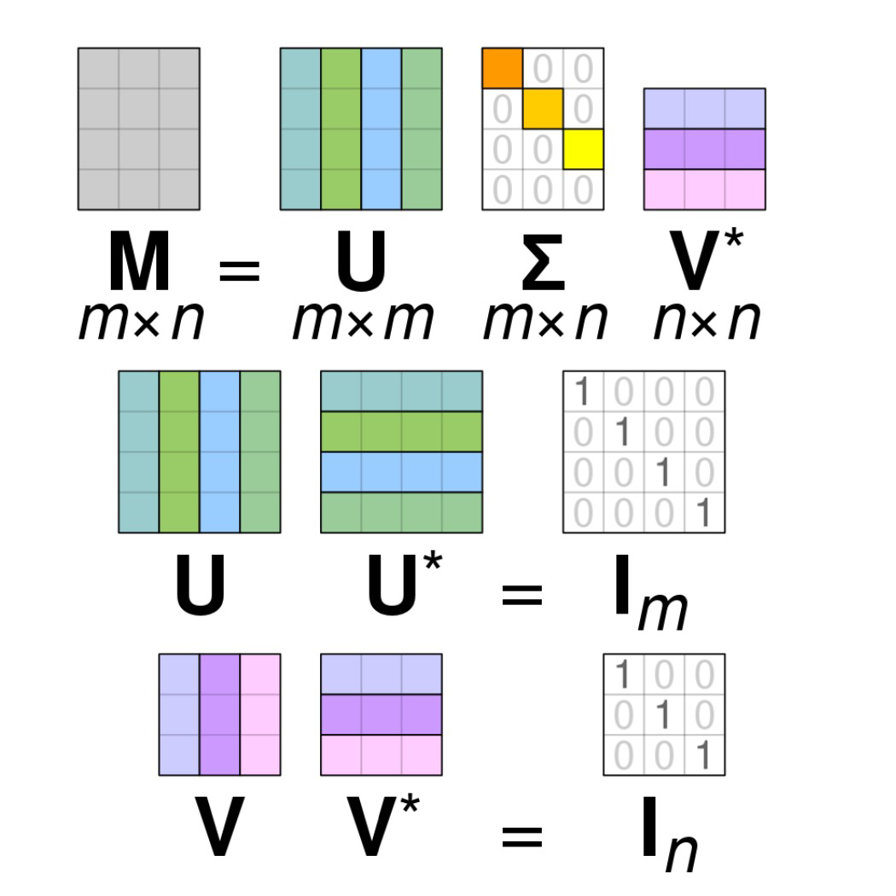
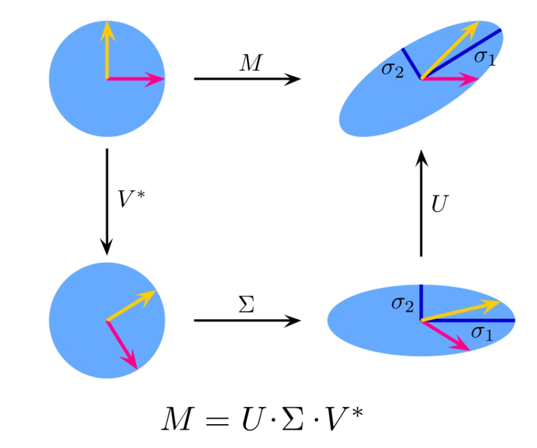

### Expectation Maximization (EM)
EM solves a maximum likelihood problem of the form @cite:dempster1977em,

$$
L(\mathbf{\theta}) = \sum_{i = 1}^M \log p(\mathbf{x}^{(i)}; \mathbf{\theta}) = \sum_{i = 1}^M \log \sum_{\mathbf{z}^{(i)} = 1}^K p(\mathbf{x}^{(i)}, \mathbf{z}^{(i)}; \mathbf{\theta})
$$

* $\mathbf{\theta}$: Parameters of the probalistic model we are trying to find.
* $\{x^{(i)}\}_{i = 1}^M$: Observed training examples.
* $\{z^{(i)}\}_{i = 1}^M$: Unobserved latent variables. (e.g., in GMM, $z^{(i)}$ indicates which one of the $K$ clusters $x^{(i)}$ belongs to, which is unobserved.)

#### Jensen's Inequality
:::theorem[Jensen's Inequality]
Suppose $f : \mathbb{R} \mapsto \mathbb{R}$ is **concave**, then for all probability distributions $p$, we have,

$$
f(\mathbb{E} [\mathbf{x}]) \geq \mathbb{E} [f(\mathbf{x})].
$$

Where the expectation is taken with respect to the random variable $\mathbf{x}$ drawn from the probability distribution $p$.

The equality holds if and only if

1. $\mathbf{x}$ is a constant, or,
2. $f$ is an affine function (i.e., $f(\mathbf{x}) = a^T \mathbf{x} + b$).
:::

#### EM Derivation
Let's derive the EM algorithm for the maximum likelihood problem.

$$
\begin{aligned}
L(\mathbf{\theta}) &= \sum_{i = 1}^M \log p(\mathbf{x}^{(i)}; \mathbf{\theta}) \newline
&= \sum_{i = 1}^M \log \sum_{\mathbf{z}^{(i)} = 1}^K p(\mathbf{x}^{(i)}, \mathbf{z}^{(i)}; \mathbf{\theta}) \newline
&= \sum_{i = 1}^M \log \sum_{\mathbf{z}^{(i)} = 1}^K q(\mathbf{z}^{(i)}) \frac{p(\mathbf{x}^{(i)}, \mathbf{z}^{(i)}; \mathbf{\theta})}{q(\mathbf{z}^{(i)})} \newline
&= \sum_{i = 1}^M \log \mathbb{E}_{\mathbf{z}^{(i)} \sim q} \left[ \frac{p(\mathbf{x}^{(i)}, \mathbf{z}^{(i)}; \mathbf{\theta})}{q(\mathbf{z}^{(i)})} \right] \newline
\end{aligned}
$$

Now we can apply Jensen's inequality to the above equation,
$$
\begin{aligned}
L(\mathbf{\theta}) &\geq \sum_{i = 1}^M \mathbb{E}_{\mathbf{z}^{(i)} \sim q} \left[ \log \frac{p(\mathbf{x}^{(i)}, \mathbf{z}^{(i)}; \mathbf{\theta})}{q(\mathbf{z}^{(i)})} \right] \newline
\end{aligned}
$$

Let's go back to sum notation,
$$
\begin{aligned}
L(\mathbf{\theta}) &= \sum_{i = 1}^M \sum_{\mathbf{z}^{(i)} = 1}^K q(\mathbf{z}^{(i)}) \log \frac{p(\mathbf{x}^{(i)}, \mathbf{z}^{(i)}; \mathbf{\theta})}{q(\mathbf{z}^{(i)})} \newline
&= \sum_{i = 1}^M \sum_{\mathbf{z}^{(i)} = 1}^K q(\mathbf{z}^{(i)}) \log p(\mathbf{x}^{(i)}, \mathbf{z}^{(i)}; \mathbf{\theta}) \newline
&- \sum_{i = 1}^M \sum_{\mathbf{z}^{(i)} = 1}^K q(\mathbf{z}^{(i)}) \log q(\mathbf{z}^{(i)}) \newline
\end{aligned}
$$

Let's call this last expression for $ell(\mathbf{\theta})$, this is a lower bound of the original objective $L(\mathbf{\theta})$.
The equality holds when $\frac{p(\mathbf{x}^{(i)}, \mathbf{z}^{(i)}; \mathbf{\theta})}{q(\mathbf{z}^{(i)})}$ is a constant.

This can be achieved for $q(z^{(i)}) = p(z^{(i)} | x^{(i)}; \theta)$.

The EM algorithm aims to optimize the lower bound $ell(\mathbf{\theta})$,

$$
\mathbf{\theta}^{\star} = \underset{\mathbf{\theta}}{\arg \max} \ell(\mathbf{\theta}) = \underset{\mathbf{\theta}}{\arg \max} \sum_{i = 1}^M \sum_{\mathbf{z}^{(i)} = 1}^K q(\mathbf{z}^{(i)}) \log \frac{p(\mathbf{x}^{(i)}, \mathbf{z}^{(i)}; \mathbf{\theta})}{q(\mathbf{z}^{(i)})}
$$

EM repeatedly performs the following two steps until convergence.

At $t$-th iteration,

1. E-step: For each index $i$, we compute,

$$
q^{(t)}(z^{(i)}) = p(z^{(i)} | x^{(i)}; \mathbf{\theta}^{(t)})
$$

2. M-step: Compute,

$$
\mathbf{\theta}^{(t + 1)} = \underset{\mathbf{\theta}}{\arg \max} \sum_{i = 1}^M \sum_{\mathbf{z}^{(i)} = 1} q^{(t)}(\mathbf{z}^{(i)}) \log p(\mathbf{x}^{(i)}, \mathbf{z}^{(i)}; \mathbf{\theta})
$$

In the E-step, we do not fill in the unobserved $z^{(i)}$ with hard values, but find a posterior distribution $q(z^{(i)})$, given $x^{(i)}$ and $\theta^{(t)}$, i.e.,

$$
q^{(t)}(z^{(i)}) = p(z^{(i)} | x^{(i)}; \mathbf{\theta}^{(t)}).
$$

In the M-step, we maximize the lower bound $ell(\mathbf{\theta})$, while holding $q^{(t)}(z^{(i)})$ fixed, which is computed from the E-step.

The M-step optimization can be done efficiently in most cases. For example, in GMM, we have a closed-form solution for all parameters.

#### EM Convergence
Assuming $\mathbf{\theta}^{(t)}$ and $\mathbf{\theta}^{(t + 1)}$ are the parameters from two successive iterations of EM, we have,

$$
\begin{aligned}
L(\mathbf{\theta}^{(t)}) &\stackrel{(1)}{=} \sum_{i = 1}^M \log p(\mathbf{x}^{(i)}; \mathbf{\theta}^{(t)}) \stackrel{(2)}{=} \sum_i^M \log \sum_{\mathbf{z}^{(i)} = 1}^K q(\mathbf{z}^{(i)}) \frac{p(\mathbf{x}^{(i)}, \mathbf{z}^{(i)}; \mathbf{\theta}^{(t)})}{q^(\mathbf{z}^{(i)})} \newline
& \stackrel{(3)}{=} \sum_{i = 1}^M \sum_{\mathbf{z}^{(i)} = 1}^K q^{(t)}(\mathbf{z}^{(i)}) \log \frac{p(\mathbf{x}^{(i)}, \mathbf{z}^{(i)}; \mathbf{\theta}^{(t)})}{q^{(t)}(\mathbf{z}^{(i)})} \newline
& \stackrel{(4)}{\leq} \sum_{i = 1}^M \sum_{\mathbf{z}^{(i)} = 1}^K q^{(t)}(\mathbf{z}^{(i)}) \log p(\mathbf{x}^{(i)}, \mathbf{z}^{(i)}; \mathbf{\theta}^{(t)}) \newline
& \stackrel{(5)}{\leq} \sum_{i = 1}^M \log \sum_{\mathbf{z}^{(i)} = 1}^K q^{(t)}(\mathbf{z}^{(i)}) \frac{p(\mathbf{x}^{(i)}, \mathbf{z}^{(i)}; \mathbf{\theta}^{(t)})}{q^{(t)}(\mathbf{z}^{(i)})} \stackrel{(6)}{=} L(\mathbf{\theta}^{(t + 1)})
\end{aligned}
$$

1. By definition, this is the (log) likelihood of the data.
2. By marginalization over $z^{(i)}$ and multiplication an arbitrary distribution $q(z^{(i)})$ to both numerator and denominator inside log.
3. By Jensen's inequality where equality condition is satisfied by setting $q^{(t)}(z^{(i)}) = p(z^{(i)} | x^{(i)}; \mathbf{\theta}^{(t)})$.
4. By M-step of EM, where we maximize (3), holding $q^{(t)}(z^{(i)})$ fixed.
5. By Jensen's inequality (in reverse order). Note that we have already updated $\mathbf{\theta}$ from $\mathbf{\theta}^{(t)}$ to $\mathbf{\theta}^{(t + 1)}$, $q^{(t)}(z^{(i)})$ may now not satisfy the equality condition.
6. By definition, this is the lower bound of the likelihood.

Hence, EM causes the likelihood to increase **monotonically**.

#### Remark
:::note[EM as coordinate ascent]
One remark that we have to do is, if we define the EM as,
$$
J(q, \mathbf{\theta}) = \sum_{i = 1}^M \sum_{\mathbf{z}^{(i)} = 1}^K q(\mathbf{z}^{(i)}) \log \frac{p(\mathbf{x}^{(i)}, \mathbf{z}^{(i)}; \mathbf{\theta})}{q(\mathbf{z}^{(i)})}
$$

We can view this as coordinate ascent on $J$, in which the E-step maximizes $J$ with respect to $q$, and the M-step maximizes $J$ with respect to $\mathbf{\theta}$.
One can easily prove this using Lagrangian multipliers!
:::

### Clustering Summary
* **Clustering Task**
    * Given a set of input vectors $\mathcal{D} = \{x^{(i)}\}_{i = 1}^M$, with $x^{(i)} \in \mathbb{R}^N$, group similar $x^{(i)}$ into clusters.
        - Estimate a cluster center, representing the data points in that cluster.
        - Predict the cluster for a new data point.
* **Exhaustive clustering**
    * **Cluster shape**: Arbitrary shape.
    * **Principle**: Minimize an assumed clustering criterion with brute-force search.
    * **Pros**: Optimal under the given clustering criterion.
    * **Cons**: Impractical to construct the clustering criterion, prohibitive to compute.
* **$K$-means**
    * **Cluster shape**: Circular.
    * **Principle**: Minimize distance to cluster center.
    * **Pros**: Simple and scalable (MiniBatchKMeans).
    * **Cons**: Sensitive to initialization, could get bad solutions due to local minima, need to choose $K$.
* **Gaussian Mixture Model (GMM)**
    * **Cluster shape**: Elliptical.
    * **Principle**: Maximum likelihood using expectation maximization.
    * **Pros**: Elliptical cluster shapes.
    * **Cons**: Sensitive to initialization, could get bad solutions due to local minima, need to choose $K$.
* **Feature normalization**
    * Feature normalization is typically required for clustering.
    * E.g., algorithms based on Eucledian distance ($K$-means).

### Dimensionality Reduction
Transform high-dimensional vectors into low-dimensional vectors.
Dimensions in the low-dimensional data represent co-occuring features in the high-dimensional data.
Dimensions in the low-dimensional data may have semantic meaning.

For example, in document analysis.
* High-dimensional data: Bag-of-word vectors of documents.
* Low-dimensional data: Each dimension represents similarity to a topic.

#### Reasons for Dimensionality Reduction
* Preprocessing, makes the dataset easier to use.
* Reduce computational cost of running machine learning algorithms.
* Can be used to "de-noise" data by projecting to lower-dimensional space and then projecting back to the original high-dimensional space.
* Makes the results easier to understand (e.g., visualization).

#### Dimensionality Reduction VS. Feature Selection
The goal of feature selection is to remove features that are not informative with respect to the class label.
This obviously reduces the dimensionality of the feature space.

Dimensionality reduction can be used to find a meaningful lower-dimensional feature space even when there is information in each feature dimension so that none can be discarded.

Another important property of dimensionality reduction is that it is **unsupervised**.

While dimensionality reduction can be seen as a simplistic form of (data) compression, it is not equivalent to it, as the goal of compression is to reduce the expected code length (which is lower bounded by **entropy**) of the representation not only the dimensionality.

For example, in lossless compression, **arithmetic coding** encodes the entire data into a single number, an arbitrary-precision fraction $q$ where $0.0 \leq q < 1.0$.

### Linear Dimensionality Reduction
In linear dimensionality reduction we project the original data onto a lower-dimensional hyperplane (e.g., line, plane).

I.e., move and rotate the coordinate axis of the data, then we represent the data with coordinates in the new component space.

Mathematically, this can be written as,

$$
\mathbf{x}^{(i)} = \sum_{k = 1}^K z_k^{(i)} \mathbf{b}_k
$$

where $\mathbf{b}_k$ is a basis vector and $z_k^{(i)} \in \mathbb{R}$ is the corresponding weight.

#### Connection to Linear Regression
If we focus on the $j$-th entry of $\mathbf{x}^{(i)}$, we have,

$$
x_j^{(i)} = \sum_{k = 1}^K z_k^{(i)} b_{jk}
$$

This expression can be seen as linear regression.

* $x_j^{(i)}$ is the target.
* $z_k^{(i)}$ for each $k$ are the weights.
* $b_{jk}$ for each $k$ are the features.

Alternatively, we may view $z_k^{(i)}$ as feature and $b_{jk}$ as weights.

Unlike linear regression, we only know "targets". We must learn both features and weights.

#### Matrix Formulation
Let $\mathbf{X} \in \mathbb{R}^{M \times N}$ be the data matrix, with one data case $\mathbf{x}^{(i)} \in \mathbb{R}^N$ per row.
$$
\mathbf{X} =
\begin{bmatrix}
-- & (\mathbf{x}^{(1)})^T & -- \newline
-- & (\mathbf{x}^{(2)})^T & -- \newline
& \vdots & \newline
-- & (\mathbf{x}^{(M)})^T & --
\end{bmatrix}
$$

Let $\mathbf{Z} \in \mathbb{R}^{M \times K}$ be the loading matrix and $\mathbf{B} \in \mathbb{R}^{K \times N}$ be the factor matrix.
$$
\mathbf{Z} =
\begin{bmatrix}
z_1^{(1)} & z_2^{(1)} & \ldots & z_K^{(1)} \newline
z_1^{(2)} & z_2^{(2)} & \ldots & z_K^{(2)} \newline
\vdots & \ddots & \ddots & \vdots \newline
z_1^{(M)} & z_2^{(M)} & \ldots & z_K^{(M)}
\end{bmatrix},
\mathbf{B} =
\begin{bmatrix}
-- & (\mathbf{b}_1)^T & -- \newline
-- & (\mathbf{b}_2)^T & -- \newline
& \vdots & \newline
-- & (\mathbf{b}_K)^T & --
\end{bmatrix}
$$

With this we can express $\mathbf{X}$ as follows,

$$
X = ZB.
$$

However, most real world data will be subject to noise.
If we assume that $\mathbf{\epsilon} \in \mathbb{R}^{M \times N}$ is a matrix of noise values from some probability distribution, we have,

$$
X = ZB + \mathbf{\epsilon}.
$$

#### Learning Criterion
The learning problem for linear dimensionality reduction is to estimate values for both $\mathbf{Z}$ and $\mathbf{B}$ given only the noisy observations of $\mathbf{X}$.

One possible learning criterion is to minimize the sum of squared errors when **reconstructing** $\mathbf{X}$ from $\mathbf{Z}$ and $\mathbf{B}$.

This leads to,

$$
\underset{\mathbf{Z}, \mathbf{B}}{\arg \min} \Vert \mathbf{X} - \mathbf{ZB} \Vert_F^2
$$

Where $\Vert \cdot \Vert_F$ is the Frobenius norm of a matrix, defined as,

$$
\Vert \mathbf{A} \Vert_F = \sqrt{\sum_{ij} A_{ij}^2}
$$

#### Alternating Least Squares
By leveraging the OLS solution for linear regression, we can estimate $\mathbf{Z}$ and $\mathbf{B}$ using **A**lternating **L**east **S**quares (ALS).

Starting from some random initialization, ALS iterates between two steps until covergence.

1. Assume $\mathbf{Z}$ is fixed and optimize $\mathbf{B}$,
$$
\mathbf{B} \leftarrow (\mathbf{Z}^T \mathbf{Z})^{-1} \mathbf{Z}^T \mathbf{X}
$$

2. Assume $\mathbf{B}$ is fixed and optimize $\mathbf{Z}$,
$$
\mathbf{Z}^T \leftarrow (\mathbf{B} \mathbf{B}^T)^{-1} \mathbf{B} \mathbf{X}^T
$$

#### Lack of Uniqueness for Optimal Parameters
Suppose we run the ALS algorithm to convergence and obtain optimal parameters $\mathbf{Z}^{\star}$ and $\mathbf{B}^{\star}$ such that,

$$
\ell^{\star} = \Vert \mathbf{X} - \mathbf{Z}^{\star} \mathbf{B}^{\star} \Vert_F^2
$$

Let $\mathbf{R} \in \mathbb{R}^{K \times K}$ be an arbitrary invertible matrix.

A $K \times K$ matrix $\mathbf{R}$ is invertible, if there exists a $K \times K$ matrix $\mathbf{S}$ such that $\mathbf{R} \mathbf{S} = \mathbf{S} \mathbf{R} = \mathbf{I}$.
Which we also can denote as $\mathbf{R}^{-1} = \mathbf{S}$.

We obtain a different set of parameters $\mathbf{\tilde{Z}} = \mathbf{Z}^{\star} \mathbf{R}$ and $\mathbf{\tilde{B}} = \mathbf{R}^{-1} \mathbf{B}^{\star}$, with the same optimal value,
$$
\ell^{\star} = \Vert \mathbf{X} - \mathbf{Z}^{\star} (\mathbf{I}) \mathbf{B}^{\star} \Vert_F^2 = \Vert \mathbf{X} - \mathbf{Z}^{\star} (\mathbf{R} \mathbf{R}^{-1}) \mathbf{B}^{\star} \Vert_F^2 = \Vert \mathbf{X} - \mathbf{\tilde{Z}} \mathbf{\tilde{B}} \Vert_F^2
$$

We can obtain the **global** optimal solution(s) and make them **unique** by specifying additional criteria.

### Singular Value Decomposition (SVD)
Let $\mathbf{X}$ be a $M \times N$ matrix, with $M \geq N$. It can be facotrized as,

$$
\mathbf{X} = \mathbf{U}
\begin{pmatrix}
\mathbf{\Sigma} \newline
\mathbf{0}
\end{pmatrix}
\mathbf{V}^T
$$

Where $\mathbf{U} \in \mathbb{R}^{M \times M}$ and $\mathbf{V} \in \mathbb{R}^{N \times N}$ are orthogonal, i.e.,
$$
\mathbf{U}^T \mathbf{U} = \mathbf{U} \mathbf{U}^T = \mathbf{I}_M, \quad \mathbf{V}^T \mathbf{V} = \mathbf{V} \mathbf{V}^T = \mathbf{I}_N
$$

Columns of $\mathbf{U}$ and $\mathbf{V}$ are called left and right **singular vectors** of $\mathbf{X}$, respectively.

$\mathbf{\Sigma} \in \mathbb{R}^{M \times N}$ is a diagonal matrix,
$$
\mathbf{\Sigma} = \text{diag}(\sigma_1, \sigma_2, \ldots, \sigma_N), \sigma_1 \geq \sigma_2 \geq \ldots \geq \sigma_N \geq 0
$$

$\sigma_i$'s are called **singular values** of $\mathbf{X}$.

In @fig:svd2, we see four different operations.

* Upper Left: The unit disc with the two canonical unit vectors.
* Upper Right: Transformed with $\mathbf{M}$.
* Lower Left: The action of $\mathbf{V}^T$. This is just a rotation.
* Lower Right: The action of $\mathbf{\Sigma}\mathbf{V}^T$. $\mathbf{\Sigma}$ scales vertically and horizontally.

#### Reduced-Form SVD
If only $K < \min\{M, N\}$ singular values are non-zero, the SVD $\mathbf{X} \in \mathbb{R}^{M \times N}$ can be represented in reduced form as follows,

$$
\mathbf{X} = \mathbf{U} \mathbf{\Sigma}_K \mathbf{V}^T,
$$

which we can write as,

$$
\mathbf{X} = \sum_{k = 1}^K \sigma_k \mathbf{u}_k \mathbf{v}_k^T.
$$

Where
* $\mathbf{U} = [\mathbf{u}_1, \mathbf{u}_2, \ldots, \mathbf{u}_M] \in \mathbb{R}^{M \times K}$.
    - $\mathbf{U}^T \mathbf{U} = \mathbf{I}_K$.
* $\mathbf{V} = [\mathbf{v}_1, \mathbf{v}_2, \ldots, \mathbf{v}_N] \in \mathbb{R}^{N \times K}$.
    - $\mathbf{V}^T \mathbf{V} = \mathbf{I}_K$.
* $\mathbf{\Sigma}_K = \text{diag}(\sigma_1, \sigma_2, \ldots, \sigma_K) \in \mathbb{R}^{K \times K}$.
    - $\sigma_1 \geq \sigma_2 \geq \ldots \geq \sigma_K \geq 0$.
* $\mathbf{u}_k \mathbf{v}_k^T \in \mathbb{R}^{M \times N}$ is the product of a column vector $\mathbf{u}_k$ and a row vector $\mathbf{v}_k^T$.
    - It has **rank** 1.
    - $\mathbf{X}$ is a weighted summation of $K$ rank-1 matrices.

#### Eckart-Young-Mirsky Theorem
:::theorem[Eckart-Young-Mirsky Theorem]
Given a $M \times N$ matrix $\mathbf{X}$ of rank $R \leq \min \{M, N\}$ and its singular value decomposition $\mathbf{X} = \mathbf{U} \mathbf{\Sigma}_R \mathbf{V}^T$
with singular values $\sigma_1 \geq \sigma_2 \geq \ldots \geq \sigma_R > 0$ and the rest being zero,
then among all $M \times N$ matrices of lower rank $K \leq R$,
the best approximation is $\mathbf{Y}^{\star} = \mathbf{U} \mathbf{\Sigma}_K \mathbf{V}^T$, where $\mathbf{\Sigma}_K$ is the diagonal matrix with singular values $\sigma_1, \sigma_2, \ldots, \sigma_K$ in the sense that @cite:eckart1936approximation,
$$
\Vert \mathbf{X} - \mathbf{Y}^{\star} \Vert_F^2 = \min \{\Vert \mathbf{X} - \mathbf{Y} \Vert_F^2; \mathbf{Y} \in \mathbb{R}^{M \times N}, \text{rank} \mathbf{Y} \leq K\}
$$
:::

SVD provdies a unique solution to minimum Frobenius norm linear dimensionality reduction.
