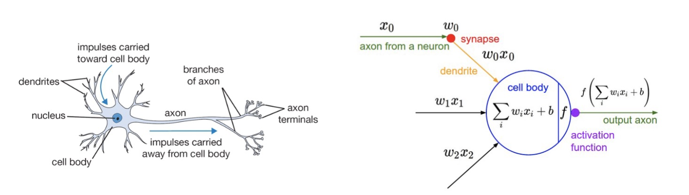
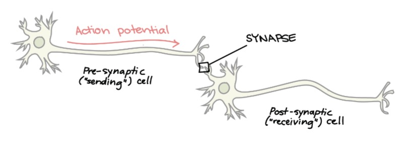
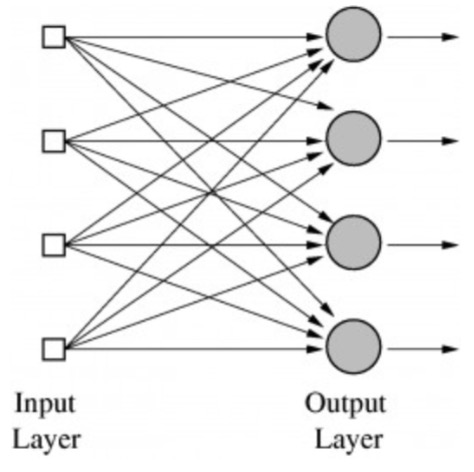
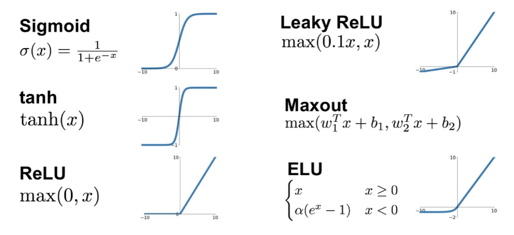

### History
The history of deep learning is fun and interesting, and many do not seem to have the proper timeline, so let's take a look.

#### Original Idea
The perceptron is the original idea of a neural network, and it was originally proposed by Warren McCulloch and Walter Pitts in 1943 and later on Rosenblatt in 1957 @cite:mcculloch1943calculus @cite:rosenblatt1958perceptron.

The idea was to simulate a neuron in the brain.

1. It takes binary inputs (input from nearby neurons)
2. Multiplies the inputs by weights (synaptic strength)
3. Sum and threshold the input to get binary output (output axon)

We train the weights from the data.

#### Synapses
Let's take a moment and talk about the biological background of these ideas.

Synapses are junctions at which neurons communicate with one another.

Most synapses are chemical (i.e., chemical messengers).
Other synpases are electrical (i.e., ions flow directly between cells).

At a chemical synapse, an action potential triggers the presynaptic neuron to release neurotransmitters.
These molecules bind to receptors on the postsynaptic cell and make it more or less likely to fire an action potential

#### Multiple Outputs?
The perceptron can only have one output, but what if we want multiple outputs?

Multiple outputs can be handled by using multiple perceptrons.

But there is a problem with this, this is a linear classifier, we can not solve any complex problems using this.

#### Multi-Layer Perceptron
If we add "hidden layers" between the input and output neurons, we might have a solution to this problem

1. Each layer extracts some features from previous layers.
2. We can represent complex non-linear functions.
3. We can train the weights using the backpropagation algorithm (1970-80s).

This is a modern day neural network!

But again, there are a few problems with (early) neural networks.

* Difficult to train.
* Sensitivity to initialization.
* Computational expensive (at that time).

##### Decline in the 1990s
Because of these problems, neural networks became less popular in the 1990s.

Support Vector Machines (SVM) had good accuracy along with,
* Easy to use - only one global optimum.
* Learning is not sensitive to initialization.
* Theory about performance guarantees.

Only a few groups continued to work on neural networks during this time period, some notable names are LeCun, Bengio, Hinton and Schmidhuber.

#### Deep Learning
Neural networks resurged in the 2000s, due to a number of factors,
* Improvements in network architectures.
    - Developed nodes that are easier to train.
* Better training algorithms.
    - Better (stochastic) optimizers for large-scale nonlinear problems.
    - Better ways to prevent overfitting.
    - Better initialization methods.
* Infrastructure for faster computing.
    - Massively parallel GPUs.
    - Distributed computing.
* More labeled data.
    - From the internet.
    - Crowd-sourcing for labeling data (Amazon Mechanical Turk).

With this, we began to train neural networks with more and more layers, this is the start of the deep learning era.

Let's now dive into each of these topics in more detail.

### Perceptron
As we have seen, the perceptron is the basic building block of a neural network.

#### McCulloch and Pitts Neuron (1943)
:::definition[McCulloch-Pitts Neuron]
This idea tries to model a single neuron as we have seen.

We have an input $\mathbf{x} \in \mathbb{R}^N$, which is a $N$-dim vector.
We apply a weight vector to the inputs, we sum and apply a threshold function to get the output.

Let's formally write this as,

$$
y = f(\mathbf{w}^T \mathbf{x}) = f(\sum_{j=0}^{N} w_j x_j),
$$

where $\mathbf{w}$ is the weight vector and $f(\cdot)$ is the activation function, e.g. $f(a) = \begin{cases} 1 & a > 0 \newline 0 & \text{otherwise} \end{cases}$.
:::

#### The Perceptron (1950)
The perceptron is a simple algorithm for adapting the weights in a McCulloch/Pitts neuron, which was developed in the 1950s by Rosenblatt @ Cornell.

The perceptron training criteria is,

* Train the perceptron on data $\mathcal{D} = \{(\mathbf{x}^{(i)}, y^{(i)})\}_{i=1}^M$.
* Only look at the points that are misclassified, i.e.,
    - Loss is based on how badly points are misclassified.
    - $\ell(\mathbf{w}) = \sum_{i=1}^M \begin{cases} -y^{(i)} \mathbf{w}^T \mathbf{x}^{(i)} & \mathbf{x}^{(i)} \text{ is misclassified} \newline 0 & \text{otherwise} \end{cases}$.
* Minimize the loss, $\mathbf{w}^{\star} = \underset{\mathbf{w}}{\arg\min} \ell(\mathbf{w})$.

Since the computational power was not enough back then, they could only look at one data point at a time, with for exampele stochastic gradient descent (SGD).

**Procedure:**

1. Start with all-zero weight vector $\mathbf{w}^{(0)}$, and initialize $t$ to 0.
2. For all $(\mathbf{x}^{(i)}, y^{(i)}) \in \mathcal{D}$ compute the activation $a^{(i)} = (\mathbf{w}^{(t)})^T \mathbf{x}^{(i)}$.
3. If $y^{(i)} a^{(i)} < 0$, then $\mathbf{w}^{(t+1)} = \alpha y^{(i)} \mathbf{x}^{(i)}$ and $t \leftarrow t+1$.
4. Repeat Steps 1-3 until no more points are misclassified.

**Notes**
* $\alpha$ is the update step (i.e., learning rate) for SGD.
    - The effect of the update step is to rotate $\mathbf{w}$ towards the misclassified point $\mathbf{x}^{(i)}$.
* If $y^{(i)} = 1$ and $\hat{y}^{(i)} = \text{sign}(a^{(i)}) = -1$, the activation is initially negative and will be increased.
* If $y^{(i)} = -1$ and $\hat{y}^{(i)} = \text{sign}(a^{(i)}) = 1$, the activation is initially positive and will be decreased.

#### Perception Algorithm
This algorithm fails to converge if the data is not linearly separable.

Rosenblatt proved that the algorithm will converge if the data is linearly separable.
The number of iterations is inversely proportional to the seperation (margin) between classes.
This was one of the first machine learning results!

Different initializations can yield different weight vectors, and hence different decision boundaries.

#### Perceptron Loss Function
We can define a loss function for this algorithm.

Firstly, let's define the margin of a point as,

$$
z^{(i)} = y^{(i)} \mathbf{w}^T \mathbf{x}^{(i)},
$$

Then, the loss function $\ell(z^{(i)})$ can be defined as,

$$
\ell(z^{(i)}) = \max(0, -z^{(i)}).
$$

### Multi-Layer Perceptron
As we discussed earlier, if we add "hidden layers" between the inputs and the outputs, we can model more complex functions.

Formally, for one layer we can write,

$$
\mathbf{h} = f(\mathbf{W}^T \mathbf{x}),
$$

where $\mathbf{W}$ is the weight matrix, one column for each output node.

Input $\mathbf{x}$ from previous layer.

Output $\mathbf{h}$ to next layer.

$f(\cdot)$ is the activation function - applied to each dimension to get output.

#### Activation Functions
There are many activation functions that can be used in neural networks.
All for different purposes and different properties.

##### Sigmoid or Logistic Activation Function
The sigmoid function is defined as,

$$
\sigma(x) = \frac{1}{1 + e^{-x}}.
$$

Sigmoid function translates the input ranged in $[-\infty, \infty]$ to the range in $(0, 1)$.

A more generalized sigmoid function that is used for (multi)class classification is the softmax function.

The sigmoid function has some problems though.

The $exp(\cdot)$ function is computationally expensive.

It also has the **vanishing gradient problem**.

##### Tanh Activation Function
The tanh function is defined as,

$$
\tanh(x) = \frac{e^{2x} - 1}{e^{2x} + 1}.
$$

It is bound to the range $(-1, 1)$.

The gradient is stronger (i.e., steeper) for tanh than sigmoid.

Like sigmoid however, tanh also has a vanishing gradient problem.

But, optimization is easier for tanh, hence in practice it is always preferred over sigmoid.

##### ReLU Activation Function
The ReLU (Rectified Linear Unit) function is defined as,

$$
\text{ReLU}(x) =
\begin{cases}
x, & \text{if } x \geq 0 \newline
0, & \text{if } x < 0
\end{cases}.
$$

ReLU is the identity function for positive values and zero for negative values.
It is traditionally known as **half-wave rectification** in signal processing.

Benefits of ReLU are,

* Cheap to compute and easy to optimize.
* It converges faster.
* No vanishing gradient problem.
* Can output a true zero value, leading to representational sparsity.

Problesm of ReLU are,
* If one neuron gets negative it is unlikely for it to recover.
This is called the "dying ReLU" problem.

##### Variants of ReLU
Leaky ReLU is defined as,

$$
\text{LReLU}(x) =
\begin{cases}
x, & \text{if } x \geq 0 \newline
ax, & \text{if } x < 0
\end{cases}.
$$

Leaky ReLU attempts to fix the "dying ReLU" problem.
Instead of the function being zero when $x < 0$, a leaky ReLU gives a small slope.

$a$ is a parameter constrained to be positive.
It can be pre-determined or learned from the data.

The ELU (Exponential Linear Unit) function is defined as,

$$
\text{ELU}(x) =
\begin{cases}
x, & \text{if } x \geq 0 \newline
a(e^x - 1), & \text{if } x < 0
\end{cases}.
$$

It follows the same rule for $x \geq 0$ as ReLU, and increases exponentially for $x < 0$.

ELU tries to make the mean activations closer to zero which speeds up training (by adjusting $a$).

Empirically, ELU leads to higher performance.

##### Maxout Activation Function
The maxout function is defined as,

$$
\text{Maxout}(\mathbf{x}; \mathbf{w_1}, \mathbf{w_2}) = \max(\mathbf{w_1}^T \mathbf{x}, \mathbf{w_2}^T \mathbf{x}).
$$

It is a piecewise linear function.

The maxout activation is a generalization of ReLU and leaky ReLU.
It is a learnable activation function.

The maxout neuron, therefore, enjoys all the benefits of ReLU (linear regime of operation, no saturation) and does not have its drawbacks (dying ReLU).

However, it increases the total number of parameters for each neuron and hence, a higher total number of parameters need to be trained.

##### Other Emerging Activation Functions
There are many other activation functions that are being developed and used in practice.

Gaussain Error Linear Unit (GELU),

$$
\text{GELU}(x) = x \Phi(x),
$$

where $\Phi(x)$ is the normal cumulative distribution function (CDF).

Softplus,

$$
\text{Softplus}(x) = \log(1 + \exp(x)).
$$

As a continuous and differentiable approximation to the ReLU function.

Swish,

$$
\text{Swish}(x) = x \cdot \text{sigmoid}(\beta x) = \frac{x}{1 + \exp(-\beta x)}.
$$

$\beta$ is either constant or a trainable parameter.

#### Training an MLP
For classification, we use the cross-entropy function as the loss.

* $\ell = -\sum_{j=1}^C y_j \log(\hat{y}_j)$
    * $y_j$ is 1 for the true class, and 0 otherwise.
    * $\hat{y}_j$ is the softmax output for the $j$-th class.

Use (stochastic) gradient descent as the optimization tool.

* $w_{ij} \leftarrow w_{ij} - \alpha \frac{\partial \ell}{\partial w_{ij}}$.
    * Layer $i$, node $j$.
* $\alpha$ is the learning rate, which controls convergence rate.
    * Too small &rarr; converges very slowly.
    * Too large &rarr; possibly does not converge.

#### Backpropagation (Backward Propagation)
Backpropagation is the algorithm used to train neural networks.

We do a forward pass to calculate the prediction, and do a backward pass to update the weights that were responsible for an error.

### Universal Approximation Theorem
It can be shown that a sigmoid network with one hidden layer (of infinite nodes) is a unversial function approximator.

In terms of classification, this means neural netwroks with one hidden layer (of unbounded size) can represent any decision boundary and thus have infinite capacity.

It was also shown that deep networks can be more efficient at representing certain types of functions than shallow (single layer) networks.

It is not the specific choice of the activation function, but rather the mulit-layer feedforward architecture itself which gives neural networks the potential of being universal approximators.

It does not touch upon the algorithmic learnability of those parameters.

### Gradient Descent with the Chain Rule
Suppose we have a 2-layer network.

* $\ell$ is the cost function.
* $g_1, g_2$ are the output functions of the two layers.
    - $g_j(\mathbf{x}) = f(\mathbf{W_j}^T \mathbf{x})$, and $\mathbf{W_1}, \mathbf{W_2}$ are the weight matrices.
* Prediction for input $\mathbf{x}$, $\hat{y} = g_2(g_1(\mathbf{x}))$.
* Cost for input $\mathbf{x}$, $\ell(g_2(g_1(\mathbf{x})))$.

If we apply the chain rule to get the gradients of the weights,

$$
\begin{aligned}
\frac{\partial \ell}{\partial \mathbf{W_2}} &= \frac{\partial \ell}{\partial g_2} \frac{\partial g_2}{\partial \mathbf{W_2}} \newline
\frac{\partial \ell}{\partial \mathbf{W_1}} &= \frac{\partial \ell}{\partial g_2} \frac{\partial g_2}{\partial g_1} \frac{\partial g_1}{\partial \mathbf{W_1}}.
\end{aligned}
$$

We can define a set of recursive relationships.

1. Calculate the output of each node from the first layer to the last layer.
2. Calculate the gradient of each node from the first layer to the last layer.

**NB**
The gradients multiply in each layer!

If two gradients are small (< 1), their product will be even smaller. This is the vanishing gradient problem.

### Convolutional Neural Networks (CNN)
CNNs are a type of neural network that is designed to recognize visual patterns directly from pixel images with minimal preprocessing.

Let's see how we can combine images and neural networks.

#### Image Inputs and Neural Networks
In MLP (multi-layer perceptron), each node accepts all nodes in the previous layer.

For an image input, we first need to transform the image into a (flat) vector, which is the input to the network.

But this comes with a few problems.

* This ignores spatial relationships between pixels in the image.
    - Images contain local structures.
        * Groups of neighboring pixels correspond to visual structures (edges, corners, textures).
        * Pixels far from each other are typically not correlated.

#### From Fully Connected to Convolutional Layer
Say we have an image of $32 \times 32 \times 3$ (RGB) image., if we were to stretch/flatten it, we would get $3072 \times 1$ input instead.

If we now have 10 classes, we would have a weight matrix of $10 \times 3072$.

This is a lot of parameters!

Instead, we can use a convolutional layer.
We preserve the original $32 \times 32 \times 3$ structure, this also preserves spatial structure.

But how would we even use these convolutional layers?

We use convolutional filters, which are small matrices that slide over the image.
Or, rather, we **convolve** the filter with the image, i.e., "slide over the image spatially", computing dot products.

Note that filters always extend the full depth of the input volume.

##### Padding
We have different types of padding,

* Valid Padding
    - No padding is added to the input image, the output image is smaller than the input image.
* Same padding
    - Padding is added to the input image, such that the size of the output image is the same as the input image.
* Full Padding
    - Padding is added to the input image, such that the size of the output image is greater than the input image.
* Constant Padding (including zero padding)
    - Add a border of constant-value pixels around the edges of the original image.
* Replicate Padding
    - The pixels of the padding are copied from the border values.
* Reflection Padding
    - The pixels at the edges of the image are mirrored to create a boundary of reflected pixels.
* Circular Padding
    - Copy the pixels at the dges of the images and append them to the opposite side of the image.

##### Spatial Subsampling
We can reduce the feature map size by subsampling the feature maps.

*Stride* for convolution filters - step size when moving the windows across the image.

Use the maximum over the pooling window.

#### Adding back MLP
After several convolutional layers, input the feature map into an MLP to get the final classification.

### Origin of Convolution
As you have seen, I've not decided to go super in depth about CNNs, there are a lot of better resources to do that, but let's dive into the origin of convolutions, since it is a very interesting topic.

#### Where Does Convolution Come From?
Convolution arises from the field of signal processing, which describes the output (In terms of the input) of an important class of operations (or systems) known as *linear-time-invariant* (LTI) systems.

A discrete-time signal such as $x[n]$ or $y[n]$ is described by an infinite sequence of values, i.e., the time index $n$ takes values in $-\infty$ to $\infty$.

The sequence of output values $y[\cdot]$ is the response of system $S$ to the input sequence $x[\cdot]$.

#### Time Invariant Systems
Let $y[n]$ be the response of $S$ to the input $x[n]$.

If for all possible sequences $x[n]$ and integers $N$,

$$
S(x[n - N]) = y[n - N],
$$

then the system is said to be time-invariant.

then the system $S$ is said to be time-invariant (TI).

A time shift in the input sequence to $S$ results in an identical time shift of the output sequence.

#### Linear Systems
Let $y_1[n]$ be the response of $S$ to an arbitrary input $x_1[n]$ and $y_2[n]$ be the response to an arbitrary input $x_2[n]$.

If, for arbitrary scalar coefficients $a$ and $b$, we have,

$$
S(a x_1[n] + b x_2[n]) = a y_1[n] + b y_2[n],
$$

then the system $S$ is said to be linear.

If the input is the weighted sum of several signals, the response is the superposition (i.e., the same weighted sum) of the response to those signals.

One key consequence, if the input is identically 0 for a linear system, the output must also be identically 0.

#### Unit Sample Response
The unit sample response of a system is the response of the system to a unit impulse.

The unit impulse function is defined as,

$$
\delta[n] =
\begin{cases}
1, & \text{if } n = 0 \newline
0, & \text{otherwise}
\end{cases}.
$$

Which means that,

$$
\delta[n - N] =
\begin{cases}
1, & \text{if } n = N \newline
0, & \text{otherwise}
\end{cases}.
$$

We will always denote the unit sample response as $h[n]$.

#### Unit Sample Decomposition
A discrete-time signal can be decomposed into a sum of time-shifted and scaled unit samples.

So, in general we can write,

$$
x[n] = \sum_{k = -\infty}^{\infty} x[k] \delta[n - k].
$$

#### Modeling LTI Systems
If system $S$ is both linear and time-invariant (LTI), then we can use the unit sample response to predict the response to any input waveform $x[n]$.

$$
\begin{aligned}
x[n] &= \sum_{k = -\infty}^{\infty} x[k] \delta[n - k] \newline
y[n] &= \sum_{k = -\infty}^{\infty} x[k] h[n - k]
\end{aligned}
$$

This is the convolution sum!

#### Discrete Convolution
Discrete convolution typically contains the following steps.

1. List the index $k$ covering a sufficient range.
2. List the input $x[k]$.
3. Obtain the **reversed** sequence $h[-k]$, and align the rightmost element of $h[n - k]$ with the leftmost element of $x[k]$.
4. Cross-multiply and sum (i.e., dot product) the nonzero overlap terms to produce $y[n]$.
5. Slide $h[n - k]$ to the right by one position.
6. Repeat Steps 4 and 5. Stop if all the output values are zero of if required.

### Summary
* Different types of neural networks.
    * Perceptron - single node (similar to logistic regression).
    * MLP - collection of perceptrons in layers.
        * Also called fully connected networks.
    * CNN - Convolutional filters for extracting local image features.
        * Originates from LTI systems in signal processing.
* **Training**
    * Optimization using *variants* of stochastic gradient descent.
* **Advantages**
    * Large capacity to learn from large amounts of data.
* **Disadvantages**
    * Lots of parameters - easy to overfit data.
        * Need to *regularize* parameters.
        * Need to monitor the training process.
    * Sensitive to initialization, learning rate, training algorithm.
