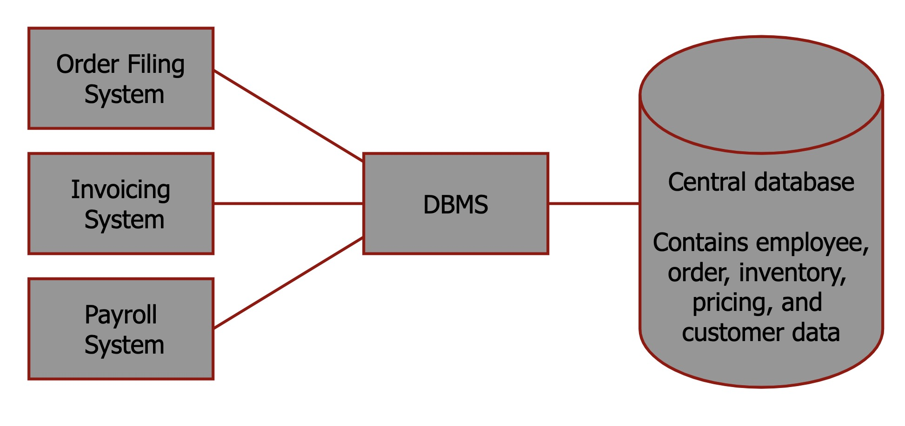
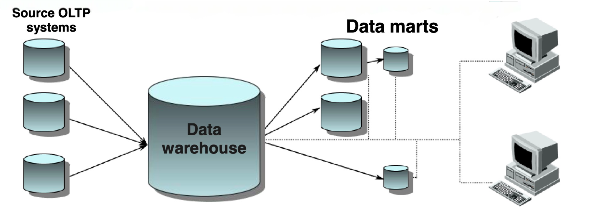
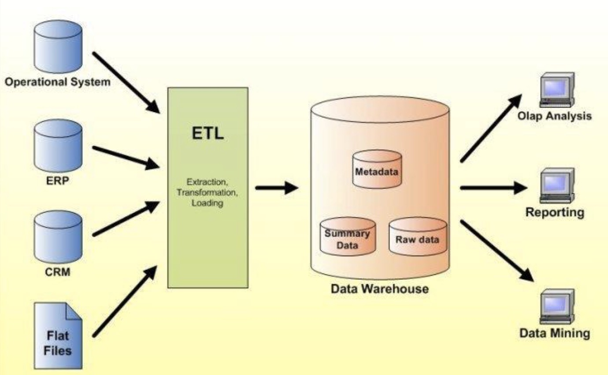
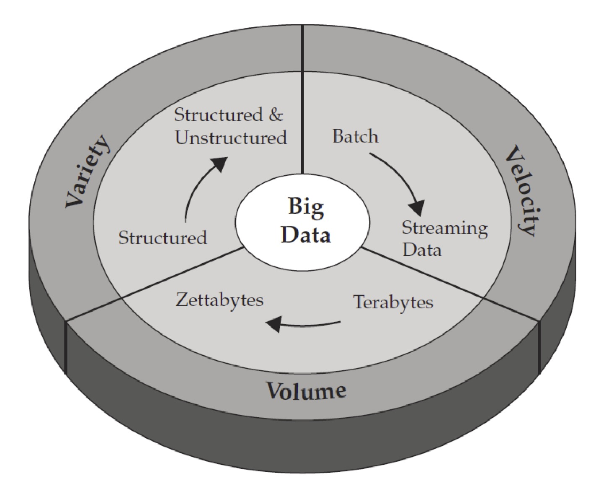

### Waves of Data Management
We will look into what we mean by data management, but before that, let's define and explain the different waves or phases of data.

Logically, each of these waves were born out of the necessity to try and solve a specific type of data management problem.

There are three waves of data management:
– Wave 1: Creating manageable data structures
– Wave 2: Web and content management
– Wave 3: Big Data Management

#### Wave 1: Creating manageable data structures
As computing moved into the commercial market in the late 60s, data was stored in flat files that imposed no structure.

The need to understand the data grew larger and the previous unstructured format didn't work anymore.
New methods had to be applied, including very detailed programming models to gain insight.

Later in the 70s, things changed with the invention of the **R**elational **D**ata **M**odel (RDM),
and the **R**elational **D**atabase **M**anagement **S**ystem (RDBMS) that imposed structure and a method for improving performance.

##### Database Management System
A software system that is used to create, maintain, and provide controlled access to user databases.

Note: DBMS manages data resources, almost like how an OS manages hardware resources

These relational models offered an ecosystem of tools.
It filled a growing need to better organize their data and be able to compare and contrast data from different sources.

In addition, it helped those who wanted to be able to examine information for decision-making purposes.

The **E**ntity **R**elationship (ER) model later emerged.
It added additional abstraction to increase the usability for users.

In the ER model, each item is defined independently of its use.
Therefore, developers can create new relationships between data sources without complex programming.

With these technologies, the need for even more data grew.
When the volume of data grew out of control, the **data warehouse** was born.

##### Data Warehouse and Data marts
The data warehouse enabled developers to select a *subset* of the data so that it would be easier to gain insights.

Although the move from unstructured data to structured data was a big step forward, it was still limited.

*BLOB*s, or **B**inary **L**arge **Ob**jects are an unstructured data element stored in a relational database.
It is stored as one contiguous chunk of data.
This object could be *labeled* but you couldn’t see what was inside that object.

#### Wave 2: Web and content management
In the 90s with the rise of the web,
organizations wanted to move beyond just documents and store more complex web content, such as images, audio, and video.

A new generation of requirements had begun to emerge that drove us into the next wave.
The wave of web and content management.

These new requirements were driven by a convergence of factors including:
- The web
- Virtualization of application
- Cloud computing

In this new wave, organizations began to understand that they needed to manage a completely new generation of data.
The new data had an unprecedented *volume* and *variety* that needed to be processed at an unheard-of *speed*.

Which leads us into the third and current wave of data management.

#### Wave 3: Big Data Management
With *big data*, it is now possible to virtualize data so that it can be stored efficiently.
For example utilizing *cloud based storage*, it will become even more cost-effective.

In addition, improvements in the network infrastructure (speed and reliability) have removed many physical limitations.
It is possible to manage massive amounts of data at a reasonable pace.
Also, the incredible improvements to hardware have made it possible to store and process data at a much lower cost.

So the main reasons for the evolution of data are:
- Rapid growth of new and advanced information technologies.
- Widespread use of ICT (especially IoT).
- Fierce competition in business world.

But what is big data *actually*?

:::definition[Big data]
Big data is high-**volume**, high-**velocity** and high-**variety** data,
that demand *cost-effective* and *innovative* forms of information processing,
for enhanced *insight* and *decision-making*.
:::

It is fundamentally about applying innovative and
cost-effective techniques for solving existing and
future problems whose resource
requirements exceed the capabilities of traditional
computing environments as currently configured.

New definition of big data is the ~~three~~ five Vs:
* Volume
* Velocity
* Variety
* Veracity
* Value

